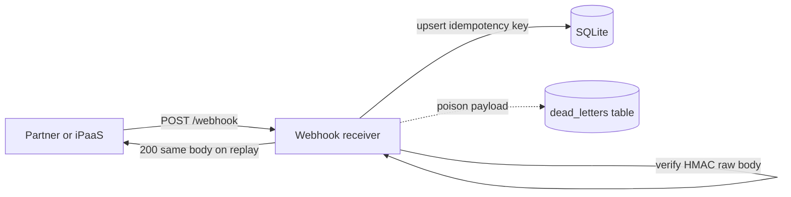

# Project 1 — Integration webhook receiver (hardened)

## Progress

| | |
|---|---|
| **Step** | 1 of 22 |
| **Previous** | — |
| **Next** | [Project 2 — RAG / tool-using LLM service](02-rag-llm-service.md) |

## What you will learn

- Verify webhook callers with HMAC (Hash-based Message Authentication Code) over the raw body
- Make retries safe with idempotency keys and a durable store
- Return fast ack after recording intent; park poison messages in a DLQ (dead-letter queue)
- Leave an audit trail with request IDs and structured logs

## Architecture pillars

| Pillar | How this project practices it |
|--------|-------------------------------|
| 1. System shape | Fast 2xx after durable idempotency record — HTTP ingress vs in-process side effects |
| 2. Integration & messaging | HMAC webhooks, idempotency keys, DLQ for poison payloads |
| 3. Data architecture | Idempotency store schema and replay-safe lookups (secondary) |
| 5. Reliability, security, operations | HMAC verification, structured logs, request IDs, failure modes |

**Required ADR(s):** tag each ADR with pillar in `docs/portfolio/adr-*.md` (e.g. SQLite vs Postgres — **Pillar 3**; raw-body HMAC — **Pillar 5**).

**Framework:** [Architecture framework](../docs/concepts/architecture-framework.md)

## Before you start

- **New to PHP?** → [PHP + Laravel map](../docs/languages/php-laravel.md) · [Stacks glossary](../docs/languages/glossary.md) · [Language fundamentals](../docs/languages/language-fundamentals-comparison.md)
- **Handbook:** [Integration](../docs/concepts/software-engineering.md#integration-sync-async-and-messaging) · [Event-driven integration](../docs/concepts/software-engineering.md#event-driven-integration) · [Security](../docs/concepts/software-engineering.md#security-for-applications)

## Problem

Practice a **production-shaped** HTTP inbound integration: verify caller, dedupe replays, log usefully, and optionally park poison messages.

## System diagram

Partner systems POST signed webhooks. Your receiver verifies HMAC on the **raw body**, records idempotency before side effects, and parks poison payloads in a dead-letter store.



| Component / path | Pillar | Decision |
|------------------|--------|----------|
| Fast 2xx after idempotency write | **1 — System shape** | HTTP ack before heavy downstream work |
| HMAC on raw body before JSON parse | **5 — Reliability and security** | Forged POST rejected at edge |
| Idempotency key store | **2 — Integration** | At-least-once transport; effectively-once business effect |
| `idemp` schema | **3 — Data** | Unique constraint on idempotency key |
| `dead_letters` branch | **2 + 5** | Poison messages parked without blocking partner retries |

Request-level sequence: [flow.md](../docs/examples/project-outcomes/01-webhook/flow.md).

## Career relevance

**Summary:** You learn to treat inbound webhooks like money-moving, security-sensitive **integrations**—not demos. That means proving who sent the event, making retries safe, and leaving an audit trail when something goes wrong.

### In depth

Inbound webhooks are how **payments, CRMs (customer relationship management), shipping, and iPaaS (integration Platform as a Service) tools** push events into your product. Interviewers and senior engineers expect you to reason about **retries, spoofing, and partial failures**—not just “parse JSON and insert a row.” The same patterns apply when you own **event consumers** behind Kafka or a queue later; HTTP is just the easiest place to drill the habits.

**Why learning this moves the needle**

- **Trust and money:** Duplicate `invoice.paid` or `subscription.updated` events can double-fulfill orders or corrupt billing. Idempotency is a common **staff-level** talking point: you’re separating *transport* (HTTP may arrive twice) from *business* (wallet or inventory must move once). Saying “we use an idempotency key” **without** describing **what** is keyed and **what** happens on replay is empty—you need operational specifics.
- **Security:** Unsigned webhooks are trivial to forge; HMAC (or mTLS in bigger shops) is table stakes for **B2B SaaS and fintech**. You’ll be asked how you’d rotate secrets, handle **timing attacks** on comparisons, and why the raw body matters for signatures.
- **Ops:** When partners open tickets (“we sent event X at 14:02”), **`request_id` + structured logs** are how you answer in minutes instead of days. That’s the difference between looking competent on-call and burning a weekend diffing environments.
- **Reliability:** Poison payloads happen (bad schema, buggy deploy). **Dead letters** let you fix forward without losing evidence or blocking the whole pipeline. They also give you a **replay story**: after a fix, you either re-drive from the DLQ or let the partner retry with the same idempotency key—both need a clear design.

**Real-world situations this project mirrors**

- **Payment and billing providers** (Stripe, PayPal, Adyen, etc.) send the same webhook again after a **`5xx`**, a timeout, or their own redelivery policy. Your side must not double-apply ledger entries.
- **iPaaS and automation** (Boomi, n8n, Workato, Zapier-style connectors) **retry** until they see `200`—your endpoint is their **success** signal. Same pattern as **fast ack + durable downstream step**: return quickly after you have **safely recorded** intent (idempotency row or enqueue), not after all Boomi-style map steps finish in-process.
- **Forged traffic:** without verification, anyone who knows your URL can POST fake “subscription canceled” events. Signature verification is how you maintain **non-repudiation** at the HTTP boundary.
- **Partial failure:** handler throws after **some** DB writes; without idempotency or compensation, replay might **duplicate** side effects. Dead-letter + abandon (or similar) is how you get back to a known state and retry deliberately.

### How to talk about this

Partners retry webhooks; you dedupe on `Idempotency-Key` and return the stored response so transport duplicates never double-apply business effects. When interviewers ask about forged traffic, explain HMAC verification over the raw body before JSON parse. When they ask about poison payloads, describe dead-letter storage with evidence and a documented replay path after you fix the handler—not blind retries that spam errors or block the pipeline.

## Important concepts

### Idempotency

Key on `Idempotency-Key` (header or body), store the outcome in a durable record, and on replay return the same response without double side effects. This separates transport retries from business semantics: the partner may send the same bytes twice, but your wallet or inventory must move once.

### HMAC verification

Verify the signature over the **raw body** before parsing JSON; reject forgeries with `401`. Re-encoding changes bytes and breaks signatures, so read the body once and compare with constant-time equality checks.

### Dead letter and replay

Park poison payloads with evidence (payload, error, idempotency key) so humans can inspect and replay after a fix. Abandon or equivalent cleanup lets the partner retry the same key once your handler is healthy again.

### Fast ack

Return `2xx` after a durable record of intent—not after all downstream work finishes. Integration platforms treat your HTTP response as their success signal; heavy work belongs behind the ack boundary.

## Code repo

| | URL |
|---|-----|
| **GitHub** | [https://github.com/shemaiahCox/webhook-receiver-lab](https://github.com/shemaiahCox/webhook-receiver-lab) |
| **SSH** | `git@github.com:shemaiahCox/webhook-receiver-lab.git` |
| **Local sibling** | [`../career-projects/01-webhook-receiver-lab`](../career-projects/01-webhook-receiver-lab) |

## Stack

PHP 8.1+, SQLite (file), no framework (readable in one sitting). Swap to Laravel later if you want ORM and queues. **Same behavior in Node + TypeScript:** [Project 7 — track A](07-node-typescript-lab.md).

**Deeper SQL:** For `EXPLAIN`, indexing, transaction isolation, and pagination drills beyond this lab’s SQLite usage, see [Project 4 — SQL performance lab](04-sql-performance-lab.md).

### Key concepts (with definitions and code)

### `Idempotency-Key` (HTTP header)

**What:** A stable identifier chosen by the **sender** (or agreed from payload) that names one **logical** delivery of work—e.g. the partner’s event UUID or `order-123:charge` .

**Problem it solves:** Networks and integration platforms **retry**. Without idempotency, `POST /webhook` twice can **double-charge**, **duplicate rows**, or send two emails. With it, the second POST with the same key must return the **same outcome** as the first (or a clear concurrency signal).

**In this repo:** Header `Idempotency-Key`, with JSON fallback field `idempotency_key` if the header is empty.

```php
// public/index.php — require a key before doing side effects
$idempotencyKey = $_SERVER['HTTP_IDEMPOTENCY_KEY'] ?? '';
// ... optional JSON body fallback ...
if ($idempotencyKey === '') {
    http_response_code(400);
    // ...
}
```

### Idempotency **store** (replay + in-flight)

**What:** Persistent record: “this key already finished with HTTP 200 and this JSON body,” or “this key is currently being processed.”

**Problem it solves:** Separates **transport retries** (same bytes again) from **new work** (new key).

**In this repo:** SQLite table `idemp`; `beginOrResume()` returns whether to replay, wait (`409`), or run the handler.

```php
// src/IdempotencyStore.php — completed deliveries replay the stored body
if ($row['status'] === 'completed') {
    return [
        'kind' => 'completed',
        'status' => (int) $row['http_status'],
        'body' => (string) $row['response_body'],
    ];
}
```

### HMAC webhook signature (`X-Signature`)

**What:** A **Message Authentication Code** (here HMAC-SHA256) over the **raw** request body, using a **shared secret** only you and the partner know. The header carries `sha256=<hex>` so you can recompute and compare.

**Problem it solves:** Proves the caller **knows the secret** (authenticity + integrity). Random clients cannot forge events; tampered bodies fail verification.

**Why it solves:** `hash_equals()` compares in **constant time**, reducing timing side channels vs naive `===`.

```php
// src/SignatureVerifier.php
$expected = 'sha256=' . hash_hmac('sha256', $rawBody, $this->secret);
if (! hash_equals($expected, $header)) {
    throw new HttpException(401, 'invalid signature');
}
```

**Must read raw body once:** Re-encoding JSON changes bytes → signature breaks. This repo uses `file_get_contents('php://input')` before any parsing.

### Dead letter (poison message)

**What:** A **durable log** of a payload that **crashed your handler** (bad schema, bug, downstream timeout), so humans can inspect and replay after a fix.

**Problem it solves:** Blind retries without visibility **spam** errors; dead-letter stores **evidence** (`payload`, stack trace, idempotency key).

**In this repo:** Table `dead_letters`; after logging, `abandon()` **deletes** the `processing` row so the partner can **retry** the same key after you deploy a fix. Successful completions stay cached forever (until you add TTL cleanup).

```php
// public/index.php
$store->recordDeadLetter($idempotencyKey, $rawBody, $e->getMessage() . "\n" . $e->getTraceAsString());
$store->abandon($idempotencyKey);
```

### `X-Request-Id` (correlation)

**What:** An identifier carried **in headers and logs** so one HTTP request trace lines up across load balancers, app logs, and partner support tickets.

**Problem it solves:** “User X failed at 14:02” becomes greppable without guessing internal IDs.

**In this repo:** Accept incoming `X-Request-Id` or generate one; echo on response; include in every `Logger::log` context.

```php
$requestId = $_SERVER['HTTP_X_REQUEST_ID'] ?? null;
if ($requestId === null || $requestId === '') {
    $requestId = bin2hex(random_bytes(16));
}
header('X-Request-Id: ' . $requestId);
```

### HTTP `409` for in-flight / races

**What:** “Same idempotency key, but another request still **owns** the row (`processing`).”

**Problem it solves:** Tells the platform to **back off and retry** instead of assuming success or failure.

**In this repo:** Returned when a row exists with `status = processing` or on SQLite `UNIQUE` race during concurrent inserts.

## Testing approach (lab)

**Primary:** **Integration** tests that drive HTTP with a real (or in-memory) SQLite DB—happy path, idempotent replay, bad signature, missing key, dead-letter, and `409` / race behavior. Most bugs here are **wiring** (raw body → HMAC, store lifecycle), not a single pure function.

**Secondary:** **Unit** tests for small, deterministic pieces (signature string comparison policy, idempotency key normalization, header parsing) so integration tests stay short and readable.

**Compare:** Integration-first matches production; unit-only **misses** “forgot to read raw body before JSON parse.” Heavy mocking of the store **often hides** real SQLite locking behavior—prefer real DB for integration paths in this lab.

**Example asks for AI (optional):**  
“Generate `POST /webhook` integration tests: valid HMAC over raw body, replay same `Idempotency-Key`, invalid signature → 401, missing key → 400. Use [test framework]. DB is SQLite file or `:memory:` per test. No mocking `file_get_contents('php://input')`—use framework request abstraction if needed.”  
“Given `SignatureVerifier`, add unit tests for constant-time behavior expectations and header format parsing—not testing PHP internals.”

**Shared patterns:** [Per-project testing (labs + AI)](../docs/concepts/per-project-testing.md).

## Reference outcomes (read without running)

Learn what "done" looks like before you clone the lab. Snapshots below are **captured from [webhook-receiver-lab](https://github.com/shemaiahCox/webhook-receiver-lab)** (2026-06-18). Run [Exploration scenarios](#exploration-scenarios) yourself to verify.

**Full captures:** [docs/examples/project-outcomes/01-webhook/](../docs/examples/project-outcomes/01-webhook/)

### Structured log (success path — scenario 1)

```json
{"ts":"2026-06-18T21:22:19+00:00","level":"info","message":"webhook_ok","request_id":"req-capture-happy-001","idempotency_key":"capture-key-happy-1","duration_ms":2}
```

Replay logs `idempotent_replay` with a new `request_id` but does not re-run the handler. See [logs-success.jsonl](../docs/examples/project-outcomes/01-webhook/logs-success.jsonl).

### Structured log (rejection — scenario 3)

```json
{"ts":"2026-06-18T21:22:19+00:00","level":"warning","message":"signature_rejected","request_id":"a05fa30c41b04fe12b9d5ddfc95ff8e5","error":"invalid signature","duration_ms":0}
```

More reject paths: [logs-reject.jsonl](../docs/examples/project-outcomes/01-webhook/logs-reject.jsonl).

### HTTP `200` (first delivery — scenario 1)

```http
HTTP/1.1 200 OK
X-Request-Id: req-capture-happy-001

{"result":{"ok":true,"received":{"event":"test.ping","data":{"n":1}}},"request_id":"req-capture-happy-001"}
```

### HTTP `401` (invalid signature — scenario 3)

```http
HTTP/1.1 401 Unauthorized

{"error":"invalid signature","request_id":"a05fa30c41b04fe12b9d5ddfc95ff8e5"}
```

All status shapes (400, 409, 500): [http-responses.md](../docs/examples/project-outcomes/01-webhook/http-responses.md).

### Idempotency store row (after replay — scenario 2)

After a successful delivery and replay, `idemp` holds one `completed` row — no duplicate processing. See [store-snapshots.md](../docs/examples/project-outcomes/01-webhook/store-snapshots.md).

## Success criteria

- [ ] `POST /webhook` accepts JSON payloads.
- [ ] **`Idempotency-Key`** header (or body field fallback): duplicate deliveries return same response without double-processing.
- [ ] **HMAC-SHA256** signature header (`X-Signature: sha256=<hex>`) keyed by `WEBHOOK_SECRET`; reject missing/invalid with 401.
- [ ] **Structured JSON logs** to stderr (level, message, `request_id`, `idempotency_key`, duration_ms).
- [ ] **`request_id`** from `X-Request-Id` or generated UUID.
- [ ] **Dead-letter**: on handler exception, store payload + error in `dead_letters` table and return 500 (or 202 + async policy—document choice in repo README).

## Exploration scenarios

Hands-on cases to **drive the code paths** and deepen **engineering vocabulary** (signatures, idempotency, dead letters, concurrency). Keep commands and exact headers next to runnable code in the **lab README** ([webhook-receiver-lab](https://github.com/shemaiahCox/webhook-receiver-lab)); use this section as the **menu of outcomes** to verify. Captured HTTP/log/DB examples: [project-outcomes/01-webhook/](../docs/examples/project-outcomes/01-webhook/).

### 1 — Happy path (first delivery)

- **Setup:** `WEBHOOK_SECRET` set; server running.
- **Action:** `POST /webhook` with valid JSON body, correct `X-Signature` over **raw body**, new `Idempotency-Key`, optional `X-Request-Id`.
- **Expected outcome:** `2xx`; response body stable; logs include structured JSON with `request_id`, `idempotency_key`, `duration_ms`.
- **Stretch:** Compare logs with and without inbound `X-Request-Id` (generated vs echoed).

### 2 — Idempotent replay

- **Setup:** Same payload bytes as scenario 1.
- **Action:** Repeat **identical** request (same `Idempotency-Key`, same body, valid signature).
- **Expected outcome:** Same HTTP status and response body as first delivery; **no double side effects** in SQLite (inspect `idemp` / domain tables).

### 3 — Missing or invalid signature

- **Setup:** Valid body and idempotency key.
- **Action:** Omit `X-Signature`, then send wrong `sha256=` hex with otherwise valid request.
- **Expected outcome:** `401` both times; **no** row advanced as “completed” for that key.

### 4 — Missing idempotency key

- **Action:** Valid signature but **no** `Idempotency-Key` header and no body fallback field (if your implementation requires a key).
- **Expected outcome:** `400` with clear error shape; no partial writes.

### 5 — Poison payload → dead letter

- **Setup:** Trigger handler path that **throws** after idempotency begins (e.g. malformed inner field your handler treats as fatal, or temporary `throw` in code).
- **Action:** Signed request with new key that hits that path.
- **Expected outcome:** `500` (or documented async policy); row in `dead_letters` with payload/error; **`abandon`** (or equivalent) so partner **can retry** same key after fix—confirm store behavior in DB.

### 6 — Correlation id propagation

- **Action:** Send fixed `X-Request-Id`; grep stderr/logs for that exact string on success and failure paths.
- **Expected outcome:** Same id on response header and every log line for that request.

### 7 — Concurrent deliveries (same key)

- **Setup:** Two terminals or `curl` in parallel.
- **Action:** Same `Idempotency-Key`, same body, two overlapping requests with valid signatures.
- **Expected outcome:** One completion; other sees **`409`** or defined concurrency behavior per **HTTP `409` for in-flight / races** above—not silent double processing.

### 8 — Invalid JSON or wrong `Content-Type`

- **Action:** Signed raw body that is **not** valid JSON; optionally non-JSON body with signature over those bytes.
- **Expected outcome:** Documented status (`400`/`415`/etc.); signature still verified on raw bytes **before** parse where applicable.

### 9 — Replay after dead letter

- **Setup:** Complete scenario 5; fix handler; redeploy or reload.
- **Action:** Partner-style **retry** with the **same** `Idempotency-Key` as the failed delivery.
- **Expected outcome:** Successful processing **or** documented idempotency semantics (prove you understand recovery vs duplicate).

### 10 — Clock / operational sanity (stretch)

- **Action:** Temporarily wrong `WEBHOOK_SECRET` env; restart; hit endpoint.
- **Expected outcome:** All signed requests `401` until secret matches—rehearses secret rotation and “why prod suddenly rejects.”

## Stretch

- Docker Compose with `php` service and mounted volume for SQLite.

## Bash scripting milestone

Ship in your lab repo `scripts/` folder:

- `scripts/health-check.sh` — curl health or root endpoint; strict mode (`set -euo pipefail`); exit 0/1.
- `scripts/dlq-replay.sh` — re-drive a dead-letter id (stretch promoted); document env vars and idempotency expectations.

See [Bash map](../docs/languages/bash.md) and [Project 14](14-shell-automation-lab.md) for patterns you will formalize later.

## Portfolio artifacts

After you build the lab, commit **your own** interview packet under `docs/portfolio/` in the lab repo. Template: [Portfolio artifacts](../docs/templates/portfolio-artifacts.md). Read-only exemplars (logs, HTTP, DB snapshots): [project-outcomes/01-webhook/](../docs/examples/project-outcomes/01-webhook/).

- [ ] **Architecture diagram** — partner → HMAC verify → idempotency store → handler / DLQ paths.
- [ ] **ADR** — e.g. SQLite file vs shared Postgres; raw-body HMAC before parse.
- [ ] **Performance numbers** — webhook ack latency (p95) or N/A with reason for minimal PHP lab.
- [ ] **Failure modes** — duplicate delivery, forged signature, poison payload without DLQ.
- [ ] **Observability evidence** — log excerpt with `request_id` and accept/reject outcome.
- [ ] Artifacts committed in lab repo `docs/portfolio/`.

## When you're done

- Run tests: [Testing approach (lab)](#testing-approach-lab) · [per-project testing guide](../docs/concepts/per-project-testing.md)
- Checklist: [Production readiness](../checklists/production-readiness.md) (step 1)
- Checklist: [Integration hardening checklist](../checklists/integration-hardening.md)
- Log in [PROGRESS.md](../PROGRESS.md)
- **Next:** [Project 2 — RAG / tool-using LLM service](02-rag-llm-service.md)
