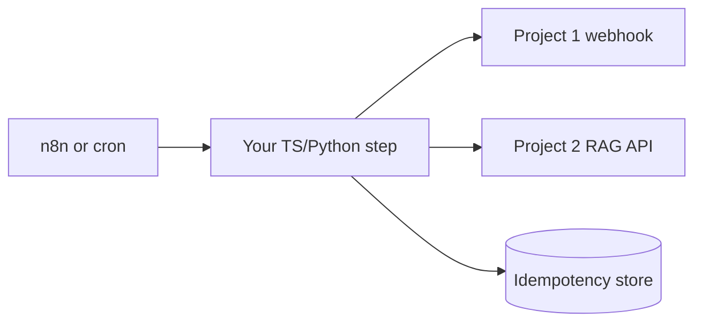

# Project 10 — Automation bot / workflow connector lab

## Progress

| | |
|---|---|
| **Step** | 10 of 22 |
| **Previous** | [Project 9 — OWASP / cybersecurity foundations](09-application-security-lab.md) |
| **Next** | [Project 11 — LLM-integrated web app lab](11-llm-web-app-lab.md) |

## What you will learn

- Build workflow steps with idempotent side effects
- Handle secrets and structured errors in n8n-style automation
- Call Project 1 or 2 boundaries reliably

## Architecture pillars

| Pillar | How this project practices it |
|--------|-------------------------------|
| 1. System shape | Workflow steps vs sync HTTP for long-running automation |
| 2. Integration & messaging | Idempotent side effects, secrets, durable step semantics |
| 5. Reliability, security, operations | Structured errors, replay-safe automation |

**Required ADR(s):** tag each ADR with pillar (e.g. sync HTTP vs enqueue — **Pillar 1**).

**Framework:** [Architecture framework](../docs/concepts/architecture-framework.md)

## Before you start

- **Patterns:** [Integration-automation map](../docs/concepts/integration-automation.md)

## Problem

Ship a **workflow-shaped automation** piece—custom **n8n node**, scheduled job, or Boomi-adjacent connector step—that calls your [Project 2](02-rag-llm-service.md) or [Project 1](01-integration-webhook-receiver.md) boundaries with **secrets, errors, and idempotency** handled like production integration code.

## Career relevance

**Summary:** You prove automation is **engineering**, not drag-and-drop only—connectors fail, retry, and double-fire; your step must survive that.

### In depth

iPaaS and workflow tools (n8n, Boomi, Zapier-class) are how many enterprises glue systems. Backend engineers who can **author reliable steps** (typed I/O, idempotent side effects, structured errors) stand out from “I built a flow in the UI.” This lab bridges [integration-automation map](../docs/concepts/integration-automation.md) vocabulary and shippable TypeScript or Python.

**Real-world situations:** Partner workflow retries a failed node; your step must not double-create tickets. API key rotation without plaintext in exported JSON. Clear error messages for ops when downstream LLM times out.

### How to talk about this

Your n8n node treats retries like webhooks—idempotent keys and structured errors so workflow replays do not duplicate side effects. Explain secrets via env or vault (never in exported workflow JSON), actionable errors back to the orchestrator, and `request_id` in logs when downstream Project 1 or 2 calls fail.

## Important concepts

### Idempotent side effects

Key outbound writes on a business id; safe on workflow retry. At-least-once step execution is the default in iPaaS (integration Platform as a Service) tools—design side effects like queue consumers, not like one-shot scripts.

### Secrets hygiene

Store credentials via environment variables or vault; never commit workflow export secrets. Rotation should not require grep-ing plaintext keys from shared JSON exports.

### Fast failure and structured errors

Return actionable errors to the workflow engine and log `request_id` for correlation. Ops need “downstream 503, retry safe” versus “invalid API key, fix config”—not opaque stack traces in the UI alone.

## Code repo

_TBD — e.g. `automation-bot-lab` or n8n community node package._ Suggested folder: [`../career-projects/10-automation-bot-lab`](../career-projects/10-automation-bot-lab).

## Stack

- **TypeScript** (n8n custom node) **or** **Python** (scheduled worker calling APIs)
- Calls existing [Project 2](02-rag-llm-service.md) or [Project 1](01-integration-webhook-receiver.md) endpoints
- Structured logging aligned with [Project 3](03-observability-lab.md)

### Key concepts (with definitions and code)

### Workflow step vs HTTP service

**What:** A step runs **inside** a orchestrator’s retry/DLQ semantics—not a standalone public API.

**Problem it solves:** You design for **at-least-once step execution**, same as queue consumers.

### n8n custom node skeleton (Illustrative)

```typescript
// Illustrative — n8n INodeType execute()
async execute(this: IExecuteFunctions): Promise<INodeExecutionData[][]> {
  const idempotencyKey = this.getNodeParameter("idempotencyKey", 0) as string;
  const response = await this.helpers.requestWithAuthentication.call(this, "project2Api", {
    method: "POST",
    url: "/query",
    headers: { "Idempotency-Key": idempotencyKey },
    body: { question: this.getNodeParameter("question", 0) },
    json: true,
  });
  return [this.helpers.returnJsonArray(response)];
}
```

### Sync HTTP vs enqueue for long steps

| Approach | Pros | Cons | Use when |
|----------|------|------|----------|
| **Sync HTTP to Project 2** | Simple workflow graph | Timeouts on long LLM calls | Short queries, bounded latency |
| **Enqueue to Project 6** | Survives partner/workflow retries | More infra | Long-running side effects |

### Architecture



**Failure modes:** secrets in exported workflow JSON; duplicate workflow run without idempotency key; unbounded wait on LLM timeout.

## Success criteria

- [ ] Step/node calls Project 2 or Project 1 with auth; secrets outside repo.
- [ ] **Idempotent** outbound effect documented (key + store or natural idempotency).
- [ ] Errors surface to workflow with log correlation id.
- [ ] README: diagram of trigger → step → downstream API.

## Testing approach (lab)

Integration test: run step twice with same input → one side effect.

## Exploration scenarios

1. Downstream 503 → workflow retries → no duplicate writes.
2. Invalid API key → clear error, no partial state.
3. LLM timeout from Project 2 → bounded wait; documented fallback.

## Stretch

- Publish as private n8n community package with version tag.
- Enqueue to [Project 6](06-async-worker-stretch.md) instead of sync call.

## Bash scripting milestone

Ship `scripts/trigger-workflow.sh` — cron-safe workflow trigger; secrets from env only; idempotent side effects documented.

## Portfolio artifacts

Template: [Portfolio artifacts](../docs/templates/portfolio-artifacts.md). Commit under `docs/portfolio/` in your lab repo.

- [ ] **Architecture diagram** — workflow trigger → your Project 1/2 API with secrets boundary.
- [ ] **ADR** — sync HTTP call vs enqueue to Project 6 for long steps.
- [ ] **Performance numbers** — workflow step timeout budget documented.
- [ ] **Failure modes** — duplicate workflow run; secrets in repo; unbounded LLM wait.
- [ ] **Observability evidence** — step log with correlation to downstream `request_id`.
- [ ] Artifacts committed in lab repo `docs/portfolio/`.

## When you're done

- Run tests: [Testing approach (lab)](#testing-approach-lab) · [per-project testing guide](../docs/concepts/per-project-testing.md)
- Checklist: [Production readiness](../checklists/production-readiness.md) (step 10)
- Checklist: [Integration hardening checklist](../checklists/integration-hardening.md)
- Log in [PROGRESS.md](../PROGRESS.md)
- **Next:** [Project 11 — LLM-integrated web app lab](11-llm-web-app-lab.md)
