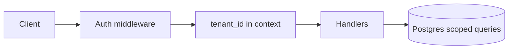

# Project 12 — Multi-tenant auth + SaaS slice lab

## Progress

| | |
|---|---|
| **Step** | 12 of 22 |
| **Previous** | [Project 11 — LLM-integrated web app lab](11-llm-web-app-lab.md) |
| **Next** | [Project 13 — Real-time dashboard lab](13-realtime-dashboard-lab.md) |

## What you will learn

- Row-level tenant isolation
- JWT (JSON Web Token) / session patterns with scoped queries
- AuthZ (authorization) on every data path

## Architecture pillars

| Pillar | How this project practices it |
|--------|-------------------------------|
| 1. System shape | Auth gate → tenant context on every request path |
| 3. Data architecture | Row-level `tenant_id` vs Postgres RLS; scoped queries |
| 5. Reliability, security, operations | JWT/session, tenant isolation, cross-tenant failure modes |

**Required ADR(s):** tag each ADR with pillar (e.g. RLS vs app-layer scoping — **Pillar 3**; JWT vs session — **Pillar 5**).

**Framework:** [Architecture framework](../docs/concepts/architecture-framework.md)

## Before you start

- **Requires:** [Project 5](05-contract-first-api.md) and [Project 4](04-sql-performance-lab.md)

## Problem

Add **authentication** and **tenant isolation** to a small API + SQL schema: users belong to tenants; every read/write scoped by `tenant_id`; JWT or session boundary documented and tested.

## Career relevance

**Summary:** You practice **SaaS-shaped data ownership**—the pattern behind multi-tenant B2B products, not single-user demos.

### In depth

Multi-tenant bugs are **cross-customer data leaks**—career-ending severity. This lab builds on [Project 5](05-contract-first-api.md) contracts and [Project 4](04-sql-performance-lab.md) indexing (`tenant_id` in composite indexes). Complements [Project 9](09-application-security-lab.md) session hygiene.

### How to talk about this

Tenant id comes from auth context, never from client body—you index and test for cross-tenant leakage. Describe JWT (JSON Web Token) or session extraction on every route, composite indexes that lead with `tenant_id`, and integration tests where tenant A’s token cannot read tenant B’s rows.

## Important concepts

### Tenant isolation

Every query filters by authenticated tenant; tests prove no cross-tenant read. Forged `tenant_id` in JSON must be ignored or rejected with `403`—the server derives scope from auth, not from client-supplied fields.

### Auth boundary

Use JWT or session cookies with secure flags; logout invalidates server-side session state where your stack supports it. Document headers or cookies in OpenAPI or README so consumers do not guess auth shape.

### Idempotent provisioning

Sign-up or invite webhooks use idempotency keys ([Project 1](01-integration-webhook-receiver.md) pattern) so duplicate delivery does not create duplicate memberships or tenants.

## Code repo

_TBD — extend [Project 7](07-node-typescript-lab.md) or [Project 5](05-contract-first-api.md) repo._ Suggested folder: [`../career-projects/12-multi-tenant-auth-lab`](../career-projects/12-multi-tenant-auth-lab).

## Stack

- **TypeScript** (Fastify/Express) or Laravel/FastAPI from Project 5
- **Postgres** — shared schema, row-level tenant column (RLS optional stretch)
- Migrations checked in

### Key concepts (with definitions and code)

### Tenant-scoped query

**What:** Every SQL statement includes `tenant_id` from auth context, never from request body.

**Problem it solves:** Cross-customer data leaks—the highest-severity SaaS bug class.

```sql
-- Illustrative — composite index leads with tenant_id
CREATE INDEX idx_orders_tenant_created ON orders (tenant_id, created_at DESC);
SELECT id, status FROM orders WHERE tenant_id = $1 AND id = $2;
```

See [Illustrative snippets — JWT tenant middleware](../docs/concepts/illustrative-snippets.md#jwt-tenant-middleware).

### JWT vs session

| Approach | Pros | Cons | Use when |
|----------|------|------|----------|
| **JWT (stateless)** | Easy horizontal scale | Revocation lists or short TTL | API-first, mobile clients |
| **Server session** | Instant logout/revoke | Sticky store or shared Redis | HTML forms + CSRF from Project 9 |
| **Postgres RLS** | DB-enforced isolation | Policy complexity | Defense in depth (stretch) |

### Architecture



**Failure modes:** trusting `tenant_id` from JSON body; missing tenant filter on one list endpoint; expired JWT returns opaque 500 instead of 401.

## Success criteria

- [ ] Register/login/logout flows; password hashing (bcrypt/argon2).
- [ ] API routes reject missing/wrong tenant context.
- [ ] Integration test: tenant A token cannot read tenant B row.
- [ ] OpenAPI or README documents auth headers/cookies.

## Testing approach (lab)

Two tenant fixtures; assert isolation on list and detail endpoints.

## Exploration scenarios

1. Forged `tenant_id` in JSON body → ignored or 403.
2. Expired JWT → 401 with stable error shape.
3. Duplicate invite webhook → idempotent tenant membership.

### 4 — Cross-tenant integration test

- **Setup:** Two tenants with fixtures; tokens for user A and user B.
- **Action:** Call tenant B resource with tenant A token.
- **Expected outcome:** `403` or empty result—never B's data in A's response.

## Stretch

- Postgres RLS policies mirroring app checks.
- Link to [Project 11](11-llm-web-app-lab.md) for tenant-scoped RAG queries.
- **OAuth/OIDC** — "Sign in with Google" (or similar) → issue your existing JWT/session; document token exchange and tenant mapping on first login.

## Big Tech benchmark tier

Optional ceiling — see [big-tech-benchmark.md](../docs/career/big-tech-benchmark.md). Complete after UK £80k success criteria are green.

- [ ] **OAuth/OIDC required** — Google (or similar) sign-in issues your JWT/session; not optional stretch.
- [ ] Document authorization code flow, token refresh, and tenant mapping on first login.
- [ ] Integration test: OAuth callback → session → tenant-scoped API access.
- [ ] Threat notes: CSRF on OAuth state param; redirect URI allowlist ([Project 9](09-application-security-lab.md)).

## Bash scripting milestone

Ship `scripts/smoke.sh` — authenticated or public health path; exit 0/1 for CI.

## Portfolio artifacts

Template: [Portfolio artifacts](../docs/templates/portfolio-artifacts.md). Commit under `docs/portfolio/` in your lab repo.

- [ ] **Architecture diagram** — auth gate → tenant context → scoped queries on every path.
- [ ] **ADR** — row-level `tenant_id` vs RLS; JWT vs session for this lab.
- [ ] **Performance numbers** — composite index impact on tenant-scoped list query (optional).
- [ ] **Failure modes** — cross-tenant read/write; missing tenant on insert; session fixation.
- [ ] **Observability evidence** — log showing tenant id on authenticated request (redacted).
- [ ] Artifacts committed in lab repo `docs/portfolio/`.

## When you're done

- Run tests: [Testing approach (lab)](#testing-approach-lab) · [per-project testing guide](../docs/concepts/per-project-testing.md)
- Checklist: [Production readiness](../checklists/production-readiness.md) (step 12)
- Log in [PROGRESS.md](../PROGRESS.md)
- **Next:** [Project 13 — Real-time dashboard lab](13-realtime-dashboard-lab.md)
