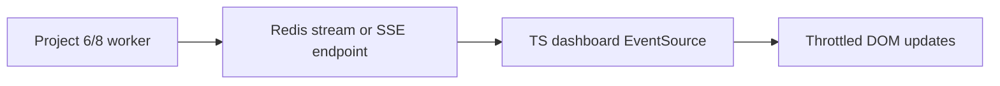

# Project 13 — Real-time dashboard lab

## Progress

| | |
|---|---|
| **Step** | 13 of 22 |
| **Previous** | [Project 12 — Multi-tenant auth + SaaS slice lab](12-multi-tenant-auth-lab.md) |
| **Next** | [Project 14 — Shell automation lab](14-shell-automation-lab.md) |

## What you will learn

- SSE (Server-Sent Events) / WebSocket push with reconnect
- Backpressure and stale UI handling
- Live updates from worker events

## Architecture pillars

| Pillar | How this project practices it |
|--------|-------------------------------|
| 1. System shape | SSE/WebSocket push path vs polling; client reconnect shape |
| 2. Integration & messaging | Event stream delivery, duplicate events (secondary) |
| 4. Performance & language boundaries | Backpressure, stale UI under load |
| 5. Reliability, security, operations | Reconnect semantics, failure modes |

**Required ADR(s):** tag each ADR with pillar (e.g. SSE vs WebSocket — **Pillar 1**).

**Framework:** [Architecture framework](../docs/concepts/architecture-framework.md)

## Before you start

- **Requires:** [Project 6](06-async-worker-stretch.md) or [Project 8](08-go-retrieval-worker-lab.md) event vocabulary
- **Handbook:** [Memory and performance — client retention](../docs/concepts/memory-and-performance.md#memory-patterns)

## Problem

Build a **TypeScript dashboard** that consumes live events from [Project 6](06-async-worker-stretch.md) / [Project 8](08-go-retrieval-worker-lab.md)—SSE or WebSocket—with reconnect, backpressure awareness, and readable ops UI (queue depth, job status, ingest progress).

## Career relevance

**Summary:** You ship **real-time full-stack** behavior—how SaaS ops and IoT dashboards actually update without polling spam.

### In depth

Real-time UIs fail on **reconnect storms**, **duplicate events**, and **unbounded client buffers**. This lab pairs with event-bus stretches in Project 8 and [Project 21](21-iot-edge-lab.md) telemetry feeds.

### How to talk about this

The dashboard uses SSE (Server-Sent Events) with reconnect and `Last-Event-ID` so ops see live queue health without polling the API every second. Explain your resume-or-dedupe policy after disconnect, batching or throttling under high event rates, and why secrets stay off the frontend bundle.

## Important concepts

### SSE and WebSocket push

The server pushes job or telemetry events; the client handles disconnect and stale UI. Pick SSE for one-way ops feeds or WebSockets when you need bidirectional control—document the choice in an ADR (architecture decision record).

### Reconnect and last-event-id

Resume or dedupe after reconnect using `Last-Event-ID` or an equivalent cursor; document policy in README. Server restarts should not double-count completed jobs in the UI if the client replays overlapping events.

### Backpressure awareness

Drop or batch high-rate events so the DOM does not grow without bound. One thousand events per minute should remain usable—throttle rendering, cap buffer size, or collapse updates into periodic snapshots.

## Code repo

_TBD — e.g. `realtime-dashboard-lab`._ Suggested folder: [`../career-projects/13-realtime-dashboard-lab`](../career-projects/13-realtime-dashboard-lab).

## Stack

- **TypeScript** — minimal UI (Vite/React or server-rendered + HTMX-style updates)
- Event source: Project 8 HTTP SSE endpoint, Redis stream, or NATS (document choice)
- [Handbook — WebSockets](../docs/concepts/servers-and-networking.md#websockets-and-long-polling)

### Key concepts (with definitions and code)

### SSE handler

**What:** HTTP long-lived response streaming `text/event-stream` events with `id` for reconnect.

**Problem it solves:** Live ops UI without polling; simpler than WebSocket for one-way job status.

See [Illustrative snippets — SSE](../docs/concepts/illustrative-snippets.md#server-sent-events-sse-endpoint).

### SSE vs WebSocket

| Approach | Pros | Cons | Use when |
|----------|------|------|----------|
| **SSE** | Auto-reconnect; HTTP infra | One-way only | This lab default (queue/job feed) |
| **WebSocket** | Bidirectional | Stateful connections | Control + push combined |
| **Long polling** | Works through old proxies | Wasteful | Legacy fallback only |

### Architecture

**Failure modes:** unbounded client buffer; duplicate event ids after reconnect; stale UI when events arrive out of order.

## Success criteria

- [ ] Live updates when worker completes/fails jobs (wired to real or mocked Project 6/Project 8).
- [ ] Reconnect after server restart documented and tested.
- [ ] README diagram: event producer → bus/stream → dashboard.
- [ ] No API secrets in frontend bundle.

## Bash scripting milestone

Ship `scripts/smoke.sh` — minimal happy path (start stack or hit SSE endpoint); strict mode; exit 0/1 for CI.

## Testing approach (lab)

Simulate event burst; assert UI stability or batching policy.

## Exploration scenarios

1. Server restart → client reconnects within N seconds.
2. Duplicate event id → UI does not double-count.
3. 1000 events/min → UI remains usable (batch/throttle).

### 4 — Reconnect with Last-Event-ID

- **Setup:** Dashboard open; note last seen event id.
- **Action:** Restart event source server; client reconnects with `Last-Event-ID` header.
- **Expected outcome:** No duplicate completed jobs in UI; README documents resume policy.

## Stretch

- Share components with [Project 11](11-llm-web-app-lab.md) for query progress.
- Consume [Project 21](21-iot-edge-lab.md) MQTT-forwarded telemetry.

## Portfolio artifacts

Template: [Portfolio artifacts](../docs/templates/portfolio-artifacts.md). Commit under `docs/portfolio/` in your lab repo.

- [ ] **Architecture diagram** — event source → SSE/WS → client reconnect and buffer policy.
- [ ] **ADR** — SSE vs WebSocket for this dashboard; duplicate event handling.
- [ ] **Performance numbers** — reconnect storm or client buffer limit note.
- [ ] **Failure modes** — unbounded client buffer; duplicate events after reconnect; stale UI state.
- [ ] **Observability evidence** — dashboard + log showing live event with correlation id.
- [ ] Artifacts committed in lab repo `docs/portfolio/`.

## When you're done

- Run tests: [Testing approach (lab)](#testing-approach-lab) · [per-project testing guide](../docs/concepts/per-project-testing.md)
- Checklist: [Production readiness](../checklists/production-readiness.md) (step 13)
- Log in [PROGRESS.md](../PROGRESS.md)
- **Next:** [Project 14 — Shell automation lab](14-shell-automation-lab.md)
