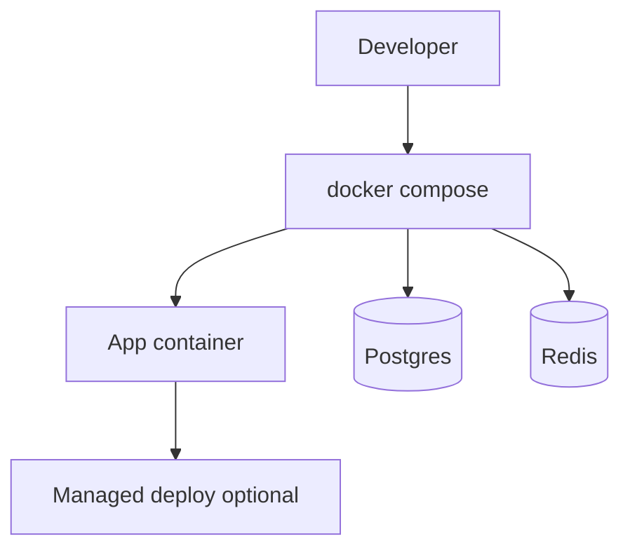

# Project 16 — Cloud deploy + infra automation lab

## Progress

| | |
|---|---|
| **Step** | 16 of 22 |
| **Previous** | [Project 15 — DevOps CLI / ops tool lab](15-devops-cli-lab.md) |
| **Next** | [Project 17 — Kubernetes controller-lite lab](17-k8s-controller-lab.md) |

## What you will learn

- Compose-based deploy with secrets and health checks
- Managed queue or cloud-shaped ops
- Rollback and env parity habits

## Architecture pillars

| Pillar | How this project practices it |
|--------|-------------------------------|
| 1. System shape | Deploy topology, service composition (secondary) |
| 5. Reliability, security, operations | Health checks, secrets, CI/CD, rollback strategy |

**Required ADR(s):** tag each ADR with pillar (e.g. cloud target — **Pillar 5**; rollback — **Pillar 5**).

**Framework:** [Architecture framework](../docs/concepts/architecture-framework.md)

## Before you start

- **Requires:** [Project 8](08-go-retrieval-worker-lab.md) or [Project 6](06-async-worker-stretch.md) runnable stack

## Problem

Take [Project 8](08-go-retrieval-worker-lab.md) (or Project 6+Project 4 stack) to **deployable** shape: `docker compose` locally, documented path to **one managed environment** (Fly, Railway, ECS, or similar), secrets outside git, health checks, and managed queue option.

## Career relevance

**Summary:** You close the loop from **works on my machine** to **runs with rollback and secrets**—cloud-shaped ops without a certification detour.

### In depth

Employers hiring for Go/Python/TypeScript (TS) backends expect **Docker literacy** and basic deploy hygiene. This lab is prerequisite for [Project 17](17-k8s-controller-lab.md) (Kubernetes assumes you already ship containers).

**Why learning this moves the needle**

- **Deploy confidence:** A documented path from local Compose to one managed environment proves you can ship—not only develop.
- **Secrets hygiene:** Credentials in git is an instant disqualifier in security-minded reviews; platform secret stores and `.env.example`-only repos show maturity.
- **Rollback stories:** Interviewers ask what happens when a deploy goes bad; “redeploy previous image tag” with verified steps beats hand-waving.

**Real-world situations this project mirrors**

- **First production deploy:** Fly, Railway, Amazon Elastic Container Service (ECS), or similar—one platform chosen and documented step-by-step.
- **CI on every PR:** GitHub Actions lint + test badge in README; deploy scripts from [Project 14](14-shell-automation-lab.md) run post-deploy smoke.
- **Managed queue switch:** local Redis to cloud-shaped queue URL with env parity documented.

### How to talk about this

You deploy the worker and API as containers with health checks and secrets in the platform store—rollback is redeploy previous tag. When interviewers ask about immutability, describe one image or artifact per release with tagged deploys. When they ask about readiness, explain liveness vs readiness endpoints and Compose `healthcheck` blocks that gate dependent services.

## Important concepts

### Immutable deploy

Ship one image or artifact per release; tag each deploy; document rollback as redeploy of the previous known-good tag—not in-place edits on running hosts.

### Secrets management

Load secrets from the platform secret store at runtime. Git contains only `.env.example` listing key names—never values. Fail fast at startup when required secrets are missing.

### Health checks

Expose liveness and readiness HTTP endpoints. Compose `healthcheck` blocks (and cloud platform probes) should gate traffic and dependent service startup on real readiness—not merely “process is running.”

## Code repo

_Document deploy in Project 8/Project 6 lab repo or `_TBD` `cloud-deploy-lab` wrapper._

## Stack

- **Docker Compose** — app + Postgres + Redis/NATS
- One cloud target (document choice in README — Fly, Railway, Amazon Elastic Container Service (ECS), or Amazon Elastic Kubernetes Service (EKS)-compatible image)
- **GitHub Actions** — lint + test on PR (see success criteria)

### Key concepts (with definitions and code)

### Compose service graph

**What:** `docker-compose.yml` wires app, database, queue, and health dependencies.

```yaml
# Illustrative — excerpt
services:
  api:
    image: your-api:tag
    env_file: .env
    healthcheck:
      test: ["CMD", "curl", "-f", "http://localhost:8080/health"]
      interval: 10s
  postgres:
    image: postgres:16
  redis:
    image: redis:7
```

### Cloud target comparison

| Platform | Pros | Cons | Use when |
|----------|------|------|----------|
| **Fly / Railway** | Fast hobby deploy | Vendor lock-in light | First managed deploy |
| **Azure Container Apps** | AI-200 / AZ-900 path; Key Vault integration; scale rules | Azure-specific; cost learning curve | [Azure certification track](../docs/career/azure-certification-track.md) |
| **ECS/Fargate** | AWS-native | More IAM surface | AWS-heavy employers |
| **Compose only** | Zero cloud cost | Not production-shaped alone | Local dev baseline |

### Architecture



**Failure modes:** secrets in git; deploy without health check; no documented rollback tag.

## Success criteria

- [ ] `docker compose up` brings full capstone slice locally.
- [ ] One successful deploy to chosen platform documented step-by-step.
- [ ] Secrets never in git; `.env.example` lists keys only.
- [ ] Health URL returns 200; README lists rollback steps.
- [ ] **GitHub Actions** workflow runs lint + test on PR (badge in README).

## Bash scripting milestone

Ship `scripts/deploy.sh` and `scripts/post-deploy-smoke.sh` using [Project 14](14-shell-automation-lab.md) strict-mode patterns: preflight env, invoke compose/deploy, hit health URL, exit non-zero on failure.

## Testing approach (lab)

Smoke test script post-deploy: hit health + one API path.

## Exploration scenarios

1. Bad deploy → rollback to previous tag documented.
2. Missing secret → fail fast at startup with clear log.
3. Queue URL switch local → managed documented.

## Azure certification stretch

Recommended if you are on [AZ-900](https://learn.microsoft.com/en-us/credentials/certifications/azure-fundamentals/) + [AI-200T00](https://learn.microsoft.com/en-us/training/courses/ai-200t00)—see [Azure certification track](../docs/career/azure-certification-track.md). **Optional** for Step 16 success criteria (any one managed platform counts).

- Deploy Project 8/6 stack to **Azure Container Apps** (API + worker + health probes).
- Secrets in **Azure Key Vault**; app uses **managed identity**—no credentials in git or plain env on host.
- Optional: **Azure Service Bus** or **Managed Redis** URLs via Key Vault references.
- **GitHub Actions** deploy workflow to Azure; document rollback (previous revision/tag).
- ADR: Container Apps vs Fly/Railway/ECS — cold start, min replicas, RBAC for deploy identity.
- Wire **Application Insights** for post-deploy smoke correlation with [Project 3](03-observability-lab.md) `request_id` pattern.

## Stretch

- Terraform/Pulumi stub for queue + DB (single file, not full platform).
- Blue/green or canary note in README (theory OK if not implemented).

## Big Tech benchmark tier

Optional ceiling — see [big-tech-benchmark.md](../docs/career/big-tech-benchmark.md). Complete after UK £80k success criteria are green.

- [ ] Deploy to **GCP (Cloud Run/GKE) or AWS (ECS/EKS)** — not local Compose only.
- [ ] Document **IAM least-privilege** — which service account/role can access queue, DB, secrets.
- [ ] Secrets in platform secret manager; no credentials in git or plain env on host.
- [ ] Post-deploy smoke test script checked into repo; rollback steps verified once.

## Portfolio artifacts

Template: [Portfolio artifacts](../docs/templates/portfolio-artifacts.md). Commit under `docs/portfolio/` in your lab repo.

- [ ] **Architecture diagram** — compose services, networks, secrets, health dependencies.
- [ ] **ADR** — cloud target choice and rollback strategy.
- [ ] **Performance numbers** — deploy smoke test duration or cold-start note.
- [ ] **Failure modes** — secrets in git; deploy without health check; no rollback path.
- [ ] **Observability evidence** — health endpoint 200 + one structured log post-deploy.
- [ ] Artifacts committed in lab repo `docs/portfolio/`.

## When you're done

- Run tests: [Testing approach (lab)](#testing-approach-lab) · [per-project testing guide](../docs/concepts/per-project-testing.md)
- Checklist: [Production readiness](../checklists/production-readiness.md) (step 16)
- Log in [PROGRESS.md](../PROGRESS.md)
- **Next:** [Project 17 — Kubernetes controller-lite lab](17-k8s-controller-lab.md)
