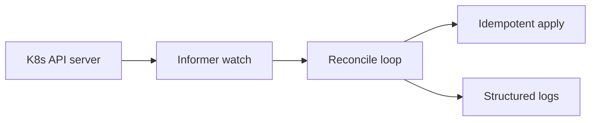

# Project 17 — Kubernetes controller-lite lab (advanced)

## Progress

| | |
|---|---|
| **Step** | 17 of 22 |
| **Previous** | [Project 16 — Cloud deploy + infra automation lab](16-cloud-deploy-lab.md) |
| **Next** | [Project 18 — Proxy / load-balancer lab](18-proxy-load-balancer-lab.md) |

## What you will learn

- Reconcile loop and desired-state apply
- Idempotent cluster operations
- Controller patterns without full operator complexity

## Architecture pillars

| Pillar | How this project practices it |
|--------|-------------------------------|
| 1. System shape | Desired vs actual state; reconcile loop as system shape |
| 2. Integration & messaging | Idempotent cluster apply; at-least-once reconcile semantics |
| 5. Reliability, security, operations | RBAC failure modes, API unavailable paths |

**Required ADR(s):** tag each ADR with pillar (e.g. controller-lite vs full CRD — **Pillar 1**).

**Framework:** [Architecture framework](../docs/concepts/architecture-framework.md)

## Before you start

- **Requires:** [Project 16](16-cloud-deploy-lab.md)

## Problem

Build a **minimal Kubernetes controller or operator pattern** in Go: watch a resource (Deployment, ConfigMap, or simple CRD), reconcile desired vs actual state **idempotently**, and log structured reconcile events.

## Career relevance

**Summary:** Kubernetes operators are Go/Rust territory—this lab proves you understand **reconcile loops**, not only `kubectl apply`.

### In depth

**Wave 3 — advanced.** Complete [Project 16](16-cloud-deploy-lab.md) first. Start with **controller-lite** (informers + sync loop) before a full custom resource definition (CRD) operator if time-boxed.

**Why learning this moves the needle**

- **Platform engineering signal:** Controllers are how teams automate cluster state; understanding reconcile beats memorizing kubectl recipes.
- **Idempotency at scale:** The same “apply twice → stable outcome” habit from [Project 6](06-async-worker-stretch.md) workers applies to cluster operations.
- **Failure modes:** Role-based access control (RBAC) denial and API server outages are real; logging and backoff separate junior from senior answers.

**Real-world situations this project mirrors**

- **Replica drift:** someone hand-edits a Deployment; your controller reconciles desired vs actual or logs a conflict policy.
- **Missed events:** level-triggered resync catches watch gaps that edge-only handlers miss.
- **Deploy hooks:** `scripts/kubectl-wait-ready.sh` polls readiness with timeout for CI/CD pipelines.

### How to talk about this

Your controller reconciles desired replicas idempotently—level-triggered sync, not one-shot edge handlers. When interviewers ask about the reconcile loop, describe observe → diff → act → requeue with backoff. When they ask about duplicates, explain that repeated reconcile without drift should not spam side effects.

## Important concepts

### Reconcile loop

Watch desired state, compare to actual cluster state, apply changes, and requeue on error or periodic resync. Avoid infinite hot loops: backoff on failures and exit early when already converged.

### Idempotent apply

Applying the same spec twice yields stable cluster state—no duplicate resources, no runaway side effects. This mirrors idempotent worker handlers from earlier labs.

### Level-triggered, not edge-only

Handle missed watch events with periodic full resync. Edge-triggered handlers alone fail when the API server drops events or the controller restarts mid-stream.

## Code repo

_TBD — e.g. `k8s-controller-lab`._ Suggested folder: [`../career-projects/17-k8s-controller-lab`](../career-projects/17-k8s-controller-lab).

## Stack

- **Go** — `controller-runtime` or client-go informers (document choice)
- **kind** or **minikube** for local cluster
- Deploy target from [Project 16](16-cloud-deploy-lab.md)

### Key concepts (with definitions and code)

### Reconcile loop

**What:** Observe desired state, diff against cluster, apply idempotently, requeue on error.

See [Illustrative snippets — reconcile](../docs/concepts/illustrative-snippets.md#kubernetes-reconcile-loop-controller-lite).

### Controller-lite vs full CRD operator

| Approach | Pros | Cons | Use when |
|----------|------|------|----------|
| **Controller-lite** | Faster to ship; informers + sync | Limited custom API | Learning reconcile habits |
| **Full CRD operator** | Kubernetes-native API | Boilerplate heavy | Production platform teams |

### Architecture

## Success criteria

- [ ] Watches at least one resource type; logs reconcile with resource name/namespace.
- [ ] Idempotent: repeated reconcile without drift does not spam side effects.
- [ ] README: architecture diagram + failure modes (RBAC denied, API unavailable).
- [ ] `go test` for pure reconcile logic where possible.

## Bash scripting milestone

Ship `scripts/kubectl-wait-ready.sh` — poll readiness with timeout and clear exit codes for deploy hooks.

## Testing approach (lab)

Envtest or fake client unit tests for reconcile function.

## Exploration scenarios

1. Manual drift in cluster → controller corrects or logs conflict policy.
2. API server unavailable → backoff documented.
3. Duplicate events → stable outcome.

## Stretch

- Full CRD + status subresource.
- Prometheus metrics on reconcile duration/errors.

## Azure certification stretch

Optional — [AI-200T00 AKS module](https://learn.microsoft.com/en-us/training/courses/ai-200t00) / [Azure certification track](../docs/career/azure-certification-track.md). **Not required** for Step 17 success criteria.

- Deploy controller target to **Azure Kubernetes Service (AKS)** instead of local kind/minikube only.
- Document **Azure RBAC** + kubeconfig access for CI vs human admin.
- Optional: **Application Insights** or Azure Monitor metrics for reconcile duration/errors.
- ADR: AKS vs Container Apps vs local cluster—ops burden vs control plane ownership.

## Portfolio artifacts

Template: [Portfolio artifacts](../docs/templates/portfolio-artifacts.md). Commit under `docs/portfolio/` in your lab repo.

- [ ] **Architecture diagram** — informer → reconcile loop → desired vs actual state.
- [ ] **ADR** — controller-lite scope vs full CRD operator.
- [ ] **Performance numbers** — reconcile loop latency or queue depth under drift.
- [ ] **Failure modes** — RBAC denied silent failure; hot loop without backoff; non-idempotent apply.
- [ ] **Observability evidence** — controller log on successful reconcile with resource id.
- [ ] Artifacts committed in lab repo `docs/portfolio/`.

## When you're done

- Run tests: [Testing approach (lab)](#testing-approach-lab) · [per-project testing guide](../docs/concepts/per-project-testing.md)
- Checklist: [Production readiness](../checklists/production-readiness.md) (step 17)
- Log in [PROGRESS.md](../PROGRESS.md)
- **Next:** [Project 18 — Proxy / load-balancer lab](18-proxy-load-balancer-lab.md)
