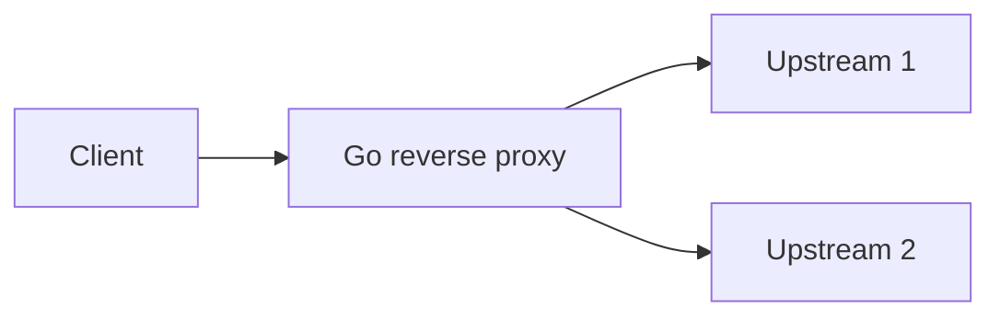

# Project 18 — Proxy / load-balancer lab (advanced)

## Progress

| | |
|---|---|
| **Step** | 18 of 22 |
| **Track** | **Go-first** — implement in Go only; Rust is not required. |
| **Previous** | [Project 17 — Kubernetes controller-lite lab](17-k8s-controller-lab.md) |
| **Next** | [Project 19 — Rust hot-path reimplementation lab](19-rust-hot-path-lab.md) — or [Project 21](21-iot-edge-lab.md) / [Project 22](22-integrated-platform-capstone.md) when Rust is paused |

## What you will learn

- Connection pooling, timeouts, graceful shutdown
- Reverse-proxy behavior under load
- Network-layer failure modes

## Architecture pillars

| Pillar | How this project practices it |
|--------|-------------------------------|
| 1. System shape | Client → proxy → upstream pool; timeout budgets across hops |
| 4. Performance & language boundaries | Connection pooling, graceful shutdown, load behavior |
| 5. Reliability, security, operations | Network-layer failure modes, access logs |

**Required ADR(s):** tag each ADR with pillar (e.g. pool sizing — **Pillar 4**; graceful shutdown — **Pillar 5**).

**Framework:** [Architecture framework](../docs/concepts/architecture-framework.md)

## Before you start

- **Handbook:** [Servers and networking](../docs/concepts/servers-and-networking.md) · [Memory and performance — timeouts and load testing](../docs/concepts/memory-and-performance.md)

## Problem

Implement a **small reverse proxy or load balancer** in **Go**: forward HTTP to upstream pool, enforce timeouts, connection limits, graceful shutdown, and structured access logs.

## Career relevance

**Summary:** Proxies teach **network-level reliability**—timeouts, pooling, and backpressure—that application code alone cannot fix.

### In depth

**Advanced.** Complements [Project 8](08-go-retrieval-worker-lab.md) gateway work and [Project 19](19-rust-hot-path-lab.md) performance comparisons.

**Why learning this moves the needle**

- **Edge reliability:** Slow upstreams wedge the whole service without proxy-level timeouts and connection limits.
- **Deploy safety:** Graceful shutdown on SIGTERM drains in-flight requests before exit—critical for zero-downtime rollouts.
- **Interview depth:** Rate limiting ([Project 23](23-rate-limiter-gateway-lab.md)) and load balancing vocabulary start here.

**Real-world situations this project mirrors**

- **One bad upstream:** timeout fires; healthy upstreams still serve traffic.
- **Deploy during load:** SIGTERM triggers drain; in-flight completes or times out per policy.
- **Capacity planning:** round-robin or least-conn across two upstreams with access logs for p95 analysis.

### How to talk about this

Your proxy enforces upstream timeouts and graceful drain on deploy so slow backends do not wedge the whole edge. When interviewers ask about pooling, describe reusing upstream connections with a max concurrent cap. When they ask about failure modes, mention 502/504 mapping, retry storms at the client layer, and why the proxy does not blindly retry idempotent-looking failures.

## Important concepts

### Timeout budgets

Configure client, upstream, and idle timeouts explicitly. Test that a slow upstream returns 502 or 504 within the budget and logs the failure—do not let requests hang indefinitely.

### Graceful shutdown

On SIGTERM, stop accepting new connections, drain in-flight requests within a deadline, then exit. Document whether in-flight requests complete or are cut off after the drain window.

### Connection pooling

Reuse upstream TCP connections to reduce latency and syscall overhead. Cap max concurrent connections so one slow client cannot exhaust the pool and block everyone else.

## Code repo

_TBD — e.g. `proxy-lab`._ Suggested folder: [`../career-projects/18-proxy-load-balancer-lab`](../career-projects/18-proxy-load-balancer-lab).

## Stack

- **Go** — `net/http` ReverseProxy or **Rust** hyper (stretch)
- Two upstream mock servers in docker-compose
- Access logs with request_id

### Key concepts (with definitions and code)

### ReverseProxy with timeouts

**What:** Go `httputil.ReverseProxy` with explicit upstream timeout and connection limits.

```go
// Illustrative — upstream timeout
proxy := httputil.NewSingleHostReverseProxy(upstreamURL)
proxy.Transport = &http.Transport{
    MaxConnsPerHost: 100,
    ResponseHeaderTimeout: 5 * time.Second,
}
```

### Proxy vs cloud load balancer

| Approach | Pros | Cons | Use when |
|----------|------|------|----------|
| **App proxy (this lab)** | Full control; learn failure modes | You operate it | Edge middleware, custom routing |
| **nginx / cloud LB** | Battle-tested TLS and scale | Less custom logic | Production default at scale |

### Architecture



## Success criteria

- [ ] Round-robin or least-conn to ≥2 upstreams.
- [ ] Upstream timeout returns 502/504 with log line.
- [ ] Graceful shutdown test documented (in-flight completes or times out).
- [ ] **`hey` or `k6` smoke load** — p95 and error rate recorded in [`performance.md`](../docs/templates/performance-p18-proxy.md).
- [ ] README compares to putting proxy in nginx/cloud LB (when to use which).

## Testing approach (lab)

Integration: kill upstream; assert failover or error behavior.

## Exploration scenarios

1. One upstream slow → timeout fires; other upstream healthy.
2. SIGTERM during load → drain behavior observed.
3. Malformed client request → 400 without upstream call.
4. **`hey` or `k6` smoke load** — record p95 and error rate under slow upstream in [`performance.md`](../docs/templates/performance-p18-proxy.md) ([Memory and performance](../docs/concepts/memory-and-performance.md#light-load-testing)).

## Stretch

- TLS termination stub (local certs).
- Compose stack with [Project 8](08-go-retrieval-worker-lab.md) upstream behind proxy.

## Portfolio artifacts

Template: [Portfolio artifacts](../docs/templates/portfolio-artifacts.md). Commit under `docs/portfolio/` in your lab repo.

- [ ] **Architecture diagram** — client → proxy → upstream pool with timeout budgets.
- [ ] **ADR** — connection pool sizing and graceful shutdown approach.
- [ ] **Performance numbers** — commit [`docs/portfolio/performance.md`](../docs/templates/performance-p18-proxy.md): p95 with vs without proxy; upstream timeout behavior under load.
- [ ] **Failure modes** — retry storm; pool exhaustion; slow upstream blocking all clients.
- [ ] **Observability evidence** — access log with status, duration, upstream timing.
- [ ] Artifacts committed in lab repo `docs/portfolio/`.

## When you're done

- Run tests: [Testing approach (lab)](#testing-approach-lab) · [per-project testing guide](../docs/concepts/per-project-testing.md)
- Checklist: [Production readiness](../checklists/production-readiness.md) (step 18)
- Log in [PROGRESS.md](../PROGRESS.md)
- **Next:** [Project 19 — Rust hot-path reimplementation lab](19-rust-hot-path-lab.md)
