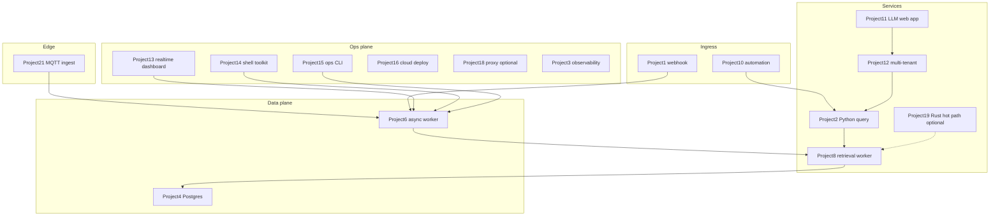

# Project 22 — Integrated platform capstone

## Progress

| | |
|---|---|
| **Step** | 22 of 22 |
| **Previous** | [Project 21 — IoT / edge ingest + local inference lab](21-iot-edge-lab.md) |
| **Next** | — |

## What you will learn

- Compose existing labs into one deployable, demo-ready platform
- Trace requests across services with shared observability contracts
- Present a flagship portfolio piece (diagram, demo, linked artifacts)
- Orchestrate the full stack with [Project 14](14-shell-automation-lab.md) `scripts/demo.sh` patterns

## Architecture pillars

| Pillar | How this project practices it |
|--------|-------------------------------|
| 1. System shape | End-to-end compose: ingest → AI → workers → dashboard → deploy |
| 2. Integration & messaging | Cross-service queues, webhooks, shared delivery semantics |
| 3. Data architecture | Postgres as system of record across services |
| 4. Performance & language boundaries | Python/Go/Rust placement across the stack |
| 5. Reliability, security, operations | Cross-service `request_id`, E2E demo, system-level failure modes |

**Required ADR(s):** tag each ADR with pillar (e.g. compose vs monorepo — **Pillar 1**; capstone-level system ADR — **all pillars**).

**Framework:** [Architecture framework](../docs/concepts/architecture-framework.md)

## Before you start

- **Requires:** Green success criteria on core spine projects, or explicit deferrals logged in [PROGRESS.md](../PROGRESS.md). **Steps 19–20 (Rust) are optional** — capstone can compose Go-first labs only; note any deferrals in the README.
- **Deep dive:** [Architecture framework](../docs/concepts/architecture-framework.md) · [Systems integration architect — Pillar 1](../docs/concepts/systems-integration-architect.md) · [Portfolio artifacts template](../docs/templates/portfolio-artifacts.md)

## Problem

Ship **one integrated system** that composes your existing labs—**not a rewrite**. The capstone repo is a thin **orchestration layer** (`docker compose`, env wiring, demo script, flagship README) that pins and connects services you already built.

## Career relevance

**Summary:** This is your **flagship portfolio piece**—the story that ties ingestion, AI, workers, dashboards, auth, observability, and cloud deploy into one coherent platform interviewers can follow in five minutes. Rust/WASM/IoT edge labs are optional enrichments when completed.

### In depth

Individual labs prove skills; the capstone proves **systems thinking**. Senior hires show: end-to-end architecture, explicit failure modes, measured performance, and production gates—not twenty disconnected repos. Project 22 is where the playbook’s linear path becomes a **single narrative**.

**Why learning this moves the needle**

- **Interview narrative:** Five-minute walkthrough from webhook or IoT ingest to dashboard event with `request_id` in logs beats listing twenty repo names.
- **Composition discipline:** Pin lab images and wire env—do not rewrite [Project 2](02-rag-llm-service.md) inside the capstone repo.
- **Tenant safety:** [Project 12](12-multi-tenant-auth-lab.md) isolation on user paths is non-negotiable for a credible SaaS-shaped demo.

**Real-world situations this project mirrors**

- **Demo day:** one `scripts/demo.sh` command runs the happy path for reviewers.
- **Cross-service incident:** grep one `request_id` across BFF, retrieval-augmented generation (RAG), and Go gateway logs.
- **Partial failure:** kill worker mid-job; queue redelivery with idempotent outcome.

### How to talk about this

This is one Compose stack: webhook and IoT ingest enqueue work, Go workers retrieve, Python serves RAG with evals, TypeScript (TS) backend-for-frontend (BFF) enforces tenant scope, and your demo script proves the full path with `request_id`s in logs. When interviewers ask why orchestration over rewrite, explain pinned lab images, env wiring, and linked `docs/portfolio/` artifacts per service—not a monorepo reimplementation.

## Important concepts

### Orchestration over rewrite

Pin lab images or tags; wire env vars and networks in `docker-compose.yml`. Do not reimplement [Project 2](02-rag-llm-service.md) or other labs inside the capstone repo—the capstone is a thin orchestration layer.

### Tenant-scoped demo

Apply auth from [Project 12](12-multi-tenant-auth-lab.md) on user paths. Prove no cross-tenant leakage in dashboard events or RAG query results in integration tests.

### Trace across boundaries

Propagate the same `request_id` from BFF → RAG → Go gateway in structured logs ([Project 3](03-observability-lab.md)). Reviewers should follow one id across at least three services.

### Flagship README

Include a system diagram, demo script output (video or screenshots), and links to each service’s `docs/portfolio/`—the capstone README is the table of contents for your entire playbook.

### Key concepts (with definitions and code)

### Compose orchestration (Illustrative)

**What:** Pin lab images; wire env; do not reimplement lab code in capstone repo.

```yaml
# Illustrative — service references external image
services:
  rag:
    image: ghcr.io/you/rag-llm-lab:v1.2.0
    environment:
      DATABASE_URL: ${DATABASE_URL}
      RETRIEVE_URL: http://go-gateway:8080
```

### Compose vs monorepo

| Approach | Pros | Cons | Use when |
|----------|------|------|----------|
| **Compose orchestration** | Reuses shipped labs; clear boundaries | Version pinning discipline | **This capstone (required)** |
| **Monorepo rewrite** | Single CI | Loses per-lab portfolio artifacts | Avoid for playbook path |

## System map



## Code repo

| | URL |
|---|-----|
| **GitHub** | _TBD — e.g. `platform-capstone-lab`_ |
| **SSH** | _TBD_ |
| **Local sibling** | [`../career-projects/22-platform-capstone-lab`](../career-projects/22-platform-capstone-lab) |

**Repo contents (minimum):**

- `docker-compose.yml` (or documented k8s manifest set) referencing built images from lab repos
- `.env.example` — all service URLs, secrets keys, queue/DB DSNs
- `scripts/demo.sh` — end-to-end happy path + one failure injection (optional); follow [Project 14](14-shell-automation-lab.md) strict-mode patterns
- `README.md` — flagship system diagram, prerequisites (which lab tags/commits), demo instructions
- `docs/portfolio/` — system-level ADR, E2E performance note, failure modes, observability walkthrough

## Stack

- **Docker Compose** (default) — orchestrates Project 1/2/6/8/11/12/13/21 services + Postgres + queue
- **Optional:** Project 16 cloud deploy of the same stack; Project 18 proxy in front; Project 19/20 components per ADR

## Success criteria

- [ ] `docker compose up` (or documented cloud stack) runs the **integrated slice** locally.
- [ ] **Demo script:** ingest → queue → worker → RAG query → dashboard event, **tenant-scoped** where applicable.
- [ ] **Auth + tenant isolation** on user-facing paths ([Project 12](12-multi-tenant-auth-lab.md)).
- [ ] **request_id** traceable across at least **3 services** in logs ([Project 3](03-observability-lab.md)).
- [ ] **Cloud deploy** documented with health checks + rollback ([Project 16](16-cloud-deploy-lab.md)).
- [ ] **Rust hot-path or WASM** wired where your ADR specifies ([Project 19](19-rust-hot-path-lab.md) / [Project 20](20-wasm-secure-component-lab.md)).
- [ ] **IoT/edge** telemetry feeds same Postgres + dashboard ([Project 21](21-iot-edge-lab.md)).
- [ ] **Flagship README:** system architecture diagram, demo walkthrough (video or screenshots), links to each lab’s `docs/portfolio/`.
- [ ] [Production readiness checklist](../checklists/production-readiness.md) — all **Req** rows for step 22.

## Bash scripting milestone

`scripts/demo.sh` is required—use strict mode, documented exit codes, and patterns from [Project 14](14-shell-automation-lab.md). Reviewer runs one command for the full happy path.

## Testing approach (lab)

- Smoke: `scripts/demo.sh` exits 0 against compose stack.
- Integration: assert tenant A cannot read tenant B’s query or dashboard event.
- Ops: health endpoints for each long-running service return 200 after `compose up`.

## Exploration scenarios

1. Kill Go worker mid-job → queue redelivery → idempotent outcome (no duplicate side effects).
2. RAG timeout → BFF shows eval-aware error; `request_id` in UI/support panel.
3. IoT duplicate MQTT → single stored reading ([Project 21](21-iot-edge-lab.md) idempotency).

## Stretch

- Project 17 controller-lite manages one capstone resource (e.g. deploy revision).
- Project 18 proxy enforces global timeout budget in front of BFF + RAG.
- Project 15 CLI replays capstone DLQ from unified compose network.

## Portfolio artifacts

Template: [Portfolio artifacts](../docs/templates/portfolio-artifacts.md). **System-level** packet in capstone repo; link out to each service’s `docs/portfolio/`.

- [ ] **Architecture diagram** — full system map (above, refined with your actual service names and ports).
- [ ] **ADR** — why compose-orchestrated labs vs monorepo rewrite; include Rust/WASM placement decision.
- [ ] **Performance numbers** — one E2E timing (e.g. webhook → dashboard event p95) or honest bottleneck note.
- [ ] **Failure modes** — cross-service failures (queue down, RAG timeout, tenant leak attempt).
- [ ] **Observability evidence** — screenshot or log walkthrough following one `request_id` across 3+ services.
- [ ] Artifacts committed in `22-platform-capstone-lab/docs/portfolio/`.

## When you're done

- Run tests: [Testing approach (lab)](#testing-approach-lab) · [per-project testing guide](../docs/concepts/per-project-testing.md)
- Checklist: [Production readiness](../checklists/production-readiness.md) (step 22 — all **Req** rows)
- Log in [PROGRESS.md](../PROGRESS.md) — this is the path terminus; summarize the flagship demo
- **Next:** — (path complete)
