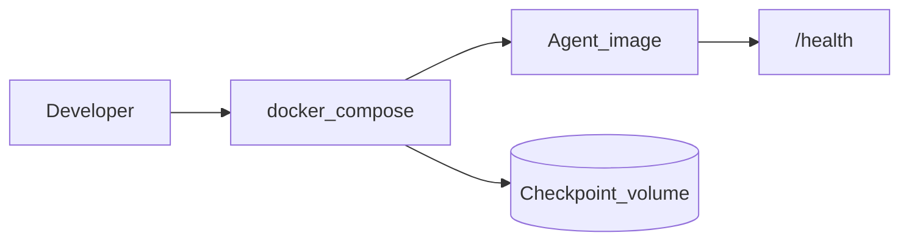

# Phase 2 — Containerize the agent

## Progress

| | |
|---|---|
| **Phase** | 2 of 7 |
| **Previous** | [Phase 1 — Agentic orchestration](01-agentic-orchestration.md) |
| **Next** | [Phase 3 — Azure Terraform stack](03-azure-terraform-stack.md) |

## What you will learn

- Package the Phase 1 **Python** agent and its dependencies into an image
- Run it with **Compose**, healthchecks, and no secrets in layers
- Treat the image as the immutable unit you will later put on Azure

## Architecture pillars

| Pillar | How this phase practices it |
|--------|-------------------------------|
| 1. System shape | Agent + optional sidecar services as a compose graph |
| 5. Reliability, security, operations | Healthchecks, `.env.example`, image tags, rollback = previous tag |

**Required ADR(s):** single-stage vs multi-stage image — **Pillar 5**.

**Framework:** [Architecture framework](../docs/concepts/architecture-framework.md) · [Containers as the ship unit](../docs/concepts/software-engineering.md#containers-as-the-ship-unit)

## Before you start

- **Requires:** Phase 1 agent runnable locally
- **Course:** [KodeKloud Docker for the Absolute Beginner](../docs/career/course-track.md#phase-2)

## Problem

The Phase 1 agent “works on my machine.” Package the **Python environment** so anyone (and later Azure) can run the same artifact.

## System diagram



## Stack and why

- **Docker / Dockerfile / Compose** — the ship unit for Phases 3–7
- **Python image** — primary. Node BFF image only if you shipped the Phase 1 TypeScript stretch.

## Important concepts

### Image vs container

An **image** is the immutable filesystem + metadata. A **container** is a running instance. You promote **tags**, not “the folder on my laptop.”

### Multi-stage build

```dockerfile
# Illustrative — Python agent
FROM python:3.12-slim AS deps
WORKDIR /app
COPY pyproject.toml .
RUN pip install --no-cache-dir .

FROM python:3.12-slim
WORKDIR /app
COPY --from=deps /usr/local /usr/local
COPY . .
EXPOSE 8080
HEALTHCHECK CMD python -c "import urllib.request; urllib.request.urlopen('http://127.0.0.1:8080/health')"
CMD ["python", "-m", "agent.serve"]
```

Never `COPY .env` into the image. Runtime secrets come from Compose `env_file` or the platform.

## Code repo

Document in the Phase 1 lab repo **or** `career-projects/02-containerize-agent-lab` if you split.

## Success criteria

- [ ] `docker compose up` starts the Phase 1 agent; `/health` returns 200.
- [ ] Image builds without secrets; `.env.example` lists key names only.
- [ ] README: how to build, tag, and roll back to a previous tag.
- [ ] Course notes or PROGRESS line: KodeKloud Docker started/completed.

## Stretch

- [ ] Second Compose service for a TypeScript MCP/API front (only if Phase 1 stretch exists).

## Testing approach (lab)

Smoke: compose up → health → one agent eval path against the container.

## Portfolio artifacts

- [ ] Diagram — compose services, volumes, health
- [ ] ADR — base image and multi-stage choice
- [ ] Failure modes — secret in layer; no healthcheck; untagged `:latest` only

## When you're done

- Checklist: [Production readiness](../checklists/production-readiness.md) (phase 2)
- Log in [PROGRESS.md](../PROGRESS.md)
- **Next:** [Phase 3 — Azure Terraform stack](03-azure-terraform-stack.md)
