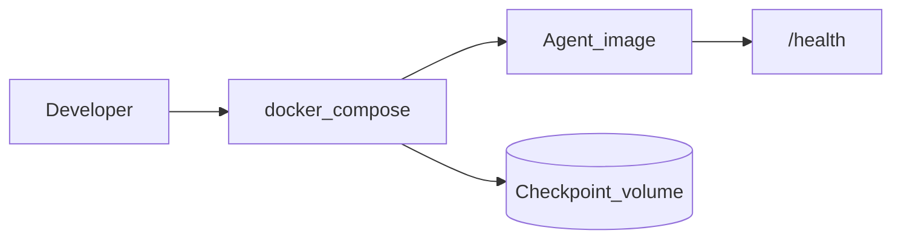

# Phase 2 — Containerize the agent

## Progress

| | |
|---|---|
| **Phase** | 2 |
| **Previous** | [Phase 1](01-agentic-orchestration.md) |
| **Next** | [Phase 3](03-azure-terraform-stack.md) |
| **Course** | [KodeKloud Docker for the Absolute Beginner](https://learn.kodekloud.com/courses/docker-for-the-absolute-beginner) |

You are here for **Security** (the image must not contain passwords) and **Observability** (a health endpoint so later Azure knows the process is alive). You also start **CI** (continuous integration — automated tests on every pull request).

## The story

Phase 1 “works on my machine.” That is not how you give the same program to a teammate or to Azure. **Docker** packages the Python environment into an **image** (an immutable snapshot). A **container** is one running copy of that image.

**Compose** is a file that says which containers start together (agent, maybe a volume for checkpoints). You will use this file again in Phase 5 when the Go worker appears — for now, package the **agent**.

Never copy a `.env` file into the image. Runtime secrets come from the environment or, later, Key Vault (Phase 4).

## You are here for

| Label | How this lab practices it |
|-------|---------------------------|
| **Shape** | Agent as one Compose service; later rows add workers beside it |
| **Security** | No secrets in layers; `.env.example` lists names only |
| **Observability** | `/health` so orchestrators can probe the process |

**Required ADR:** single-stage vs multi-stage image — tag **Security** (smaller attack surface, fewer leftover build tools).

## Before you start

- Phase 1 agent runs locally.
- Course: KodeKloud Docker (Progress table).

## Problem

Anyone else — and later Azure — must run the **same** artifact, not your laptop folder.

## How work moves



## Important concepts

### Image vs container

You promote **tags** (for example `agent:2026-08-31`). Rollback means run the previous tag, not “git stash on the server.”

### Multi-stage build

A first stage installs dependencies; the final stage copies only what you need to run. That keeps compilers and pip caches out of production.

```dockerfile
# Illustrative
FROM python:3.12-slim AS deps
WORKDIR /app
COPY pyproject.toml .
RUN pip install --no-cache-dir .

FROM python:3.12-slim
WORKDIR /app
COPY --from=deps /usr/local /usr/local
COPY . .
EXPOSE 8080
HEALTHCHECK CMD python -c "import urllib.request; urllib.request.urlopen('http://127.0.0.1:8080/health')"
CMD ["python", "-m", "agent.serve"]
```

### CI

Add a GitHub Action (or equivalent) that runs tests — including the Phase 1 eval command — and builds the image. You do not need to deploy yet. AKS (Phase 7) will assume this habit exists.

## Code repo

Phase 1 lab repo, or `career-projects/02-containerize-agent-lab` if you split.

## Success criteria

- [ ] `docker compose up` starts the Phase 1 agent; `/health` returns 200.
- [ ] Image builds without secrets; `.env.example` lists key names only.
- [ ] README: build, tag, roll back to a previous tag.
- [ ] CI runs tests (and the image build) on pull request.
- [ ] KodeKloud Docker started or completed; note in PROGRESS.

## Testing

Smoke: compose up → health → one eval path against the container.

## Portfolio

- [ ] Diagram — Compose, volumes, health
- [ ] ADR — base image / multi-stage
- [ ] Failure modes — secret in layer; no healthcheck; only `:latest`

## When you're done

- [Production readiness](../checklists/production-readiness.md) (phase 2)
- Log in [PROGRESS.md](../PROGRESS.md)
- **Next:** [Phase 3](03-azure-terraform-stack.md)
