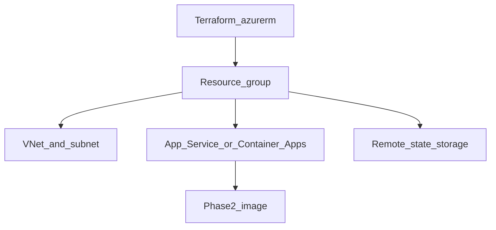

# Phase 3 — Azure Terraform stack

## Progress

| | |
|---|---|
| **Phase** | 3 |
| **Previous** | [Phase 2](02-containerize-agent.md) |
| **Next** | [Phase 4](04-azure-admin-governance.md) |
| **Course** | [KodeKloud Terraform for Beginners](https://learn.kodekloud.com/courses/terraform-for-beginners) |

You are here for **Shape** (network and compute as a diagram you can apply twice) and **Security** (state files and secrets never belong in git).

## The story

Clicking the Azure portal does not review well, does not repeat, and does not destroy cleanly. **IaC** (infrastructure as code) means the cloud is described in files. **Terraform** is the tool; **azurerm** is the provider plugin for Azure.

You will create a **resource group** (a folder of Azure resources that die together), a **VNet** (virtual network — private address space in Azure), and compute that can run the Phase 2 image: **App Service** or **Container Apps** (two Azure products that host containers; pick one in an ADR).

**Remote state** means Terraform’s memory of what exists lives in Azure Storage, not only on your laptop. **Destroy** is how this lab should end unless you deliberately keep a cheap SKU.

Optional vocabulary before naming SKUs: [AZ-900](https://learn.microsoft.com/en-us/credentials/certifications/azure-fundamentals/) (Azure fundamentals). Not required to exit.

On AWS this shape is a VPC plus ECS or App Runner; on GCP a VPC plus Cloud Run. One sentence in the ADR is enough — do not deploy a second cloud. See [cloud portability](../docs/concepts/cloud-portability.md).

## You are here for

| Label | How this lab practices it |
|-------|---------------------------|
| **Shape** | RG, VNet, compute topology as code |
| **Security** | State and secrets not in git; destroy is documented |

**Required ADR:** App Service vs Container Apps — tag **Shape**. One sentence AWS/GCP analogue.

## Before you start

- Phase 2 image builds.
- Course: KodeKloud Terraform.

## Problem

Encode the Azure footprint that will host the agent so you can apply, review, and destroy it.

## How work moves



## Important concepts

### Plan then apply

`terraform plan` is the review. `apply` makes it real. `destroy` should be in the README.

```hcl
# Illustrative
resource "azurerm_resource_group" "lab" {
  name     = "rg-playbook-agent"
  location = "uksouth"
}
```

## Code repo

`career-projects/03-azure-terraform-stack-lab` (or `infra/` in the agent repo). **Never commit state or secrets.**

## Success criteria

- [ ] `plan` / `apply` creates RG + VNet + compute ready for the Phase 2 image.
- [ ] Remote state configured.
- [ ] README: apply, URLs, **destroy**.
- [ ] One apply and one destroy logged (or a note if you kept a cheap always-on SKU on purpose).
- [ ] KodeKloud Terraform started or completed.

## Stretch

- [ ] Azure Container Registry (ACR) in the same Terraform; image pulled from there.

## Testing

`terraform validate` and `fmt`. Prefer running them in CI. Manual: apply → health if live → destroy.

## Portfolio

- [ ] Diagram — RG, VNet, compute, state
- [ ] ADR — compute choice + portability sentence
- [ ] Failure modes — state in git; orphans after failed destroy

## When you're done

- [Production readiness](../checklists/production-readiness.md) (phase 3)
- Log in [PROGRESS.md](../PROGRESS.md)
- **Next:** [Phase 4](04-azure-admin-governance.md)
