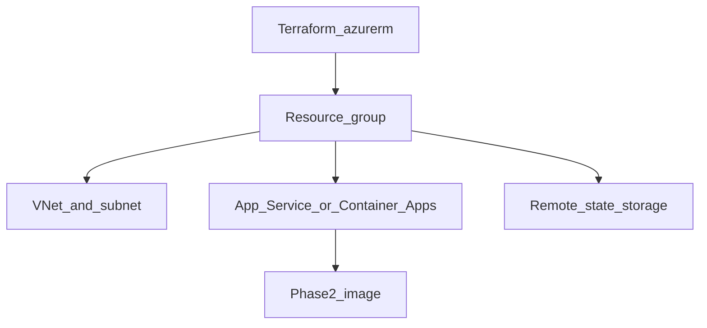

# Phase 3 — Azure Terraform stack

## Progress

| | |
|---|---|
| **Phase** | 3 of 7 |
| **Previous** | [Phase 2 — Containerize the agent](02-containerize-agent.md) |
| **Next** | [Phase 4 — Azure admin and governance](04-azure-admin-governance.md) |

## What you will learn

- Provision Azure with **Terraform** (`azurerm`) instead of clicking the portal
- Create a resource group, **VNet**, and **App Service** (or Container Apps) that can run the Phase 2 image
- Use **remote state**; destroy the lab when done

## Architecture pillars

| Pillar | How this phase practices it |
|--------|-------------------------------|
| 1. System shape | Network and compute topology as code |
| 5. Reliability, security, operations | State as source of truth; blast radius of apply/destroy |

**Required ADR(s):** App Service vs Container Apps — **Pillar 5**. One sentence AWS/GCP analogue — [cloud portability](../docs/concepts/cloud-portability.md). Optional AZ-900 vocabulary before you name SKUs.

**Framework:** [Architecture framework](../docs/concepts/architecture-framework.md) · [Infrastructure as Code](../docs/concepts/software-engineering.md#infrastructure-as-code) · [Azure cloud and AI](../docs/concepts/azure-cloud-and-ai.md) · [Cloud portability](../docs/concepts/cloud-portability.md)

## Before you start

- **Requires:** Phase 2 image builds
- **Course:** [KodeKloud Terraform for Beginners](../docs/career/course-track.md#phase-3)
- **Optional:** AZ-900 study guide for IaaS/PaaS/RBAC words — [cert track](../docs/career/azure-certification-track.md)

## Problem

Portal clicks do not review, repeat, or destroy cleanly. Encode the Azure footprint that will host the agent.

## System diagram



## Stack and why

- **Terraform + azurerm** — industry default for Azure IaC
- **Remote state** (Azure Storage) — so apply is not locked to one laptop
- HCL is the language here; app code stays Python/Go

## Important concepts

### Plan then apply

```hcl
# Illustrative — azurerm
resource "azurerm_resource_group" "lab" {
  name     = "rg-playbook-agent"
  location = "uksouth"
}

resource "azurerm_virtual_network" "lab" {
  name                = "vnet-playbook"
  resource_group_name = azurerm_resource_group.lab.name
  location            = azurerm_resource_group.lab.location
  address_space       = ["10.10.0.0/16"]
}
```

`terraform plan` is the review artifact. `destroy` is how labs die — document that you ran it.

## Code repo

`career-projects/03-azure-terraform-stack-lab` (or `infra/` in the agent repo). **Never commit state or secrets.**

## Success criteria

- [ ] `terraform plan` / `apply` creates RG + VNet + compute that can run (or is ready to run) the Phase 2 image.
- [ ] Remote state backend configured; local state is not the source of truth.
- [ ] README: apply, output URLs, **destroy** steps.
- [ ] One apply + one destroy logged in PROGRESS (or a note if you kept a cheap always-on SKU on purpose).
- [ ] KodeKloud Terraform started/completed.

## Stretch

- [ ] Wire the container image from a registry (ACR) in the same Terraform.

## Testing approach (lab)

- `terraform validate` + `fmt` in CI if the repo has Actions.
- Manual: apply → hit health (if compute is live) → destroy.

## Portfolio artifacts

- [ ] Diagram — RG, VNet, compute, state
- [ ] ADR — App Service vs Container Apps; remote state location
- [ ] Failure modes — state file in git; orphaned resources after failed destroy

## When you're done

- Checklist: [Production readiness](../checklists/production-readiness.md) (phase 3)
- Log in [PROGRESS.md](../PROGRESS.md)
- **Next:** [Phase 4 — Azure admin and governance](04-azure-admin-governance.md)
