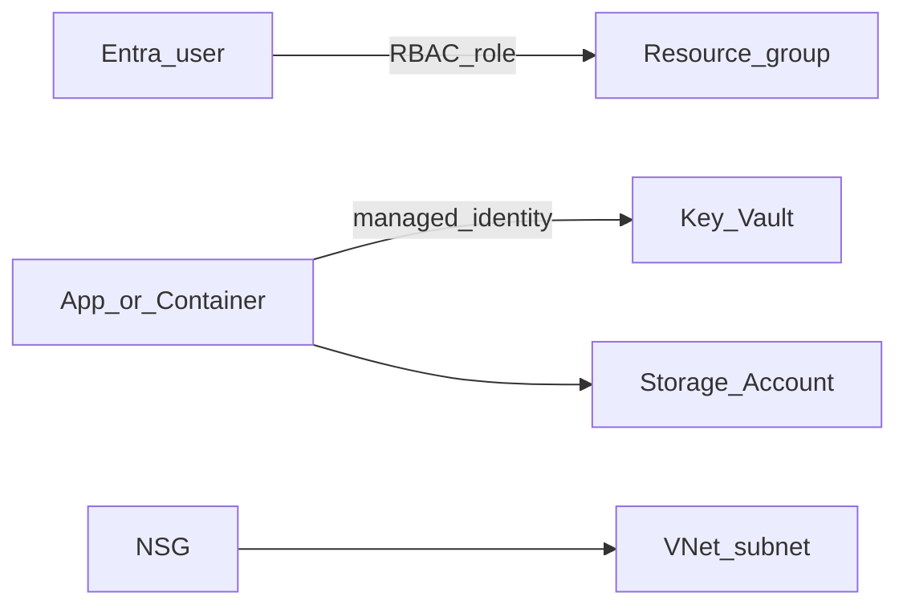

# Phase 4 — Azure admin and governance

## Progress

| | |
|---|---|
| **Phase** | 4 |
| **Previous** | [Phase 3](03-azure-terraform-stack.md) |
| **Next** | [Phase 5](05-azure-backends.md) |
| **Course** | [KodeKloud AZ-104](https://learn.kodekloud.com/) · [AZ-104 on Microsoft Learn](https://learn.microsoft.com/en-us/credentials/certifications/azure-administrator/) |

You are here for **Security**: who may touch the lab, and how the app reads secrets without putting them in git.

## Terms for this lab

- **Entra ID** (formerly Azure Active Directory) — Azure’s login directory for people and many apps.
- **RBAC** (role-based access control) — which identity may create, change, or delete which Azure resource.
- **Key Vault** — Azure’s secret store. Apps read values at runtime.
- **Managed identity** — the app logs into Azure as itself; no password copied onto your laptop.
- **Storage Account** — blobs and files in Azure (state, uploads, or later agent files).
- **NSG** (network security group) — firewall rules on a subnet.

On AWS the analogues are IAM + Secrets Manager; on GCP, Cloud IAM + Secret Manager. One ADR sentence. Do not deploy them.

When the agent calls **Azure OpenAI** (Microsoft’s hosted models) from the cloud, prefer managed identity over an API key in an env file.

## The story

Terraform without governance is a lab that anyone with Owner on the subscription can wreck. You will lock the Phase 3 resource group to **least privilege** (only the roles people actually need) and move secrets into Key Vault.

Entra answers “who is this?” RBAC answers “what may they do to Azure?” Your agent’s end-user login, if you add one later, is a different problem — do not mash them together.

## You are here for

| Label | How this lab practices it |
|-------|---------------------------|
| **Security** | Entra vs app identity; Key Vault; NSG you can explain |

**Required ADR:** human RBAC vs managed identity for the workload — tag **Security**. Portability sentence.

## Before you start

- Phase 3 applied (or re-apply a small resource group).
- Course: AZ-104 is **in-path**, not optional trivia.

## Problem

Secrets on the host and Owner-everywhere will not survive a real team.

## How work moves

## Code repo

Extend Phase 3 Terraform, or `career-projects/04-azure-admin-governance-lab`.

## Success criteria

- [ ] One **custom RBAC assignment** (not just subscription Owner): who, on what scope, why.
- [ ] Key Vault holds at least one runtime secret; app uses **managed identity** (or a documented local-dev exception).
- [ ] Storage Account created; purpose named.
- [ ] NSG or subnet rules described in the README.
- [ ] ADR: deploy identity vs app identity; Azure OpenAI (or other model) auth when not on localhost.
- [ ] AZ-104 course in progress or complete.

## Stretch

- [ ] Azure Policy (for example allowed locations = UK South) on the lab resource group.

## Testing

Prove a denied action (wrong role cannot delete the vault). Prove the app identity can read the secret.

## Portfolio

- [ ] Diagram — identities, vault, storage, NSG
- [ ] ADR — RBAC scopes
- [ ] Failure modes — Owner-everywhere; secrets in committed Terraform variables; NSG allow `*`

## When you're done

- [Production readiness](../checklists/production-readiness.md) (phase 4)
- Log in [PROGRESS.md](../PROGRESS.md)
- **Next:** [Phase 5](05-azure-backends.md)
