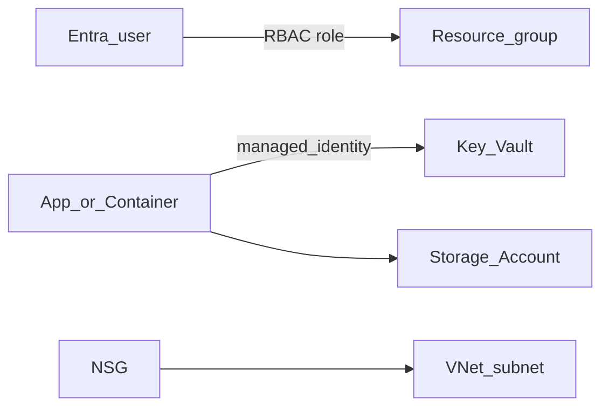

# Phase 4 — Azure admin and governance

## Progress

| | |
|---|---|
| **Phase** | 4 of 7 |
| **Previous** | [Phase 3 — Azure Terraform stack](03-azure-terraform-stack.md) |
| **Next** | [Phase 5 — Azure backends](05-azure-backends.md) |

## What you will learn

- Apply **AZ-104** habits to *your* stack: Entra ID, RBAC, Key Vault, Storage, NSGs
- Separate **who you are** (Entra) from **what the app may do** (RBAC + managed identity)
- Treat Policy and least privilege as part of the product, not a portal afterthought

## Architecture pillars

| Pillar | How this phase practices it |
|--------|-------------------------------|
| 5. Reliability, security, operations | Identity, secrets, network rules, resource lifecycle |

**Required ADR(s):** human RBAC vs managed identity for the app — **Pillar 5**. One sentence AWS/GCP analogue — [cloud portability](../docs/concepts/cloud-portability.md).

**Framework:** [Cloud identity and governance](../docs/concepts/software-engineering.md#cloud-identity-and-governance) · [Azure cloud and AI](../docs/concepts/azure-cloud-and-ai.md) · [Azure certification track](../docs/career/azure-certification-track.md) · [Cloud portability](../docs/concepts/cloud-portability.md)

## Before you start

- **Requires:** Phase 3 stack applied (or re-apply a small RG)
- **Course:** [KodeKloud AZ-104](../docs/career/course-track.md#phase-4) — this is the **in-path** cert course

## Problem

IaC without governance is a lab that anyone with a subscription owner role can wreck. Lock the Phase 3 resources to least privilege and move secrets out of env files on the host.

## System diagram

## Stack and why

- **Entra ID** — workforce identity
- **Azure RBAC** — data-plane / control-plane permissions on the RG
- **Key Vault + managed identity** — runtime secrets
- **Storage Account** — state, artifacts, or agent filesystem backend later
- **NSG** — subnet rules you can explain

## Important concepts

### Entra ID vs app auth

**Entra ID** answers “which human or workload identity is this?” **RBAC** answers “what may they do to Azure resources?” Your agent’s end-user login (if any) is a different problem — do not mash them together.

### Key Vault reference

The app reads secrets at runtime. Git still has `.env.example` names only. Prefer managed identity over a copied connection string on your laptop.

## Code repo

Extend Phase 3 Terraform (`azurerm_key_vault`, role assignments, storage, NSG) in `career-projects/03-azure-terraform-stack-lab` or `04-azure-admin-governance-lab`.

## Success criteria

- [ ] At least one **custom RBAC assignment** (not just subscription Owner) documented: who, on what scope, why.
- [ ] Key Vault holds at least one runtime secret; app or Function uses **managed identity** (or a documented local-dev exception).
- [ ] Storage Account created and purpose named (state, blobs, or agent files).
- [ ] NSG or subnet rules described in the README (even if lab-open on one port).
- [ ] AZ-104 course **in progress or complete**; exam date optional in PROGRESS.
- [ ] ADR: least privilege for deploy identity vs app identity.

## Stretch

- [ ] Azure Policy assignment (e.g. allowed locations = UK South) on the lab RG.

## Testing approach (lab)

- Prove a denied action (wrong role cannot delete the vault).
- Prove the app identity can read the secret and a human without the role cannot.

## Portfolio artifacts

- [ ] Diagram — identities, vault, storage, NSG
- [ ] ADR — RBAC scopes
- [ ] Failure modes — Owner-everywhere; secrets in Terraform variables committed; open NSG `*`

## When you're done

- Checklist: [Production readiness](../checklists/production-readiness.md) (phase 4)
- Log in [PROGRESS.md](../PROGRESS.md)
- **Next:** [Phase 5 — Azure backends](05-azure-backends.md)
