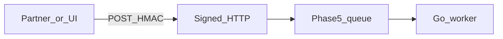

# Phase 5.0 — Signed inbound HTTP

## Progress

| | |
|---|---|
| **Phase** | 5.0 |
| **Previous** | [Phase 5](05-azure-backends.md) |
| **Next** | [Phase 5.1 — Edge proxy](05-1-edge-proxy.md) |
| **Course** | Same as Phase 5 (ByteByteGo / DesignGurus) |

You are here for **Security** (prove the caller is who they claim) and **Integration** (accept work quickly, process later).

## The story

Partners and UIs should not wait while your worker talks to a slow API. They **POST** a payload. You verify a signature, write to the **queue** from Phase 5, and return **202 Accepted** (the HTTP status that means “I have the work; I have not finished the side effect”).

**HMAC** (hash-based message authentication code) proves the caller holds a **shared secret**. You hash the **raw body** with that secret and compare it to a header. If you parse JSON first, then hash, attackers can slip bytes you never verified.

This is the classic webhook pattern. Do it in **Go or Python**, not PHP. Do not build a payments product. Compose the Phase 5 worker.

Loot patterns only: [archived v1 webhook spec](../archive/v1-22-step/career-project-specs/01-integration-webhook-receiver.md).

If Phase 5 did not ship OpenAPI, this POST **is** the contract: document it (OpenAPI or equivalent).

## You are here for

| Label | How this lab practices it |
|-------|---------------------------|
| **Integration** | Sync HTTP ends at enqueue; worker is async |
| **Security** | HMAC on raw body; secret not in logs |
| **Shape** | 202 vs 200 (do not pretend the tool already ran) |

**Required ADR:** header name and secret source (env vs Key Vault) — **Security**.

## Before you start

Phase 5 worker consumes a queue.

## Problem

Unsigned POST endpoints get abused. Slow handlers time out partners. Sign, enqueue, return 202.

## How work moves

## Important concepts

Compare HMAC in **constant time** (a comparison that does not leak how many bytes matched). Reject missing or wrong signatures with **401** (unauthorized). Do not enqueue unsigned bodies.

Idempotency: if the partner retries the same event id, you still enqueue at-least-once — the **worker** from Phase 5 must stay idempotent.

## Code repo

`career-projects/05-0-signed-http-lab` or a package in the Phase 5 repo.

## Success criteria

- [ ] POST verifies HMAC on the **raw** body; bad signature → 401, nothing enqueued.
- [ ] Good signature → message on the Phase 5 queue → **202** with an id.
- [ ] Secret from environment / Key Vault, not logs.
- [ ] OpenAPI (or equivalent) for this POST if Phase 5 did not already ship a contract.
- [ ] One integration test: valid signature vs tampered body.

## Testing

Unit: HMAC helper. Integration: signed POST → queue depth or worker log.

Also: [integration-hardening.md](../checklists/integration-hardening.md).

## Portfolio

- [ ] Diagram — partner, API, queue, worker
- [ ] ADR — HMAC header; 202 vs 200
- [ ] Failure modes — JSON parsed before HMAC; secret in logs; 200 implying the tool finished

## When you're done

- [Production readiness](../checklists/production-readiness.md) (lab 5.0)
- Log in [PROGRESS.md](../PROGRESS.md)
- **Next:** [Phase 5.1](05-1-edge-proxy.md)
