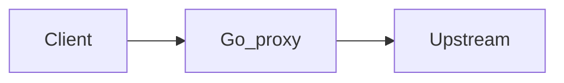

# Phase 5.1 — Edge proxy

## Progress

| | |
|---|---|
| **Phase** | 5.1 |
| **Previous** | [Phase 5.0](05-0-signed-http.md) |
| **Next** | [Phase 5.2 — Rate limiter](05-2-rate-limiter.md) |
| **Course** | Same as Phase 5 |

You are here for **Performance**: deadlines, connection pooling, and shutting down without dropping in-flight work if you can drain.

## The story

Application code cannot fix hung upstreams or connection storms. A small **Go reverse proxy** sits in front of the Phase 5 HTTP (or 5.0): it enforces **timeouts**, limits connections, and on **SIGTERM** (the signal Kubernetes and App Service send first) stops accepting and waits a few seconds for in-flight requests.

**Circuit breaker** (stop calling an upstream that is already dying) belongs in an ADR even if you only document “we fail fast with 504.” You do not need a new product.

On Azure the managed form is Application Gateway or Container Apps ingress; on AWS, ALB plus Envoy; on GCP, HTTPS load balancer. One sentence. Do not deploy those yet.

v1 notes: [P18](../archive/v1-22-step/career-project-specs/18-proxy-load-balancer-lab.md).

## You are here for

| Label | How this lab practices it |
|-------|---------------------------|
| **Shape** | Client → proxy → upstream; timeout budget across hops |
| **Performance** | Pool size, connect/read timeouts, p95 or a local load note |
| **Observability** | Access logs with `request_id` |

**Required ADR:** timeout budget and pool size — **Performance**. Circuit breaker policy. Portability sentence.

## Before you start

Phase 5 (or 5.0) has an HTTP path to forward.

## Problem

Hung upstreams leak goroutines and confuse clients. Put deadlines at the edge.

## How work moves

## Important concepts

Client timeout > proxy timeout > upstream timeout. Nested wrong, you leak work or return confusing **504** (gateway timeout).

Graceful shutdown: stop accepting, wait up to N seconds, then exit.

## Code repo

`career-projects/05-1-edge-proxy-lab`

## Success criteria

- [ ] Proxy forwards HTTP to at least one upstream.
- [ ] Hung upstream returns a documented 502/504.
- [ ] SIGTERM drain described and implemented.
- [ ] Access logs with `request_id`.
- [ ] ADR: process-local proxy vs App Gateway; circuit breaker; portability.

## Testing

Fake slow upstream → timeout. Optional SIGTERM test.

## Portfolio

- [ ] Diagram — clients, proxy, upstream
- [ ] ADR — timeouts, breaker, analogue
- [ ] Performance — one measurement
- [ ] Failure modes — no deadline; kill -9 vs SIGTERM

## When you're done

- [Production readiness](../checklists/production-readiness.md) (lab 5.1)
- Log in [PROGRESS.md](../PROGRESS.md)
- **Next:** [Phase 5.2](05-2-rate-limiter.md)
