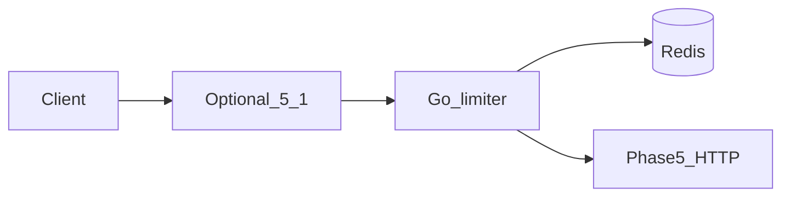

# Phase 5.2 — Rate limiter

## Progress

| | |
|---|---|
| **Phase** | 5.2 |
| **Previous** | [Phase 5.1](05-1-edge-proxy.md) |
| **Next** | [Phase 5.3 — Fan-out](05-3-notification-fanout.md) |
| **Course** | Same as Phase 5 |

You are here for **Performance**: stop unbounded clients before they melt the worker.

## The story

A **rate limiter** counts requests per API key or IP in a window. Under the limit, forward (this can sit behind 5.1). Over the limit, return **429 Too Many Requests** with **Retry-After** (how long to wait).

**Token bucket** allows short bursts. **Sliding window** is smoother. Ship **one** in code; compare the other in the ADR.

Use the **same Redis** as Phase 5. If Redis is down: **fail-open** (serve traffic, lose the limit) vs **fail-closed** (503). Write the choice.

v1 notes: [P23](../archive/v1-22-step/career-project-specs/23-rate-limiter-gateway-lab.md). AWS analogue: API Gateway usage plans. GCP: Cloud Armor quotas. Names only.

## You are here for

| Label | How this lab practices it |
|-------|---------------------------|
| **Performance** | Algorithm, Redis atomic increment, middleware overhead |
| **Security** | Per-key limits; hashed key in logs, not the raw secret |
| **Observability** | `limit_exceeded` events |

**Required ADR:** token bucket vs sliding window — **Performance**. Fail-open vs fail-closed. Portability.

## Before you start

Phase 5 Redis and an HTTP path (5.0 or 5.1).

## Problem

Unbounded traffic exhausts the worker. Limit at the edge of *your* process.

## How work moves



## Important concepts

```go
// Illustrative sliding window
func (rl *Limiter) Allow(ctx context.Context, key string) (bool, time.Duration, error) {
    n, err := rl.redis.Incr(ctx, "rl:"+key).Result()
    if n == 1 {
        rl.redis.Expire(ctx, "rl:"+key, rl.window)
    }
    if n > rl.limit {
        return false, rl.window, err
    }
    return true, 0, err
}
```

## Code repo

`career-projects/05-2-rate-limiter-lab` or middleware in 5.1 / 5.

## Success criteria

- [ ] Configurable N requests per window per key or IP.
- [ ] Over limit → 429 + Retry-After.
- [ ] One algorithm in code; the other in the ADR.
- [ ] Integration test: N+1th request is 429.
- [ ] Redis-down policy documented.
- [ ] Logs: hashed key, remaining, limit_exceeded.

## Testing

Burst N+1 against a fake upstream.

## Portfolio

- [ ] Diagram — limiter, Redis, upstream
- [ ] ADR — algorithm, outage, analogue
- [ ] Failure modes — Redis down; hot key

## When you're done

- [Production readiness](../checklists/production-readiness.md) (lab 5.2)
- Log in [PROGRESS.md](../PROGRESS.md)
- **Next:** [Phase 5.3](05-3-notification-fanout.md)
