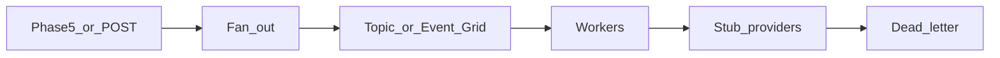

# Phase 5.3 — Notification fan-out

## Progress

| | |
|---|---|
| **Phase** | 5.3 |
| **Previous** | [Phase 5.2](05-2-rate-limiter.md) |
| **Next** | [Phase 5.4 — Ops CLI](05-4-ops-cli.md) |
| **Course** | Same as Phase 5 |

You are here for **Integration**: one event becomes many deliveries without double-sending.

## The story

When a Phase 5 job finishes, more than one sink may need to know (email stub, push stub, in-app). **Fan-out** means expand one event into one job per `(user, channel)`.

Use **Azure Service Bus topics** or **Event Grid** (or a local stand-in). **SNS+SQS** / **Pub/Sub** are the AWS/GCP names — one ADR sentence.

**Idempotent** `notification_id` + channel: duplicate redelivery must not call the provider twice. Failed deliveries retry; poison lands in a **DLQ**. You will replay in 5.4.

**Fan-out on write** (enqueue now) vs **digest** (batch later): ship write-path for at least one urgent channel; document digest as the cheaper alternative.

**Outbox / dual-write** (database and queue disagree) is an ADR, not a second product.

v1 notes: [P24](../archive/v1-22-step/career-project-specs/24-notification-fanout-lab.md).

## You are here for

| Label | How this lab practices it |
|-------|---------------------------|
| **Shape** | One event → N deliveries |
| **Integration** | Topics, at-least-once, dedupe, DLQ |
| **Observability** | `notification_id` on API and worker |

**Required ADR:** topics vs Event Grid — **Integration**. Write vs digest — **Shape**. Portability. Outbox named if you skip it.

## Before you start

Phase 5 queue habits. Trigger from a finished job or `POST /notify`.

## Problem

A finished worker should notify more than one sink without double email.

## How work moves

## Important concepts

Enqueue durably, then return **202**. Stub providers — no real SMTP vendor required.

## Code repo

`career-projects/05-3-notification-fanout-lab`

## Success criteria

- [ ] Notify path returns 202 after durable enqueue.
- [ ] One job per `(user, channel)` with a stable idempotency key.
- [ ] Duplicate delivery → single provider call (test this).
- [ ] Poison → DLQ after N attempts.
- [ ] Urgent vs digest policy written.
- [ ] ADR: Azure broker + analogue.

## Testing

Notify → stub; replay same id → still one increment. Forced 500 → retry or DLQ.

## Portfolio

- [ ] Diagram — fan-out, topic, DLQ
- [ ] ADR — broker, write vs digest
- [ ] Failure modes — double-send; fan-out storm

## When you're done

- [Production readiness](../checklists/production-readiness.md) (lab 5.3) · [Integration hardening](../checklists/integration-hardening.md) if HTTP
- Log in [PROGRESS.md](../PROGRESS.md)
- **Next:** [Phase 5.4](05-4-ops-cli.md)
