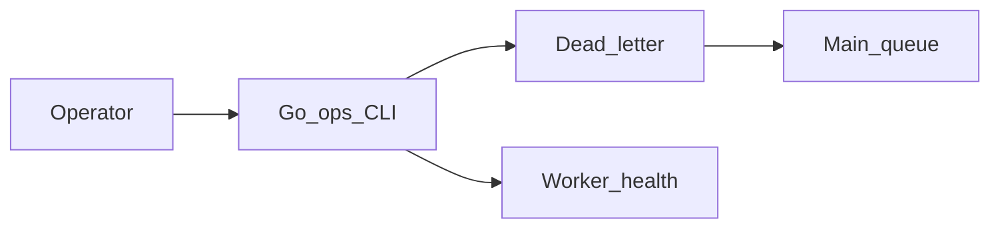

# Phase 5.4 — Ops CLI

## Progress

| | |
|---|---|
| **Phase** | 5.4 |
| **Previous** | [Phase 5.3](05-3-notification-fanout.md) |
| **Next** | [Phase 6 — Data pipelines](06-data-pipelines.md) |
| **Course** | Same as Phase 5 |

You are here for **Observability** as an operator: inspect and **replay** the dead-letter queue without clicking the Azure portal.

## The story

When a poison message sits on the **DLQ**, a binary you trust is the runbook: `ops dlq ls`, `ops dlq replay --id …`, `ops health`.

**Exit codes:** `0` means success. Non-zero means the operator can script against failure. Never `os.Exit` from a library — return `error` and map in `main`.

Default to **dry-run**. Require `--confirm` to actually move a message. Log message ids, not connection strings.

On AWS you would write the same CLI against an SQS DLQ; on GCP, a Pub/Sub dead-letter. One sentence. v1 notes: [P15](../archive/v1-22-step/career-project-specs/15-devops-cli-lab.md).

## You are here for

| Label | How this lab practices it |
|-------|---------------------------|
| **Integration** | DLQ replay is an operator workflow on at-least-once buses |
| **Observability** | Health, list, structured output |
| **Security** | Secrets via env / Key Vault, never flags |

**Required ADR:** flag/exit conventions — **Observability**. Portability.

## Before you start

Phase 5 (and 5.3 if you used a second DLQ) has a dead-letter you can seed.

## Problem

Portal clicking is not a runbook. Give yourself a Go CLI.

## How work moves

## Code repo

`career-projects/05-4-ops-cli-lab` or `cmd/ops` in the Phase 5 repo.

## Success criteria

- [ ] Subcommands: `health` and `dlq ls` / `dlq replay`.
- [ ] Replay moves or copies a dead-lettered message back (documented).
- [ ] `--confirm` required for mutating commands; dry-run default.
- [ ] Exit codes in README; optional JSON output mode.
- [ ] Secrets not in flags.

## Testing

Seed poison → `ls` sees it → replay → queue depth or worker processes it.

## Portfolio

- [ ] Diagram — CLI, DLQ, main queue
- [ ] ADR — conventions + analogue
- [ ] Failure modes — replay without confirm; logging connection strings

## When you're done

- [Production readiness](../checklists/production-readiness.md) (lab 5.4)
- Log in [PROGRESS.md](../PROGRESS.md)
- **Next:** [Phase 6](06-data-pipelines.md)
