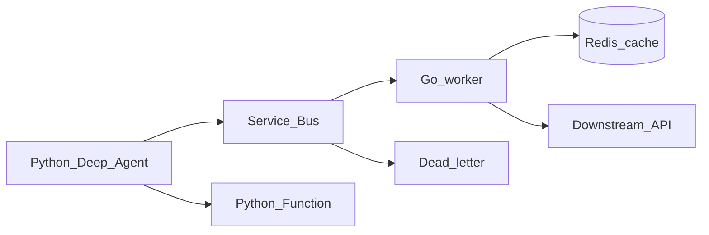

# Phase 5 — Azure backends

## Progress

| | |
|---|---|
| **Phase** | 5 of 7 |
| **Previous** | [Phase 4 — Azure admin and governance](04-azure-admin-governance.md) |
| **Next** | [Lab 08 — Ops CLI](08-ops-cli.md) |

## What you will learn

- Wrap Phase 1 **tools** behind **Go** workers (high concurrency) and **Python** Functions (bursty)
- Use **Service Bus** (queue + DLQ) and **Redis** as cache — not as source of truth
- Narrate system-design tradeoffs (ByteByteGo / DesignGurus as the reading track)

## Architecture pillars

| Pillar | How this phase practices it |
|--------|-------------------------------|
| 1. System shape | Agent stays Python; Go owns the hot path for tools that must scale |
| 2. Integration & messaging | Service Bus at-least-once + idempotent handlers + DLQ |
| 4. Performance and language boundaries | Why this tool is Go vs Python Function |
| 5. Reliability, security, operations | Timeouts, retries, Key Vault, health |

**Required ADR(s):** Go worker vs Azure Function for one tool — **Pillar 4**. One sentence AWS/GCP analogue — [cloud portability](../docs/concepts/cloud-portability.md).

**Framework:** [Azure-shaped backends](../docs/concepts/software-engineering.md#azure-shaped-backends) · [Messaging and RPC](../docs/concepts/messaging-and-rpc.md) · [Cloud portability](../docs/concepts/cloud-portability.md)

## Before you start

- **Requires:** Phase 1 tools + Phase 3/4 Azure identity
- **Course:** [ByteByteGo System Architecture](../docs/career/course-track.md#phase-5) and [DesignGurus Modern API Design](../docs/career/course-track.md#phase-5)

## Problem

Calling tools in-process inside the agent will not survive load or partial failure. Put a queue and a worker in front of side effects.

## System diagram



## Stack and why

- **Go** — required workers (bounded concurrency, timeouts)
- **Python Azure Functions** — acceptable for bursty, scale-to-zero tool adapters
- **Service Bus + Redis** — queue + cache
- **TypeScript Function or API gateway** — stretch only

## Important concepts

### Idempotent Go consumer

```go
// Illustrative — Service Bus handler
func (w *Worker) Handle(ctx context.Context, msg Message) error {
    applied, err := w.store.MarkApplied(ctx, msg.MessageID)
    if err != nil {
        return err
    }
    if !applied {
        return nil // duplicate — safe no-op
    }
    return w.invokeTool(ctx, msg.Payload)
}
```

Same semantics you will hear as “at-least-once + effectively-once.” Redis is for **cache**, not the idempotency store of record unless you ADR why.

### Cold start

Functions can scale to zero. Workers with queues often keep **min replicas ≥ 1**. Write that in the ADR.

## Code repo

`career-projects/05-azure-backends-lab` (Go module + optional Function app).

## Success criteria

- [ ] At least **one Go worker** consumes Service Bus (or a local Redis/queue stand-in with an ADR to Service Bus) **idempotently**.
- [ ] DLQ path documented; one poison message landed and inspected.
- [ ] Redis used for a cache or lock with TTL — not as the system of record.
- [ ] One **Python Function** (or FastAPI worker) for a bursty tool **or** a written ADR that all tools stay on Go and why.
- [ ] Health endpoint + structured logs with `request_id` / correlation id.
- [ ] Reading-track notes in PROGRESS (ByteByteGo / DesignGurus — which episode/module).

## Stretch (TypeScript)

- [ ] One Azure Function or thin Node gateway in front of a tool. Not required to exit.

## Testing approach (lab)

- Unit: Go handler with a fake store (duplicate id → no second side effect).
- Integration: enqueue → process → DLQ on forced failure.

## Portfolio artifacts

- [ ] Diagram — agent, bus, Go, Function, Redis, DLQ
- [ ] ADR — language split + broker
- [ ] Performance — one p95 or timeout budget for the Go path
- [ ] Failure modes — poison message loop; cache stampede; Function cold start on a user-facing tool

## When you're done

- Checklist: [Production readiness](../checklists/production-readiness.md) (phase 5)
- Log in [PROGRESS.md](../PROGRESS.md)
- **Next:** [Lab 08 — Ops CLI](08-ops-cli.md)
