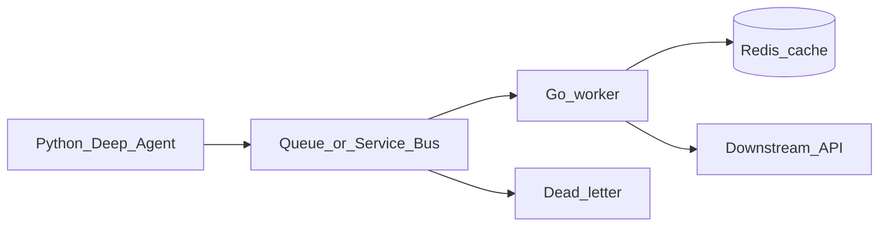

# Phase 5 — Azure backends (local queue first)

## Progress

| | |
|---|---|
| **Phase** | 5 |
| **Previous** | [Phase 4](04-azure-admin-governance.md) |
| **Next** | [Phase 5.0 — Signed inbound HTTP](05-0-signed-http.md) |
| **Course** | [ByteByteGo](https://bytebytego.com/) · [DesignGurus Modern API](https://www.designgurus.io/) |

You are here for **Integration** (a queue between the agent and side effects) and **Observability** (follow one message). This is the first time you practice **idempotency**, **bounded concurrency**, and real logs/metrics. Azure **Service Bus** is the named product; a local stand-in is fine if the ADR says you will point at Service Bus after Terraform already exists (you are in Phase 5 — use local Redis streams, NATS, or a fake bus until you re-point).

Slices 5.0–5.4 stay on this course. Do not start Phase 6 until 5.4 is green.

## The story

Calling tools inside the agent process will not survive load or a stuck downstream API. You put a **queue** (a list of work waiting to be processed) in front of side effects. A **Go worker** reads the queue with a **bounded** pool (a maximum number of jobs in flight — not “spawn forever”).

**Idempotency** means if the same message is delivered twice, you do not charge twice or call the tool twice. Store a message id; on duplicate, return success and do nothing.

A **DLQ** (dead-letter queue) is where poison messages go after N failures so they stop blocking everyone else. You will **replay** them in 5.4.

**Redis** is a fast cache or lock with a time-to-live. It is **not** the system of record unless you write an ADR why.

**p95** is the latency that 95% of requests beat. Measure the Go path once.

**PII** (personally identifiable information — emails, names, account numbers) must not appear in logs. Log ids, not payloads.

**OpenAPI** is a machine-readable description of your HTTP API. Ship it on this worker **or** on 5.0 (the signed POST). Version the document.

On AWS the queue analogue is SQS; on GCP, Pub/Sub. One ADR sentence.

## You are here for

| Label | How this lab practices it |
|-------|---------------------------|
| **Shape** | Agent stays Python; Go owns the hot path |
| **Integration** | At-least-once queue + idempotent handler + DLQ |
| **Performance** | Bounded goroutines, timeouts, p95, Go vs Python Function ADR |
| **Observability** | JSON logs, `request_id` / message id on enqueue **and** handle, one metric, `handle_ms` |
| **Security** | No PII in logs; secrets from env / Key Vault |
| **Data** | Redis cache with TTL, not the source of truth |

**Required ADR:** Go worker vs Azure Function for one tool — **Performance**. Portability sentence. Redis vs store-of-record.

## Before you start

- Phase 1 tools exist. Phase 3/4 identity if you use real Service Bus; otherwise local stand-in + ADR.
- Reading: [concurrency runtime model](../docs/concepts/concurrency-runtime-model.md) · [observability](../docs/concepts/software-engineering.md#observability-logs-metrics-traces). v1 notes: [P3 observability](../archive/v1-22-step/career-project-specs/03-observability-lab.md) (patterns only).

## Problem

In-process tools will hang the agent. Queue the work; process it with timeouts; prove you can grep one id across the hop.

## How work moves



## Important concepts

```go
// Illustrative — duplicate id is a safe no-op
func (w *Worker) Handle(ctx context.Context, msg Message) error {
    applied, err := w.store.MarkApplied(ctx, msg.MessageID)
    if err != nil {
        return err
    }
    if !applied {
        return nil
    }
    return w.invokeTool(ctx, msg.Payload)
}
```

**Follow this id:** document one enqueue → worker log line with the same `request_id` or message id in the README.

## Code repo

`career-projects/05-azure-backends-lab`

## Success criteria

- [ ] One Go worker consumes the queue **idempotently** (duplicate id → no second side effect).
- [ ] DLQ path documented; one poison message landed.
- [ ] Redis used as cache or lock with TTL.
- [ ] JSON logs on agent enqueue and worker handle; `request_id` / message id; `handle_ms` or equivalent; **no PII**.
- [ ] One metric you can show (queue depth, handler duration, or error count).
- [ ] README: follow this id across the hop.
- [ ] OpenAPI for the HTTP you expose here **or** a note that 5.0 owns the contract.
- [ ] Health endpoint.
- [ ] One p95 or timeout budget written down.
- [ ] ByteByteGo / DesignGurus notes in PROGRESS.

## Stretch

Python Azure Function for a bursty tool, **or** ADR that all tools stay on Go. TypeScript gateway is stretch.

## Testing

Unit: fake store, duplicate id. Integration: enqueue → process → DLQ on forced failure.

## Portfolio

- [ ] Diagram — agent, bus, Go, Redis, DLQ
- [ ] ADR — language split, broker, portability
- [ ] Performance — p95 or timeout budget
- [ ] Observability evidence — log excerpt with the shared id (redact PII)
- [ ] Failure modes — poison loop; cache stampede; PII in logs

## When you're done

- [Production readiness](../checklists/production-readiness.md) (phase 5)
- Log in [PROGRESS.md](../PROGRESS.md)
- **Next:** [Phase 5.0](05-0-signed-http.md)
