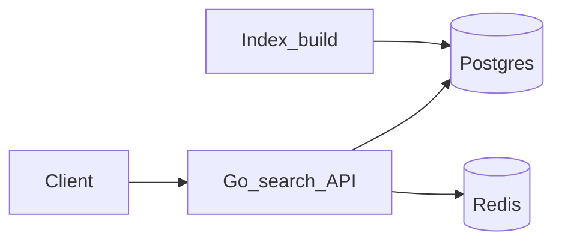

# Phase 6.1 — Search / autocomplete

## Progress

| | |
|---|---|
| **Phase** | 6.1 |
| **Previous** | [Phase 6](06-data-pipelines.md) |
| **Next** | [Phase 6.2 — RAG](06-2-rag-retrieve.md) |
| **Course** | Same as Phase 6 (Zoomcamp still applies). Search theory: trie / indexes in the algorithms handbook if you want depth. |

You are here for **Data** (indexes) and **Performance** (typeahead p95). This is **lexical** search — matching words and prefixes — not RAG (that is 6.2).

## The story

Operators and agents need **typeahead** (`GET /suggest`) and **keyword search** (`GET /search`). A **trie** (prefix tree) or a database prefix index finds completions. Postgres **`tsvector`** (full-text search type) plus a GIN index is enough at lab scale.

**Redis** can cache hot prefixes. **p95** for suggest should be documented (target under 50ms on a small corpus).

OpenSearch / Cloud Search are **names** in the ADR, not a second deploy. v1 notes: [P25](../archive/v1-22-step/career-project-specs/25-search-autocomplete-lab.md).

## You are here for

| Label | How this lab practices it |
|-------|---------------------------|
| **Data** | Prefix index or trie; inverted index / FTS |
| **Performance** | Suggest p95; hot prefix cache |
| **Observability** | `q`, `result_count`, `latency_ms`, `request_id` |

**Required ADR:** in-memory trie vs DB — **Data**. FTS vs named managed search. Portability.

## Before you start

Phase 5 Redis comfort. Corpus can be tool names, run titles, or pipeline output. Compose existing stores.

## Problem

Keyword typeahead is a different path from vector RAG. Ship both APIs.

## How work moves

## Code repo

`career-projects/06-1-search-autocomplete-lab`

## Success criteria

- [ ] `GET /suggest` returns ≤K suggestions; corpus size and p95 documented.
- [ ] `GET /search` returns ranked hits; ranking explained.
- [ ] Idempotent ingest by `doc_id`.
- [ ] Redis for at least one hot prefix (or documented skip).
- [ ] ADR: index choice + named analogues.

## Testing

Ingest fixture → suggest `"pre"` includes `"prefix"` if present. Re-ingest same `doc_id` → one current document.

## Portfolio

- [ ] Diagram — ingest, Postgres, Redis, API
- [ ] ADR — trie vs DB
- [ ] Performance — suggest p95
- [ ] Failure modes — stale index; stampede

## When you're done

- [Production readiness](../checklists/production-readiness.md) (lab 6.1)
- Log in [PROGRESS.md](../PROGRESS.md)
- **Next:** [Phase 6.2](06-2-rag-retrieve.md)
