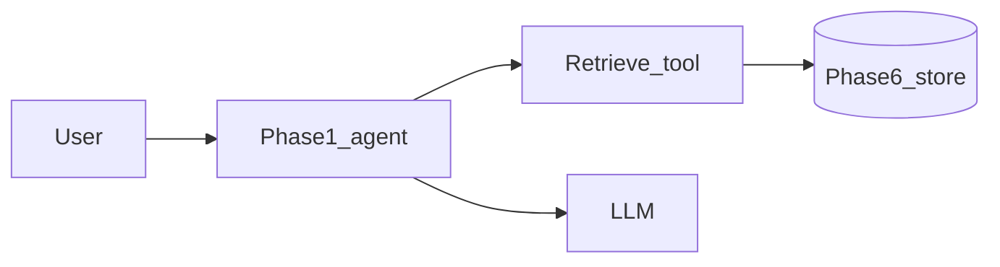

# Phase 6.2 — RAG retrieve tool

## Progress

| | |
|---|---|
| **Phase** | 6.2 |
| **Previous** | [Phase 6.1](06-1-search-autocomplete.md) |
| **Next** | [Phase 7.1 — Kubernetes controller](07-1-k8s-controller.md) |
| **Course** | [LangChain](https://docs.langchain.com/oss/python/langchain/overview) retrieval docs — same agent stack as Phase 1 |

You are here for **Data**: the model must **ground** answers in retrieved text, not invent facts.

## The story

**RAG** (retrieval-augmented generation) means: find relevant **chunks** (pieces of documents), then ask the model to answer **using those chunks**. Phase 1 was tools and graphs. Phase 6.1 was keyword search. This row wires a **retrieve tool** into the **existing** Phase 1 agent over Phase 6’s serving store.

You may use **embeddings** (vectors that capture meaning) in Postgres (`pgvector`) or files. An ADR can choose SQL keyword retrieve first if embeddings are too heavy — still call it RAG only if the model must cite retrieved text.

**Eval:** a question whose answer is in the store must be grounded (quotes or ids). A question with nothing in the store must be “I don’t know,” not a hallucination.

Do **not** start a second chatbot product. Loot patterns from [archived v1 RAG](../archive/v1-22-step/career-project-specs/02-rag-llm-service.md).

## You are here for

| Label | How this lab practices it |
|-------|---------------------------|
| **Data** | Chunking, retrieve tool, grounding |
| **Shape** | Retrieval is a tool, not a hidden side channel |
| **Security** | Retrieved text still must not dump secrets; injection in documents |
| **Observability** | Which chunk ids were retrieved for a run id |

**Required ADR:** embeddings vs lexical retrieve for v1 — **Data**. Chunk size.

## Before you start

Phase 1 agent + Phase 6 (or 6.1) corpus. Same Python environment.

## Problem

Employers ask “how does the model get facts?” Answer with a retrieve tool and an eval, not a slide.

## How work moves

## Code repo

Extend `01-agentic-orchestration-lab` or `career-projects/06-2-rag-retrieve-lab`.

## Success criteria

- [ ] Allowlisted retrieve tool returns chunks from the Phase 6 store.
- [ ] Agent answers a fixture question using those chunks (eval pass).
- [ ] Empty-store or unknown question → refusal / “I don’t know” (eval pass).
- [ ] Run id shows retrieved chunk ids in logs (no full secret documents).
- [ ] ADR: embedding vs SQL retrieve; chunking.

## Testing

JSONL evals: one grounded, one unknown. No live model required if you stub retrieve + a recorded generation.

## Portfolio

- [ ] Diagram — agent, retrieve tool, store, model
- [ ] ADR — retrieve strategy
- [ ] Failure modes — hallucination with empty retrieve; prompt injection in a chunk

## When you're done

- [LLM feature ship](../checklists/llm-feature-ship.md) · [Production readiness](../checklists/production-readiness.md) (lab 6.2)
- Log in [PROGRESS.md](../PROGRESS.md)
- **Next:** [Phase 7.1](07-1-k8s-controller.md)
