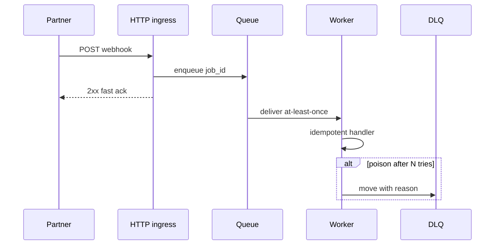

# Project 6 — Async worker (stretch)

## Progress

| | |
|---|---|
| **Step** | 6 of 22 |
| **Previous** | [Project 5 — Contract-first API](05-contract-first-api.md) |
| **Next** | [Project 7 — Node / TypeScript service lab](07-node-typescript-lab.md) |

## What you will learn

- Move durable work off the HTTP thread with queues
- Handle at-least-once delivery with idempotent workers
- Operate DLQ (dead-letter queue), retries, and replay safely

## Architecture pillars

| Pillar | How this project practices it |
|--------|-------------------------------|
| 1. System shape | HTTP returns fast; durable work moves to queue/worker |
| 2. Integration & messaging | At-least-once delivery, broker choice, ack timing, DLQ |
| 4. Performance & language boundaries | Worker throughput vs sync request (secondary) |
| 5. Reliability, security, operations | Idempotent handlers, retry policy, failure modes |

**Required ADR(s):** tag each ADR with pillar (e.g. Redis vs DB outbox — **Pillar 2**; ack before commit — **Pillar 2**).

**Framework:** [Architecture framework](../docs/concepts/architecture-framework.md)

## Before you start

- **Patterns:** [Integration-automation map](../docs/concepts/integration-automation.md)
- **Brokers (career context):** [Messaging and RPC](../docs/concepts/messaging-and-rpc.md)
- **Handbook:** [Integration](../docs/concepts/software-engineering.md#integration-sync-async-and-messaging) · [Concurrency basics](../docs/concepts/software-engineering.md#concurrency-basics) · [Memory and performance — throughput vs latency](../docs/concepts/memory-and-performance.md#measure-before-tuning)

## Problem

Move from “request in → response out” to **durable processing**: enqueue, worker, retries, visibility.

## Career relevance

**Summary:** You move **heavy, slow, or flaky work** off the HTTP thread into **durable jobs**—the pattern behind most “webhook returned 200 but we’re still working” systems and almost every scaled backend.

### In depth

Almost every mature product eventually splits **fast acknowledgment** (HTTP 200 in seconds) from **slow or flaky work** (PDFs, ML, third-party APIs, batch fan-out). Queues and workers are the standard pattern; understanding **at-least-once delivery and idempotency** is a core backend skill. If you only ever think in request/response, you’ll struggle anywhere **throughput and reliability** matter more than latency to the first byte.

**Why learning this moves the needle**

- **Partner SLAs:** Webhook providers expect a quick **`2xx`**; heavy work belongs **after** the response, in a durable queue. Keeping the HTTP handler thin is how you stay inside **their timeout and retry rules** without lying about success.
- **Scale:** Workers scale **horizontally**; monolithic request threads do not. This pattern appears in **e-commerce, fintech, and data pipelines**—anywhere work is **bursty** or **CPU-bound** relative to your web tier.
- **Resilience:** Retries + **DLQ** are how you **survive deploys, blips, and poison messages** without losing jobs or blocking the whole queue. You learn the vocabulary: **visibility timeout**, **ack**, **nack**, **backoff**, **poison pill**.
- **Interviews:** “What if the message is delivered twice?” is a standard filter; this project ties directly to [**Project 1**](01-integration-webhook-receiver.md)’s idempotency story. Answering with **both** transport duplicates and business keys is what passes the bar.

**Real-world situations this project mirrors**

- **Payments and provisioning:** webhooks must **ack fast** while you **open accounts**, sync CRM, or run **risk scoring**—too slow in HTTP and the provider marks deliveries failed and floods retries.
- **Long-running tasks:** image, video, or PDF generation **exceeds** reverse-proxy or **mobile** timeouts; the job completes **in workers**, and the UI polls or gets **pushed** a completion event.
- **Rate limits and partners:** a downstream API **429s** you; workers **back off** and spread load instead of tying up web workers or cascading timeouts to users.
- **Operational safety:** one malformed message **crashes** the consumer loop; **DLQ + alerting** isolates the bad payload so the main queue **drains** while someone replays or patches the handler.

### How to talk about this

The queue may deliver twice—you idempotent-key side effects so redelivery never double-writes. Tie the story to Project 1: business idempotency is broker-independent. Mention visibility timeout, ack timing, backoff, and DLQ inspection when interviewers ask what happens after N failures or a poison message.

## Important concepts

### At-least-once delivery

Assume duplicate messages; design the worker for safe redelivery. Crashes before ack and visibility timeouts mean the same job may run twice—your handler must dedupe on `job_id` or a business key before side effects.

### Idempotency (worker)

Dedupe on `job_id` or business key before writes, mirroring `Idempotency-Key` semantics from [Project 1](01-integration-webhook-receiver.md). Transport duplicates and queue redelivery are the same class of problem at a different boundary.

### DLQ and backoff

Route poison messages to a DLQ (dead-letter queue) after N tries; retry transient failures with exponential backoff. Isolating bad payloads lets the main queue drain while ops inspect evidence and replay deliberately after a fix.

## Code repo

_TBD — often extends [Project 1](01-integration-webhook-receiver.md) (same domain)._ Link it here.

Optional pattern: keep [webhook-receiver-lab](https://github.com/shemaiahCox/webhook-receiver-lab) HTTP-thin: validate + enqueue, then a worker process drains the queue.

## Stack (suggestions)

Redis + PHP worker, Laravel queues, **Go worker** ([Project 8](08-go-retrieval-worker-lab.md)), **BullMQ (Node)**—see [Project 7](07-node-typescript-lab.md)—or RDS outbox pattern.

**When to choose Go for the consumer:** high throughput, many concurrent I/O-bound steps, or you are practicing the **AI + integration** performance lane from [README](../README.md#role-direction). PHP/Laravel queues remain valid when ops familiarity and team stack matter more than raw concurrency.

**Deeper SQL:** Workers that UPDATE/INSERT in batches benefit from the same index and transaction thinking as the web tier—see [Project 4 — SQL performance lab](04-sql-performance-lab.md).

### Key concepts (with definitions and code)

### Message queue (job queue)

**What:** A **broker** (Redis, SQS, RabbitMQ, database table) holds **messages** representing work; producers **enqueue**, consumers **dequeue** and ack/fail.

**Problem it solves:** HTTP timeouts: Stripe webhook must return `200` in seconds while **heavy** work (PDFs, third-party APIs) runs **asynchronously** without losing jobs.

### At-least-once delivery

**What:** The queue may deliver the **same message more than once** (crash before ack, visibility timeout).

**Problem it solves:** Your handler must be **idempotent** (same theme as `Idempotency-Key` in Project 1) or use **dedupe keys** in the worker.

**Tie-in:** Reuse the idea from Project 1—**business idempotency** is queue-independent.

### Worker / consumer

**What:** Long-running process that polls or subscribes, runs business logic, **acks** on success, **nacks** or **requeues** with backoff on transient failure.

**Problem it solves:** Scales **CPU-heavy** work horizontally (N workers) vs one web thread.

### Dead-letter queue (DLQ)

**What:** After N failures or non-retryable error, move message to a **DLQ** for inspection—same **operational idea** as `dead_letters` in webhook-receiver-lab.

**Problem it solves:** Poison messages do not block the main queue forever.

**Cross-reference** (Project 1): synchronous dead-letter **table** + abandon for retries.

```php
// public/index.php — synchronous analogue
$store->recordDeadLetter($idempotencyKey, $rawBody, $trace);
$store->abandon($idempotencyKey);
```

### Redis enqueue/dequeue (Illustrative)

**What:** `LPUSH` to publish; worker `BRPOP` with timeout; ack by not requeueing on success.

```php
// Illustrative — producer after webhook validation
$redis->lPush('jobs:webhook', json_encode(['job_id' => $idempotencyKey, 'payload' => $rawBody]));
```

```go
// Illustrative — consumer loop (see Project 8)
msg, _ := redis.BRPop(ctx, 30*time.Second, "jobs:webhook").Result()
```

### Alternatives considered

| Broker / pattern | Pros | Cons | Use when |
|------------------|------|------|----------|
| **Redis list/stream** | Fast local dev; simple ops | Durability weaker than Kafka | Labs, startups ([default](../docs/concepts/messaging-and-rpc.md)) |
| **DB outbox** | Same transaction as business write | Polling or CDC complexity | Strong consistency with SQL |
| **Kafka** | Durable log; many consumers | Ops overhead locally | Event bus at scale (stretch) |
| **SQS** | Managed; visibility timeout | AWS coupling | AWS-heavy deploy ([Project 16](16-cloud-deploy-lab.md)) |

### Architecture (async path)



**Failure modes:** duplicate delivery double-apply (missing idempotency); infinite retry on poison message (missing DLQ); ack before commit loses job on crash (document ack timing in ADR).

## Testing approach (lab)

**Primary:** **Integration** tests across **producer → broker (or test double) → worker** with at-least-once semantics: duplicate delivery must not double-apply effects; poison messages reach DLQ after N attempts.

**Secondary:** Unit tests for **job payload parsing** and idempotency key extraction if kept pure; avoid mocking away the queue semantics you are trying to learn.

**Compare:** Same playbook as [Project 1](01-integration-webhook-receiver.md)—**replay**—but asynchronous. Unit tests alone rarely catch **visibility timeout** or **ack-after-crash** bugs; script exploration + one integration test beats dozens of isolated mocks.

**Example asks for AI (optional):**  
“Using [Redis | SQS | Laravel queue fake], write integration tests: enqueue job from HTTP path, worker processes once, duplicate redelivery yields one side-effect (use in-memory counter table). Second test: always-throwing handler lands in DLQ after max retries.”

**Shared patterns:** [Per-project testing (labs + AI)](../docs/concepts/per-project-testing.md).

## Success criteria

- [ ] Producer enqueues a job from webhook validation path (or separate endpoint).
- [ ] Worker processes with at-least-once semantics; **idempotency** still prevents duplicate side effects.
- [ ] Failed jobs land in a **dead-letter** state with reason and payload ref.
- [ ] README diagrams happy path + retry path.

## Exploration scenarios

These assume **producer + broker + worker + DLQ** (Redis/Laravel/BullMQ/SQS-style—match your README). Exact CLI commands belong in the **lab repo** once linked.

### 1 — Fast HTTP ack

- **Action:** Webhook or HTTP endpoint validates and **enqueues** only; heavy work in worker.
- **Expected outcome:** HTTP returns **`2xx` within partner timeout**; job visible in queue backlog metric or inspect API.

### 2 — Happy-path job

- **Action:** One well-formed message; worker processes to completion.
- **Expected outcome:** Message **acked** / removed; side effects applied exactly once.

### 3 — At-least-once duplicate delivery

- **Setup:** Simulate broker redelivery (crash worker **after** side effect but **before** ack, or use tooling to **nack without ack** once—follow queue docs).
- **Action:** Same payload/job id processed twice.
- **Expected outcome:** **Idempotent** outcome—no duplicate rows/charges; logs show duplicate detection if implemented.

### 4 — Transient failure → retry

- **Action:** Force downstream **429** or timeout once; succeed on retry (or use mock).
- **Expected outcome:** Job retries with **backoff**; succeeds without landing in DLQ.

### 5 — Poison message → DLQ

- **Action:** Enqueue payload that always throws (schema mismatch, permanent `400` from downstream).
- **Expected outcome:** After **N** attempts, message in **DLQ** with reason; main queue **drains** other jobs.

### 6 — Visibility timeout / stuck worker

- **Action:** Worker holds message longer than visibility lease without ack (long GC pause or deliberate sleep).
- **Expected outcome:** Another worker **may** claim message—ties back to **idempotency** (scenario 3).

### 7 — Operational replay

- **Action:** Fix bug; **replay** from DLQ or re-publish one poison message with same business key.
- **Expected outcome:** Documented safe replay—aligns with [Project 1](01-integration-webhook-receiver.md) abandon/retry story.

## Stretch

- **Go consumer** — Same queue semantics with a Go worker ([Project 8](08-go-retrieval-worker-lab.md)); document idempotency + DLQ in README.
- **Kafka consumer** — Optional broker swap; same idempotency keys and DLQ story ([Messaging and RPC](../docs/concepts/messaging-and-rpc.md)).
- **Event bus (after DLQ is solid)** — Publish job lifecycle events (NATS / Redis Streams); subscribers must tolerate duplicates—see [Project 8 stretch](08-go-retrieval-worker-lab.md#stretch) and [integration-automation map](../docs/concepts/integration-automation.md).
- **Cloud** — Document Redis local vs managed queue (SQS-compatible); optional `docker compose` for broker + worker.

## Big Tech benchmark tier

Optional ceiling — see [big-tech-benchmark.md](../docs/career/big-tech-benchmark.md). Complete after UK £80k success criteria are green.

- [ ] **Kafka** (or GCP Pub/Sub) as primary broker for at least one deployment path — same idempotency keys, DLQ, and replay semantics as Redis.
- [ ] README documents consumer group, partition strategy, and offset commit timing.
- [ ] Be ready to explain: same idempotency whether Redis or Kafka; you can ramp on the team’s broker.

**Capstone:** Pair with [Project 1](01-integration-webhook-receiver.md) ingress and [Project 8](08-go-retrieval-worker-lab.md) retrieval. See [Stretch: connect your labs](08-go-retrieval-worker-lab.md#stretch-connect-your-labs) when Project 8 is green.

## Bash scripting milestone

Ship `scripts/enqueue-fixture.sh` — idempotent load of test jobs/messages into queue; document `--dry-run`.

## Portfolio artifacts

Template: [Portfolio artifacts](../docs/templates/portfolio-artifacts.md). Commit under `docs/portfolio/` in your lab repo.

- [ ] **Architecture diagram** — HTTP enqueue → queue → worker → idempotent side effect / DLQ.
- [ ] **ADR** — queue technology (Redis, DB outbox, etc.) and ack timing.
- [ ] **Performance numbers** — worker throughput or job processing p95.
- [ ] **Failure modes** — duplicate delivery double-apply; poison message infinite retry.
- [ ] **Observability evidence** — log line for job id + `request_id` correlation.
- [ ] Artifacts committed in lab repo `docs/portfolio/`.

## When you're done

- Run tests: [Testing approach (lab)](#testing-approach-lab) · [per-project testing guide](../docs/concepts/per-project-testing.md)
- Checklist: [Production readiness](../checklists/production-readiness.md) (step 6)
- Checklist: [Integration hardening checklist](../checklists/integration-hardening.md)
- Log in [PROGRESS.md](../PROGRESS.md)
- **Next:** [Project 7 — Node / TypeScript service lab](07-node-typescript-lab.md)
