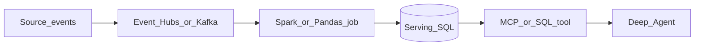

# Phase 6 — Data pipelines

## Progress

| | |
|---|---|
| **Phase** | 6 of 7 |
| **Previous** | [Lab 12 — Search / autocomplete](12-search-autocomplete.md) |
| **Next** | [Lab 13 — Kubernetes controller-lite](13-k8s-controller.md) |

## What you will learn

- Build a **batch or stream** path that lands **context the agent can retrieve**
- Use **SQL** as the serving layer; **Event Hubs** (or local Kafka) as the log; **Spark/Pandas** (Python) to transform
- Follow [Data Engineering Zoomcamp](../docs/career/course-track.md#phase-6) while you build

## Architecture pillars

| Pillar | How this phase practices it |
|--------|-------------------------------|
| 2. Integration & messaging | Events as facts; consumers still idempotent |
| 3. Data architecture | Schema, partitions/watermarks, serving tables |
| 1. System shape | Pipeline is not the agent — it **feeds** the agent |

**Required ADR(s):** Kafka locally vs Azure Event Hubs — **Pillar 2**. Batch vs stream for v1 — **Pillar 3**. One sentence AWS/GCP analogue — [cloud portability](../docs/concepts/cloud-portability.md).

**Framework:** [Data pipelines that feed agents](../docs/concepts/software-engineering.md#data-pipelines-that-feed-agents) · [Database design](../docs/concepts/database-design.md) · [Cloud portability](../docs/concepts/cloud-portability.md)

## Before you start

- **Requires:** [Lab 12](12-search-autocomplete.md) green (path order) plus a Phase 1 agent that can read *some* store (SQL, files, or MCP tool). Phase 6 can later feed the lab 12 index.
- **Course:** [Data Engineering Zoomcamp](../docs/career/course-track.md#phase-6) (DataTalks.Club, free)

## Problem

The agent’s context cannot be “whatever is on disk this week.” Produce a repeatable pipeline: ingest → transform → serve.

## System diagram

## Stack and why

- **Python** — Spark/Pandas and Zoomcamp exercises
- **SQL** — serving layer the tool queries
- **Event Hubs or Kafka** — log; pick one and ADR the other

## Important concepts

### Batch vs stream

**Batch** is “process last night’s files.” **Stream** is “process as events arrive.” Start batch if you have not operated a broker; add a stream when Zoomcamp week on streaming lands.

### Watermark

In streaming, a **watermark** is how late an event may be and still count. Without one, windows never close.

## Code repo

`career-projects/06-data-pipelines-lab`

## Success criteria

- [ ] At least one **transform job** (Spark or well-structured Pandas) writes a **serving table** the Phase 1 agent can query via a tool.
- [ ] Event path: Event Hubs **or** local Kafka (Compose) with a documented mapping to Azure.
- [ ] SQL schema + one `EXPLAIN` or “why this index” note for the agent’s hot query.
- [ ] Job is rerunnable (idempotent sink or partition overwrite).
- [ ] Zoomcamp progress logged in PROGRESS (which weeks).

## Stretch

- [ ] Change Data Capture (CDC) from Postgres into the hub.

## Testing approach (lab)

- Fixture events → job → assert row counts / a golden query.
- Re-run job → no duplicate business rows (or documented overwrite).

## Portfolio artifacts

- [ ] Diagram — source, hub, job, SQL, agent tool
- [ ] ADR — batch vs stream; Event Hubs vs Kafka
- [ ] Failure modes — late events; poison payload; agent reading a half-written partition

## When you're done

- Checklist: [Production readiness](../checklists/production-readiness.md) (phase 6)
- Log in [PROGRESS.md](../PROGRESS.md)
- **Next:** [Lab 13 — Kubernetes controller-lite](13-k8s-controller.md)
