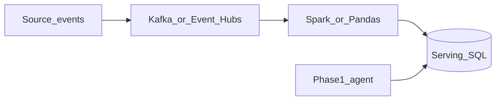

# Phase 6 — Data pipelines

## Progress

| | |
|---|---|
| **Phase** | 6 |
| **Previous** | [Phase 5.4](05-4-ops-cli.md) |
| **Next** | [Phase 6.1 — Search](06-1-search-autocomplete.md) |
| **Course** | [Data Engineering Zoomcamp](https://github.com/DataTalksClub/data-engineering-zoomcamp) (DataTalks.Club, free) |

You are here for **Data**: a repeatable path from events to a **serving table** the agent can read. **Event Hubs** is Azure’s event log; **Kafka** is the local default. One ADR.

## The story

The agent’s context cannot be “whatever is on disk this week.” You ingest events, **transform** them (Spark or Pandas in Python), and land rows in **SQL**. The job must be **idempotent**: run twice, no duplicate business rows (or a documented overwrite).

**Migrations** are versioned schema changes (a tool like `golang-migrate`, Flyway, or Alembic). The serving table is the **system of record**. Redis stays a cache.

**Transactions** mean a group of writes that all succeed or all roll back. Use them when two tables must stay in sync.

## You are here for

| Label | How this lab practices it |
|-------|---------------------------|
| **Data** | Ingest → transform → serving SQL; migrations |
| **Integration** | Event log; idempotent consumers |
| **Shape** | Batch vs stream for v1 |

**Required ADR:** Kafka locally vs Event Hubs — **Integration**. Batch vs stream — **Data**. Portability sentence.

## Before you start

Phase 1 agent can read *some* store (SQL, files, or an MCP tool). Zoomcamp in parallel.

## Problem

Produce a pipeline the agent can trust: ingest → transform → serve.

## How work moves

## Code repo

`career-projects/06-data-pipelines-lab`

## Success criteria

- [ ] At least one job lands rows in SQL the agent (or an MCP tool) can query.
- [ ] Re-run does not duplicate business facts (or overwrite is documented).
- [ ] Schema migrations exist; README how to apply them.
- [ ] ADR: Kafka vs Event Hubs; batch vs stream.
- [ ] Zoomcamp progress noted in PROGRESS.

## Testing

Fixture events → job → row counts. Re-run → still one logical row per key.

## Portfolio

- [ ] Diagram — source, hub, job, SQL, agent
- [ ] ADR — batch vs stream
- [ ] Failure modes — late events; poison payload; agent reading a half-written partition

## When you're done

- [Production readiness](../checklists/production-readiness.md) (phase 6)
- Log in [PROGRESS.md](../PROGRESS.md)
- **Next:** [Phase 6.1](06-1-search-autocomplete.md)
