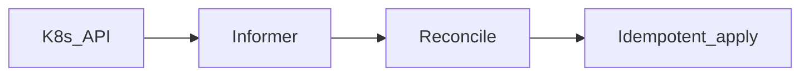

# Phase 7.1 — Kubernetes controller-lite

## Progress

| | |
|---|---|
| **Phase** | 7.1 |
| **Previous** | [Phase 6.2](06-2-rag-retrieve.md) |
| **Next** | [Phase 7 — AKS](07-aks-orchestration.md) |
| **Course** | [KodeKloud CKA](https://learn.kodekloud.com/courses/certified-kubernetes-administrator-cka) — start here |

You are here for **Shape**: a **reconcile loop** (observe → diff → act → requeue) before you Helm the stack onto AKS.

## The story

`kubectl apply` hides the control loop. **Kubernetes** is an API: you declare desired state (for example, three replicas). A **controller** watches and makes the cluster match.

**kind** runs Kubernetes in Docker on your laptop. **AKS** (Phase 7) is the same API, managed by Azure. EKS/GKE are the AWS/GCP names — one sentence.

**Idempotent apply:** if nothing drifted, reconcile must not create duplicate objects.

**Level-triggered:** a periodic resync catches events the watch dropped. Edge-only handlers fail after restart.

v1 notes: [P17](../archive/v1-22-step/career-project-specs/17-k8s-controller-lab.md).

## You are here for

| Label | How this lab practices it |
|-------|---------------------------|
| **Shape** | Desired vs actual |
| **Integration** | At-least-once reconcile; backoff |
| **Observability** | Reconcile logs with name/namespace |
| **Security** | RBAC denial is a failure mode you document |

**Required ADR:** controller-lite vs full custom resource — **Shape**. Portability (same API on EKS/GKE).

## Before you start

Phase 2 images. Docker. kind or minikube. Reconcile something you own (worker Deployment replicas). Not a greenfield operator product.

## Problem

Understand the loop before “just Helm.”

## How work moves

## Code repo

`career-projects/07-1-k8s-controller-lab`

## Success criteria

- [ ] Watches at least one resource type; logs name/namespace.
- [ ] No-drift reconcile does not spam apply.
- [ ] Backoff when the API is unavailable (or documented requeue).
- [ ] README: RBAC-denied and API-down.
- [ ] `go test` for pure reconcile logic (fake client).
- [ ] Optional: `scripts/kubectl-wait-ready.sh` with timeout + exit codes.
- [ ] CKA course started.

## Testing

Fake client: converged → no apply; drift → one apply. kind smoke optional.

## Portfolio

- [ ] Diagram — informer, reconcile, apply
- [ ] ADR — lite vs CRD
- [ ] Failure modes — silent RBAC fail; hot loop

## When you're done

- [Production readiness](../checklists/production-readiness.md) (lab 7.1)
- Log in [PROGRESS.md](../PROGRESS.md)
- **Next:** [Phase 7](07-aks-orchestration.md)
