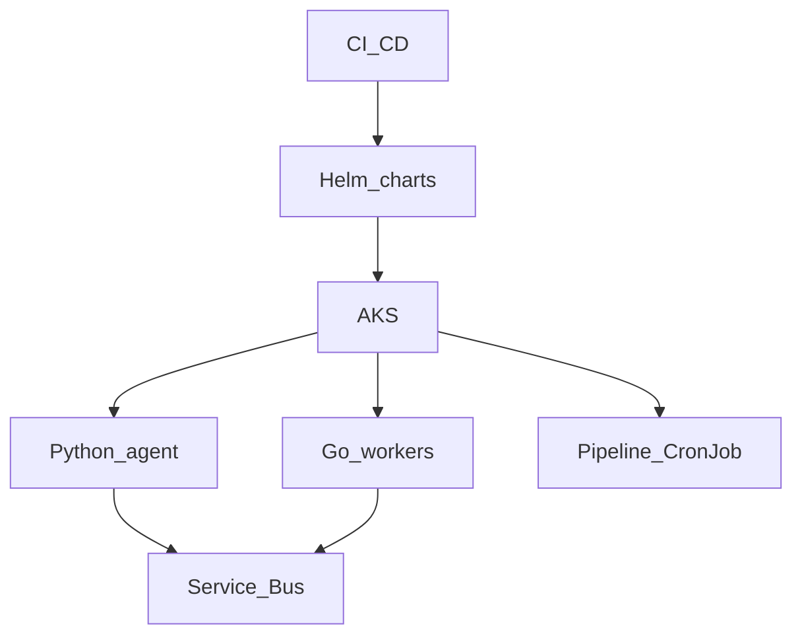

# Phase 7 — AKS orchestration (capstone)

## Progress

| | |
|---|---|
| **Phase** | 7 |
| **Previous** | [Phase 7.1](07-1-k8s-controller.md) |
| **Next** | — (path complete; keep operating and tightening ADRs) |
| **Course** | [KodeKloud CKA](https://learn.kodekloud.com/courses/certified-kubernetes-administrator-cka) |

You are here for **Security** and **Observability** with Azure product names: the same agent and workers, scheduled on a cluster.

## The story

**AKS** (Azure Kubernetes Service) is Microsoft’s managed Kubernetes — they run the control plane; you run workloads. **Helm** packages Kubernetes YAML as **charts** (templates plus values). **CI/CD** (continuous integration and continuous delivery) is the pipeline that tests and deploys those charts.

This is the capstone: not a new product. Compose Phases 1–6. **App Insights** / **Azure Monitor** are Azure’s logs, metrics, and traces. You already learned correlation in Phase 5; here you query the same story with Azure names.

Secrets still do not live in `values-prod.yaml`. **CSI** (Container Storage Interface) or Key Vault references inject secrets at runtime.

**HPA** (horizontal pod autoscaler) adds replicas when CPU (or a custom metric) is high. Write the threshold you chose.

**Probes:** **liveness** (restart if dead) vs **readiness** (stop sending traffic until ready).

EKS and GKE are the same Kubernetes API on AWS and GCP. One ADR sentence.

## You are here for

| Label | How this lab practices it |
|-------|---------------------------|
| **Shape** | One cluster for agent, workers, pipeline job |
| **Performance** | HPA / replica math with a number |
| **Security** | Network policy, secrets not in git, RBAC |
| **Observability** | Probes; one Azure Monitor / App Insights query across agent and worker |

**Required ADR:** AKS vs staying on App Service / Container Apps — **Shape**. Portability (EKS/GKE).

## Before you start

Phase 7.1 green. Phase 2 images. Phase 5 workers. Phase 6 job as a CronJob or separate workload.

## Problem

Enterprise teams ask for schedule, scale, and policy on Kubernetes.

## How work moves

## Code repo

`career-projects/07-aks-orchestration-lab`

## Success criteria

- [ ] Helm chart(s) install agent + at least one Go worker on AKS (or kind locally **plus** a documented AKS apply).
- [ ] Liveness and readiness probes on the agent.
- [ ] CI: lint + test + chart lint (and deploy to a non-prod namespace if you have AKS).
- [ ] At least one network policy (or ADR why the lab is open).
- [ ] `helm rollback` documented and tried once.
- [ ] One log or trace query across agent and worker in Azure Monitor / App Insights (or kind + grep with an ADR to Azure).
- [ ] CKA in progress or complete.

## Testing

`helm template` / `helm lint`. Smoke: port-forward or ingress → health → one tool path.

## Portfolio

- [ ] Diagram — cluster, namespaces, charts, bus
- [ ] ADR — AKS vs Container Apps; secrets into the pod
- [ ] Failure modes — crash loop without probes; secrets in values; no resource requests
- [ ] Observability — Azure query or documented stand-in

## When you're done

- [Production readiness](../checklists/production-readiness.md) (phase 7)
- Log in [PROGRESS.md](../PROGRESS.md)
- Update [target alignment](../docs/career/target-alignment.md) pin list when artifacts are public
