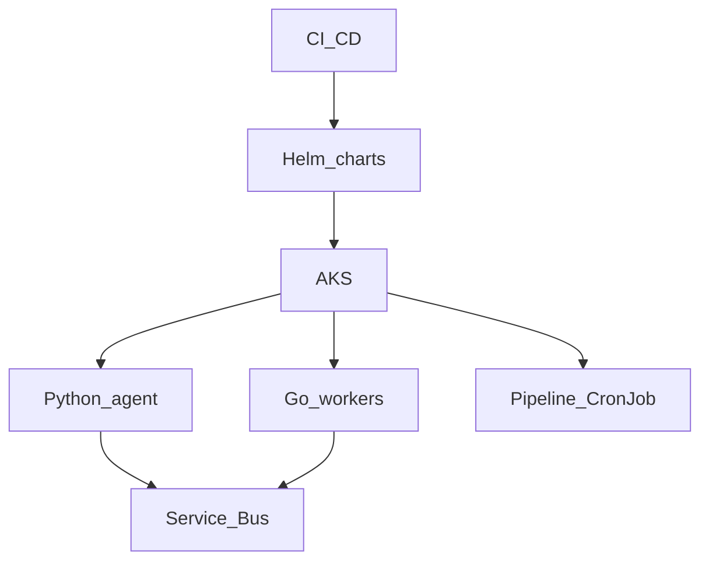

# Phase 7 — AKS orchestration (capstone)

## Progress

| | |
|---|---|
| **Phase** | 7 of 7 |
| **Previous** | [Lab 13 — Kubernetes controller-lite](13-k8s-controller.md) |
| **Next** | — (path complete; keep operating and tightening ADRs) |

## What you will learn

- Run the **Python agent**, **Go workers**, and pipeline jobs on **Azure Kubernetes Service**
- Package with **Helm**; ship with **CI/CD**; observe and lock down with network policies
- Complete **CKA**-shaped habits (pods, deploys, services, probes, RBAC) on *your* stack

## Architecture pillars

| Pillar | How this phase practices it |
|--------|-------------------------------|
| 1. System shape | Same system as Phases 1–6, now one cluster |
| 4. Performance and language boundaries | HPA / replica math with evidence |
| 5. Reliability, security, operations | Helm, CI, probes, network policies, rollback |

**Required ADR(s):** AKS vs staying on App Service / Container Apps — **Pillar 5**. One sentence AWS/GCP analogue (EKS/GKE) — [cloud portability](../docs/concepts/cloud-portability.md).

**Framework:** [Kubernetes delivery](../docs/concepts/software-engineering.md#kubernetes-delivery) · [Azure certification track](../docs/career/azure-certification-track.md) · [Cloud portability](../docs/concepts/cloud-portability.md)

## Before you start

- **Requires:** [Lab 13](13-k8s-controller.md) green (path order) plus Phase 2 images + Phase 5 workers (Phase 6 job as a CronJob or separate workload)
- **Course:** [KodeKloud CKA](../docs/career/course-track.md#phase-7)

## Problem

Compose and App Service got you to Azure. Enterprise teams ask for **schedule, scale, and policy** on Kubernetes. This phase is the capstone: one cluster story, not a greenfield product.

## System diagram

## Stack and why

- **AKS + Helm** — enterprise packaging
- **CI/CD** (GitHub Actions) — lint, test, helm diff / deploy
- Images from Phase 2/5

## Important concepts

### Helm values vs secrets

Charts take **values**. Secrets stay in Key Vault / CSI / sealed secrets — not `values-prod.yaml` in git.

### Probes and HPA

Liveness vs readiness (glossary). **HPA** scales on CPU or custom metrics; write the threshold you chose.

## Code repo

`career-projects/07-aks-orchestration-lab` (charts + pipeline). May wrap previous repos as subcharts.

## Success criteria

- [ ] Helm chart(s) install agent + at least one Go worker on AKS (or `kind` locally **plus** a documented AKS apply).
- [ ] Liveness and readiness probes on the agent deploy.
- [ ] CI: lint + test + chart lint (and deploy to a non-prod namespace if you have AKS).
- [ ] At least one **network policy** (or explicit ADR why the lab cluster is open).
- [ ] Rollback: `helm rollback` (or previous revision) documented and tried once.
- [ ] CKA course in progress or complete; notes in PROGRESS.

## Stretch

- [ ] Ingress + TLS; Pod Disruption Budget; HPA on a real metric.

## Testing approach (lab)

- `helm template` / `helm lint`
- Smoke script: port-forward or ingress → health → one tool path

## Portfolio artifacts

- [ ] Diagram — cluster, namespaces, charts, bus, SQL
- [ ] ADR — AKS vs Container Apps; how secrets enter the pod
- [ ] Failure modes — crash loop without probes; chart that embeds secrets; no resource requests
- [ ] Observability — one trace or log query across agent and worker

## When you're done

- Checklist: [Production readiness](../checklists/production-readiness.md) (phase 7)
- Log in [PROGRESS.md](../PROGRESS.md)
- Update [target-alignment](../docs/career/target-alignment.md) pin list when artifacts are public
