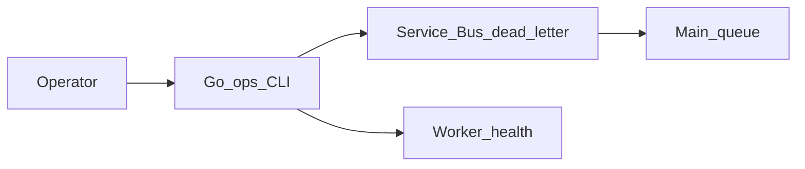

# Lab 08 — Ops CLI

## Progress

| | |
|---|---|
| **Lab** | 08 — required competence |
| **Previous** | [Phase 5 — Azure backends](05-azure-backends.md) |
| **Next** | [Lab 09 — Edge proxy](09-edge-proxy.md) |

## What you will learn

- Ship a **Go CLI** operators can trust: flags, exit codes, structured output
- **Inspect and replay** a dead-letter queue
- Smoke-check health without opening the portal

## Architecture pillars

| Pillar | How this lab practices it |
|--------|---------------------------|
| 2. Integration & messaging | DLQ replay is an operator workflow on at-least-once buses |
| 5. Reliability, security, operations | Exit codes, dry-run, no secrets in argv logs |

**Required ADR(s):** flag/exit conventions — **Pillar 5**. One sentence AWS/GCP analogue (SQS DLQ CLI / Pub/Sub dead letter) — [cloud portability](../docs/concepts/cloud-portability.md).

**Framework:** [Command-line tooling](../docs/concepts/command-line-tooling.md) · [Azure-shaped backends](../docs/concepts/software-engineering.md#azure-shaped-backends) · [Cloud portability](../docs/concepts/cloud-portability.md)

**Reading (v1):** [P15 DevOps CLI](../archive/v1-22-step/career-project-specs/15-devops-cli-lab.md) — patterns only.

## Before you start

- **Requires:** [Phase 5](05-azure-backends.md) worker + Service Bus (or local stand-in with ADR)

## Problem

When a poison message sits on the DLQ, clicking Azure Portal is not a runbook. Give yourself a binary: `ops dlq ls`, `ops dlq replay --id …`, `ops health`.

## System diagram



## Stack and why

- **Go** — one static binary, clear exit codes
- **Azure Service Bus** (or Compose stand-in) — same bus as Phase 5

## Important concepts

### Exit codes

`0` = success. Non-zero = operator-visible failure (auth, empty-id, replay failed). Never `os.Exit` from a library function — return `error` and map in `main`.

```go
// Illustrative
func replay(ctx context.Context, id string) error {
    if id == "" {
        return errUsage
    }
    return bus.DeadLetterReplay(ctx, id)
}
```

### Dry-run then replay

Default to print what you would move. Require `--confirm` to actually replay. Log `request_id` / message id.

## Code repo

`career-projects/08-ops-cli-lab` (or `cmd/ops` in the Phase 5 repo).

## Success criteria

- [ ] Subcommands: at least `health` and `dlq ls` / `dlq replay`.
- [ ] Replay moves or copies a dead-lettered message back to the main queue (documented).
- [ ] `--confirm` (or equivalent) required for mutating commands; dry-run is default.
- [ ] Exit codes documented in README; one structured JSON output mode.
- [ ] ADR: Azure Service Bus DLQ + one-sentence SQS / Pub/Sub analogue.
- [ ] Secrets via env / Key Vault — not flags.

## Testing approach (lab)

- Unit: flag parsing and “empty id → usage error.”
- Integration: seed a poison message → `dlq ls` sees it → replay → worker processes or queue depth changes.

## Portfolio artifacts

- [ ] Diagram — CLI, DLQ, main queue, health
- [ ] ADR — including portability sentence
- [ ] Failure modes — replay without confirm; logging connection strings

## When you're done

- Checklist: [Production readiness](../checklists/production-readiness.md) (lab 08)
- Log in [PROGRESS.md](../PROGRESS.md)
- **Next:** [Lab 09 — Edge proxy](09-edge-proxy.md)
