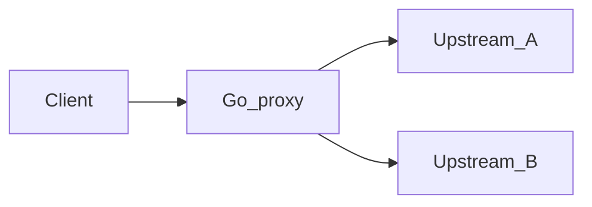

# Lab 09 — Edge proxy

## Progress

| | |
|---|---|
| **Lab** | 09 — required competence |
| **Previous** | [Lab 08 — Ops CLI](08-ops-cli.md) |
| **Next** | [Lab 10 — Rate limiter](10-rate-limiter.md) |

## What you will learn

- Reverse-proxy HTTP to an upstream **pool** (Phase 5 worker or agent HTTP)
- **Timeouts**, connection **pooling**, **graceful shutdown**
- Network-layer failure modes you will later name as App Gateway / ALB

## Architecture pillars

| Pillar | How this lab practices it |
|--------|---------------------------|
| 1. System shape | Client → proxy → upstream; timeout budget across hops |
| 4. Performance & language boundaries | Pool size, p95 under load |
| 5. Reliability, security, operations | Access logs, drain on SIGTERM |

**Required ADR(s):** pool sizing and timeout budget — **Pillar 4**. One sentence AWS/GCP analogue (ALB+Envoy / HTTPS LB) — [cloud portability](../docs/concepts/cloud-portability.md).

**Framework:** [Servers and networking](../docs/concepts/servers-and-networking.md) · [Memory and performance](../docs/concepts/memory-and-performance.md) · [Cloud portability](../docs/concepts/cloud-portability.md)

**Reading (v1):** [P18 proxy](../archive/v1-22-step/career-project-specs/18-proxy-load-balancer-lab.md) — patterns only.

## Before you start

- **Requires:** Phase 5 (or Phase 1) HTTP health + one API path to forward

## Problem

Application code cannot fix hung upstreams or connection storms. Put a small **Go reverse proxy** in front: enforce deadlines, limit connections, shut down without dropping in-flight work if you can drain.

## System diagram

## Stack and why

- **Go** `net/http` + `httputil.ReverseProxy` (or equivalent)
- Local first; **name** Azure App Gateway / Container Apps ingress as the managed form in the ADR

## Important concepts

### Timeout budget

Client timeout > proxy timeout > upstream timeout. Nested wrong, you leak goroutines or return confusing 504s.

### Graceful shutdown

On SIGTERM: stop accepting, wait up to N seconds for in-flight, then exit. Kubernetes and App Service both send SIGTERM first.

## Code repo

`career-projects/09-edge-proxy-lab`

## Success criteria

- [ ] Proxy forwards HTTP to ≥1 upstream; optional round-robin if two.
- [ ] Configurable connect/read timeouts; a hung upstream returns a documented error (504/502).
- [ ] Connection limit or pool documented; one load note (even a local `hey`/`vegeta` run).
- [ ] SIGTERM drain path implemented and described.
- [ ] Structured access logs with `request_id`.
- [ ] ADR: why a process-local proxy vs App Gateway + portability sentence.

## Testing approach (lab)

- Unit: director/timeout helpers.
- Integration: proxy → fake slow upstream → expect timeout; SIGTERM test if feasible.

## Portfolio artifacts

- [ ] Diagram — clients, proxy, pool
- [ ] ADR — timeouts + AWS/GCP analogue
- [ ] Performance — one p95 or timeout measurement
- [ ] Failure modes — no deadline; kill -9 vs SIGTERM

## When you're done

- Checklist: [Production readiness](../checklists/production-readiness.md) (lab 09)
- Log in [PROGRESS.md](../PROGRESS.md)
- **Next:** [Lab 10 — Rate limiter](10-rate-limiter.md)
