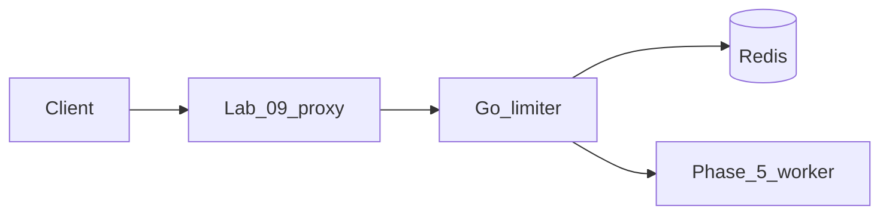

# Lab 10 — Rate limiter

## Progress

| | |
|---|---|
| **Lab** | 10 — required competence |
| **Previous** | [Lab 09 — Edge proxy](09-edge-proxy.md) |
| **Next** | [Lab 11 — Notification fan-out](11-notification-fanout.md) |

## What you will learn

- Enforce **per-client** limits before expensive upstream work
- Implement (or document) **token bucket vs sliding window**
- Return **`429` + `Retry-After`**; decide fail-open vs fail-closed when Redis is down

## Architecture pillars

| Pillar | How this lab practices it |
|--------|---------------------------|
| 2. Integration & messaging | Gateway middleware, 429 contract, per-API-key or per-IP keys |
| 4. Performance & language boundaries | Redis atomic counters; middleware overhead |
| 5. Reliability, security, operations | Redis outage policy; hot-key note |

**Required ADR(s):** token bucket vs sliding window — **Pillar 4**. Redis vs in-memory — **Pillar 2**. One sentence AWS/GCP analogue (API Gateway usage plans / Cloud Armor quotas) — [cloud portability](../docs/concepts/cloud-portability.md).

**Framework:** [Memory and performance](../docs/concepts/memory-and-performance.md) · [Cloud portability](../docs/concepts/cloud-portability.md) · [System design — rate limiter](../docs/career/system-design-interview-map.md#rate-limiter)

**Reading (v1):** [P23 rate limiter](../archive/v1-22-step/career-project-specs/23-rate-limiter-gateway-lab.md) — patterns only.

## Before you start

- **Requires:** [Lab 09](09-edge-proxy.md) (this limiter can sit **behind** the proxy) and Phase 5 Redis
- Compose the Phase 5 worker HTTP path (or the 09 upstream). Do not start a greenfield product.

## Problem

Unbounded clients exhaust the worker. Put a **Go** limiter on the same Redis you already run: under limit → forward; over limit → `429` with `Retry-After`.

## System diagram



## Stack and why

- **Go** middleware in front of the Phase 5 (or 09) HTTP path
- **Redis** — same cache from Phase 5; not a second product

## Important concepts

### Sliding window (illustrative)

```go
func (rl *Limiter) Allow(ctx context.Context, key string) (bool, time.Duration, error) {
    n, err := rl.redis.Incr(ctx, "rl:"+key).Result()
    if n == 1 {
        rl.redis.Expire(ctx, "rl:"+key, rl.window)
    }
    if n > rl.limit {
        return false, rl.window, err
    }
    return true, 0, err
}
```

Token bucket allows short bursts; sliding window is smoother. Ship **one** in code; compare the other in the ADR.

### Fail-open vs fail-closed

If Redis is unreachable: fail-open (serve traffic, lose the limit) vs fail-closed (503). Write the choice and the failure mode.

## Code repo

`career-projects/10-rate-limiter-lab` (or middleware in the 09 / Phase 5 repo).

## Success criteria

- [ ] Configurable limit (e.g. N req/min per API key or IP).
- [ ] Under limit → upstream; over limit → **429** + **Retry-After**.
- [ ] Token bucket **or** sliding window in code; the other compared in the ADR.
- [ ] Integration test: N+1th request in window is 429.
- [ ] Redis-down policy documented (fail-open or fail-closed).
- [ ] Structured logs: hashed client key, remaining, `limit_exceeded`.
- [ ] ADR includes Azure (APIM / App Gateway WAF / your limiter) + AWS/GCP analogue.

## Testing approach (lab)

- Unit: window / bucket math at the boundary.
- Integration: burst N+1 against a fake upstream.

## Portfolio artifacts

- [ ] Diagram — client, proxy, limiter, Redis, worker
- [ ] ADR — algorithm + Redis outage + portability sentence
- [ ] Performance — one middleware overhead or 429-accuracy note
- [ ] Failure modes — Redis down; hot key; clock skew at window edge

## When you're done

- Checklist: [Production readiness](../checklists/production-readiness.md) (lab 10)
- Log in [PROGRESS.md](../PROGRESS.md)
- **Next:** [Lab 11 — Notification fan-out](11-notification-fanout.md)
