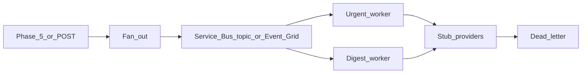

# Lab 11 — Notification fan-out

## Progress

| | |
|---|---|
| **Lab** | 11 — required competence |
| **Previous** | [Lab 10 — Rate limiter](10-rate-limiter.md) |
| **Next** | [Lab 12 — Search / autocomplete](12-search-autocomplete.md) |

## What you will learn

- Fan-out **one domain event** to many channels (email stub, push stub, in-app)
- **Idempotent** `notification_id` delivery; retries; **DLQ**
- Name the Azure broker (Service Bus topics or Event Grid) vs SNS+SQS / Pub/Sub

## Architecture pillars

| Pillar | How this lab practices it |
|--------|---------------------------|
| 1. System shape | One event → N deliveries |
| 2. Integration & messaging | Topics / Event Grid; at-least-once + dedupe |
| 5. Reliability, security, operations | Priority vs digest; poison isolation |

**Required ADR(s):** Service Bus topics vs Event Grid — **Pillar 2**. Fan-out on write vs lazy digest — **Pillar 1**. One sentence AWS/GCP analogue (SNS+SQS / Pub/Sub) — [cloud portability](../docs/concepts/cloud-portability.md).

**Framework:** [Messaging and RPC](../docs/concepts/messaging-and-rpc.md) · [Azure-shaped backends](../docs/concepts/software-engineering.md#azure-shaped-backends) · [Cloud portability](../docs/concepts/cloud-portability.md) · [System design — notifications](../docs/career/system-design-interview-map.md#notification-system)

**Reading (v1):** [P24 notification fan-out](../archive/v1-22-step/career-project-specs/24-notification-fanout-lab.md) — patterns only.

## Before you start

- **Requires:** Phase 5 Service Bus habits + [Lab 08](08-ops-cli.md) DLQ vocabulary
- Trigger from a Phase 5 tool completion (or a thin `POST /notify`). Do not invent a social product.

## Problem

A finished worker job should notify more than one sink. Accept an event, expand to one job per `(user, channel)`, deliver asynchronously with retries and a DLQ.

## System diagram



## Stack and why

- **Go** API + workers (same language as Phase 5)
- **Azure Service Bus topics or Event Grid** (or local stand-in + ADR)
- Stub email/push adapters — no real SMTP vendor required

## Important concepts

### Fan-out enqueue (illustrative)

```go
for _, ch := range prefs.Channels {
    job := Job{
        ID:      fmt.Sprintf("%s:%s:%s", batchID, userID, ch),
        Payload: payload,
    }
    if err := queue.Enqueue(ctx, job); err != nil {
        return err
    }
}
```

Enqueue durably, then return `202`. Duplicate redelivery must not double-call a provider — store `notification_id` + channel.

### Fan-out on write vs digest

Immediate per-channel jobs vs a later batch. Ship write-path fan-out for at least one urgent channel; document digest as the cheaper alternative.

## Code repo

`career-projects/11-notification-fanout-lab`

## Success criteria

- [ ] `POST /notify` (or Phase 5 hook) returns **202** after durable enqueue.
- [ ] One job per `(user, channel)` with a stable idempotency key.
- [ ] Duplicate delivery → single provider call (test this).
- [ ] Failed deliveries retry; poison lands in **DLQ** after N attempts.
- [ ] Urgent vs digest policy written (even if only one queue in code).
- [ ] ADR: Azure topic/Event Grid + SNS+SQS / Pub/Sub sentence.

## Testing approach (lab)

- Integration: notify → worker → stub; replay the same id → still one provider increment.
- One forced provider 500 → retry then success **or** DLQ.

## Portfolio artifacts

- [ ] Diagram — event, fan-out, topic, workers, DLQ
- [ ] ADR — broker + write vs digest + portability sentence
- [ ] Failure modes — double-send; fan-out storm; DLQ without replay
- [ ] Observability — `notification_id` on API and worker logs

## When you're done

- Checklist: [Production readiness](../checklists/production-readiness.md) (lab 11) · [Integration hardening](../checklists/integration-hardening.md) if you expose HTTP
- Log in [PROGRESS.md](../PROGRESS.md)
- **Next:** [Lab 12 — Search / autocomplete](12-search-autocomplete.md)
