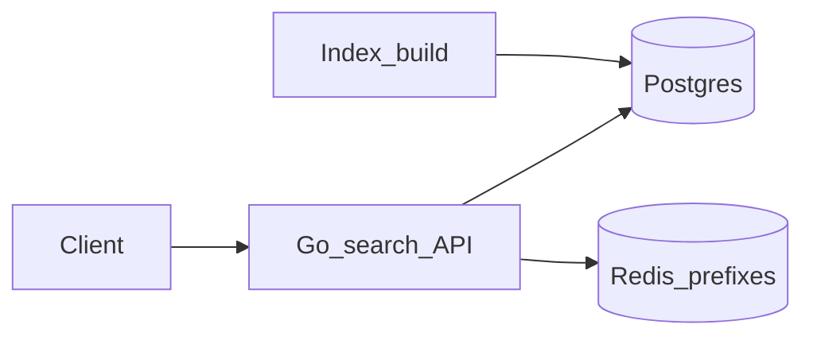

# Lab 12 — Search / autocomplete

## Progress

| | |
|---|---|
| **Lab** | 12 — required competence |
| **Previous** | [Lab 11 — Notification fan-out](11-notification-fanout.md) |
| **Next** | [Phase 6 — Data pipelines](06-data-pipelines.md) |

## What you will learn

- **Prefix suggest** and **keyword search** with a latency budget
- Indexes (Postgres `tsvector` or equivalent) plus a **Redis** hot-prefix cache
- Contrast keyword search with later Phase 6 / agent retrieval — not a second RAG product

## Architecture pillars

| Pillar | How this lab practices it |
|--------|---------------------------|
| 3. Data architecture | Trie or prefix index; inverted index / FTS |
| 4. Performance & language boundaries | Suggest p95; cache vs index |
| 5. Reliability, security, operations | Stale index; cache stampede |

**Required ADR(s):** in-memory trie vs DB prefix — **Pillar 3**. Postgres FTS vs naming OpenSearch / Cloud Search — **Pillar 3** (names only). One sentence AWS/GCP analogue — [cloud portability](../docs/concepts/cloud-portability.md).

**Framework:** [Algorithms — trie](../docs/concepts/algorithms-and-data-structures.md#trie-prefix-tree) · [Database design](../docs/concepts/database-design.md) · [Cloud portability](../docs/concepts/cloud-portability.md) · [System design — search](../docs/career/system-design-interview-map.md#search--autocomplete)

**Reading (v1):** [P25 search](../archive/v1-22-step/career-project-specs/25-search-autocomplete-lab.md) — patterns only.

## Before you start

- **Requires:** Phase 5 Redis + comfort with SQL. Phase 6 can **later** feed this index — do not wait for Zoomcamp.
- Corpus can be agent tool names, run titles, or a public title list. Compose the existing stack.

## Problem

Operators and agents need **typeahead** and **exact/prefix keyword** search — different from vector RAG. Ship `GET /suggest` and `GET /search` with a documented p95.

## System diagram



## Stack and why

- **Go** HTTP API
- **Postgres** (or sqlite + ADR) — documents + `tsvector` / GIN
- **Redis** — hot prefix cache (same Redis family as Phase 5)

## Important concepts

### Suggest (illustrative)

```go
type Node struct {
    children map[rune]*Node
    terminal bool
}

func (t *Trie) Suggest(prefix string, k int) []string { /* ... */ }
```

In-memory trie is fine for a moderate corpus; a DB prefix / trigram index is the portable production shape. Write which you shipped.

### Keyword vs later pipelines

This lab is **lexical**. Phase 6 lands events the agent can retrieve; you may point ingest at that serving table later. OpenSearch / Cloud Search are **names** in the ADR — not a second cloud deploy.

## Code repo

`career-projects/12-search-autocomplete-lab`

## Success criteria

- [ ] `GET /suggest?q=` returns ≤K suggestions; document corpus size and a local p95 (target &lt;50ms if the corpus is small).
- [ ] `GET /search?q=` returns ranked hits; ranking explained in README.
- [ ] Idempotent ingest by `doc_id`.
- [ ] Redis (or documented skip) for at least one hot prefix.
- [ ] Structured logs: `q`, `result_count`, `latency_ms`, `request_id`.
- [ ] ADR: index choice + OpenSearch/Cloud Search as names + portability sentence.

## Testing approach (lab)

- Integration: ingest fixture → suggest `"pre"` includes `"prefix"` if present.
- Re-ingest same `doc_id` → one current document.

## Portfolio artifacts

- [ ] Diagram — ingest, Postgres, Redis, API
- [ ] ADR — trie vs DB; FTS vs named managed search
- [ ] Performance — suggest p95; index build for N docs
- [ ] Failure modes — stale index; stampede on a viral prefix

## When you're done

- Checklist: [Production readiness](../checklists/production-readiness.md) (lab 12)
- Log in [PROGRESS.md](../PROGRESS.md)
- **Next:** [Phase 6 — Data pipelines](06-data-pipelines.md)
