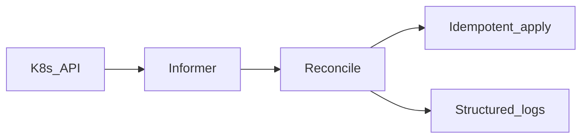

# Lab 13 — Kubernetes controller-lite

## Progress

| | |
|---|---|
| **Lab** | 13 — required competence |
| **Previous** | [Phase 6 — Data pipelines](06-data-pipelines.md) |
| **Next** | [Phase 7 — AKS orchestration](07-aks-orchestration.md) |

## What you will learn

- A **reconcile loop**: observe → diff → act → requeue
- **Idempotent** apply — repeated reconcile without drift does not spam side effects
- Level-triggered resync so missed watches do not leave the cluster wrong

Do this **before** you Helm the stack onto AKS in Phase 7.

## Architecture pillars

| Pillar | How this lab practices it |
|--------|---------------------------|
| 1. System shape | Desired vs actual state |
| 2. Integration & messaging | At-least-once reconcile; idempotent apply |
| 5. Reliability, security, operations | RBAC denial; API unavailable; backoff |

**Required ADR(s):** controller-lite vs full CRD operator — **Pillar 1**. One sentence AWS/GCP analogue (same Kubernetes API on EKS/GKE) — [cloud portability](../docs/concepts/cloud-portability.md).

**Framework:** [Kubernetes delivery](../docs/concepts/software-engineering.md#kubernetes-delivery) · [Cloud portability](../docs/concepts/cloud-portability.md)

**Reading (v1):** [P17 controller](../archive/v1-22-step/career-project-specs/17-k8s-controller-lab.md) — patterns only.

## Before you start

- **Requires:** Phase 6 green (path order). Docker from Phase 2. **kind** (or minikube) locally — not AKS yet.
- Reconcile something you already own (Deployment replicas for the Phase 5 worker, a ConfigMap checksum). Not a greenfield operator product.

## Problem

`kubectl apply` and Helm hide the control loop. Write a small **Go** controller that watches one resource, converges desired vs actual, and logs every reconcile.

## System diagram

## Stack and why

- **Go** — `controller-runtime` or client-go informers (ADR the choice)
- **kind** locally; AKS is Phase 7 (same API)

## Important concepts

### Reconcile

Observe desired spec, compare to live objects, apply only the delta, requeue on error with backoff. Converged → no extra writes.

### Level-triggered

A periodic resync catches events the watch dropped. Edge-only handlers fail after controller restart or API blips.

### Controller-lite vs CRD

Informers + sync on built-in types is enough to prove the loop. A Custom Resource Definition is stretch — Phase 7 still does not require you to write an operator.

## Code repo

`career-projects/13-k8s-controller-lab`

## Success criteria

- [ ] Watches at least one resource type; logs name/namespace on reconcile.
- [ ] Idempotent: no-drift reconcile does not create duplicate objects or log-spam apply.
- [ ] Backoff (or documented requeue) when the API is unavailable.
- [ ] README: RBAC-denied and API-down failure modes.
- [ ] `go test` for pure reconcile logic (fake client or envtest).
- [ ] ADR: controller-lite vs CRD + “same API on EKS/GKE” sentence.
- [ ] Optional hook: `scripts/kubectl-wait-ready.sh` with timeout + exit codes (useful for Phase 7 CI).

## Testing approach (lab)

- Unit: fake client — already-converged → no apply; drift → one apply.
- kind smoke: start controller, change the watched object, see a reconcile log.

## Portfolio artifacts

- [ ] Diagram — API, informer, reconcile, apply
- [ ] ADR — lite vs CRD + portability sentence
- [ ] Failure modes — RBAC silent fail; hot loop; non-idempotent apply
- [ ] Observability — one successful reconcile log with resource id

## When you're done

- Checklist: [Production readiness](../checklists/production-readiness.md) (lab 13)
- Log in [PROGRESS.md](../PROGRESS.md)
- **Next:** [Phase 7 — AKS orchestration](07-aks-orchestration.md)
