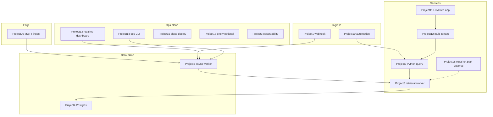

# Project 21 — Integrated platform capstone

## Progress

| | |
|---|---|
| **Step** | 21 of 21 |
| **Previous** | [Project 20 — IoT / edge ingest + local inference lab](20-iot-edge-lab.md) |
| **Next** | — |

## What you will learn

- Compose existing labs into one deployable, demo-ready platform
- Trace requests across services with shared observability contracts
- Present a flagship portfolio piece (diagram, demo, linked artifacts)

## Before you start

- **Requires:** Green success criteria on Projects **1–20**, or explicit deferrals logged in [PROGRESS.md](../PROGRESS.md)
- **Deep dive:** [Systems integration architect](../docs/concepts/systems-integration-architect.md) · [Portfolio artifacts template](../docs/templates/portfolio-artifacts.md)

## Problem

Ship **one integrated system** that composes your existing labs—**not a rewrite**. The capstone repo is a thin **orchestration layer** (`docker compose`, env wiring, demo script, flagship README) that pins and connects services you already built.

## Career relevance

**Summary:** This is your **flagship portfolio piece**—the story that ties ingestion, AI, workers, dashboards, auth, observability, cloud deploy, Rust hot path, and IoT edge into one coherent platform interviewers can follow in five minutes.

### In depth

Individual labs prove skills; the capstone proves **systems thinking**. Senior hires show: end-to-end architecture, explicit failure modes, measured performance, and production gates—not twenty disconnected repos. Project 21 is where the playbook’s linear path becomes a **single narrative**.

## Important concepts

### Concept spotlight

| **Orchestration over rewrite** | Pin lab images/tags; wire env and networks; don’t reimplement Project 2 in Project 21 |
| **Tenant-scoped demo** | Auth from Project 12 on user paths; no cross-tenant leakage in dashboard or query |
| **Trace across boundaries** | Same `request_id` from BFF → RAG → Go gateway in logs |
| **Flagship README** | System diagram, demo script output, links to each service’s `docs/portfolio/` |

**Interview line:** *“This is one compose stack: webhook and IoT ingest enqueue work, Go workers retrieve, Python serves RAG with evals, TS BFF enforces tenant scope, and our demo script proves the full path with request_ids in logs.”*

## System map

## Code repo

| | URL |
|---|-----|
| **GitHub** | _TBD — e.g. `platform-capstone-lab`_ |
| **SSH** | _TBD_ |
| **Local sibling** | [`../career-projects/21-platform-capstone-lab`](../career-projects/21-platform-capstone-lab) |

**Repo contents (minimum):**

- `docker-compose.yml` (or documented k8s manifest set) referencing built images from lab repos
- `.env.example` — all service URLs, secrets keys, queue/DB DSNs
- `scripts/demo.sh` — end-to-end happy path + one failure injection (optional)
- `README.md` — flagship system diagram, prerequisites (which lab tags/commits), demo instructions
- `docs/portfolio/` — system-level ADR, E2E performance note, failure modes, observability walkthrough

## Stack

- **Docker Compose** (default) — orchestrates Project 1/2/6/8/11/12/13/20 services + Postgres + queue
- **Optional:** Project 15 cloud deploy of the same stack; Project 17 proxy in front; Project 18/19 components per ADR

## Success criteria

- [ ] `docker compose up` (or documented cloud stack) runs the **integrated slice** locally.
- [ ] **Demo script:** ingest → queue → worker → RAG query → dashboard event, **tenant-scoped** where applicable.
- [ ] **Auth + tenant isolation** on user-facing paths ([Project 12](12-multi-tenant-auth-lab.md)).
- [ ] **request_id** traceable across at least **3 services** in logs ([Project 3](03-observability-lab.md)).
- [ ] **Cloud deploy** documented with health checks + rollback ([Project 15](15-cloud-deploy-lab.md)).
- [ ] **Rust hot-path or WASM** wired where your ADR specifies ([Project 18](18-rust-hot-path-lab.md) / [Project 19](19-wasm-secure-component-lab.md)).
- [ ] **IoT/edge** telemetry feeds same Postgres + dashboard ([Project 20](20-iot-edge-lab.md)).
- [ ] **Flagship README:** system architecture diagram, demo walkthrough (video or screenshots), links to each lab’s `docs/portfolio/`.
- [ ] [Production readiness checklist](../checklists/production-readiness.md) — all **Req** rows for step 21.

## Testing approach (lab)

- Smoke: `scripts/demo.sh` exits 0 against compose stack.
- Integration: assert tenant A cannot read tenant B’s query or dashboard event.
- Ops: health endpoints for each long-running service return 200 after `compose up`.

## Exploration scenarios

1. Kill Go worker mid-job → queue redelivery → idempotent outcome (no duplicate side effects).
2. RAG timeout → BFF shows eval-aware error; `request_id` in UI/support panel.
3. IoT duplicate MQTT → single stored reading ([Project 20](20-iot-edge-lab.md) idempotency).

## Stretch

- Project 16 controller-lite manages one capstone resource (e.g. deploy revision).
- Project 17 proxy enforces global timeout budget in front of BFF + RAG.
- Project 14 CLI replays capstone DLQ from unified compose network.

## Portfolio artifacts

Template: [Portfolio artifacts](../docs/templates/portfolio-artifacts.md). **System-level** packet in capstone repo; link out to each service’s `docs/portfolio/`.

- [ ] **Architecture diagram** — full system map (above, refined with your actual service names and ports).
- [ ] **ADR** — why compose-orchestrated labs vs monorepo rewrite; include Rust/WASM placement decision.
- [ ] **Performance numbers** — one E2E timing (e.g. webhook → dashboard event p95) or honest bottleneck note.
- [ ] **Failure modes** — cross-service failures (queue down, RAG timeout, tenant leak attempt).
- [ ] **Observability evidence** — screenshot or log walkthrough following one `request_id` across 3+ services.
- [ ] Artifacts committed in `21-platform-capstone-lab/docs/portfolio/`.

## When you're done

- Run tests: [Testing approach (lab)](#testing-approach-lab) · [per-project testing guide](../docs/concepts/per-project-testing.md)
- Checklist: [Production readiness](../checklists/production-readiness.md) (step 21 — all **Req** rows)
- Log in [PROGRESS.md](../PROGRESS.md) — this is the path terminus; summarize the flagship demo
- **Next:** — (path complete)
