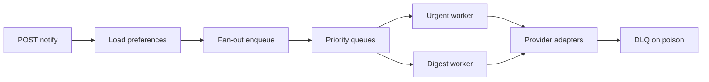

# Project 24 — Notification fan-out service (optional)

## Progress

| | |
|---|---|
| **Step** | Optional — after [Project 8](08-go-retrieval-worker-lab.md) or [Project 22](22-integrated-platform-capstone.md) |
| **Previous** | [Project 22 — Integrated platform capstone](22-integrated-platform-capstone.md) (recommended) |
| **Next** | — (optional branch) |

**Not in the linear spine.** One active project rule still applies — pick this only when the spine milestone you need is green.

## What you will learn

- Fan-out one domain event to many delivery channels (push, email stub, in-app)
- Priority queues and idempotent `notification_id` delivery
- At-least-once semantics with DLQ and provider-style retries

## Architecture pillars

| Pillar | How this project practices it |
|--------|-------------------------------|
| 1. System shape | One domain event → many delivery channels |
| 2. Integration & messaging | Kafka vs Redis; fan-out on write vs lazy digest |
| 4. Performance & language boundaries | Fan-out throughput, priority queues |
| 5. Reliability, security, operations | Idempotent `notification_id`, delivery guarantees |

**Required ADR(s):** tag each ADR with pillar (e.g. fan-out on write vs read — **Pillar 4**; broker choice — **Pillar 2**).

**Framework:** [Architecture framework](../docs/concepts/architecture-framework.md)

## Before you start

- **Requires:** [Project 6](06-async-worker-stretch.md) and [Project 8](08-go-retrieval-worker-lab.md) queue + worker patterns green
- **Career context:** [System design interview map](../docs/career/system-design-interview-map.md#notification-system) · [Big Tech benchmark](../docs/career/big-tech-benchmark.md)
- **Brokers:** [Messaging and RPC](../docs/concepts/messaging-and-rpc.md) — **Kafka recommended** for benchmark tier

## Problem

Build a **notification service** that accepts `POST /notify` (event type, user id, payload), **fans out** to N delivery targets per user preferences, and processes deliveries **asynchronously** with idempotency, retries, and dead-letter queue (DLQ) — the classic Meta/Google system design problem.

## Career relevance

**Summary:** You practice **multi-channel fan-out at scale** — one of the most common senior system design interviews — using the same idempotency and dead-letter queue (DLQ) habits as [Project 1](01-integration-webhook-receiver.md) and [Project 6](06-async-worker-stretch.md).

### In depth

Notification systems combine **high fan-out** (one post → millions of devices), **heterogeneous providers** (email, push, short message service (SMS)), and **strict delivery semantics** (at-least-once with idempotent handlers). Interviewers probe: priority, digest vs immediate, provider webhooks, and poison message isolation. This lab is **highest ROI** among optional projects — it reuses your spine without a new domain.

**Why learning this moves the needle**

- **Interview frequency:** notification fan-out is among the most common senior system design prompts at large tech companies.
- **Reuse:** same idempotency and dead-letter queue (DLQ) habits as [Project 1](01-integration-webhook-receiver.md) and [Project 6](06-async-worker-stretch.md)—no new domain to learn.
- **Scale vocabulary:** priority queues, provider adapters, and fan-out-on-write vs lazy digest are transferable patterns.

**Real-world situations this project mirrors**

- **Social post fan-out:** one domain event becomes N per-user delivery jobs across email, push, and in-app channels.
- **Provider failures:** one email stub returns 500; retries succeed while other users still deliver.
- **Priority traffic:** urgent notifications drain ahead of digest batches under load.

### How to talk about this

Each notification has a stable `notification_id`; workers dedupe before side effects; urgent traffic uses a priority queue without starving digest jobs. When interviewers ask about fan-out, describe one `POST /notify` enqueueing one job per `(user, channel)` with idempotency keys. When they ask about at-least-once delivery, explain dedupe tables or unique constraints so duplicate Kafka or queue redelivery does not double-call providers.

## Important concepts

### Fan-out

One domain event expands to N per-user delivery jobs—one per enabled channel according to user preferences. Enqueue durably before returning `202 Accepted`.

### Idempotent delivery

Stable `notification_id` plus channel dedupes provider calls. Duplicate job delivery must not increment provider call counts or send duplicate emails.

### Priority

Urgent vs digest queues or weighted consumers: document which traffic drains first under backlog and how you prevent starvation.

### Provider boundary

Stub email and push adapters with configurable failure rates, retries, and DLQ after N attempts—isolate third-party instability from core API availability.

## Code repo

_TBD — create sibling repo (e.g. `notification-fanout-lab`) when you start._

Suggested local folder: [`../career-projects/24-notification-fanout-lab`](../career-projects/24-notification-fanout-lab).

## Stack

- **Go 1.22+** — API + workers
- **Kafka** (benchmark tier) or Redis Streams (UK default acceptable)
- **Postgres** — `notifications`, `delivery_attempts`, user channel preferences
- **Stub providers** — in-process HTTP fakes for email/push with configurable failure rates
- **Observability** — structured logs, Prometheus metrics (enqueue rate, delivery lag, DLQ depth)

## Architecture

## Success criteria

- [ ] `POST /notify` accepts event; returns `202` with `notification_batch_id` after durable enqueue.
- [ ] Fan-out creates **one job per (user, channel)** with stable idempotency key.
- [ ] **Duplicate job delivery** does not double-call provider (dedupe table or unique constraint).
- [ ] **Priority:** urgent jobs drain ahead of digest under load (document policy).
- [ ] Failed deliveries retry with backoff; poison messages land in **DLQ** after N attempts.
- [ ] README diagrams happy path, retry path, fan-out explosion mitigation.
- [ ] Integration test: duplicate Kafka/queue delivery → single provider call count.
- [ ] Prometheus `/metrics` — enqueue count, delivery latency histogram, DLQ size.

## Testing approach (lab)

**Primary:** Integration test — API → broker → worker → stub provider with duplicate redelivery assertion.

**Secondary:** Unit tests for idempotency key derivation and preference filtering.

**Exploration scenarios**

1. User with email + push enabled → two jobs from one notify call.
2. Provider returns 500 → retry then success.
3. Provider always fails → DLQ; other users still deliver.
4. Burst of 1k notifies → backlog metric rises; urgent queue drains first.

## Stretch

- Wire [Project 1](01-integration-webhook-receiver.md) ingress — partner webhook triggers notify.
- **Provider webhook** — delivery status callback with HMAC ([Project 1](01-integration-webhook-receiver.md) pattern).
- Link to [Project 13](13-realtime-dashboard-lab.md) — in-app notifications via SSE.
- **Big Tech benchmark:** Kafka consumer groups + partition key by `user_id`; document ordering tradeoffs.

## Portfolio artifacts

Template: [Portfolio artifacts](../docs/templates/portfolio-artifacts.md). Commit under `docs/portfolio/` in your lab repo.

- [ ] **Architecture diagram** — fan-out, priority queues, provider boundary.
- [ ] **ADR** — Kafka vs Redis; fan-out on write vs lazy digest.
- [ ] **Performance numbers** — fan-out enqueue p95 for N users; delivery lag under load.
- [ ] **Failure modes** — duplicate delivery double-send; fan-out storm; DLQ without replay.
- [ ] **Observability evidence** — `notification_id` in logs across API and worker.
- [ ] Artifacts committed in lab repo `docs/portfolio/`.

## When you're done

- Run tests: [per-project testing guide](../docs/concepts/per-project-testing.md)
- Checklist: [Production readiness](../checklists/production-readiness.md)
- Checklist: [Integration hardening](../checklists/integration-hardening.md)
- Log in [PROGRESS.md](../PROGRESS.md)
- **See also:** [System design interview map — notifications](../docs/career/system-design-interview-map.md#notification-system)
