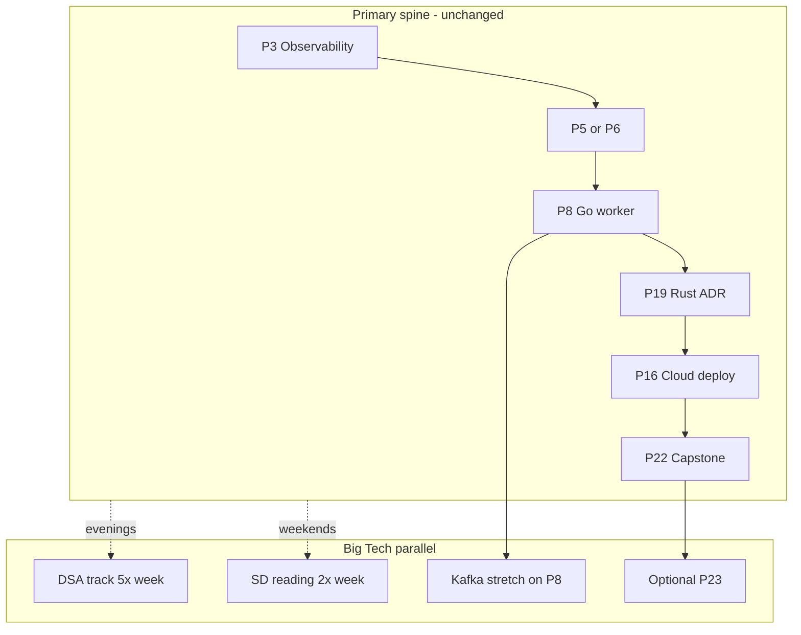

# Big Tech benchmark — Google / Meta / top-tier hiring bar

**Use this:** Benchmark your [22-step path](../../README.md#progression-step-1--22) against **Google, Meta, and similar** backend hiring loops — even if you are not applying there. This doc raises your ceiling; [target-alignment.md](target-alignment.md) remains the primary **UK £80k** execution plan.

**Profile this supports:** Backend & Systems Engineer — PHP/SQL/JS commercial experience + Python, Go, Rust, TypeScript depth + AI/RAG automation.

**Companions:** [DSA interview track](dsa-interview-track.md) · [System design interview map](system-design-interview-map.md) · [Portfolio artifacts template](../templates/portfolio-artifacts.md)

---

## Verdict

Your playbook **over-indexes on production systems skills** (the [five architecture pillars](../concepts/architecture-framework.md): idempotency, queues, observability, SQL tuning, polyglot boundaries) that senior engineers at Google/Meta use daily. It **under-indexes on interview-specific prep**: timed LeetCode-style coding and formal system design drills.

**System design interviews** = narrating **pillar tradeoffs at scale** (fan-out, caching, consistency, sharding vocabulary) on a whiteboard — see [system design interview map](system-design-interview-map.md) as a layer on top of production pillars, not a separate curriculum.

**Execution gap matters more than curriculum gap:** only **3 of 22 labs** are on GitHub; Project 2 still has stub retrieval; no shipped `docs/portfolio/` milestones logged in [PROGRESS.md](../../PROGRESS.md). For any top-tier bar, **shipping Projects 8, 19, 16, and 22** with full portfolio packets is prerequisite.

**Rule:** Do **not** pause the spine for LeetCode. Candidates who only grind DSA without shipped systems fail behavioral and depth rounds.

---

## How Google, Meta, and peers test candidates

| Stage | Google (typical SWE) | Meta (typical SWE) | What they measure |
|-------|----------------------|--------------------|-------------------|
| **Recruiter / resume** | Polyglot backend + scale signals; AI roles want shipped ML features | Similar; strong OSS or internal-scale stories | Credible story + pass the resume bar |
| **Phone screen** | 1 × 45–60 min coding (medium DSA) | 1–2 coding screens | Clean code, complexity analysis, edge cases under time pressure |
| **Onsite** | 4–5 rounds: 2–3 coding, 1–2 system design (L4+), behavioral | 2 coding + 1 system design + behavioral (+ domain for specialist) | DSA fluency **and** tradeoff reasoning |
| **System design** | "Design X at scale" (URL shortener, news feed, chat, rate limiter) | Similar; fan-out, caching, consistency | Requirements → APIs → data model → bottlenecks → failure modes |
| **Behavioral** | "Googleyness" — ambiguity, collaboration, ownership | Impact, move fast, conflict resolution | STAR stories tied to real incidents |
| **Specialist loops** | ML: ML system design + coding; Infra: deeper OS/network | AI infra: training/serving pipelines | [Project 2](../../career-project-specs/02-rag-llm-service.md) / [11](../../career-project-specs/11-llm-web-app-lab.md) help **if shipped with evals** |

### Level calibration (rough)

| Level | Coding bar | System design | Portfolio / experience |
|-------|------------|---------------|------------------------|
| **L3 / E3** (entry–mid) | Medium LeetCode reliably | Basic SD (single service + DB) | 1–2 strong shipped projects |
| **L4 / E4** (mid–senior) | Medium–hard DSA; 45-min designs with capacity estimates | Full distributed designs | Your [£80k milestone](target-alignment.md#80k-ready-milestones) maps here for **narrative**, not coding screen |
| **L5+** | Hard DSA + leadership scope | Staff-level tradeoffs, multi-region | Years of production scale + org impact |

Your commercial PHP/SQL/JS background + playbook spine targets **L4 narrative for backend systems** once shipped. **Coding screen prep is a separate parallel track** — see [DSA interview track](dsa-interview-track.md).

---

## Scorecard: playbook vs Big Tech expectations

| Dimension | Playbook today | Big Tech bar | Gap | Action |
|-----------|----------------|--------------|-----|--------|
| **Distributed reliability** | Strong — idempotency, DLQ, at-least-once (P1, P6, P8) | Core expectation | **None** (conceptual) | Ship labs; cite in SD answers |
| **Observability** | Good — P3, Prometheus on P8 | SLI/SLO, tracing, on-call | **Low** | Add SLO snippet to portfolio artifacts |
| **SQL / data modeling** | Strong — P4, [database-design.md](../concepts/database-design.md) | Sharding, replication lag, CAP nuance | **Low–medium** | Study sharding; [system design map](system-design-interview-map.md) |
| **Messaging at scale** | Redis-first; Kafka/gRPC = stretch | Kafka/PubSub hands-on common | **Medium** | [Big Tech benchmark tier](#big-tech-benchmark-tier) on P6/P8 |
| **K8s / cloud** | P16, P17 | GKE/EKS, IAM, multi-region | **Medium** | Deploy P16 on GCP or AWS |
| **Security** | P9, P20 | OAuth/OIDC, threat modeling | **Medium** | OAuth required on P12 benchmark tier |
| **Algorithms (LeetCode)** | [algorithms-and-data-structures.md](../concepts/algorithms-and-data-structures.md) = design literacy | 150–300 timed problems | **High** | [DSA interview track](dsa-interview-track.md) |
| **System design interview** | Scattered checklists | 15–20 classic problems with diagrams | **Medium–high** | [System design interview map](system-design-interview-map.md) |
| **Behavioral** | Interview lines per spec | 8–12 STAR stories | **Medium** | Section below |
| **Portfolio proof** | Strong template | Live demos, CI badges, measurable perf | **High (execution)** | Finish spine; pin per [target-alignment](target-alignment.md) |

---

## What you already have that Big Tech respects

1. **Webhook → queue → worker pipeline** — payment webhooks, event buses, async fan-out at Meta/Google.
2. **Go vs Rust ADR with p95/RSS** ([P19](../../career-project-specs/19-rust-hot-path-lab.md)) — engineering judgment, not language religion.
3. **RAG with eval JSONL** ([P2](../../career-project-specs/02-rag-llm-service.md)) — AI-adjacent backend roles.
4. **SQL plan-backed tuning** ([P4](../../career-project-specs/04-sql-performance-lab.md)) — stronger than ORM-only candidates.
5. **Capstone orchestration** ([P22](../../career-project-specs/22-integrated-platform-capstone.md)) — "design a platform" in one demo.

**Interview narrative (Big Tech version):**

> "I built an event-driven platform: signed webhook ingress with idempotent ack, Redis/Kafka-style queue semantics, Go workers with bounded concurrency and Prometheus metrics, Python RAG with regression evals, Rust hot-path reimplementation with measured tradeoffs, deployed on K8s with health checks and distributed tracing."

Credible **L4 backend** story **once shipped**.

---

## Big Tech benchmark tier

Optional upgrades to existing specs — **not** new linear steps. Complete after the relevant spine project is green.

| Spec | UK £80k (default) | Big Tech benchmark tier |
|------|-------------------|-------------------------|
| [P2 RAG](../../career-project-specs/02-rag-llm-service.md) | Eval JSONL + stub OK to start | Remove `_stub_answer`; real retrieval + eval regression numbers |
| [P6 Async worker](../../career-project-specs/06-async-worker-stretch.md) | Redis or Laravel queue | **Kafka** (or GCP Pub/Sub) deployment path with same idempotency/DLQ semantics |
| [P8 Go worker](../../career-project-specs/08-go-retrieval-worker-lab.md) | Redis + REST JSON | **Kafka consumer** + **gRPC** internal API + **OpenTelemetry** traces Python↔Go |
| [P12 Auth](../../career-project-specs/12-multi-tenant-auth-lab.md) | JWT/session + tenant isolation | **OAuth/OIDC** (Google sign-in) + tenant mapping on first login |
| [P16 Cloud deploy](../../career-project-specs/16-cloud-deploy-lab.md) | Compose + one managed target | Deploy to **GCP or AWS** (not local-only); document **IAM least-privilege** |

### Optional projects (after P8 or P22)

| ID | Project | Why Big Tech cares |
|----|---------|-------------------|
| [P23](../../career-project-specs/23-rate-limiter-gateway-lab.md) | Distributed rate limiter + API gateway slice | Top-5 system design question |
| [P24](../../career-project-specs/24-notification-fanout-lab.md) | Notification fan-out service | Classic Meta/Google SD problem |
| [P25](../../career-project-specs/25-search-autocomplete-lab.md) | Search/autocomplete microservice | Trie + inverted index; complements RAG |

**P24 is highest ROI** — reuses idempotency/DLQ spine; maps to "design a notification system."

---

## Dual-track roadmap

| Phase | Spine | Parallel |
|-------|-------|----------|
| **1 (0–3 mo)** | P3 → P6 → P8 + portfolio artifacts | DSA: easy/medium (arrays, hash maps, two pointers) — [DSA track](dsa-interview-track.md) |
| **2 (3–6 mo)** | P19 + P16 | DSA: trees, graphs, heaps; Kafka stretch on P8; SD: rate limiter, URL shortener on paper |
| **3 (6–12 mo)** | P22 capstone; optional P24 | DSA: medium/hard maintenance; mocks (Pramp, interviewing.io); P12 OAuth benchmark tier |

---

## Behavioral prep

Mine **8–12 STAR stories** from commercial PHP work + future lab incidents. Template:

| Field | Content |
|-------|---------|
| **Situation** | Context in 2–3 sentences |
| **Task** | Your specific responsibility |
| **Action** | What **you** did (not the team) |
| **Result** | Metric or concrete outcome |

### Story themes (Google "Googleyness" / Meta impact)

| Theme | Source ideas |
|-------|--------------|
| **Ownership** | On-call incident you drove to resolution; DLQ replay you designed (P6/P15) |
| **Ambiguity** | Chose queue vs sync path under unclear SLA (P1/P6 ADR) |
| **Collaboration** | Cross-team API contract negotiation (P5 OpenAPI) |
| **Growth mindset** | Go vs Rust ADR — measured, changed mind with data (P19) |
| **Conflict / tradeoff** | Performance vs complexity; shipped simpler path first |
| **Impact** | Reduced p95, prevented duplicate charges, eval regression caught prod drift (P2/P4) |

Log story drafts in [PROGRESS.md](../../PROGRESS.md) when you complete a lab milestone — tie each to a real artifact or commercial incident.

---

## Career prospects summary

| Target | Readiness today | After £80k milestone | After benchmark additions |
|--------|-----------------|----------------------|---------------------------|
| UK fintech backend (£80k) | Path aligned; execution early | **Interview-ready** | Over-qualified on paper |
| UK infra Rust/Go scale-up | Strong curriculum | Competitive with portfolio | Strong |
| Google/Meta L3–L4 backend | Coding screen gap; 3/21 shipped | Narrative ready; need DSA + SD drills | Competitive if DSA + Kafka/cloud shipped |
| Google/Meta L5+ | Not targeted | Partial | Needs years of production scale scope |

---

## See also

- [Target alignment (UK £80k)](target-alignment.md) — primary execution plan
- [DSA interview track](dsa-interview-track.md) — parallel LeetCode curriculum
- [System design interview map](system-design-interview-map.md) — classic problems ↔ labs
- [Messaging and RPC](../concepts/messaging-and-rpc.md) — Kafka vs Redis interview lines
- [Algorithms and data structures](../concepts/algorithms-and-data-structures.md) — design-review literacy
