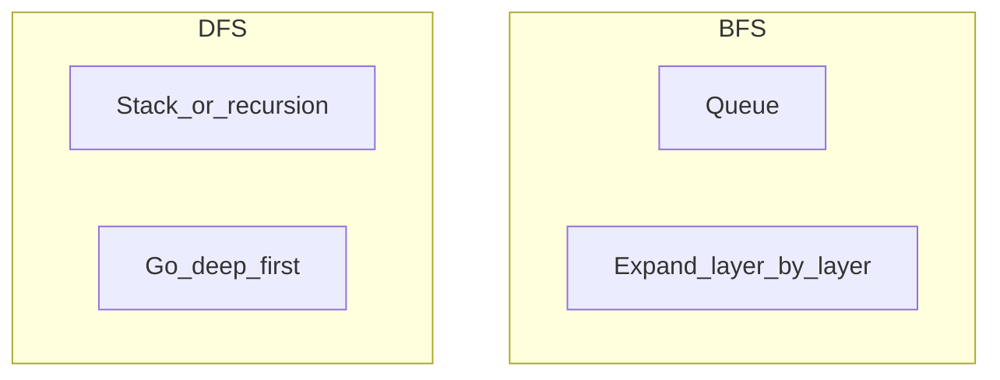

# Algorithms and data structures

Interview- and design-review-grade literacy: **how work and memory scale**, **which structure fits which access pattern**, and **how to talk about it** when libraries or AI supply the code. Companion to [Software engineering](software-engineering.md).

**See also:** [Database design — Indexes](database-design.md#indexes) for B-trees and index tradeoffs in storage engines.

---

## How to use this doc

This handbook builds from naming structures and knowing typical operation costs, through tradeoffs (memory versus speed, average versus worst case), to knowing when *not* to optimize asymptotically. Read sections in order when learning; jump to a structure when you need a refresher during a lab or interview.

---

## Why this still matters (including with AI)

Asymptotic complexity is a **language for bounds**: whether a path is safe at 10³ versus 10⁹ items, whether you are doing extra passes, whether you are trading memory for time. Generated code can be **asymptotically fine** or **accidentally quadratic**; you still choose structures, spot hot loops, and explain choices to teammates and interviewers.

**When Big-O is load-bearing in production:** request handlers, batch jobs, data pipelines, anything that runs **per item** at scale, or holds large in-memory graphs. **When libraries are enough:** most app code — use your language's `dict`, `list`, `PriorityQueue`, and standard sorts; optimize after measurement.

---

## Time and space complexity

### Big-O is scaling, not seconds

**Big-O** describes how cost grows as input size `n` grows — **up to constant factors**. A fast O(n²) algorithm may beat a slow O(n log n) for tiny `n`; the notation tells you what happens when `n` gets large.

**Worst versus average:** Interview answers are usually **worst case** unless the problem says otherwise. **Hash tables** are O(1) average for lookup but **O(n)** worst if everything collides — still the right tool when keys are well distributed.

**Amortized:** Some operations are occasionally expensive but rare **when spread over many steps**. **Appending** to a dynamic array is usually O(1) **amortized** because doubling capacity pays for rare O(n) copies.

### Space

**Auxiliary space** is extra memory beyond storing the input/output **as given** (often what interviews mean by "space"). **Total space** includes the output itself. **Recursion** uses **O(depth)** stack frames — deep trees can blow the stack even if heap memory is fine.

### Common growth classes (recognition)

| Class | Meaning | Example situation |
|--------|---------|-------------------|
| **O(1)** | Constant | Hash lookup (average), index into array, peek heap top |
| **O(log n)** | Halve or narrow | Balanced Binary Search Tree (BST) search, binary search, B-tree probe |
| **O(n)** | One pass | Scan array, build hash map of counts, Breadth-First Search (BFS)/Depth-First Search (DFS) visiting each edge once (sparse graph) |
| **O(n log n)** | Divide-and-conquer or good sorts | Mergesort/heapsort, many "sort then scan" pipelines |
| **O(n²)** | Pairs or nested loops on `n` | Naive "all pairs," some Dynamic Programming (DP) tables |
| **O(2ⁿ)** | Exhaustive subsets | Trying every subset of `n` items — explodes fast |

### Reading loops (practical)

When you see a sequential loop over `n` elements with O(1) work per iteration, the total is O(n). Nested loops both running to `n` are often O(n²) — verify the inner work is not itself O(n). A loop that halves `i` each step (`i = n; while i > 1: i //= 2`) runs O(log n) iterations. "Sort then one pass" is O(n log n) + O(n), which simplifies to O(n log n).

---

## Data structures

### Array, dynamic array, list (contiguous)

An array stores elements in order at contiguous indices. A dynamic array grows by reallocation when full. Index read and write are **O(1)**; append is **O(1) amortized**; insert or delete in the middle is **O(n)** because elements must shift. Arrays are the default for sequences, cache-friendly scans, and queues built on ring buffers. In production you see them as buffers, JSON arrays, column chunks, and most "just a list" in application code.

The sketch below shows how a dynamic array doubles capacity when full — the occasional O(n) copy is amortized across many cheap appends:

```python
def append(arr, x, size, cap):
    if size == cap:
        cap = max(1, cap * 2)
        arr = arr + [None] * (cap - len(arr))  # conceptual grow
    arr[size] = x
    size += 1
    return arr, size, cap
```

When `size == cap`, the array is full. Capacity doubles (or starts at 1), a new backing store is allocated, and the element is written at index `size`. The `size` counter tracks how many slots are in use versus total capacity.

---

### Linked list

A linked list stores nodes with pointers; order exists without contiguous memory. Insert or delete at a known node pointer is **O(1)**; finding the k-th element is **O(n)**; cache locality is worse than arrays. Use linked lists when you frequently insert or delete in the middle **and** already hold node references — for example an Least Recently Used (LRU) cache combining a list with a hash map. You see them in LRU eviction lists, kernel schedulers, and functional-style persistent lists.

```python
class Node:
    def __init__(self, val, next=None):
        self.val = val
        self.next = next

# prepend: O(1)
head = Node(42, head)
```

Each `Node` holds a value and a pointer to the next node. Prepending creates a new head in constant time — no shifting required.

---

### Stack (Last In, First Out — LIFO)

A stack pushes and pops from one end only. Both operations are **O(1)**. Stacks suit parsing (brackets, expressions), explicit DFS, undo stacks, and modeling recursive call semantics. Expression evaluators, bytecode virtual machines, browser history "back," and depth-first traversals all use stack behavior.

---

### Queue (First In, First Out — FIFO) and deque

A **queue** enqueues at the rear and dequeues from the front. A **deque** (double-ended queue) supports efficient operations at both ends — **O(1)** when implemented with a ring buffer or doubly linked structure. Queues drive BFS, fair work distribution, rate smoothing, and ordered event processing. Job queues (often backed by Redis, Amazon Simple Queue Service (SQS), or RabbitMQ), streaming windows, and level-order tree walks are common examples.

---

### Hash map and hash set

A hash map maps keys to values; a hash set tracks key presence. Both use a hash function plus bucket array. Insert, lookup, and delete are **O(1) average** but **O(n)** worst case under heavy collision. Use them for counting, deduplication, caching by id, and "have I seen this?" when sorted order is not required.

```python
def naive_hash(key: str, buckets: int) -> int:
    return sum(ord(c) for c in key) % buckets

# bucket[slot] holds a short list of (key, value) on collision
```

The hash function maps a string key to a bucket index. On collision, the bucket holds a short list of key-value pairs — this is simplified **chaining**. Production hash maps use better hash functions and open addressing, but the average-case O(1) intuition is the same. Language `dict`/`Map`/`HashMap`, caches, in-memory indexes, and API route tables all rely on this pattern.

---

### Trees and balanced BST (conceptual)

A tree is hierarchical ordering; a **BST** keeps left children smaller and right children larger. Search and insert cost **O(h)** where `h` is height — **O(log n)** when **balanced** (AVL, red-black) but degrading to **O(n)** if skewed. Trees suit ordered iteration and range queries **in memory**. File systems and databases use **B-trees** on disk — wider nodes, fewer seeks — see [Indexes](database-design.md#indexes). `TreeSet`/`sorted map` types, interval trees, Document Object Model (DOM)/XML trees, and syntax trees are everyday examples.

**B-tree intuition (disk):** Shallow, **wide** nodes keep more keys per read; minimizing disk seeks beats raw CPU on storage. Details stay in the database doc.

---

### Heap / priority queue

A binary heap is a complete tree with the **heap property** (parent ≥ or ≤ children depending on min/max variant). Insert is **O(log n)**; peek min/max is **O(1)**; pop is **O(log n)**. Heaps suit "top k," schedulers (next due task), merging sorted streams, and Dijkstra's algorithm with a priority queue. Heaps are often stored in an array: node `i` has children at `2i+1` and `2i+2`; sift up or down after push/pop. Operating system schedulers, event loops with earliest deadline, and bandwidth limiters use heap-like structures.

---

### Trie (prefix tree)

A trie stores strings as paths from root — edges labeled with characters, shared prefixes share nodes. Insert and prefix lookup cost **O(L)** for string length `L`. Tries suit autocomplete, IP longest-prefix routing (conceptually), censored-word filters, and many short strings with shared prefixes.

```python
root = {}

def trie_insert(trie, word):
    node = trie
    for ch in word:
        node = node.setdefault(ch, {})
    node["$"] = True  # end marker
```

Each character walks deeper into nested dictionaries. The `"$"` key marks a complete word. Routers, search suggestions, and some config/key namespaces use tries.

---

### Graph representations

An **adjacency list** maps each vertex to a list of neighbors — **O(V + E)** space for sparse graphs with fast neighbor iteration. An **adjacency matrix** is a `V × V` table — **O(V²)** space with **O(1)** edge lookup between two vertices. Lists **almost always** win for sparse graphs (web links, social graphs, dependencies). Matrices help when graphs are **very dense** or you need all-pairs tricks at small V. Dependency resolution, network topology, recommendation subgraphs, and CI task graphs are graph problems in production.

---

### Bloom filter and bitmap (vocabulary)

A **Bloom filter** is a probabilistic set membership structure — it **may say "maybe yes," never false "no"** (with tuned false positive rate), using bits plus multiple hash functions. A **bitmap / bitset** is a dense set of integers in a range with fast **union/intersection** for analytics. Bloom filters suit "probably seen before" at huge scale (Content Delivery Network (CDN), database internals) with acceptable false positives. Bitmaps suit feature flags or slot allocation. Cassandra/Scylla hints, CDN-style caches, and browser safe-browsing filters (simplified) use these ideas.

---

## Algorithm families (recognition + when to suggest)

### Sorting

**Comparison sorts** (mergesort, heapsort, typical `sort()`) are **O(n log n)** worst case. **Stable** sort keeps equal keys' relative order — matters for multi-key sorts. **Linear-time sorts** when keys are **bounded integers or small alphabet** (counting sort, radix sort) run in **O(nk)** — know they exist for interview variety. Sort when you need ordered output, deduplication after sort, a binary search precondition, or joining sorted streams.

### Binary search

Binary search halves a **sorted** range each step → **O(log n)**. Use it for lookup in sorted arrays and for **"search on answer"** problems (minimum feasible capacity, earliest time) when a predicate is **monotonic** in the domain.

### Two pointers and sliding window

**Two pointers** often solve sorted-array pair sums, merging sorted lists, and palindrome scans — avoiding O(n²) recomputation. **Sliding window** handles contiguous subarray/substring problems with a **constraint** (max sum ≤ K, unique characters) — often **O(n)** when you only advance window ends.

### BFS and DFS

**BFS (queue):** Explores **layer by layer**; finds **shortest path in unweighted** graphs; processes closest nodes first.

**DFS (stack or recursion):** Goes **deep** first; used for cycle detection (with colors), topological sort on Directed Acyclic Graphs (DAGs), and exhaustive layouts.



The diagram contrasts traversal order: BFS uses a queue to expand layer by layer; DFS uses a stack or recursion to go deep before backtracking. Use BFS for grid puzzles, unweighted shortest paths, and connected components. Use DFS for cycle detection, topological ordering, and path existence (weighted shortest path needs Dijkstra or A* instead).

### Greedy versus dynamic programming

**Greedy** picks the locally best choice; it works only when the **problem has greedy-choice property** (e.g. some interval scheduling). It is fast and simple **when valid**. **DP** applies when subproblems **overlap** and optimal substructure holds — table or memoization, often **O(n²)** or similar. Know the **shape** ("knapsack-like," edit distance) more than every variant. In interviews: brute force → spot repeated subproblems → memo/table; or prove greedy on a small example.

---

## Interview and design discussion flow

Walk through problems in this order: clarify constraints, size of `n`, sorted input, memory limits, stability needs. Walk a tiny example on the board. State brute force with complexity to establish a ceiling. Optimize by picking a structure (hash map, heap, two pointers) and **justify** why complexity improves. Cover edge cases: empty input, one element, duplicates, overflow, recursion depth. Write at least one normal test, one edge test, and one larger sanity check.

In **system design**, use the same vocabulary: "That's linear scan per request; if the fan-out grows…" or "We can bound membership with a Bloom filter if false positives are OK."

---

## Quick reference

**Structures → access pattern:** random by index → array; by key → hash map; min/max repeatedly → heap; ordering/ranges → tree or sort+search; prefixes → trie; relationships → graph (usually list).

**Patterns → shapes:** sorted + target → binary search; contiguous constraint → sliding window; unweighted shortest → BFS; exhaustive structures → DFS + pruning.
