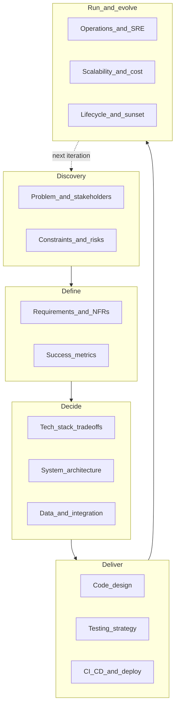

# Real-world system architecture checklist

A **complete questionnaire** for designing and shipping software in production — greenfield or brownfield, startup or enterprise. Work top-to-bottom for a new system; skip sections marked N/A and revisit as you scale.

**Companion:** [Architecture framework](architecture-framework.md) (five pillars) · [SDLC playbook map](sdlc-playbook-map.md) · [Production readiness](../../checklists/production-readiness.md) · [Portfolio artifacts](../templates/portfolio-artifacts.md) · [Software engineering handbook](software-engineering.md)

**How to use:** Treat each bullet as a question. For irreversible forks, write a one-page **Architecture Decision Record (ADR)** (context → decision → consequences). For ship gates, require explicit answers — not "TBD."



---

## Phase 0 — Context and stakeholders (before feasibility)

Often skipped; causes rework when politics, compliance, or org structure contradict the design.

**Stakeholders**
- Who is the sponsor, product owner, and on-call owner?
- Who are the consumers: end users, internal teams, partners, regulators?
- Who must approve architecture, security, and spend?

**Organizational fit (Conway's law)**
- How many teams will own this? One team → monolith bias; many teams → clearer service boundaries.
- What is the existing platform (cloud account, Kubernetes (K8s) cluster, shared auth, observability stack)?
- Build on platform standards or justify an exception?

**Brownfield vs greenfield**
- What systems must we integrate with, replace, or coexist with during migration?
- What is the strangler-fig / parallel-run strategy if replacing legacy?
- What technical debt in adjacent systems becomes our problem?

**Documentation deliverables (plan upfront)**
- Architecture diagram (C4 context + container minimum)
- ADRs for major forks
- Runbooks for on-call
- API/event contract (OpenAPI, protobuf, AsyncAPI)
- Threat model summary
- Data classification matrix

---

## Phase 1 — Feasibility — "Should we build this?"

**Problem and value**
- What pain are we solving? For whom? How do we know it matters (data, interviews, revenue)?
- What happens if we do nothing for 6–12 months?
- What is the **smallest credible release** (minimum viable product (MVP)) vs v2 vs never?
- Build, buy (Software as a Service (SaaS)), integrate (integration Platform as a Service (iPaaS)), or hybrid?

**Constraints**
- Budget (build + run), timeline, headcount, and skill gaps?
- Regulatory: General Data Protection Regulation (GDPR), Health Insurance Portability and Accountability Act (HIPAA), Payment Card Industry Data Security Standard (PCI-DSS), System and Organization Controls 2 (SOC 2), industry-specific rules?
- Data residency: must data stay in EU/UK/US region?
- Existing contracts, Service Level Agreements (SLAs) with partners, or vendor lock-in?

**Risk and reversibility**
- Which decisions are **expensive to reverse**? (database, tenancy model, public API, broker, auth provider, cloud)
- What is the cheapest experiment to kill the riskiest assumption?
- What is explicitly **out of scope** for v1?
- What are the top 3 project-killer risks and mitigations?

**Economic feasibility**
- Rough total cost of ownership (TCO): compute, storage, egress, third-party APIs, support/on-call cost?
- Revenue or cost-avoidance model — when does this pay for itself?
- Operating expenditure (op-ex) vs capital expenditure (cap-ex); reserved vs on-demand pricing assumptions?

**Feasibility gate**
- Can we ship a **modular monolith** first, or is distributed shape required day one?
- Do we have skills to **operate** what we build (not just build it)?
- Go / no-go criteria documented?

---

## Phase 2 — Requirements — "What must stay true?"

**Scope**
- Success criteria in **observable** terms (metrics, SLAs, user outcomes)?
- Non-goals and deferred scope?
- Actors, personas, and permission levels?
- Happy path + top unhappy paths (errors, abuse, partial failure)?

**Functional requirements**
- Read vs write operations; which are side-effecting?
- Real-time vs batch vs near-real-time expectations per feature?
- Offline / degraded-mode behavior required?
- Multi-tenant: business-to-business (B2B) SaaS isolation level (logical, Row-Level Security (RLS), dedicated database)?
- Audit trail: who did what, when, immutable log?

**Non-functional requirements (NFRs)**
- Availability target (e.g. 99.9%) and error budget?
- Latency: p50/p95/p99 per user-facing path?
- Throughput: peak queries per second (QPS), events/sec, concurrent users?
- Durability: Recovery Point Objective (RPO) / Recovery Time Objective (RTO) for data loss and recovery time?
- Retention: how long is data kept; right-to-erasure (GDPR)?
- Security boundary: public internet, virtual private network (VPN), private link?

**Compliance and privacy**
- What data is personally identifiable information (PII) / sensitive? Classification per field?
- Consent, purpose limitation, data minimization?
- Encryption at rest and in transit requirements?
- Access logging and who can view production data?

**Contracts and evolution**
- Source of truth for API/event schema?
- Breaking-change detection in Continuous Integration (CI)?
- Versioning: URL (`/v1`), header, or schema registry?
- Backward compatibility window for consumers?

**Acceptance**
- Definition of done per milestone?
- Who signs off: product, security, ops?

---

## Phase 3 — Tech stack and platform tradeoffs

Decisions here should be **evidence-based** (team skills, NFRs, ecosystem) — not resume-driven. Document rejected options in ADRs.

### Application language / runtime

| Factor | Questions |
|--------|-----------|
| Team | What does the team know today? Hiring pool? |
| Workload | CPU-bound, I/O-bound, machine learning (ML), real-time, scripting? |
| Ecosystem | Libraries, frameworks, Object-Relational Mapping (ORM), observability agents? |
| Performance | Need p99 guarantees before choosing "fast" language? |
| Operability | Static binary vs interpreted; memory footprint; garbage collection (GC) pauses? |

**Common tradeoffs**
- **Python:** fast iteration, ML/Artificial Intelligence (AI) ecosystem; Global Interpreter Lock (GIL), slower hot paths unless offloaded.
- **Node/TypeScript:** I/O-heavy APIs, full-stack TypeScript (TS); CPU-heavy work off hot path; event-loop blocking risk.
- **Go:** throughput, concurrency, single binary deploy; less expressive for complex domain models.
- **Java/Kotlin/C#:** enterprise maturity, Java Virtual Machine (JVM) tooling; heavier runtime, ceremony.
- **Rust:** memory safety, predictable latency; steeper learning curve, slower feature velocity.
- **PHP/Ruby:** rapid web CRUD; less common for new distributed systems (still valid for ingress/content management system (CMS)).

**Rule:** one primary language per service; split by **measured** boundary, not preference.

### Frontend (if applicable)

- Single-page application (SPA) (React/Vue/Svelte) vs server-side rendering (SSR) (Next/Nuxt) vs server-rendered (Rails/Laravel)?
- Mobile: native vs cross-platform (React Native/Flutter)?
- Real-time: polling, Server-Sent Events (SSE), WebSocket — reconnect and backpressure?
- Accessibility (Web Content Accessibility Guidelines (WCAG) level)? Internationalization (i18n/l10n)?

### Data stores

| Store | Good for | Watch out for |
|-------|----------|---------------|
| **PostgreSQL** | Default relational; JSON, full-text search (FTS), pgvector | Connection limits; migration discipline |
| **MySQL/MariaDB** | Web CRUD, read-heavy | Feature gaps vs Postgres for advanced types |
| **SQLite** | Edge, dev, embedded, low traffic | Single writer; not for multi-instance writes |
| **Redis** | Cache, session, rate limit, simple queue | Durability modes; memory cost; hot keys |
| **MongoDB** | Flexible schema, document model | Joins, transactions, schema drift |
| **Elasticsearch/OpenSearch** | Full-text search, log analytics | Operational complexity; mapping explosions |
| **ClickHouse/BigQuery** | Analytics online analytical processing (OLAP) | Not online transaction processing (OLTP) substitute |
| **S3/object storage** | Files, backups, data lake | Consistency model; lifecycle policies |
| **Vector DB** (Pinecone, pgvector, etc.) | Embeddings/Retrieval-Augmented Generation (RAG) | Freshness, cost, hybrid search strategy |

**Questions**
- OLTP vs OLAP split needed?
- Strong consistency required or eventual consistency acceptable?
- Read replicas, caching layer, Command Query Responsibility Segregation (CQRS) read models?
- Backup, point-in-time recovery, restore tested?

See [Database design](database-design.md) for depth.

### Messaging and async

| Broker | Good for | Tradeoff |
|--------|----------|----------|
| **DB outbox** | Same-transaction enqueue; small scale | Polling lag; DB load |
| **Redis** | Dev, moderate throughput, simplicity | Durability; not a long-term event log |
| **RabbitMQ** | Enterprise routing, classic queues | Ops maturity varies |
| **Kafka/Pulsar** | High throughput, replay, event log | Operational complexity |
| **SQS/SNS/Pub-Sub** | Managed cloud, less ops | Vendor semantics (visibility timeout) |
| **NATS** | Lightweight pub/sub, edge | Ecosystem smaller than Kafka |

**Questions**
- At-most-once, at-least-once, or effectively-once (via idempotency)?
- Ordering guarantees per key/partition?
- Dead Letter Queue (DLQ), replay, poison message handling?
- Transactional outbox vs dual-write?

See [Messaging and RPC](messaging-and-rpc.md) and [integration hardening](../../checklists/integration-hardening.md).

### API and integration styles

| Style | Good for | Tradeoff |
|-------|----------|----------|
| **REST + OpenAPI** | Public/partner, human debuggable | Chatty; no streaming native |
| **gRPC + protobuf** | Internal service-to-service (S2S), strong typing | Browser needs gateway |
| **GraphQL** | Flexible client queries | N+1, complexity, caching harder |
| **Webhooks** | Partner push events | Signature, replay, idempotency |
| **WebSocket/SSE** | Real-time push | Connection scaling, state |
| **SOAP/OData** | Legacy enterprise | Still in brownfield integrations |
| **iPaaS** (Boomi, n8n, Zapier) | Low-code integration | Vendor limits, observability gaps |

**Questions**
- Sync vs async per integration edge?
- Timeout and retry policy; circuit breaker?
- Idempotency keys and duplicate delivery?
- Partner rate limits and backoff?

### Cloud and infrastructure

| Choice | Questions |
|--------|-----------|
| **Cloud vs on-prem vs hybrid** | Compliance, latency, existing investment? |
| **AWS / GCP / Azure** | Team certs, managed services, egress cost, region availability? |
| **Kubernetes vs PaaS vs VMs** | Who runs the control plane? Multi-tenancy needs? |
| **Serverless** (Lambda, Cloud Functions) | Cold start, timeout limits, vendor lock-in, cost at scale? |
| **Containers** | Image scanning, resource limits, graceful shutdown? |
| **Infrastructure as Code (IaC)** (Terraform, Pulumi, CloudFormation) | State backend, drift detection, module reuse? |
| **Edge/Content Delivery Network (CDN)** | Static assets, Web Application Firewall (WAF), DDoS, geo latency? |

**Questions**
- Multi-region active-active vs active-passive vs single region?
- Network: virtual private cloud (VPC) design, private endpoints, service mesh needed?
- Secrets: vault, rotation, least-privilege Identity and Access Management (IAM)?
- Cost alerts and tagging strategy?

### Auth and identity

| Approach | Good for | Tradeoff |
|----------|----------|----------|
| **Session + cookie** | Traditional web apps | Cross-Site Request Forgery (CSRF), sticky sessions, scale |
| **JSON Web Token (JWT) (stateless)** | APIs, microservices | Revocation, size, claim design |
| **OAuth2/OpenID Connect (OIDC)** | Social/login, delegated auth | Complexity, redirect flows |
| **Security Assertion Markup Language (SAML)** | Enterprise single sign-on (SSO) | Legacy, XML heaviness |
| **API keys + Hash-based Message Authentication Code (HMAC)** | Partner/webhook integrations | Rotation, scope design |
| **mutual Transport Layer Security (mTLS)** | Service-to-service zero trust | Certificate lifecycle |

**Questions**
- Authentication (authn) (who) vs authorization (authz) (what) — role-based access control (RBAC), attribute-based access control (ABAC), tenant scoping on every path?
- Identity provider: Auth0, Cognito, Keycloak, Entra ID, roll-your-own?
- Multi-factor authentication (MFA), password policy, account recovery abuse?

### Observability stack

- Logs: structured JSON, centralized (ELK, Loki, CloudWatch)?
- Metrics: Prometheus, Datadog, CloudWatch — cardinality limits?
- Traces: OpenTelemetry, sampling strategy?
- Service Level Indicator (SLI) / Service Level Objective (SLO) / error budget policy?
- On-call paging: PagerDuty, Opsgenie — what wakes someone at 3am?

### AI / ML (if applicable)

- Model hosting: API (OpenAI, Anthropic) vs self-hosted vs hybrid?
- RAG: chunking, embedding model, vector store, freshness?
- Eval sets and regression for non-deterministic outputs?
- Guardrails: PII leakage, prompt injection, tool use boundaries?
- Cost per request; caching embeddings/responses?
- Latency budget: sync in request path vs async job?

See [LLM feature ship](../../checklists/llm-feature-ship.md) when shipping user-facing AI paths.

**Tech stack gate:** Every major choice has a one-paragraph **why not the alternative** in an ADR.

---

## Phase 4 — Architectural design

Draw **one diagram** before coding. Tag decisions to the [five pillars](architecture-framework.md#the-five-pillars):

1. **System shape** — boundaries, sync vs async, ownership
2. **Integration** — delivery semantics, contracts, retries
3. **Data** — schema, consistency, tenancy
4. **Performance** — hot paths, caching, language splits
5. **Reliability & ops** — failure modes, security, deploy

### System shape

- Where does synchronous request/response end and durable async work begin?
- Service boundaries: who owns which datastore (no shared DB anti-pattern across services)?
- Modular monolith vs microservices — what **metric** triggers a split?
- Backend-for-frontend (BFF) needed for web/mobile?
- Event-driven vs request-driven — eventual consistency acceptable where?
- CQRS / event sourcing — justified or overkill?
- For AI: ingress, retrieval, inference, post-processing — separate services?

**Patterns to consider:** layered, hexagonal, clean/onion, event-driven ([architectural patterns](software-engineering.md#architectural-patterns)).

### Integration architecture

- Message flow diagram: producer → broker → consumer → DLQ
- Idempotency: key source, store, time-to-live (TTL), response on duplicate
- Retry: which errors, max attempts, exponential backoff + jitter
- Timeouts nested: client ≤ upstream ≤ job deadline
- Saga / compensation for distributed transactions?
- Schema evolution for events (additive-only, version field, compatibility mode)
- Third-party dependency failure: degrade, queue, fail?

### Data architecture

- Entity-relationship (ER) model; aggregate roots and transaction boundaries
- Normalization vs denormalization for read paths
- Index strategy for hot queries (`EXPLAIN` evidence)
- Migrations: forward-only, expand-contract, zero-downtime pattern
- Multi-tenancy: shared DB + filter, RLS, schema-per-tenant, DB-per-tenant
- Caching: cache-aside, write-through, invalidation, stampede protection
- Search: DB FTS vs dedicated engine; sync vs async indexing
- File/blob storage and CDN strategy
- Data pipeline: extract-transform-load (ETL) / extract-load-transform (ELT), Change Data Capture (CDC) if analytics needed

### Performance architecture

- Capacity estimate: users × actions → QPS; ×10 for peak
- Storage estimate: records × bytes × retention
- What is the **hot path**? Profile before optimizing.
- Rate limiting: edge (API gateway) vs service vs both?
- Connection pooling, N+1 query prevention
- Fan-out on read vs write (feeds, notifications)
- CDN, edge caching, geographic latency

See [Memory and performance](memory-and-performance.md).

### Reliability, security, operations (design-time)

- Name **≥3 failure modes** and mitigations before ship
- Partial outage behavior: graceful degradation vs fail closed?
- Blast radius: bulkhead, circuit breaker, timeout everywhere
- Threat model: STRIDE or similar — assets, trust boundaries, mitigations
- Open Web Application Security Project (OWASP) top risks relevant to your surface (injection, broken auth, Cross-Site Scripting (XSS), Server-Side Request Forgery (SSRF), etc.)
- Secrets never in code/logs; key rotation plan
- Backup/restore tested; disaster recovery (DR) runbook (RPO/RTO)
- Compliance controls mapped to design (encryption, audit log, access reviews)

---

## Phase 5 — Code design — "How do modules stay coherent?"

**Structure and domain**
- Where do business invariants live (domain layer, not controllers)?
- Bounded contexts and ubiquitous language per module?
- Domain-Driven Design (DDD) aggregates where domain is complex; avoid anemic domain model
- Dependency rule: inner layers never import HTTP/ORM details

**SOLID and pragmatism**
- Single responsibility per module — but avoid god-class fragmentation
- Interface stability: depend on abstractions at integration seams only
- When does duplication beat premature abstraction?

**Concurrency and resilience**
- Shared mutable state eliminated or guarded?
- Worker pools and bounded concurrency (not unbounded goroutines/threads)
- Idempotent handlers safe under parallel delivery
- Don't block the event loop / main thread on I/O or CPU work

**Cross-cutting code concerns**
- Error handling: typed errors, consistent HTTP/problem+json shape
- Configuration: 12-factor env vars; no secrets in repo
- Logging at boundaries; correlation ID propagation
- Feature flags for risky paths

**Anti-pattern scan**
- God object, deep inheritance, N+1, premature microservices, distributed monolith, chatty S2S calls

**Code review and docs**
- Pull request (PR) size and review checklist
- ADR for every significant fork
- README: local dev, smoke test, common ops commands

---

## Phase 6 — Testing — "What must never regress?"

**Strategy**
- What invariants are non-negotiable (tenant isolation, payments, auth, idempotency)?
- Test pyramid: many unit, fewer integration, few end-to-end (E2E)
- What runs on every PR vs nightly vs pre-release?

**By layer**
- **Unit:** pure logic, validators, pricing rules — public API only
- **Integration:** HTTP + real DB/queue (containers); migrations
- **Contract:** OpenAPI/protobuf consumer tests; schema registry compatibility
- **E2E:** critical user journeys only; avoid flaky UI over-reliance
- **Performance:** load test baseline; regression on p95
- **Security:** Static Application Security Testing (SAST) / Dynamic Application Security Testing (DAST), dependency scan, OWASP repro scripts
- **Chaos/resilience:** kill dependency, verify circuit breaker (mature teams)
- **AI/ML:** eval JSONL + golden sets; separate from deterministic unit tests

**Test data and environments**
- Reproducible fixtures; no production data in lower envs
- PII-safe synthetic data
- Testcontainers or dedicated test DB — not shared mutable state

See [Per-project testing](per-project-testing.md) for lab-specific emphasis and [production readiness](../../checklists/production-readiness.md) for the ship gate.

**Release gate checklist (production readiness)**
- [ ] Retries safe with idempotency
- [ ] DLQ path for poison messages
- [ ] Structured logs + correlation ID on every request path
- [ ] At least one operational metric beyond "it works"
- [ ] Health/readiness endpoints
- [ ] Secrets externalized; threat notes documented
- [ ] API/event versioning story
- [ ] Rate limits on public/partner endpoints (if applicable)
- [ ] Timeouts nest correctly
- [ ] Rollback tested

---

## Phase 7 — Deployment and release

**CI/CD pipeline**
- Stages: lint → unit → integration → build artifact → deploy
- What blocks merge vs blocks promote to prod?
- Branch strategy: trunk-based vs GitFlow?
- Artifact immutability: tagged images, signed builds?

**Environments**
- Dev / staging / prod parity — what differs intentionally?
- Ephemeral preview envs per PR?
- Data in staging: sanitized subset or synthetic?

**Deploy strategies**
- Rolling, blue/green, canary — which and rollback in one step?
- Database migrations: backward-compatible expand phase?
- Feature flags: decouple deploy from release?
- Maintenance windows required?

**Infrastructure**
- IaC for all prod resources?
- Config per environment; no manual prod clicks
- Resource limits, autoscaling rules, min/max instances
- Graceful shutdown: drain connections, finish in-flight work

**Pre/post deploy**
- Smoke tests hit health URL and critical path
- Deployment notifications and change log
- Rollback criteria: error rate, latency, business metric

See [CI/CD and delivery](software-engineering.md#cicd-and-delivery).

---

## Phase 8 — Operations and maintenance

**Observability**
- Dashboards: golden signals (latency, traffic, errors, saturation)
- Alerts tied to SLOs — not noisy threshold spam
- Log query examples documented ("find request X")
- Trace example across services
- Synthetic monitoring / uptime checks

**Incident management**
- On-call rotation and escalation path
- Severity definitions (SEV1–SEV4)
- Incident template: timeline, impact, root cause, action items
- Postmortem culture: blameless, follow-ups tracked
- Debugging workflow: reproduce → shrink → one experiment at a time

**Runbooks (write before you need them)**
- Dependency outage (DB, broker, third-party API)
- DLQ replay procedure
- Scale-up / scale-out manual steps
- Certificate expiry, secret rotation
- Data repair / backfill (with approval gate)

**Change and dependency management**
- Dependency update cadence; security patch SLA
- Breaking API deprecation: notice period, sunset date
- Technical debt register with explicit deferrals

**Business continuity**
- RPO/RTO validated with restore drill
- Multi-Availability Zone (AZ) minimum; multi-region if required
- Incident comms: status page, customer notification template

See [Observability: logs, metrics, traces](software-engineering.md#observability-logs-metrics-traces).

---

## Phase 9 — Scalability and cost

**Capacity planning**
- Current: QPS, storage growth/month, queue lag, DB CPU/connections
- 10× scenario: what breaks first?
- 100× scenario: sharding, regional split, re-architecture triggers?

**Scaling levers (in order of typical cost)**
1. Optimize query/index/hot path (cheapest)
2. Vertical scale
3. Cache (with invalidation discipline)
4. Read replicas
5. Async offload / queue
6. Horizontal stateless scale
7. Partition/shard data
8. Split services / regionalize (most expensive)

**Cost optimization**
- Right-size instances; autoscale down
- Reserved capacity vs spot for batch
- Egress and cross-AZ traffic awareness
- Storage lifecycle (tier to cold, delete stale)
- Third-party API cost per feature (especially Large Language Model (LLM) tokens)

**Performance validation**
- Load test with realistic mix; measure p95/p99 not average
- Soak test for memory leaks and connection exhaustion
- Load test after major releases

See [System design interview map — capacity estimation](../career/system-design-interview-map.md#capacity-estimation-cheat-sheet) for order-of-magnitude math.

---

## Phase 10 — Lifecycle, evolution, and sunset

**Evolution**
- What metrics trigger service extraction or merge?
- Platform vs product code boundaries
- Shared libraries: versioning and breaking change policy

**Migration**
- Strangler pattern for legacy replacement
- Dual-write / dual-read cutover plan
- Rollback if migration fails mid-flight

**Deprecation and retirement**
- Feature flags for old path; telemetry on usage
- Communicate sunset date to consumers
- Archive data; legal hold requirements
- Decommission runbook: Domain Name System (DNS), certs, IAM, billing cleanup

---

## Master gate checklist — "Ready for production?"

Use as final review before calling v1 done.

| Area | Gate question |
|------|---------------|
| **Problem** | Success metrics defined and measurable? |
| **Requirements** | NFRs (latency, availability, retention) written and agreed? |
| **Stack** | Major tech choices documented with rejected alternatives? |
| **Architecture** | Diagram + ADRs + 3 failure modes? |
| **Security** | Threat model, authz on every path, secrets externalized? |
| **Data** | Backups tested, migrations safe, tenancy enforced? |
| **Integration** | Idempotency, retries, DLQ, timeouts documented? |
| **Testing** | CI green; contract tests; critical path E2E? |
| **Deploy** | Rollback tested; health checks; pinned artifacts? |
| **Ops** | Dashboards, alerts, runbooks, on-call owner? |
| **Scale** | Capacity estimate; known first bottleneck? |
| **Compliance** | Privacy, audit, encryption requirements met? |
| **Cost** | Monthly run cost estimated; alerts configured? |

---

## Quick reference — one question per phase

| Phase | If you only ask one thing |
|-------|---------------------------|
| Context | Who owns this in prod and who must approve spend/security? |
| Feasibility | What is the smallest shippable slice and the hardest-to-reverse decision? |
| Requirements | What observable outcomes and NFRs define "done"? |
| Tech stack | Why this language/store/broker over the alternative **for this team and NFR**? |
| Architecture | Where does sync HTTP end and durable async work begin? |
| Code design | Where do invariants live so every entry point enforces them? |
| Testing | What three failures must never regress silently? |
| Deployment | How do we roll back in one step with verified health? |
| Operations | How do we trace one bad request and replay one poison message? |
| Scalability | What breaks first at 10× load and what is the cheapest fix? |
| Lifecycle | How do we deprecate v1 without stranding consumers or data? |

---

## Worksheet template

Copy into Notion, Confluence, or Google Docs per project:

```markdown
# [System name] — Architecture worksheet

## Status: Draft | Review | Approved
## Owner: | On-call: | Last updated:

### 1. Problem & success metrics
-

### 2. Constraints (time, budget, compliance, team)
-

### 3. Tech stack decisions (link ADRs)
| Component | Choice | Rejected | Why |
|-----------|--------|----------|-----|

### 4. Architecture diagram
[link or embed]

### 5. Failure modes (≥3)
| Mode | Impact | Mitigation |
|------|--------|------------|

### 6. NFRs
| Metric | Target |
|--------|--------|

### 7. Open risks / deferred items
-
```

This checklist is **domain-agnostic** — apply to APIs, data pipelines, SaaS, integrations, mobile backends, or AI features. Depth beats breadth: answer every question in the sections you touch; mark others N/A and revisit at the next growth milestone.

---

## See also

- [Architecture framework](architecture-framework.md) — five pillars and reference shape
- [SDLC playbook map](sdlc-playbook-map.md) — how playbook projects map to lifecycle phases
- [Production readiness](../../checklists/production-readiness.md) — detailed ship gate per lab step
- [Portfolio artifacts](../templates/portfolio-artifacts.md) — diagram, ADR, failure modes template
