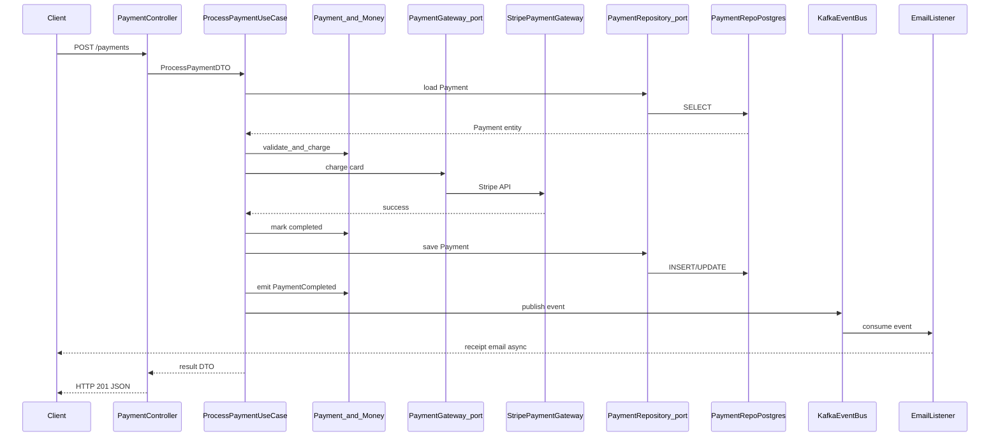

# Clean Architecture — mental model and folder layouts (reference)

**Use this:** When a spec or ADR mentions **layers, hexagonal ports, or “domain shouldn’t import SQL”**—reference for folder names, not a mandate for every lab.

**Reading order:**

1. [Architectural patterns](software-engineering.md#architectural-patterns) — when clean/onion is worth the ceremony
2. **You are here** — payment walkthrough + language layouts
3. [Architecture framework](architecture-framework.md) — system-level pillars (orthogonal to folders)

**Companion:** [DDD](software-engineering.md#domain-driven-design-ddd) · [Glossary — Clean / Onion](software-engineering-glossary.md#clean--onion-architecture) · [Architecture checklist Phase 5](../../checklists/architecture-checklist.md#phase-5--code-design--how-do-modules-stay-coherent)

This doc explains **what each layer is**, **how layers interact**, and **where code would live in folders** if you chose to express those layers explicitly.

---

## Table of contents

- [How to use this doc](#how-to-use-this-doc)
- [Core mental model](#core-mental-model)
- [Domain layer](#domain-layer)
- [Entities vs value objects](#entities-vs-value-objects)
- [Application layer](#application-layer)
- [Controllers](#controllers)
- [Infrastructure](#infrastructure)
- [How layers interact (payments example)](#how-layers-interact-payments-example)
- [Layer stack diagram](#layer-stack-diagram)
- [Cheat sheet](#cheat-sheet)
- [Universal folder structure](#universal-folder-structure)
- [What each layer does](#what-each-layer-does)
- [TypeScript layout](#typescript-layout)
- [Go layout](#go-layout)
- [Python layout](#python-layout)
- [PHP layout](#php-layout)
- [Example request flow (payments)](#example-request-flow-payments)
- [When to use CA folders vs skip them](#when-to-use-ca-folders-vs-skip-them)
- [Related reading](#related-reading)

---

## How to use this doc

Most explanations online list words like "domain", "value object", "use case", and "infrastructure" without showing how they relate. This doc builds the mental model first, then maps it to folders.

Clean Architecture organizes code in **concentric layers**. Inner rings hold business rules; outer rings hold frameworks, databases, and HTTP. The **Dependency Rule** says source-code dependencies point **only inward** — the domain never imports Express, Postgres drivers, or Stripe SDKs.

That idea is summarized in [Architectural patterns](software-engineering.md#architectural-patterns). Here you get two things:

1. **Mental model** — what belongs in each layer and what does not
2. **Folder layouts** — illustrative trees per language if you chose to name directories after layers

**Playbook labs keep framework-conventional layouts.** Project specs and [language ecosystem maps](../languages/) prescribe paths like `src/routes/`, `internal/queue/`, `app/main.py`, and Laravel `app/` — not `domain/entities/`. You can apply the dependency rule inside those conventional folders without renaming directories. See [When to use CA folders vs skip them](#when-to-use-ca-folders-vs-skip-them).

---

## Core mental model

Think of your application as a company:

```text
User  →  Receptionist  →  Manager  →  Experts  →  External Vendors
```

Map that to Clean Architecture:

| Real world | Clean Architecture | Meaning |
|------------|-------------------|---------|
| User | Controller | Receives requests |
| Receptionist | Use case | Coordinates actions |
| Manager | Domain service | Enforces rules spanning entities |
| Experts | Entities / value objects | Core business logic and data |
| External vendors | Infrastructure | DB, Stripe, email, Kafka, etc. |

The receptionist (use case) does not do the expert's job (domain rules) and does not call vendors directly — they coordinate through defined contracts (ports).

---

## Domain layer

The domain layer contains **pure business logic** — the rules of your system that would still exist if you changed frameworks, databases, programming languages, or removed the internet entirely.

### What belongs here

- **Entities** — things with identity that change over time (`Payment`, `User`, `Order`)
- **Value objects** — things defined by value, typically immutable (`Money`, `Email`, `Address`)
- **Domain services** — business rules that do not fit naturally on one entity
- **Domain events** — facts that happened in the business (`PaymentCompleted`, `OrderShipped`)

### What does NOT belong here

- HTTP, REST, or GraphQL handlers
- SQL, ORM models, or repository implementations
- JSON serialization tied to API shapes
- Controllers or use cases
- Stripe SDK, email clients, Kafka producers
- Logging frameworks or environment variables

### Why

The domain should not care **how** it is used — only **what the rules are**. If `Payment` imports `express` or `pg`, you cannot test "amount must be positive" without booting a web server and database.

**Domain services are not microservices.** They are pure classes or functions for rules involving multiple entities when no single entity should own the logic.

---

## Entities vs value objects

This is the most common confusion point.

### Entities

- Have **identity** that persists through change
- Change over time while remaining "the same thing"
- Examples: `Payment`, `User`, `Order`

`Payment #abc-123` is still that payment even if its status changes from `pending` to `completed`.

### Value objects

- Have **no identity** — defined entirely by their attributes
- Typically **immutable** — replace the whole value instead of mutating fields
- Examples: `Money`, `Email`, `Address`, `Quantity`

### How to decide

**Replacement test:** If you swap one instance for another with the same values and nothing breaks in the business meaning, it is a value object. If replacing it breaks relationships or meaning, it is an entity.

| Type | Example | Replacement test |
|------|---------|------------------|
| Value object | `Money(10, "USD")` | Another `Money(10, "USD")` is interchangeable |
| Entity | `Payment #abc-123` | Replacing it with a different ID is a different payment |

---

## Application layer

The application layer is the **receptionist** — it coordinates actions. It does **not** implement business rules; it orchestrates domain objects and external contracts.

### What belongs here

- **Use cases** — `ProcessPayment`, `RegisterUser`, `ShipOrder`, `ResetPassword`
- **Input/output DTOs** — plain data passed into and out of use cases
- **Ports** — interfaces for repositories, payment gateways, event buses (`PaymentRepository`, `PaymentGateway`)

Use cases are the **verbs** of your system. They describe **what** the system does, not **how** Stripe or Postgres work.

```text
ProcessPaymentUseCase
RegisterUserUseCase
ShipOrderUseCase
ResetPasswordUseCase
```

### What does NOT belong here

- SQL queries or ORM calls
- HTTP request/response handling
- Stripe SDK or Kafka client code
- Business rule implementations (those live on entities and domain services)
- Business calculations that belong in the domain

The use case **calls** `payment.charge(amount)` on a domain entity; it does not embed `if (amount <= 0)` if that invariant belongs to `Payment`.

---

## Controllers

Controllers are the **reception desk**. In Uncle Bob's vocabulary they live under **interface adapters** — the `interface-adapters/controllers/` folder in the layouts below.

### What controllers do

- Receive HTTP (or RPC) requests
- Validate and parse input at the boundary
- Call the appropriate use case with a DTO
- Return HTTP responses (status codes, JSON bodies)

Controllers are **thin**. They translate **HTTP → use case → HTTP**.

### What controllers should NOT do

- Business logic or domain rules
- SQL or direct database access
- Calling Stripe, sending email, or publishing to Kafka directly
- Modifying entity invariants (delegate to use case → domain)
- Deciding whether a payment amount is valid

If your controller grows past request parsing and response formatting, move logic inward.

---

## Infrastructure

Infrastructure is **external vendors** — everything that touches the outside world.

### What belongs here

- **Repository implementations** (`PaymentRepoPostgres`, `PaymentRepositoryEloquent`)
- **ORM models** and migration-aware persistence code
- **HTTP framework wiring** (Express routes, FastAPI app factory, Laravel service providers)
- **Third-party clients** — Stripe, SendGrid, S3
- **Message brokers** — Kafka producers/consumers, SQS handlers
- **Logging, caching, file storage** implementations

### What does NOT belong here

- Business rules ("order cannot ship twice")
- Domain logic or use case orchestration
- Deciding **whether** a payment is allowed (domain) — only **how** to persist or transmit it

Infrastructure is **replaceable**. Swap Postgres for MySQL by writing a new adapter. Domain is not replaceable — it **is** the business.

**Ports** are interfaces the application layer defines (`PaymentRepository`). **Adapters** in infrastructure implement them (`PaymentRepoPostgres`).

---

## How layers interact (payments example)

Walk through **ProcessPayment** step by step:

```text
User clicks "Pay"
    ↓
Controller receives HTTP POST /payments
    ↓
Controller builds ProcessPaymentDTO, calls ProcessPaymentUseCase
    ↓
Use case loads Payment entity from PaymentRepository (port)
    ↓
Use case invokes domain logic on Payment (e.g. amount must be > 0)
    ↓
Use case calls PaymentGateway (port) to charge card
    ↓
StripePaymentGateway (infrastructure) talks to Stripe API
    ↓
Stripe returns success
    ↓
Use case updates Payment entity state (domain method)
    ↓
Use case saves Payment via PaymentRepository (port → Postgres adapter)
    ↓
Use case records PaymentCompleted domain event
    ↓
Event bus (infrastructure) publishes to Kafka
    ↓
Email listener (infrastructure) consumes event, sends receipt
    ↓
Use case returns result DTO to controller
    ↓
Controller responds HTTP 201 with JSON body
```

**Notice:**

- Domain never sees HTTP, SQL, Stripe, or Kafka
- Use case never imports Stripe SDK or raw SQL — only port interfaces
- Controller never encodes payment rules
- Infrastructure never decides if a payment is valid

Each layer has a single responsibility. Violating inward dependencies forces unit tests to need a running database or web server.

---

## Layer stack diagram

```text
+---------------------------+
|        Controller         |  ← HTTP, REST, GraphQL
+-------------+-------------+
              |
              v
+---------------------------+
|        Use Case           |  ← Application orchestration (verbs)
+-------------+-------------+
              |
              v
+---------------------------+
|         Domain            |  ← Entities, value objects, rules
+-------------+-------------+
              |
              v
+---------------------------+
|      Infrastructure       |  ← DB, Stripe, email, Kafka
+---------------------------+
```

Dependencies point **downward** (inward). Domain at the center never imports from layers above or beside it in the outer rings.

---

## Cheat sheet

| Layer | Think of it as | Holds |
|-------|----------------|-------|
| **Domain** | Nouns + rules | `Payment`, `User`, `Money`, `Email`; invariants like "amount must be positive" |
| **Use cases** | Verbs | `ProcessPayment`, `RegisterUser`, `ShipOrder` |
| **Controllers** | Translators | HTTP → use case → HTTP |
| **Infrastructure** | Tools | Postgres, Stripe, Redis, Kafka, email |

**Shortest version:**

- **Domain** = what the business **is**
- **Use cases** = what the system **does**
- **Controllers** = how users **talk** to the system
- **Infrastructure** = **tools** the system uses

---

## Universal folder structure

Once the mental model is clear, folders are just a way to make layers visible in your repo.

Language-agnostic conceptual layout:

```text
/src
  /domain
    /entities
    /value-objects
    /events
    /services          # domain services (pure business logic spanning entities)
  /application
    /use-cases
    /dto
    /ports             # interfaces the application layer owns
  /interface-adapters
    /controllers
    /presenters
    /repositories      # implementations that satisfy application ports
  /infrastructure
    /persistence       # database adapters
    /http              # framework-specific wiring
    /messaging         # Kafka, SQS, etc.
    /external-services # Stripe, email, third-party APIs
```

Some teams merge `interface-adapters` and `infrastructure`; others split them so controllers stay thin and framework code stays at the edge. Both are valid as long as the dependency rule holds.

---

## What each layer does

The table below maps the mental model above to folder names.

| Layer | Responsibility | Must not depend on |
|-------|----------------|-------------------|
| **Domain** | Enterprise business rules: entities, value objects, domain events, domain services | Web frameworks, ORMs, message brokers, external HTTP clients |
| **Application** | Use cases that orchestrate domain logic; input/output DTOs; **ports** (interfaces) for persistence and gateways | SQL, HTTP routing, Kafka client libraries, Stripe SDK |
| **Interface adapters** | Translate between the outside world and application: controllers call use cases; presenters format output; repository impls satisfy ports | Concrete database drivers (those live in infrastructure) |
| **Infrastructure** | Actual implementations: Postgres, Redis, Stripe, email, Kafka, Express/FastAPI/Laravel bootstrap | Business invariants (those live in domain) |

---

## TypeScript layout

Illustrative tree for a Node/TypeScript service:

```text
src/
  domain/
    entities/
      Payment.ts
      User.ts
    value-objects/
      Money.ts
      Email.ts
    events/
      PaymentCompleted.ts
    services/
      PaymentDomainService.ts

  application/
    use-cases/
      ProcessPayment/
        ProcessPaymentUseCase.ts
        ProcessPaymentDTO.ts
    ports/
      PaymentRepository.ts
      PaymentGateway.ts

  interface-adapters/
    controllers/
      PaymentController.ts
    presenters/
      PaymentPresenter.ts
    repositories/
      PaymentRepositoryImpl.ts

  infrastructure/
    http/
      express/
        routes.ts
    persistence/
      postgres/
        PaymentRepoPostgres.ts
    external-services/
      stripe/
        StripePaymentGateway.ts
    messaging/
      kafka/
        KafkaEventBus.ts
```

**Why this works in TypeScript**

- Domain files import only other domain types — no `express`, `pg`, or `@stripe/stripe-js`.
- Application use cases depend on **interfaces** (`PaymentRepository`), not concrete Postgres classes.
- Infrastructure implements those interfaces and is wired at the composition root (`routes.ts` or `main.ts`).
- Controllers parse HTTP, call a use case, and return a presenter response — they do not embed SQL or Stripe calls.

Playbook labs using [Express/Fastify conventions](../languages/node-typescript-backend.md) (`src/routes/`, `src/middleware/`) can keep that layout and still follow the same dependency direction inside each folder.

---

## Go layout

Go maps naturally to packages and implicit interfaces:

```text
myapp/
  cmd/
    api/
      main.go              # composition root — wires everything

  internal/
    domain/
      payment/
        entity.go
        value_objects.go
        events.go
        service.go

    application/
      payment/
        usecase.go
        dto.go
        ports.go           # PaymentRepository, PaymentGateway interfaces

    adapters/
      http/
        payment_controller.go
      persistence/
        payment_repo_postgres.go
      messaging/
        kafka_event_bus.go
      external/
        stripe_gateway.go
```

**Why this works in Go**

- **Packages enforce boundaries** — `internal/domain/payment` cannot import `internal/adapters/http` without creating an import cycle (a compile-time guard).
- **Interfaces are implicit** — `PaymentRepoPostgres` satisfies `PaymentRepository` without `implements` keywords; tests inject fakes the same way.
- **`cmd/api/main.go`** is the only place that knows about Postgres connection strings, Stripe keys, and HTTP listen addresses.
- No inheritance — composition through constructor injection (`NewProcessPaymentUseCase(repo, gateway)`).

Playbook [Go lab layout](../languages/go.md) (`cmd/worker/`, `internal/queue/`) is a valid alternative. You can treat `internal/retrieve/` as an application package with ports without renaming it to `internal/application/`.

---

## Python layout

Python often uses `src/` layout; duck typing makes explicit interfaces optional but still recommended:

```text
src/
  domain/
    entities/
      payment.py
      user.py
    value-objects/
      money.py
      email.py
    events/
      payment_completed.py
    services/
      payment_service.py

  application/
    use_cases/
      process_payment.py
    ports/
      payment_repository.py
      payment_gateway.py
    dto/
      process_payment_dto.py

  interface_adapters/
    controllers/
      payment_controller.py
    presenters/
      payment_presenter.py
    repositories/
      payment_repository_impl.py

  infrastructure/
    http/
      fastapi/
        routes.py
    persistence/
      postgres/
        payment_repo_postgres.py
    external_services/
      stripe_gateway.py
    messaging/
      kafka_event_bus.py
```

**Why this works in Python**

- **Protocols or ABCs** (`typing.Protocol`, `abc.ABC`) document ports; tests use simple fakes without a framework.
- FastAPI/Flask routes live in **infrastructure** — they parse requests and delegate to use cases, not ORM models directly.
- Domain stays plain Python classes and dataclasses with no `fastapi` or `sqlalchemy` imports.
- Optional: `dependency-injector` or manual wiring in `routes.py` / `main.py` — keep DI at the edge, not inside domain.

Playbook [Python lab layout](../languages/python.md) (`app/main.py`, `app/routes`) is the default for FastAPI labs. The mental model transfers even when folder names differ.

---

## PHP layout

Laravel-friendly layout that keeps Eloquent out of the domain:

```text
app/
  Domain/
    Entities/
      Payment.php
    ValueObjects/
      Money.php
    Events/
      PaymentCompleted.php
    Services/
      PaymentDomainService.php

  Application/
    UseCases/
      ProcessPayment/
        ProcessPaymentUseCase.php
        ProcessPaymentDTO.php
    Ports/
      PaymentRepository.php
      PaymentGateway.php

  InterfaceAdapters/
    Controllers/
      PaymentController.php
    Presenters/
      PaymentPresenter.php
    Repositories/
      PaymentRepositoryImpl.php

  Infrastructure/
    Persistence/
      Eloquent/
        PaymentModel.php
        PaymentRepositoryEloquent.php
    ExternalServices/
      StripePaymentGateway.php
    Messaging/
      KafkaEventBus.php
```

**Why this works in PHP**

- **PSR-4 autoloading** maps `App\Domain\Entities\Payment` to `app/Domain/Entities/Payment.php` cleanly.
- **Eloquent models are infrastructure** — they know about database columns; domain entities do not.
- Laravel controllers in `InterfaceAdapters` call use cases; route files stay thin registration only.
- Service container bindings wire `PaymentRepository` → `PaymentRepositoryEloquent` in a service provider.

Playbook [Laravel layout](../languages/php-laravel.md) (`app/`, `routes/`) remains the lab default. Project 1 webhook work does not require this folder split.

---

## Example request flow (payments)

The step-by-step narrative is in [How layers interact](#how-layers-interact-payments-example). This diagram shows the same flow as a sequence:



**What each step must not know**

| Component | Knows | Must not know |
|-----------|-------|---------------|
| `PaymentController` | HTTP status codes, request parsing | SQL, Stripe API, Kafka wire format |
| `ProcessPaymentUseCase` | Domain methods, port interfaces | Express middleware, Stripe SDK imports, connection pool details |
| `Payment` entity + `Money` VO | Business invariants | Database schema, JSON serialization |
| `PaymentRepository` (port) | Aggregate load/save contract | Postgres vs MySQL |
| `PaymentGateway` (port) | Charge/refund contract | Stripe HTTP endpoints |
| `PaymentRepoPostgres` | SQL, migrations, connection | HTTP, why a payment amount is valid |
| `StripePaymentGateway` | Stripe API keys, wire format | Payment business rules |
| `KafkaEventBus` | Broker config, serialization | Payment business rules |
| `EmailListener` | SMTP/SendGrid, template rendering | Whether payment was valid |

If any inner layer imports an outer framework, the dependency rule is broken.

---

## When to use CA folders vs skip them

**CA folder ceremony pays off when**

- The **domain is genuinely complex** — many invariants, multiple entry points (HTTP, CLI, queue worker), domain experts to align language with.
- You need **fast unit tests** on business rules without booting Laravel or spinning up Postgres.
- You are explaining architecture in an **interview or ADR** and want a shared vocabulary for layers.

**Skip explicit CA folders when**

- The app is **thin CRUD or integration glue** — webhook receivers, health checks, simple queue consumers. The playbook default for many labs fits here.
- Renaming `internal/queue/` to `internal/application/use-cases/` adds navigation cost without clearer boundaries.
- The team already has a **framework-conventional layout** that respects inward dependencies in practice.

**Mental model without renaming folders**

You can keep playbook layouts and still apply Clean Architecture:

```text
# Go worker (playbook style)
internal/queue/consumer.go     → interface adapter (reads messages, calls handler)
internal/queue/handler.go      → application use case (orchestrates domain + ports)
internal/queue/store.go        → port interface
internal/queue/postgres.go     → infrastructure adapter

# Node API (playbook style)
src/routes/payments.ts         → controller (HTTP in, DTO out)
src/services/processPayment.ts → use case
src/domain/payment.ts          → entity (optional subfolder)
src/db/paymentRepo.ts          → infrastructure
```

The folder names are conventional; the **dependency direction** is what matters.

This aligns with [Architectural patterns](software-engineering.md#architectural-patterns): the payoff of Clean Architecture is a testable domain; the cost is ceremony on small CRUD apps. The [five-pillar architecture framework](architecture-framework.md) is orthogonal — it answers system shape, integration, data, performance, and ops across services, not how to name folders inside one service.

---

## Related reading

| Doc | Topic |
|-----|-------|
| [software-engineering.md § Architectural patterns](software-engineering.md#architectural-patterns) | Layered, hexagonal, clean/onion, event-driven |
| [software-engineering.md § DDD](software-engineering.md#domain-driven-design-ddd) | Entities, value objects, aggregates, repositories |
| [software-engineering-glossary.md § Clean / Onion](software-engineering-glossary.md#clean--onion-architecture) | Short definition and dependency rule |
| [architecture-checklist.md § Phase 5](../../checklists/architecture-checklist.md#phase-5--code-design--how-do-modules-stay-coherent) | Where invariants live, dependency rule questions |
| [architecture-framework.md](architecture-framework.md) | Five pillars — system/integration/data/performance/ops |
| [Language ecosystem maps](../languages/) | **Prescribed lab layouts** — unchanged by this doc |

---

## Technical reference

### Layer vocabulary

| Term | One line |
|------|----------|
| **Entity** | Core business object with identity |
| **Value object** | Immutable, compared by value (Money, Email) |
| **Use case / application service** | Orchestrates domain + ports for one user goal |
| **Port** | Interface the domain defines; adapter implements |
| **Adapter / infrastructure** | DB, HTTP, queue implementations |

### Dependency rule

**Source code dependencies point inward** — domain never imports framework or database drivers.

### ADR terms

| Term | Glossary |
|------|----------|
| Clean / Onion / Hexagonal | [software-engineering-glossary.md#clean--onion-architecture](software-engineering-glossary.md#clean--onion-architecture) |
| Bounded context | [software-engineering-glossary.md#bounded-context](software-engineering-glossary.md#bounded-context) |
