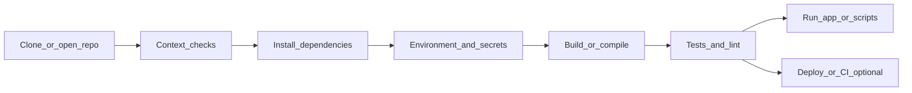

# Command-line tooling playbook

Study and reference material for shells, streams, Git, packages, HTTP, scheduling, compilers, SSH, Docker, and cheatsheets—in **one file** with a table of contents. See also [Software engineering](software-engineering.md), [Servers and networking](servers-and-networking.md), [Database design](database-design.md).

## Table of contents

- [Agent workflow: setup and troubleshooting commands](#agent-workflow-setup-and-troubleshooting-commands)
- [Standard streams: stdin, stdout, stderr (and why they matter)](#standard-streams-stdin-stdout-stderr-and-why-they-matter)
- [Shells: bash and Unix-style CLIs](#shells-bash-and-unix-cli)
- [Environment variables and PATH](#environment-variables-and-path)
- [Permissions: Unix and Windows](#permissions-unix-and-windows)
- [Git: workflow and troubleshooting](#git-workflow-and-troubleshooting)
- [Package managers and language ecosystems](#package-managers-and-language-ecosystems)
- [Compilers, transpilers, interpreters, and runtimes](#compilers-transpilers-interpreters-and-runtimes)
- [curl and HTTP from the command line](#curl-and-http-from-the-command-line)
- [Scheduling: cron (Linux/macOS servers) and Windows Task Scheduler](#scheduling-cron-linuxmacos-servers-and-windows-task-scheduler)
- [CLI text editors: Vim and Nano](#cli-text-editors-vim-and-nano)
- [Bash scripting: patterns and safety](#bash-scripting-patterns-and-safety)
- [Extras: SSH, jq, processes, disks, Docker CLI, security](#extras-ssh-jq-processes-disks-docker-cli-security)
- [Dense command reference (cheatsheet)](#dense-command-reference-cheatsheet)
- [CLI security checklist (extra)](#cli-security-checklist-extra)

## Agent workflow: setup and troubleshooting commands

When people say **“agent workflow”** in a coding context, they often mean **the concrete commands an automated assistant runs** to **stand up** a project and **unblock** failures. This page lists those patterns so you can read a proposed command and know **what phase** it is in, **what it mutates**, and **what to try next** when something breaks.

It is not about the agent’s prose—it is about the **CLI vocabulary** agents reuse across repos.

**Beginner foundation:** When a log says “writing to stdout” or you see `2>&1`, read [stdin, stdout, stderr, and redirection](#standard-streams-stdin-stdout-stderr-and-why-they-matter) (**bash** examples throughout).

---

### Phase map (typical order)

Agents and humans usually work in this rough sequence. Troubleshooting often **loops back** to an earlier phase (for example, fix Node version → reinstall deps → rerun build).



---

### 1. Repository and workspace setup

**Goal:** Get source on disk and know **where** you are working.

| Intent | Typical commands |
|--------|-------------------|
| Clone | `git clone <url>`, `cd repo` |
| Current branch / sync | `git status`, `git branch -vv`, `git fetch`, `git pull` |
| Inspect repo | `ls`, `git log -5 --oneline` |
| Submodules (if used) | `git submodule update --init --recursive` |

**Watch for:** wrong directory (`cwd`), detached HEAD, diverged branch, missing remote.

#### Clone

- **`git clone <url>`** — Copies the remote repository into a new directory (often named after the repo), sets `origin`, and checks out the default branch. Use SSH or HTTPS depending on how your host authenticates.
- **`cd <repo>`** — Enter that directory so every later command runs in the project root (where `.git` lives).

#### Current branch / sync

- **`git status`** — Shows staged/unstaged changes, untracked files, and whether you are ahead/behind the tracked remote branch.
- **`git branch -vv`** — Lists local branches with upstream tracking (`origin/...`) and ahead/behind hints.
- **`git fetch`** — Downloads new commits from the remote **without** changing your working tree; safest way to refresh your view of `origin/*`.
- **`git pull`** — Typically `fetch` plus merge (or rebase, if configured) into the **current** branch—use when you intend to update that branch to match the remote.

**Order:** `status` / `branch -vv` → `fetch` → inspect → then `pull` or merge/rebase deliberately. Full workflow, conflicts, and recovery: [Git: workflow and troubleshooting](#git-workflow-and-troubleshooting).

#### Inspect repo

- **`ls`** — See top-level layout (`README`, `package.json`, `src`, etc.). Use **`ls -la`** when you want details and hidden entries.
- **`git log -5 --oneline`** — Last five commits in one line each; confirms you are on the expected history before you change things.

#### Submodules (if the repo uses them)

- **`git submodule update --init --recursive`** — Initializes submodule metadata, clones missing submodule repos, checks out the commits pinned by the parent repo, and recurses into nested submodules. Run after `clone` or after pulling commits that move submodule pointers.

---

### 2. “What machine is this?” context checks

**Goal:** Match the toolchain to **what the project expects** (README, `.nvmrc`, `engines` in `package.json`, `Dockerfile`, CI YAML).

| Intent | Typical commands |
|--------|-------------------|
| OS / kernel | `uname -a` |
| Shell | `echo $SHELL` |
| Architecture | `uname -m` |
| Current path | `pwd` |
| Tool versions | `node -v`, `npm -v`, `python --version`, `docker --version`, `git --version` |
| Where a tool resolves | `command -v node` |

**Watch for:** multiple installs of the same tool; **PATH order** picking the wrong binary (see [Environment variables and PATH](#environment-variables-and-path)).

#### OS / kernel

- **`uname -a`** — Kernel name, host, architecture, and version string—sanity-check you are on Linux vs macOS and which release.

#### Shell

- **`echo $SHELL`** — Default login shell on Unix (bash, zsh, fish, …).

#### Architecture

- **`uname -m`** — Machine hardware (e.g. `x86_64`, `arm64`). Important for prebuilt binaries and Docker images.

#### Current path

- **`pwd`** — Confirm **cwd**; many failures are “run from wrong folder.”

#### Tool versions

- **`node -v`**, **`npm -v`**, **`python --version`**, **`docker --version`**, **`git --version`** — Compare to README, `.nvmrc`, `engines`, CI images, and `Dockerfile` `FROM` lines.

#### Where a tool resolves

- **`command -v node`** — Which binary runs when you type the command; if the path is surprising, fix **PATH** or version managers (nvm, fnm, pyenv, etc.). (**`which node`** is common but not universal; **`command -v`** is portable in bash.)

---

### 3. Dependency installation (language-specific)

**Goal:** Install libraries and tools the project lists—**locally** unless docs say global.

| Stack | Typical commands | Signals in repo |
|-------|------------------|-----------------|
| Node / JS | `npm install`, `npm ci`, `pnpm install`, `yarn` | `package.json`, lockfile |
| Python | `python -m venv .venv`, `pip install -r requirements.txt`, `pip install -e .` | `requirements.txt`, `pyproject.toml` |
| PHP | `composer install` | `composer.json` / `composer.lock` |
| Rust | `cargo build` (also fetches deps) | `Cargo.toml` |
| .NET | `dotnet restore`, `dotnet build` | `.csproj`, `Directory.Build.props` |
| Go | `go mod download`, `go build ./...` | `go.mod` |

**Watch for:** lockfile present → prefer **`npm ci`** over **`npm install`** in CI; Python **venv** not activated; **wrong language version**.

#### Node / JS

- **`npm install`** — Resolves deps and writes/updates `node_modules`; may update lockfile depending on npm version and flags.
- **`npm ci`** — Clean install from lockfile—preferred in **CI** and reproducible builds when `package-lock.json` (or equivalent) is committed.
- **`pnpm install`** / **`yarn`** — Alternate package managers; respect the lockfile the repo uses (`pnpm-lock.yaml`, `yarn.lock`).

More patterns: [Package managers and language ecosystems](#package-managers-and-language-ecosystems).

#### Python

- **`python -m venv .venv`** — Creates an isolated environment; **activate** it before `pip install` so deps do not land in the global interpreter.
- **`pip install -r requirements.txt`** — Installs pinned deps from a flat list.
- **`pip install -e .`** — Editable install of the current package (common in libraries and apps with `pyproject.toml`).

#### PHP

- **`composer install`** — Installs PHP deps from `composer.lock` when present (deterministic); without lock, resolves from `composer.json`.

#### Rust

- **`cargo build`** — Fetches crates per `Cargo.toml`/`Cargo.lock` and builds; use **`cargo build --release`** for optimized binaries.

#### .NET

- **`dotnet restore`** — Restores NuGet packages; **`dotnet build`** compiles—many repos document a single `dotnet build` that implies restore.

#### Go

- **`go mod download`** — Fetches modules; **`go build ./...`** builds packages and surfaces compile errors across the module.

---

### 4. Environment and configuration

**Goal:** Non-secret and secret config loaded the way the app expects.

| Intent | Typical commands / locations |
|--------|-----------------------------|
| Example env file | Copy `.env.example` → `.env` (never commit real secrets) |
| Show env (filtered) | `printenv`, `env \| grep TOKEN` |
| PATH prepend (session) | `export PATH=...` |

**Watch for:** missing `DATABASE_URL`, wrong `NODE_ENV`, feature flags only documented in README.

#### Example env file

- Copy **`.env.example`** → **`.env`** (or follow README) and fill secrets locally. Never commit real secrets; rotate anything that leaked.

#### Show env (filtered)

- **`printenv`** (or **`env`**) — Inspect variables the shell will pass to child processes. Narrow with **`env \| grep NAME`** when looking for something specific. Prefer redacting or filtering when pasting logs.

#### PATH prepend (session)

- **`export PATH="/new/prefix:$PATH"`** — Session-only fix to prepend a directory so a specific toolchain wins; persistent fixes belong in your shell profile or system PATH ([Environment variables and PATH](#environment-variables-and-path)).

---

### 5. Build, code generation, bundles

**Goal:** Produce runnable artifacts or type-checked output.

| Intent | Typical commands |
|--------|-------------------|
| Scripted build | `npm run build`, `pnpm run build`, `yarn build` |
| Monorepo | `pnpm -r build`, `nx build`, `turbo run build` (varies) |
| Native | `make`, `cmake --build`, `meson compile`, `cargo build --release` |
| Transpile only | `tsc`, `esbuild`, `swc` (often via npm script) |

**Watch for:** first error in log (often root cause), **out-of-memory** in CI, **wrong Node** for native addons.

#### Scripted build

- **`npm run build`**, **`pnpm run build`**, **`yarn build`** — Project-defined compile/bundle step; exact behavior lives in `package.json` scripts.

#### Monorepo

- **`pnpm -r build`**, **`nx build`**, **`turbo run build`** — Build many packages; which command is canonical is repo-specific (check root README/CI).

#### Native

- **`make`**, **`cmake --build`**, **`meson compile`**, **`cargo build --release`** — Native/compiled stacks; ensure toolchain (compiler, SDK) matches docs.

#### Transpile only

- **`tsc`**, **`esbuild`**, **`swc`** — Often invoked inside npm scripts; running them directly is useful when isolating type or transform errors.

---

### 6. Tests, lint, typecheck (quality gates)

**Goal:** Fail fast with **actionable** output.

| Intent | Typical commands |
|--------|-------------------|
| Tests | `npm test`, `pytest`, `cargo test`, `dotnet test`, `go test ./...` |
| Lint | `npm run lint`, `ruff check`, `eslint`, `cargo clippy` |
| Types | `npm run typecheck`, `tsc --noEmit`, `mypy`, `pyright` |

**Verbose / debug flags:** `npm test -- --verbose`, `pytest -vv`, `cargo test -- --nocapture`.

#### Tests

- **`npm test`**, **`pytest`**, **`cargo test`**, **`dotnet test`**, **`go test ./...`** — Run the project’s test suite; pass **verbose** flags through when output is truncated (`npm test -- --verbose`, etc.).

#### Lint

- **`npm run lint`**, **`ruff check`**, **`eslint`**, **`cargo clippy`** — Style and bug-finding rules; fix or suppress per team standards.

#### Types

- **`npm run typecheck`**, **`tsc --noEmit`**, **`mypy`**, **`pyright`** — Static analysis without emitting build artifacts (`--noEmit` keeps checks separate from bundling).

---

### 7. Run the application or script

**Goal:** Start the thing you are trying to fix.

| Intent | Typical commands |
|--------|-------------------|
| Dev server | `npm run dev`, `pnpm dev`, `vite`, `next dev` |
| Single file | `node script.js`, `python main.py` |
| Containers | `docker compose up --build`, `docker run ...` |
| Background | `nohup ... &` (Unix), Windows: services / scheduled tasks |

**Watch for:** port already in use → find process with **`ss -lntp`**, **`lsof -i :PORT`**, or similar Unix tools (see [Dense command reference](#dense-command-reference-cheatsheet)).

#### Dev server

- **`npm run dev`**, **`pnpm dev`**, **`vite`**, **`next dev`** — Hot-reload development entry points; read `package.json` for the canonical script name.

#### Single file

- **`node script.js`**, **`python main.py`** — Quick runs without a full server; confirm interpreter version matches the project.

#### Containers

- **`docker compose up --build`**, **`docker run ...`** — Reproducible environment; logs often explain “works on my machine” gaps. More: [Extras: SSH, jq, processes, disks, Docker CLI, security](#extras-ssh-jq-processes-disks-docker-cli-security).

#### Background

- **`nohup ... &`** (Unix) — Keeps a process running after disconnect; **Windows** usually uses Services or Task Scheduler for long-lived tasks ([Scheduling](#scheduling-cron-linuxmacos-servers-and-windows-task-scheduler)).

---

### 8. Troubleshooting commands agents reach for first

These do not “fix” everything—they **narrow** the problem.

#### A. Re-run with more visibility

| Situation | Command pattern |
|-----------|-------------------|
| npm noise | `npm run xxx -- --verbose` or `npm_config_loglevel=verbose` |
| Node internals | `NODE_DEBUG=module` or `node --trace-warnings` (targeted) |
| curl API | `curl -v` or `curl -i` |
| Build steps | add `--verbose` / `--debug` per tool (`cargo build -vv`, etc.) |

**Going deeper:** npm passes args after `--` to the underlying script; `npm_config_*` env vars can set log level without editing files. `curl -v` shows DNS, TLS, and headers—use `-i` when you only need response headers plus body. For native builds, the first failing command’s **full** log (not the summary line) usually names the missing library or flag.

#### B. “What failed?” logs

| Situation | Command / location |
|-----------|---------------------|
| Last git operation | `git status`, `git diff` |
| Container | `docker logs -f <name>`, `docker compose logs -f` |
| Systemd (Linux) | `journalctl -u service -e` |
| Recent file | `tail -n 200 app.log` |

**Going deeper:** `git diff` shows *uncommitted* drift; pair with `git log -1` if the failure was right after a pull. `docker compose logs -f` aggregates services—add the service name to reduce noise. `journalctl -u <unit> -e` jumps to the end of systemd logs; `-n 200` caps line count. **`tail -f app.log`** for live logs when reproducing.

#### C. Resource and permission errors

| Symptom | Checks |
|---------|--------|
| EACCES / Permission denied | file mode `ls -l`, directory must be writable for install |
| Port in use | `ss`, `lsof`, `netstat -an` |
| Disk full | `df -h` |
| OOM / killed | `dmesg` / host logs, CI job memory limits |

**Going deeper:** **EACCES** on install often means the target directory is not writable by your user (global npm without prefix, or system Python). **Port in use:** find the PID, then stop that process or change your app’s port. **Disk full:** clean package caches and old artifacts before blaming the compiler. **OOM in CI:** raise memory limit or reduce parallelism (`NODE_OPTIONS=--max-old-space-size`, `cargo build -j 1`).

#### D. Network and TLS

| Symptom | Checks |
|---------|--------|
| TLS / proxy | `curl -v`, verify `HTTP(S)_PROXY`, corporate CA |
| DNS | `dig`, `nslookup` |
| Registry | `npm ping`, `docker pull hello-world` |

**Going deeper:** `curl -v` reveals **proxy** env vars and **TLS** trust issues (corporate MITM needs the right CA). `dig +trace` helps when stale answers are suspected; compare to a public resolver. `npm ping` / `docker pull hello-world` isolate **registry reachability** vs your app code.

#### E. Git recovery (agent-safe habits)

| Problem | Safer move |
|---------|------------|
| Bad merge state | `git status`, resolve files, `git merge --continue` / `git rebase --abort` |
| Lost commit | `git reflog` |
| Undo last commit (keep changes) | `git reset --soft HEAD~1` |

Avoid **`git push --force`** unless you understand shared-branch rules; prefer `git push --force-with-lease`.

**Going deeper:** **`git reflog`** is the first tool when you “lost” a commit locally—it shows where `HEAD` moved; you can `git checkout` or `git cherry-pick` from a reflog entry. **`git merge --abort`** / **`git rebase --abort`** backs out of a conflicted operation when you have not pushed the result. For anything stranger (auth, remote, history cleanup), use [Git: workflow and troubleshooting](#git-workflow-and-troubleshooting).

---

### 9. How to read an agent’s “next command”

Use this quick parse:

1. **Mutates disk?** (`install`, `rm`, `docker system prune`, DB migrations)
2. **Mutates remote?** (`git push`, cloud CLI)
3. **Needs secrets?** (tokens in env—confirm scope)
4. **Needs elevation?** (`sudo` / root)
5. **Irreversible?** ( destructive deletes, production DB)

If any **yes** is uncomfortable, pause and narrow scope (dry-run flags, staging environment, backup).

---

### Related docs in this repo

- Git details: [git-workflow-and-troubleshooting.md](#git-workflow-and-troubleshooting)
- PATH / env: [environment-and-path.md](#environment-variables-and-path)
- Package managers: [package-managers.md](#package-managers-and-language-ecosystems)
- Quick command list: [command-reference-cheatsheet.md](#dense-command-reference-cheatsheet)

---

## Standard streams: stdin, stdout, stderr (and why they matter)

This page explains **standard input and output** in plain language, with **bash** examples only. Read this once and every mention of “pipe to stdout” or “redirect stderr” will make sense.

**Related:** [Shells: bash and Unix-style CLIs](#shells-bash-and-unix-cli) · [Dense command reference (cheatsheet)](#dense-command-reference-cheatsheet)

---

### The idea in one sentence

Almost every command-line program is designed to read **text in**, do something, and write **text out**. The operating system wires three default “pipes” for that—**stdin**, **stdout**, and **stderr**—so programs can be **chained** and **logged** without each program knowing about your terminal or files.

---

### What are stdin, stdout, and stderr?

| Stream | Name | Number (Unix) | Typical content |
|--------|------|----------------|-----------------|
| **Standard input** | **stdin** | 0 | Data the program **reads** (keyboard, file, or another program’s output) |
| **Standard output** | **stdout** | 1 | Normal, “successful” **print** output (results, text, JSON bodies) |
| **Standard error** | **stderr** | 2 | **Errors, warnings, debug traces**—meant to be separate from normal output |

**Why separate stdout and stderr?**

- You can **save a clean result** to a file (`program > out.txt`) while **errors still appear on screen** (stderr), so you don’t mix “good data” with “something went wrong.”
- In scripts, you can **detect failure** (non-zero exit code + stderr) while still capturing stdout for parsing.
- Tools like **`curl`** send the **downloaded body** to stdout but **progress or TLS chatter** to stderr—so piping `curl … | jq` works without junk in the pipe.

**stdin** is “where typing goes” when a program waits for input, or “the upstream pipe” when you use `|` .

---

### Mental model: your terminal is not “the program”

- The **terminal window** displays what programs write to stdout/stderr and sends your keystrokes to stdin when a program asks for input.
- **Redirection** (`>`, `2>`) and **pipes** (`|`) change **where** those streams go—file, another program, or nowhere—without changing the program’s logic.

```text
You type keys ──────────► stdin  ──►  program  ──► stdout ──► terminal (or file, or next command)
                              │                      │
                              │                      └──► stderr ──► terminal (often same window, different stream)
```

---

### Examples: stdout (stream 1)

```bash
echo "hello"              # writes "hello\n" to stdout
echo "hello" > greeting.txt   # redirect stdout to file (overwrite)
echo "world" >> greeting.txt  # append to file
cat greeting.txt          # reads file, writes contents to stdout
```

**Why use `>`?** To capture build logs, save API responses, or silence output: `npm run build > build.log`.

---

### Examples: stderr (stream 2)

Many programs print errors to stderr so they don’t corrupt data meant for piping.

```bash
## Run a command and send only stderr to a file, keep stdout on screen
some-command 2> errors.log

## Merge stderr into stdout so both go to the same pipe/file
some-command 2>&1

## Send both to a file (bash)
some-command &> all.log

## Equivalent without &>
some-command > all.log 2>&1
```

**Why `2>`?** In bash, **`2`** is the file descriptor for stderr; **`1`** is stdout. **`2>&1`** means “make stderr go wherever stdout goes.” When merging into **one file**, putting **`> file 2>&1`** captures both streams reliably.

---

### Examples: pipes (stdout → stdin)

**Why use a pipe?** So the **output of program A** becomes the **input of program B** without a temporary file.

```bash
cat data.txt | wc -l           # line count of file via stdin
curl -s https://api.example.com/users | jq '.[0].name'
grep ERROR app.log | tail -n 5
```

Here **`|`** connects **stdout of left** to **stdin of right**.

---

### Examples: stdin explicitly

```bash
## Feed a string as stdin to `wc`
echo "hello world" | wc -w

## File as stdin
wc -l < bigfile.txt
```

---

### curl and stdout/stderr (practical)

From [curl and HTTP from the command line](#curl-and-http-from-the-command-line):

- Default: **response body → stdout**, progress → **stderr**.
- So: `curl -s url` (`-s` silent) hides progress on stderr; body still goes to stdout—ideal for `curl -s url | jq`.

---

### Quick reference (bash)

| Goal | Typical bash |
|------|----------------|
| Print to stdout | `echo`, `printf` |
| Redirect stdout to file | `>` (overwrite), `>>` (append) |
| Redirect stderr only | `2> file` |
| Merge stderr into stdout | `2>&1` (often paired with `> file`) |
| Pipe one command into the next | `cmd1 \| cmd2` |
| Discard stdout | `>/dev/null` |
| Discard stderr | `2>/dev/null` |
| Discard both | `&>/dev/null` or `>/dev/null 2>&1` |

---

### Why master this as a beginner?

1. **Reading tutorials** that say “prints to stdout” or “merge stderr” will be clear.
2. **Debugging:** you’ll know whether to log a file, run with `-v`, or grep stderr.
3. **CI/CD:** logs are often **stdout/stderr capture**; exit codes + stderr explain failures.
4. **Agents** often chain commands; knowing streams prevents accidental **empty pipes** (silently wrong) or **mixed error+data** files.

---

### Further reading

- Your platform’s **`bash`** manual page (`man bash`), section **REDIRECTION**.

---

## Shells: bash and Unix-style CLIs

**Beginner deep-dive:** If terms like **stdout** or **stderr** are new, read [stdin, stdout, stderr, and redirection](#standard-streams-stdin-stdout-stderr-and-why-they-matter) first—it explains *what* those streams are, *why* programs use them, and gives **bash** examples (pipes, `>`, `2>`).

### What is a shell?

A **shell** reads your typed commands, expands variables, finds programs, runs them, and wires **stdin** (standard input), **stdout** (standard output), and **stderr** (standard error). In short: **text flows in**, the program runs, **normal results print on stdout**, and **problems/warnings print on stderr** so you can separate “clean output” from “errors.” Your **terminal** is only the UI that displays those streams; the **shell** is the interpreter that parses what you type.

| Shell | Typical OS | Script extension | Notes |
|--------|------------|------------------|-------|
| **bash** | Linux, macOS, Git Bash on Windows | `.sh` | Ubiquitous in docs and CI—the default for fenced examples below |
| **zsh** | macOS default in many setups | `.sh`/`.zsh` | Similar to bash for everyday commands (paths, redirection, piping) |

**Windows note:** Prefer **Git Bash** or **WSL** when you want to run **the same bash commands as written**; path roots look like **`/c/Users/...`** (Git Bash) or **`/mnt/c/...`** (WSL). Check with **`echo $SHELL`** that you’re in bash (or a close compatible shell) before pasting snippets from this playbook.

---

### Why this matters for agents and scripts

- **Paths:** **`/`**-style paths assume a Unix-shaped environment—even on Windows via Git Bash/WSL.
- **Quoting:** **Single quotes** are literal; **double quotes** allow **`$`** expansion.
- **Environment variables:** Typical patterns are **`export NAME=value`**, **`echo "$PATH"`**, **`printenv`** ([Environment variables](#environment-variables-and-path)).

---

### Bash essentials

#### Session vs persistent config

| File | When it runs |
|------|----------------|
| `~/.bashrc` | Interactive non-login shells (common on Linux) |
| `~/.bash_profile` or `~/.profile` | Login shells (varies by OS) |
| `~/.zshrc` | zsh interactive config |

After editing: `source ~/.bashrc` or open a new terminal.

#### Quoting (bash)

```bash
echo $HOME           # expands
echo "$HOME"         # expands
echo '$HOME'         # literal $HOME
echo "It's fine"     # double quotes allow apostrophe inside
```

#### Useful bash one-liners

```bash
pwd                  # current directory
cd -                 # previous directory
ls -la               # list all, long format
mkdir -p a/b/c       # parents as needed
cp -r src dst        # recursive copy
mv old new           # move/rename
rm -rf dir           # DANGER: recursive delete
which node           # where is node on PATH?
command -v node      # preferred POSIX way to find a command
```

#### Tasks you will repeat everywhere

The one-liners above cover most navigation (**`pwd`**, **`ls -la`**, **`cd`**, **`cp -r`**, **`mv`**, **`rm`**). **`man`** and **`tldr`** are the quickest way to confirm flags that differ slightly between Linux and macOS BSD userland.

#### Exit codes

- **`0`** = success; non-zero = failure (convention across Unix tools).
- After a command finishes: **`echo $?`** prints the exit code from the immediately previous foreground command.

---

### Pipelines and redirection (bash recap)

**Full tutorial with beginner explanations:** [stdin, stdout, stderr, and redirection](#standard-streams-stdin-stdout-stderr-and-why-they-matter).

**Summary:** **stdout** is “normal program output”; **stderr** is “errors/diagnostics.” **Pipes** send one command’s **stdout** to the next command’s **stdin**. **Redirection** sends stdout or stderr to a file—or discards it (`/dev/null`).

| Concept | Typical bash pattern |
|---------|-----------------------|
| Pipe (text streams) | `cmd1 \| cmd2` |
| Redirect stdout (overwrite / append) | `>` / `>>` |
| Redirect stderr alone | `2> file` |
| Merge stderr into stdout | `2>&1` (often after assigning stdout destination) |
| Tee to file and terminal | `2>&1 \| tee out.log` |
| Capture both streams in one file | `npm run build > build.log 2>&1` or `some-command &> all.log` |

```bash
npm run build > build.log 2>&1    # stdout+stderr in one log
wc -l < myfile.txt
cat myfile.txt | wc -l
```

Programs you invoke from bash—**`curl`**, **`git`**, **`node`**, compilers—normally speak the same stdin/stdout/stderr model.

---

### Running bash on Windows

- **Git Bash:** Unix-ish tooling with paths rooted at **`/c/Users/...`**.
- **WSL:** Paths like **`/mnt/c/...`** with behavior close to Linux servers.

Use Git Bash/WSL whenever you paste commands from Unix-oriented docs (including this file).


### Agent-mode checklist (before running a proposed command)

1. Commands target **bash** (Git Bash / WSL on Windows).
2. **Paths and quotes** are escaped for bash.
3. The command is **destructive** or mutates infra (`rm -rf`, `DROP`, partitioning, …).
4. It needs **`sudo`** / elevated privileges?
5. Will it **mutate git state** or **remote** resources?

---

## Environment variables and PATH

This section uses **bash** patterns (`export`, `printenv`). On Windows native shells the syntax differs—in practice use **Git Bash** or **WSL** alongside this playbook.

**Related:** [stdin, stdout, stderr](#standard-streams-stdin-stdout-stderr-and-why-they-matter).

### What is an environment variable?

A **name=value** pair that the operating system passes into every **child process** when a program starts. Think of it as **context your programs inherit** without reading a file first: *where is home?*, *which language?*, *which API URL?*

**Why it matters:**

- **Scripts and apps** read env vars to configure behavior (`NODE_ENV=production`).
- **The shell** reads **`PATH`** to know **which folders to search** when you type `node` instead of a fully qualified filesystem path (for example **`/usr/local/bin/node`**).
- **Security:** secrets are often env vars in development—never treat them as “private” in logs or screenshots.

Operating systems copy the environment when a program starts; shells let you read and set values for the **current session**—and persist them (**`~/.bashrc`**, **`~/.profile`**, OS-level settings on Windows/macOS/Linux).

Common examples:

| Name | Typical meaning |
|------|------------------|
| `PATH` | Ordered list of directories to search for executables |
| `HOME` | User home directory (Unix/Git Bash/WSL convention) |
| `SHELL` | Default interactive shell (Unix-like systems) |
| `LANG` / `LC_*` | Locale (sorting, encoding, date formats) |
| `NODE_ENV` | Node convention: `development` / `production` |
| `TEMP` / `TMP` | Temp directory |

---

### Inspecting variables (bash)

| Goal | Typical bash |
|------|----------------|
| Show **most** exported variables | **`printenv`** or **`env`** |
| Show **one** variable | **`printenv PATH`**, **`echo "$PATH"`** |
| Hunt for substring | **`env \| grep NODE`** |

```bash
printenv              # all exported variables via printenv’s view
printenv PATH
echo "$PATH"
env | grep NODE       # coarse filter across names/values
```

---

### What `PATH` is

`PATH` is a **search path**: one long string containing **directories**, in order, separated by a character:

- **Linux/macOS/Git Bash/WSL:** **`:`**, e.g. `/usr/local/bin:/usr/bin:/bin`
- **Native Windows** sessions often use **`;`** between entries such as **`C:\\Windows\\System32;C:\\Program Files\\nodejs`**—prefer Git Bash/WSL when following bash tutorials verbatim.

When you type `node` (no slash), the runtime **does not** search the entire disk—it walks **`PATH`** left→right for the **first** matching executable.

**Why use PATH instead of full paths every time?**

- You can run **`git`**, **`python`**, **`node`** from any working directory once their directories are indexed.
- Version managers prepend shims (`fnm`, `nvm`, etc.) so the **right binary** floats to the front.

**First match wins.** Two **`node`** installs on **`PATH`** means the **leftmost** wins—classic “wrong Node version.”

---

### How executables are found (bash viewpoint)

Most automation targets Linux—or Windows users running Git Bash/WSL—so **`command`** is portable:

```bash
command -v node       # resolves what runs for `node` (preferred here)
which node             # ubiquitous but not POSIX-mandated
type -a node           # bash builtin: lists all matches along PATH order
```

On purely native Windows hosts you may additionally need **`where.exe node`** and **PATHEXT** semantics—consult Windows docs; this playbook avoids non-bash fenced examples there.

---

### Changing PATH for one session (bash)

```bash
export PATH="/usr/local/bin:$PATH"   # prepend
export PATH="$PATH:/opt/extra/bin"    # append
```

#### Persisting (examples)

- **Linux/macOS:** `~/.bashrc`, `~/.bash_profile`, or `/etc/environment` variants.
- **Windows GUI:** **System Properties → Environment Variables**.
- Prefer **runtime managers** (nvm/fnm/pyenv/asdf) that rewrite PATH for shells automatically.

---

### Dotenv files (`.env`)

Many frameworks load **`.env`** at runtime **for apps**, not for the whole OS.

- **Never commit** real `.env` to Git.
- Commit **`.env.example`** with dummy keys describing required variables.
- Shells do **not** load `.env` automatically unless you **`set -a; source .env; set +a`** (careful!) or rely on tooling.

Example workflow:

```bash
cp .env.example .env
## edit .env locally with your secrets
```

---

### Common PATH problems

| Symptom | Likely cause |
|---------|----------------|
| `command not found` | Missing directory entry, typo, or venv/toolchain not sourced |
| Wrong Node/npm version | Multiple installs; PATH order resolves the unintended one |
| Works in GUI but not terminal | Separate environment (login shells vs `.app` shortcuts) |
| Works in IDE but not in CI | Container image exposes a different PATH |

**Debug strategy (bash/Git Bash/WSL):**

```bash
echo "$PATH"
command -v node
type -a node 2>/dev/null || command -v node
```

Triple-check separators when stitching PATH strings manually (**`:`** vs **`;`**).

---

### Process inheritance

If you set a variable in a bash session, **child processes** see it unless stripped. **Parents do not inherit** edits made solely inside a child shell.

---

### Security note

Environment variables can leak via crash dumps, CI logs, and casual **`printenv`** pastes. Prefer secret managers rather than immortal tokens in plaintext env exports.

## Permissions: Unix and Windows

### Why permissions exist

Operating systems restrict **who can read, write, or execute** files and traverse directories. This limits blast radius when accounts are compromised.

---

### Unix-style permissions (Linux, macOS, WSL)

#### Subjects and objects

- **Files and directories** have an **owner** user and a **group**.
- Three permission triplets: **user (u)**, **group (g)**, **others (o)**.
- Three bits each: **read (r)**, **write (w)**, **execute (x)**.

For **directories**, **execute** means *permission to enter/list contents* (depending on other bits); `r` on a directory allows listing names; `w` allows creating/deleting entries.

#### `ls -l` example

```text
-rw-r--r--  1 alice dev  1024  Jan 1 10:00 app.js
drwxr-xr-x  2 alice dev  4096  Jan 1 10:00 src
```

Interpretation:

- `app.js`: owner read/write; group read; others read.
- `src` directory: owner rwx; group rx; others rx.

#### Numeric modes (octal)

Each triplet is a 3-bit number:

- `r=4`, `w=2`, `x=1` → add per slot.

Examples:

- `755` = `rwxr-xr-x` (common for scripts/binaries).
- `644` = `rw-r--r--` (common data file).
- `600` = `rw-------` (owner-only; sensitive files like SSH private keys).

#### Core commands

```bash
chmod u+x script.sh        # add execute for user
chmod 755 bin/tool         # set exact mode
chmod -R go-w assets/      # recursive: remove group/other write
chown user:group file      # change owner (often needs sudo)
chgrp group file
umask                      # default mask for new files (shell setting)
```

#### sudo

**`sudo`** runs a command as another user (often root).

- Prefer **specific** privilege: installing packages, binding low ports, editing system files.
- **Avoid** `chmod 777` “to make it work”—that rarely fixes root causes and invites abuse.

#### SSH keys (quick sanity)

```bash
chmod 700 ~/.ssh
chmod 600 ~/.ssh/id_ed25519
chmod 644 ~/.ssh/id_ed25519.pub
```

---

### Windows ACLs (overview)

Windows uses **Access Control Lists (ACLs)** with **users and groups** and granular rights (read, write, execute, delete, etc.), not the compact `rwx` model.

#### Built-in tools

- **GUI:** File → Properties → Security.
- **CLI:** `icacls` is the modern replacement for many `cacls` scenarios.

**Windows CLI note:** Administrators often use **`icacls`** to inspect/grant ACLs (not bash—refer to **`icacls /?`** for syntax). Prefer the GUI for one-off tweaks unless you automate policy.

Elevation (Run as Administrator) is often required for system paths.

#### Execution restrictions

- **SmartScreen**, **AppLocker**, **Defender** can block unknown binaries.

---

### Practical debugging

| Problem | Checks |
|---------|--------|
| Permission denied on Unix | `ls -l`; parent directory `x`; SELinux/AppArmor context (advanced) |
| Cannot delete file | Writable directory? sticky bit? immutable attr? |
| Works locally, fails in CI | Different user; umask; container root vs non-root |
| Works on Windows, fails on Linux | Line endings, case sensitivity, path differences |

---

### Agent safety

Before a command changes permissions widely:

- Confirm **path** (no accidental `/` or `C:\`).
- Prefer **least privilege**: narrow **`chmod`** on Unix, and tighten Windows ACL tooling only along intended paths rather than blasting `Everyone:(F)` indiscriminately.
- Avoid recursive `chmod` on `$HOME` or system roots without an explicit backup plan.

---

## Git: workflow and troubleshooting

### Mental model

Git tracks **snapshots** of a directory over time as **commits** on **branches**. Remotes (like GitHub) are **other copies** you sync with `fetch`, `pull`, `push`.

Core areas:

- **Working tree**: your files on disk.
- **Index / staging**: what will go into the *next* commit (`git add`).
- **Local repo**: commits and branches in `.git`.
- **Remote**: `origin` is a conventional name for the primary remote URL.

---

### Identity and first-time config

```bash
git config --global user.name "Your Name"
git config --global user.email "you@example.com"
```

On Windows, line endings matter when collaborating across OSes:

```bash
git config --global core.autocrlf true   # Windows typical checkout CRLF, commit LF
```

Inspect:

```bash
git config --list --show-origin
```

---

### Daily commands (cheat sheet level)

| Task | Command |
|------|---------|
| Status | `git status` |
| Stage all changes | `git add -A` or `git add .` (nuances exist for deletes/new) |
| Commit | `git commit -m "message"` |
| See history | `git log --oneline --graph --decorate -20` |
| Branch | `git branch`, `git switch -c feature/foo` |
| Switch branch | `git switch main` |
| Update from remote | `git fetch` then `git merge` or `git pull` |
| Push | `git push -u origin branch-name` |
| Stash work in progress | `git stash push -m "wip"`, `git stash pop` |

**Write good commit messages:** imperative mood (“Add login validation”), explain *why* when non-obvious.

---

### Understanding `fetch` vs `pull`

- **`git fetch origin`**: downloads remote updates **without** merging into your branch. Safe and predictable.
- **`git pull`**: usually `fetch` + `merge` (or `rebase` depending on config). Faster, but you should know your merge/rebase defaults.

Recommended habit: `git fetch` → inspect (`git log origin/main`) → `git merge` or `git rebase` deliberately.

---

### Merge vs rebase (short)

- **Merge:** preserves a branching history; creates a merge commit when needed.
- **Rebase:** replays your commits on top of another branch for a linear story; **rewrites history** for commits that were only local—avoid rebasing commits already pushed unless you coordinate.

---

### Troubleshooting playbook

#### “Not a git repository”

You are not inside a repo or `.git` is missing. `cd` to the project root or `git init`.

#### Detached HEAD

You checked out a specific commit, not a branch tip. Fix: create/switch to a branch:

```bash
git switch -c recover-from-detached
```

#### Merge conflicts

During merge or rebase:

1. `git status` shows *unmerged* paths.
2. Open files, find conflict markers:

```text
<<<<<<< HEAD
your side
=======
their side
>>>>>>> branch-name
```

3. Edit to final desired content, remove markers.
4. `git add` resolved files, then `git merge --continue` or `git rebase --continue`.

#### Undo last commit (keep changes)

```bash
git reset --soft HEAD~1
```

#### Discard local changes to a file (destructive)

```bash
git restore path/to/file    # modern
## or: git checkout -- path   # older style
```

#### Remote auth failures

- **SSH:** test `ssh -T git@github.com`; ensure key added to `ssh-agent` and GitHub.
- **HTTPS:** credential manager or personal access token scopes.

#### Accidentally committed secrets

1. **Rotate/revoke the secret immediately** (API keys, tokens).
2. Remove from history is hard; assume clones may still have it. Use `git filter-repo` or BFG with guidance from your org; for GitHub, also check **secret scanning**.

#### “Why is my branch behind?”

```bash
git fetch origin
git status
```

Compare with:

```bash
git log --oneline HEAD..origin/main   # commits on remote you don't have
```

---

### Safety checks before `git push --force`

- `--force` overwrites remote branch history.
- Use `--force-with-lease` when you must force-push: it refuses if someone else pushed first.

---

### `.gitignore` rules of thumb

Ignore:

- build outputs (`dist/`, `bin/`, `node_modules/` often ignored but sometimes not in apps packaging),
- secrets (`.env`),
- OS/editor junk.

Use root `.gitignore` plus optional `.git/info/exclude` for local-only patterns.

---

### Helpful diagnostics

```bash
git remote -v
git branch -vv
git reflog                     # local HEAD movements—recovery tool
git show HEAD
git diff
git diff --staged
```

When something “mysterious” happens, **reflog** plus a calm `fetch` usually explains it.

---

## Package managers and language ecosystems

Package managers install **libraries, binaries, and tools**, record **versions**, and replay installs on another machine. They are not interchangeable across ecosystems—learn each ecosystem’s primary tool first.

---

### Node.js / JavaScript

#### npm (bundled with Node)

| Command | Meaning |
|---------|---------|
| `npm init` | Create `package.json` |
| `npm install` | Install deps from `package.json` / lockfile |
| `npm install lodash` | Add runtime dep; updates `package.json` |
| `npm install -D eslint` | Dev dependency |
| `npm ci` | Clean install from lockfile (CI-friendly) |
| `npm run build` | Runs `build` script from `package.json` |
| `npx some-cli` | Run CLI without global install (downloads temporarily if needed) |

**Lockfiles:** `package-lock.json` (npm v5+). Commit it for apps; libraries may have different policies.

#### yarn / pnpm

- **Yarn:** similar mental model; `yarn`, `yarn install`, lockfile `yarn.lock`.
- **pnpm:** disk-efficient via symlinks; `pnpm install`; `pnpm run`.

#### Version managers for Node

Install specific Node versions per project:

- **nvm** (Unix/macOS), **nvm-windows**, **fnm**, **asdf** (multi-language).

Why: avoid “works on my machine” when CI uses Node 20 and you use 18.

---

### PHP: Composer

| Command | Meaning |
|---------|---------|
| `composer init` | Create `composer.json` |
| `composer require vendor/package` | Add dependency |
| `composer install` | Install from lock file |
| `composer update` | Update deps (changes `composer.lock`) |
| `composer dump-autoload` | Regenerate autoloader |

Files: `composer.json` (constraints), `composer.lock` (pinned versions—commit for apps).

---

### Python: pip, pipx, poetry, conda, uv

| Tool | Role |
|------|------|
| **pip** | Install packages from PyPI into current env |
| **venv** / **virtualenv** | Isolated Python environments (strongly recommended) |
| **pipx** | Install CLI tools in isolated envs (`pipx install black`) |
| **Poetry** | Project + lockfile workflow (`pyproject.toml`) |
| **conda** | Broader scientific packaging (binaries beyond pure Python) |
| **uv** | Fast resolver/installer (emerging Astral toolchain) |

Typical venv workflow:

```bash
python -m venv .venv
source .venv/bin/activate   # POSIX shells, Git Bash, WSL (bin layout)
pip install -r requirements.txt
```

---

### Ruby: Bundler (`bundle`)

- `Gemfile` + `Gemfile.lock`.

---

### Rust: Cargo

- `cargo new`, `cargo build`, `cargo run`, `cargo test`.
- `Cargo.toml` manifests; `Cargo.lock` for apps (commit); libraries may vary.

---

### Java: Maven / Gradle

- **Maven:** `pom.xml`, `mvn clean install`.
- **Gradle:** `build.gradle` / Kotlin DSL, `./gradlew`.

---

### .NET: NuGet

- `dotnet restore`, `dotnet add package Name`.
- `PackageReference` in `.csproj`.

---

### System / OS package managers

| OS | Examples |
|----|----------|
| Debian/Ubuntu | `apt` |
| Fedora/RHEL | `dnf` / `yum` |
| macOS (common) | **Homebrew** (`brew`) |
| Windows | **winget**, **Chocolatey**, **Scoop** |

Use OS packages for **tools you want globally** (git, ffmpeg). Use language package managers for **project libraries** to avoid polluting the OS Python/Node.

---

### Containers vs package managers

- **Docker/OCI images** ship a filesystem snapshot. **Still** often use `apt`, `apk`, etc. inside the Dockerfile to build layers.
- Prefer **multi-stage builds** to keep runtime images small.

---

### Security hygiene

- Review `package.json`/`composer.json` changes in PRs.
- Run **`npm audit` / `composer audit`** (noise vs signal—triaged).
- Pin versions for production apps; understand **supply chain** risks.

---

### Quick decision tree

1. **Is this dep for one project?** Use that language’s project-local install (venv, `node_modules`, Composer in project).
2. **CLI tool you use everywhere?** Consider global install or `pipx`/`npx` style isolation.
3. **Reproducible servers?** Lockfiles + pinned base image + documented build steps.

---

## Compilers, transpilers, interpreters, and runtimes

This section builds a **mental model** so phrases like “build”, “bundle”, “compile”, and “target ES2019” map to real steps. Use it when you read CI logs or agent-proposed toolchain commands.

---

### Core concepts

#### Source code → something runnable

Programs start as **human-readable source**. Getting to execution usually involves one or more of:

1. **Interpretation** — another program reads source (or bytecode) **at runtime** line-by-line or opcode-by-opcode.
2. **Compilation** — a **compiler** translates source **ahead of time** to machine code or an intermediate representation (IR).
3. **Transpilation** — a **source-to-source** transform (often high-level → another high-level language or older dialect).

Nothing stops a toolchain from combining all three (e.g. compile → bytecode → VM interprets).

#### Interpreter (typical)

- Reads source or bytecode when the program runs.
- **Startup** may be fast; **peak** performance may lag compiled code unless a JIT exists.
- Examples: **CPython** (Python reference implementation), **Ruby MRI**, **bash** itself.

#### Compiler (typical)

- Performs **static analysis**, **optimization**, and emits **object files** or native binaries.
- Often a separate **linking** step merges objects and libraries into one executable.
- Examples: **GCC/Clang** for C/C++, **Rust `rustc`**, **Go `go build`**, **Zig `zig build`**.

#### Transpiler

- Input and output are both “language-level” source (or very near).
- Example: **TypeScript → JavaScript**, **Svelte → JS**, historical **CoffeeScript → JS**, some **CSS preprocessors**.
- Motivations: **new syntax on old runtimes**, gradual adoption, types (TypeScript) erased at emit time.

#### JIT (just-in-time compilation)

- VM starts with interpretation, **hot code paths** get compiled at runtime.
- Examples: **V8** (Chrome/Node JavaScript), **JVM HotSpot**, **.NET CLR**.

#### Bytecode + VM

- Compiler front end lowers source to **bytecode**; a **virtual machine** executes it.
- Examples: **Python `.pyc`** (implementation detail), **Java `.class` files**, **.NET IL** (Common Intermediate Language, stored in assemblies), **Ethereum EVM** (different domain).

---

### Build pipeline vocabulary

| Term | Meaning |
|------|---------|
| **AST** | Abstract syntax tree produced by parsing source |
| **IR / IL** | Intermediate language between front end and optimizer/back end |
| **Object file** | Compiled translation unit (`.o`/`.obj`) not yet linked |
| **Linker** | Combines objects + libraries, resolves symbols → final binary |
| **Static library** | Archive of objects (`.a`, `.lib`) linked at build time |
| **Dynamic/shared library** | Loaded at runtime (`.so`, `.dll`, `.dylib`) |
| **Symbol** | Named function/global; link errors mean “symbol missing/duplicate” |
| **ABI** | Binary interface between compiled units (calling conventions, struct layout) |

When builds fail with **undefined reference** / **unresolved external symbol**, think **linker** + missing `-l` library or wrong link order.

---

### Examples by category (compiled / ahead-of-time emphasis)

#### Systems / native machine code (typical AOT to native)

| Language | Typical toolchain | Output notes |
|----------|-------------------|--------------|
| **C** | `gcc`, `clang` | `.exe`/ELF/Mach-O; minimal runtime |
| **C++** | `g++`, `clang++` | heavier runtime (exceptions, RTTI) |
| **Rust** | `cargo`, `rustc` | safe concurrency focus; LLVM backend |
| **Go** | `go build` | static binaries common; small runtime |
| **Zig** | `zig build` | C interop story; explicit control |
| **Swift** | `swiftc` | Apple-ecosystem heavy |
| **Fortran** | `gfortran` | numeric HPC legacy and present |
| **Haskell** | `ghc` | lazy functional; native codegen |

Minimal C example mental model:

```bash
clang -O2 -Wall main.c -o app
./app
```

#### JVM languages (compile to JVM bytecode; JIT at runtime)

| Language | Typical commands | Notes |
|----------|------------------|-------|
| **Java** | `javac Main.java` → `java Main` | bytecode `.class`, JDK tools |
| **Kotlin** | `kotlinc`, Gradle `compileKotlin` | targets JVM, JS, Native (different backends) |
| **Scala** | `scalac`, sbt | JVM + other backends depending on project |

Bytecode is **not OS machine code**; it needs a **JVM**.

#### .NET languages (compile to IL; JIT with CLR)

| Language | Typical commands | Notes |
|----------|------------------|-------|
| **C# / F# / VB.NET** | `dotnet build`, `dotnet run` | IL in assemblies (`.dll`/`.exe`), **CoreCLR** / **.NET** runtime |

`dotnet publish` can produce **framework-dependent** or **self-contained** outputs—read output folders carefully in CI.

#### Native with explicit bytecode / custom VM

| Ecosystem | Notes |
|-----------|--------|
| **Lua** | Lightweight embeddable; `luac` optional bytecode; often embedded in games/servers |

---

### Transpiled / “compile to JS” (examples)

These usually target **JavaScript** (or WASM) for browsers/Node:

| Source | Tool | Target |
|--------|------|--------|
| **TypeScript** | `tsc`, **esbuild**, **swc** | JavaScript (types erased) |
| **Reason/ReScript** | respective compilers | JS |
| **Elm** | `elm make` | JS |
| **Svelte** | `svelte/compiler` via bundlers | JS |
| **JSX** | Babel/esbuild/swc | plain JS |

**Bundlers** (`webpack`, `vite`, `rollup`, `parcel`) merge modules **after** transpile; **minifiers** (`terser`, `esbuild`) shrink output for production.

---

### Interpreted (no separate compile step for typical dev workflow)

| Language | Notes |
|----------|--------|
| **Python** | `python script.py`; may write `.pyc` cache |
| **Ruby** | `ruby script.rb` |
| **PHP** | interpreted per request historically; **Opcache** in production |

**Important:** “Interpreted” does not mean “no compilation”—CPython compiles to bytecode internally; PHP may opcode-cache.

---

### Polyglot build patterns you will see in CI

- **Monorepo** with multiple `package.json`, `Cargo.toml`, `go.mod` in subfolders.
- **Code generation**: OpenAPI → client stubs, protobuf → language bindings.
- **Cross-compilation**: building Linux ARM binaries from macOS/x86 CI (Go/Rust strong here).

---

### What to log when a build fails (checklist)

1. **Which compiler/version** (`clang --version`, `rustc -V`, `node -v`).
2. **First error** in the log—often root cause; later errors can cascade.
3. **Linker vs compiler** message keywords.
4. **Feature flags** / target triple (Rust/Clang `--target`).
5. **Environment** differences: CI vs local `PATH`, `CC`, `CXX`, `PKG_CONFIG_PATH`.

---

### Relation to package managers

- **npm scripts** chain bundlers/transpilers.
- **Cargo** builds Rust crates deterministically from lockfile.
- **`cmake` / `meson`** orchestrate native multi-language builds.

Understanding **compile** vs **install** vs **publish** helps you read CI jobs:

- `go test` compiles test binaries temporarily.
- `dotnet pack` produces NuGet packages—different from `dotnet run`.

---

### Further topics worth short deep dives later

- **LLVM** as shared optimizer/backend (Clang, Rust, Swift overlap).
- **WASM** as portable compile target (Rust, Go, C++ → browsers/edge).
- **Profile-guided optimization (PGO)**, **LTO** (link-time optimization).
- **Sanitizers** (`-fsanitize=address`) for native memory bugs—CI integration patterns.

---

## curl and HTTP from the command line

`curl` transfers data with URLs. It is the **de facto** way to script HTTP in docs and CI. Learn flags once; reuse forever.

**Streams reminder:** **stdout** is “normal output” (here: the response body); **stderr** is “extra messages” (here: progress, sometimes TLS debug). See [stdin, stdout, stderr](#standard-streams-stdin-stdout-stderr-and-why-they-matter) if those terms are new.

---

### Basic usage

```bash
curl https://api.example.com/health
```

By default, **`curl`** prints the **response body** to **stdout** (so you can pipe it to `jq` or save with `>`). Progress and some diagnostics go to **stderr**, which is why tutorials use **`curl -s`** (“silent”)—it quiets stderr so your terminal stays clean when piping.

**Why care?** If you run `curl … > out.json` and see errors on screen but a clean file, that is **stderr** still attached to the terminal while **stdout** went to the file.

---

### Useful flags

| Flag | Meaning |
|------|---------|
| `-i` | Include **response headers** in output |
| `-I` | **HEAD** request (headers only) |
| `-L` | Follow **redirects** |
| `-o file` | Save body to `file` |
| `-O` | Save to filename from URL |
| `-H "Name: value"` | Add/set header (repeat for multiple) |
| `-d 'key=value'` | POST body (default `Content-Type: application/x-www-form-urlencoded`) |
| `-X POST` | Set method (often optional when `-d` is used) |
| `-v` | Verbose (TLS handshake, redirects—debug) |
| `-s` | Silent (no progress) |
| `-S` | Show errors when silent |
| `-f` | Fail on HTTP error status (no body treated as success) |
| `--fail-with-body` | Newer curl: fail but still print body |

Combine common debugging:

```bash
curl -sS -i -L https://example.com
```

---

### POST JSON (common API pattern)

```bash
curl -sS -X POST https://api.example.com/items \
  -H "Content-Type: application/json" \
  -d '{"name":"demo"}'
```

Often add auth:

```bash
curl -sS -H "Authorization: Bearer $TOKEN" https://api.example.com/me
```

**Never paste real tokens** into chat logs or public repos.

---

### File uploads

**Multipart** (typical HTML forms):

```bash
curl -F "file=@./photo.jpg" https://example.com/upload
```

---

### TLS / certificates

Corporate proxies may require custom CA bundles:

```bash
curl --cacert corp-ca.pem https://internal/
```

`-k` / `--insecure` disables TLS verification—**only** for controlled debugging, never as default in scripts.

---

### Timeouts and retries

```bash
curl --connect-timeout 5 --max-time 30 --retry 2 https://example.com
```

---

### Using curl with `jq`

Pipe JSON APIs to `jq` to extract fields—see [extras](#extras-ssh-jq-processes-disks-docker-cli-security).

---

### Safety when an agent “tests” endpoints

- Confirm **environment** (staging vs production).
- Avoid destructive verbs without explicit approval.
- Redact auth headers from terminal scrollback when possible.

---

## Scheduling: cron (Linux/macOS servers) and Windows Task Scheduler

Scheduled jobs run commands **without an interactive login**: backups, cleanup, report emails, queue workers, cert renewals.

---

### Linux cron

#### Crontab files

Per-user:

```bash
crontab -e    # edit
crontab -l    # list
```

System-wide: `/etc/crontab`, `/etc/cron.d/*` (distribution-dependent).

#### Five-field syntax (most common)

```text
* * * * * command
│ │ │ │ │
│ │ │ │ └─── day of week (0-7) (0 and 7 = Sunday)
│ │ │ └───── month (1-12)
│ │ └─────── day of month (1-31)
│ └───────── hour (0-23)
└─────────── minute (0-59)
```

Examples:

```text
*/15 * * * * /usr/local/bin/check-health.sh   # every 15 minutes
0 3 * * * /opt/scripts/backup.sh               # 03:00 daily
0 9 * * 1 /opt/scripts/weekly-report.sh        # Monday 09:00
```

#### Environment and PATH in cron

Cron jobs run with **minimal environment**—often no `.bashrc`, different `PATH`, no GUI keychain.

**Best practices:**

- Use **absolute paths** to scripts and interpreters: `/usr/bin/python3 /opt/app/job.py`.
- Set needed vars **inside** the cron line or `crontab`:

```text
PATH=/usr/local/bin:/usr/bin
SHELL=/bin/bash
0 * * * * /opt/app/hourly.sh
```

- **Log** stdout/stderr:

```text
0 * * * * /opt/app/hourly.sh >> /var/log/hourly.log 2>&1
```

#### Timezones

`cron` typically uses the **server’s local timezone** unless configured otherwise. For UTC-only ops, set TZ explicitly or use `systemd` timers with documented behavior.

#### systemd timers (alternative)

Many distros prefer **`systemd` timers** over cron for service integration, logging via `journalctl`, and dependency ordering. Worth learning if you manage modern Linux services.

---

### Windows Task Scheduler

#### GUI path

**Task Scheduler** (`taskschd.msc`): create **Trigger** (schedule), **Action** (program/script), **Principal** (which user, highest privileges), **Conditions** (AC power, idle).

**Automation note:** Scheduled tasks created through **Task Scheduler** usually point **`schtasks`/GUI** tooling or vendor-specific IaC—not bash snippets. Prefer Linux **`cron`/systemd** examples when your runtime is Unix.

**Elevation:** tasks needing admin rights must run under an account allowed to elevate or use a dedicated service account with least privilege.

#### PATH and working directory

Set **“Start in”** (working directory) for tasks that assume relative paths.

---

### Idempotency and safety

Good scheduled jobs:

- **Exit non-zero** on failure so monitoring/alerts can fire.
- **Lock** against overlap (two runs at once)—use `flock`, PID files, or job queues.
- **Do not embed secrets** in plain cron lines in shared servers—use secret stores or restricted files with correct permissions.

---

### Logs

- Linux: app logs under `/var/log/...`, or `journalctl -u unit`.
- Windows: **Event Viewer**, task **History** tab.

---

### Agent caution

Provisioning cron/Task Scheduler remotely can affect production. Confirm:

- exact schedule,
- account running the job,
- network side effects,
- rollback if the job misbehaves.

---

## CLI text editors: Vim and Nano

Graphical editors are fine. On servers and in minimal environments you often have only a terminal—knowing **Nano** (easy) and **Vim** (ubiquitous) pays off.

---

### Nano

Beginner-friendly; shortcuts shown at bottom of screen.

| Action | Keys |
|--------|------|
| Save | `Ctrl+O` (write Out), confirm with Enter |
| Exit | `Ctrl+X` |
| Search | `Ctrl+W` |
| Cut line | `Ctrl+K` |
| Uncut/paste | `Ctrl+U` |
| Where am I | `Ctrl+C` (cursor position) |

Open file:

```bash
nano /path/to/file.txt
```

---

### Vim: modes

Vim is **modal**:

- **Normal** — navigate and run commands (default after open).
- **Insert** — type text (`i`, `a`, `o` to enter).
- **Visual** — select text (`v`, `V`, `Ctrl+v` block).

Press **`Esc`** to return to Normal.

#### Survival commands

| Goal | Command |
|------|---------|
| Insert at cursor | `i` |
| Insert after cursor | `a` |
| New line below / above | `o` / `O` |
| Save | `:w` |
| Quit | `:q` |
| Save and quit | `:wq` or `ZZ` |
| Quit without save | `:q!` |
| Delete line | `dd` |
| Undo | `u` |
| Redo | `Ctrl+r` |
| Go to line N | `NG` or `:N` |
| Search | `/pattern` then `n` / `N` for next/prev |
| Find/replace | `:%s/old/new/g` |

#### Copy/paste (Vim terms: yank/put)

| Action | Command |
|--------|---------|
| Yank line | `yy` |
| Paste after | `p` |
| Paste before | `P` |

#### Why Vim matters

- Often the **default** editor on servers (`git rebase -i`, emergency `kubectl edit`, etc.).
- Once muscle memory exists, very fast for navigation.

#### Exiting Vim jokes exist because

People land in Normal mode and type literal characters. Remember: **`Esc`**, then **`:wq`** to save, **`:q!`** to bail out.

---

### Choosing an editor for Git

```bash
git config --global core.editor "nano"
## or: vim, code --wait, etc.
```

`--wait` is important for GUI editors so Git blocks until you close the file.

---

### Others (brief)

- **emacs**: extensible; steeper curve; powerful for Lisp-centric workflows.
- **Helix / kakoune**: modal alternatives worth exploring if you like modal editing.

---

### Agent note

If an automated workflow opens Vim unexpectedly, look for:

- `git` invoking default editor,
- `crontab -e`,
- `sudoedit` with `EDITOR=vim`.

Set `EDITOR`/`VISUAL` to a non-interactive flow in automation where appropriate, or use `-m` flags / env vars tools support.

---

## Bash scripting: patterns and safety

Shell scripts glue together CLI tools. Weak scripts become fragile automation—apply structure early.

---

### Shebang and strict mode

Start scripts with an interpreter path and enable common safeguards:

```bash
#!/usr/bin/env bash
set -euo pipefail
```

| Option | Effect |
|--------|--------|
| `-e` | Exit on first failing command (nuances with pipelines) |
| `-u` | Error on unset variables |
| `-o pipefail` | Pipeline fails if any stage fails |

**Note:** some commands *expect* non-zero (e.g. `grep` when no match). Handle explicitly:

```bash
grep -q pattern file || true
```

Or capture:

```bash
if grep -q pattern file; then
  echo "found"
fi
```

---

### Variables and quoting

```bash
name="Alice"
echo "Hello $name"
echo "Path is long: ${HOME}/projects"
readonly pi=3.14
```

**Always double-quote expansions** unless you intend word-splitting:

```bash
cp "$src" "$dst"
```

---

### Arguments

```bash
./script.sh arg1 "arg two"

echo "$1"    # first arg
echo "$#"    # count
echo "$@"    # all args as separate words
shift        # drop $1, renumber
```

---

### Conditionals and tests

```bash
if [[ -f "./config.json" ]]; then
  echo "config exists"
elif [[ -d "./backup" ]]; then
  echo "backup dir exists"
else
  echo "missing"
fi
```

Tests: `-f` file, `-d` directory, `-x` executable, `-z` empty string, string `=` / `!=`.

Arithmetic:

```bash
if (( count > 0 )); then
  echo "positive"
fi
```

---

### Loops

```bash
for f in *.txt; do
  echo "$f"
done

while read -r line; do
  echo "$line"
done < input.txt

## C-style
for ((i=0; i<5; i++)); do echo "$i"; done
```

---

### Functions

```bash
log() {
  local msg="$1"
  echo "[$(date -Is)] $msg"
}
```

Use `local` inside functions to avoid polluting globals.

---

### Subshells vs current shell

```bash
(cd /tmp && pwd)   # does not change cwd of parent
```

Grouping `{ ...; }` runs in current shell (no subshell for `cd` side effects).

---

### Exit codes

```bash
exit 0   # success to OS
exit 1   # generic error; use small integers for scripts
```

Callers (`cron`, CI) use exit codes for success/failure.

---

### Debugging

```bash
bash -x script.sh    # trace lines as executed
set -x               # enable trace mid-script
set +x               # disable
```

---

### Portability

- Prefer `[` tests carefully; `[[` is bash/ksh extension—fine if bash-only.
- Avoid GNU-specific flags if you target macOS BSD userland without GNU coreutils.

---

### Security

- Do not `eval` untrusted input.
- Quote variables passed to commands.
- `curl | bash` from the internet is convenient and risky—pin URLs, checksums, org policy.

---

### When not to use bash

For complex logic, **Python** or **Go** often yields clearer maintenance. Use bash where it **orchestrates** CLIs and files; use real languages for heavy data processing and typed logic.

---

## Extras: SSH, jq, processes, disks, Docker CLI, security

Supporting skills that appear constantly next to core CLI work.

---

### SSH (secure shell)

**Purpose:** Encrypted remote shell and file copy. **Identity** is usually **public/private key pairs**.

#### Key concepts

| File | Role |
|------|------|
| `~/.ssh/id_ed25519` | Private key — **never** share |
| `~/.ssh/id_ed25519.pub` | Public key — add to GitHub, servers |
| `~/.ssh/config` | Host aliases, IdentityFile, forward agent rules |
| `~/.ssh/known_hosts` | Server host key fingerprints |

#### Common commands

```bash
ssh user@host
ssh -i ~/.ssh/custom_key user@host
scp local.txt user@host:/remote/path/
sftp user@host
```

#### `ssh-agent` (avoid retyping passphrase)

```bash
eval "$(ssh-agent -s)"
ssh-add ~/.ssh/id_ed25519
```

On Windows, OpenSSH agent service may integrate with OS key storage.

#### Git over SSH

Remote URL form:

```text
git@github.com:user/repo.git
```

Test:

```bash
ssh -T git@github.com
```

#### Hardening mindset

- Disable password auth on servers when keys are enforced.
- **ForwardAgent** only when necessary—agent forwarding can be abused on untrusted servers.

---

### `jq` (JSON in the shell)

Parse/filter JSON without custom scripts.

```bash
curl -s https://api.github.com/repos/octocat/Hello-World | jq .
echo '{"a":1,"b":{"c":2}}' | jq '.b.c'
```

Common patterns:

- **Select array fields:** `jq '.items[].name'`
- **Filter:** `jq '.users[] | select(.active==true)'`

Install: `apt install jq`, `brew install jq`, Windows `winget install jqlang.jq`.

---

### Processes and signals (Unix)

| Command | Purpose |
|---------|---------|
| `ps aux` / `ps -ef` | Process list |
| `top` / `htop` | Live view |
| `kill PID` | Default SIGTERM (polite) |
| `kill -9 PID` | SIGKILL (last resort) |
| `nohup cmd &` | Survive hangup (legacy; prefer systemd) |

**Signals:** `SIGTERM` allows cleanup; `SIGKILL` cannot be caught.

#### Windows hosts (conceptual)

POSIX-style **`SIGTERM`** / **`SIGKILL`** metaphors translate to graphical tools plus Windows services—not bash builtins. Prefer the Unix tables above whenever you operate inside bash/Git Bash/WSL.

### Disk and space

| Goal | Typical bash tooling |
|------|----------------------|
| Mounted filesystem utilization | **`df -h`** |
| Human-readable sizes under **cwd** | **`du -sh *`** |
| Depth-limited summary (flags vary OS) | **`du -h --max-depth=1 ~`** (GNU) or **`du -h -d1 ~`** |

```bash
df -h
du -sh *
du -h -d1 ~
```

Interactives like **`ncdu`** or **`dust`** help when recursion is exploratory.

### Find files quickly

- **ripgrep** `rg` — fast recursive search respecting `.gitignore`.
- **`fd`** — ergonomic `find` alternative.

```bash
rg "TODO"
fd netlify.toml
```

---

### Docker CLI (essentials)

Containers package **apps plus dependencies** as immutable-ish filesystem snapshots.

| Command | Meaning |
|---------|---------|
| `docker ps` | Running containers |
| `docker ps -a` | Include stopped |
| `docker images` | Local images |
| `docker pull nginx` | Download image |
| `docker run -it --rm ubuntu bash` | Interactive shell, delete on exit |
| `docker build -t myapp .` | Build from `Dockerfile` |
| `docker logs -f container` | Follow logs |
| `docker exec -it container bash` | Shell inside running container |

**Compose:** `docker compose up -d` reads `compose.yaml` for multi-service dev stacks.

Security: **root inside container ≠ secure by default**; follow least privilege, read-only roots where possible, scan images.

---

### `make` and task runners

- **`Makefile`**: declares targets and dependencies; ubiquitous in C/C++ world; also used for polyglot shortcuts (`make test`).
- **npm scripts**: JS ecosystem standard for `test`, `build`, `lint`.

---

### Security hygiene for devs

1. **Secrets:** never commit `.env`; rotate on leak; prefer vaults (1Password, cloud secret managers).
2. **Dependencies:** review lockfile diffs; enable GitHub Dependabot or similar.
3. **Supply chain:** pin actions in CI to commit SHAs when paranoid (`uses: actions/checkout@abc123...`).
4. **Shell history:** aware `HISTFILE` may contain tokens—prefer short-lived tokens.
5. **Clipboard:** pasting multi-line `curl | bash` from random sites is high risk.
6. **sudo:** only when necessary; understand what a script does before piping to `sudo bash`.

---

### `tar` / archives (frequent in ops)

```bash
tar czf backup.tgz folder/      # gzip compress
tar xzf backup.tgz              # extract
zip -r archive.zip dir/
```

---

### TLS certificates (ops awareness)

- **Let's Encrypt** with **certbot** automates HTTP-01/DNS challenges.
- Know difference between **certificate**, **private key**, and **chain**.
- Renewal jobs often run via **cron** or **systemd timers**.

---

## Dense command reference (cheatsheet)

Portable reminders. Prefer `man`, `tldr`, and `--help` on your machine for exact flags.

This section is **reference-first**: tables list equivalents and common flags; **explanations and safety context** live in the linked sections above (streams, shells, Git, packages, Docker, etc.)—same **two-layer** idea as the rest of the playbook.

For **how these commands fit agent-style setup and troubleshooting** (clone → install → build → debug), see [agent-setup-and-troubleshooting-commands.md](#agent-workflow-setup-and-troubleshooting-commands).

For **stdin / stdout / stderr** (what they are and why pipes exist), see [stdin-stdout-stderr-and-redirection.md](#standard-streams-stdin-stdout-stderr-and-why-they-matter).

---

### Navigation and files (Unix)

| Command | Purpose |
|---------|---------|
| `pwd` | Print working directory |
| `ls -la` | List all, details |
| `cd -` | Previous directory |
| `cp -r src dst` | Recursive copy |
| `mv a b` | Move/rename |
| `rm -rf dir` | **Destructive** recursive delete |
| `mkdir -p a/b` | Create parents |
| `touch f` | Create/ctime bump |
| `cat f` | Print file |
| `less f` | Paged read |
| `head -n 20 f` / `tail -n 20 f` | First/last lines |
| `tail -f f` | Follow log growth |

---

### Redirection (bash) — read [stdin/stdout primer](#standard-streams-stdin-stdout-stderr-and-why-they-matter) first

| Pattern | Effect |
|---------|--------|
| `cmd > file` | Send **stdout** to file (overwrite) |
| `cmd >> file` | Append **stdout** to file |
| `cmd 2> err.log` | Send **stderr** only to file |
| `cmd 2>&1` | Send stderr to same place as stdout (merge before a pipe or file) |
| `cmd &> all.log` | Both stdout and stderr to one file (bash) |
| `cmd1 \| cmd2` | **Pipe:** stdout of left becomes stdin of right |

---

### Text search and transform (Unix)

| Command | Purpose |
|---------|---------|
| `grep -RIn pattern dir` | Recursive search (careful with binary) |
| `grep -E` | Extended regex |
| `sed 's/a/b/g' file` | Stream edit |
| `awk '{print $1}'` | Column processing |
| `sort`, `uniq -c` | Sorting, frequency counts |
| `cut -d, -f1` | Delimited fields |
| `wc -l` | Line count |
| `diff -u a b` | Unified diff |

---

### Everyday tasks (bash)

```bash
ls -la
cat README.md
grep -RIn "FIXME" .

pgrep -fl node || ps aux | grep '[n]ode'
```

### Git (ultra-short)

```bash
git status
git add -A
git commit -m "msg"
git push
git pull --rebase
git stash
git log --oneline --graph -20
git diff
git branch -vv
```

---

### Compression

```bash
gzip file            # → file.gz
gunzip file.gz
tar czf a.tgz dir/
tar xzf a.tgz
```

---

### Network (Unix)

| Command | Purpose |
|---------|---------|
| `ping host` | ICMP echo (may be blocked) |
| `curl` | HTTP(S) and more |
| `nc -vz host 443` | Probe TCP port (if netcat available) |
| `dig`, `nslookup` | DNS |
| `ss -lntp` / `netstat` | Listening sockets (tool varies) |

---

### `chmod` quick map (octal)

- `7` `rwx` — read+write+execute  
- `6` `rw-`  
- `4` `r--`  
- `5` `r-x`  
- `0` `---`

Example: `chmod 640 file` = `rw-r-----`.

---

### Node / npm (short)

```bash
node -v
npm -v
npm install
npm ci
npm run build
npx eslint .
```

---

### Python venv (short)

```bash
python -m venv .venv
source .venv/bin/activate
pip install -r requirements.txt
```

Windows: `.\venv\Scripts\Activate.ps1`.

---

### Help systems

- `man git` — manual pages (Unix).
- **`tldr command`** — simplified examples (install `tldr` / `tealdeer`).
- **`--help`** — almost always first stop.

---

### Agents: before running unknown commands

1. Identify **shell** and **OS**.
2. Resolve **paths** (`.` vs repo root).
3. Classify **read vs write vs network vs delete**.
4. For **package/install** commands, confirm **scope** (global vs project).
5. Prefer **dry-run** flags when tools offer them.

---

## CLI security checklist (extra)

Cross-cutting habits while using the shell (see also [Software engineering](software-engineering.md) for app security and [Servers and networking](servers-and-networking.md) for TLS and network edge).

- **Secrets:** never commit `.env`; treat pasted tokens as compromised if they hit logs or tickets.
- **SSH:** verify host keys on first connect; use `ForwardAgent` only when needed.
- **Piping installers:** avoid `curl … | bash` from unknown URLs; prefer checksums and pinned versions.
- **Elevation:** understand scripts fully before escalating privilege (**`sudo`**, tooling-specific admin gates, …).
- **Permissions:** narrow **`chmod`** to the directories you intend; avoid recursive chmod on **`$HOME`** or system roots by mistake—and treat Windows ACL changes with the same care.

---

