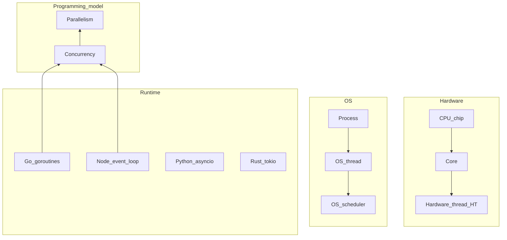

# Concurrency runtime model (Part 1)

**Use this:** When **core, thread, goroutine, and event loop** sound interchangeable—before [Project 7](../../career-project-specs/07-node-typescript-lab.md) or [Project 8](../../career-project-specs/08-go-retrieval-worker-lab.md).

**Reading order:**

1. **You are here** — layers + definitions
2. [Concurrency deep dives (Part 2)](concurrency-deep-dives.md) — Go M:N scheduler, Node at scale, CPU pipeline intuition
3. [Language fundamentals — Concurrency beyond syntax](../languages/language-fundamentals-comparison.md#concurrency-beyond-syntax) — per-language I/O vs CPU split
4. [Software engineering — Concurrency basics](software-engineering.md#concurrency-basics) — backpressure, worker pools, production mistakes
5. Ship a lab — [Project 8](../../career-project-specs/08-go-retrieval-worker-lab.md) (Go) or [Project 7](../../career-project-specs/07-node-typescript-lab.md) (Node)

**Companion:** [Software engineering glossary — concurrency terms](software-engineering-glossary.md) · [Memory and performance](memory-and-performance.md)

---

## Why layers matter

People say "Go is concurrent," "Node is single-threaded," "threads run in parallel," and "goroutines are lightweight threads." All of those can be true—but they refer to **different layers** of the stack. Mixing layers is the main source of confusion.

Each layer builds on the one below:

| Layer | Examples |
|-------|----------|
| **Hardware** | CPU chip → cores → hardware threads (hyper-threading) |
| **OS** | Processes → OS threads → scheduler |
| **Runtime** | Goroutines, event loops, asyncio tasks, tokio tasks |
| **Programming model** | Concurrency vs parallelism |

---

## Layer 1 — CPU, core, hardware thread

**CPU** is the physical chip.

**Core** is an independent execution unit on that chip. Each core runs **one instruction stream at a time** (at the micro-architecture level, pipelines overlap work—but think "one stream per core" for system design).

**Hardware thread (hyper-threading)** lets some cores expose **two** logical execution streams to the OS. That improves pipeline utilization when one stream stalls; it is **not** the same as adding a full second core. **Parallelism at the hardware level starts with core count:** eight cores can run eight instruction streams at the same instant (ignoring HT nuances).

---

## Layer 2 — Process and OS thread

**Process** is a running program with its own virtual memory space. Processes are isolated—one crash or leak does not corrupt another process's heap by default.

**Thread** is a unit of execution **inside** a process. Threads in the same process **share memory**, which enables fast communication but requires explicit synchronization (locks, channels, message passing) to avoid data races.

The **OS scheduler** assigns runnable OS threads to cores. When you have more runnable threads than cores, the OS **time-slices**—switching threads on and off. That creates **concurrency** (many tasks making progress) even on **one core**, but not **parallelism** (many tasks executing at the same instant).

**See also:** [Process vs thread](software-engineering-glossary.md#process-vs-thread)

---

## Layer 3 — Runtime (playbook stack)

Languages add a **runtime layer** on top of OS threads. Runtimes multiplex many lightweight tasks onto fewer OS threads.

| Runtime | Concurrency unit | Maps to OS threads | Playbook lab |
|---------|------------------|-------------------|--------------|
| **Go** | Goroutine | **M:N** — many goroutines → few OS threads | [Project 8](../../career-project-specs/08-go-retrieval-worker-lab.md) |
| **Node / TypeScript** | Event loop + libuv thread pool | **1 main thread** for JS + pool for some I/O/crypto | [Project 7](../../career-project-specs/07-node-typescript-lab.md) |
| **Python** | `asyncio` task or OS thread | Event loop; **GIL** limits parallel CPU bytecode in one process | [Project 2](../../career-project-specs/02-rag-llm-service.md), [Project 11](../../career-project-specs/11-llm-web-app-lab.md) |
| **PHP (FPM)** | Request worker process | ~**one request per worker**; scale by adding workers | [Project 1](../../career-project-specs/01-integration-webhook-receiver.md) |
| **Rust** | `tokio` task | Similar M:N model to Go | [Project 19](../../career-project-specs/19-rust-hot-path-lab.md) stretch |

**Green threads / fibers** (Java virtual threads, Ruby fibers, Kotlin coroutines at the JVM level) are the same *idea* as goroutines—user-space tasks scheduled by a runtime—but differ in maturity and integration. This playbook does not deep-dive them; know they exist when reading other stacks.

---

## Layer 4 — Concurrency vs parallelism

**Concurrency** means **many tasks in progress** at once. On one core, the OS or runtime **interleaves** them—you get concurrency through switching, not simultaneous execution.

**Parallelism** means **many tasks executing at the same instant**—which requires **multiple cores** (or multiple machines).

**Relationship:** every parallel program is concurrent, but not every concurrent program is parallel.

| Concept | What it really means |
|---------|----------------------|
| **Core** | Hardware that executes instructions |
| **OS thread** | OS-scheduled execution unit inside a process |
| **Goroutine** | Go runtime's user-space lightweight task |
| **Event loop** | Single thread scheduling many I/O completions |
| **Concurrency** | Many tasks in progress (may time-slice on one core) |
| **Parallelism** | Many tasks running simultaneously on multiple cores |
| **Go (typical)** | Concurrency by default; parallelism when `GOMAXPROCS > 1` |
| **Node (typical)** | Concurrency on I/O; limited parallelism unless `worker_threads` / cluster |

---

## Go in this model

Go structures programs as **many goroutines** that communicate via channels and respect **`context`** cancellation. The **Go scheduler** maps goroutines onto OS threads and then onto cores (Part 2 explains M:N).

- **Concurrency:** cheap—spawn goroutines for I/O fan-out, queue workers, HTTP handlers (with bounds).
- **Parallelism:** automatic when multiple cores are available and `GOMAXPROCS` allows it; you still must **cap** goroutines on CPU-heavy work ([Project 8](../../career-project-specs/08-go-retrieval-worker-lab.md) worker pool).

---

## Node.js in this model

Node gives you **concurrency** through a **single-threaded JavaScript event loop**: while one request awaits I/O, the loop runs other callbacks. **libuv** uses a small thread pool for some blocking system calls.

- **Concurrency:** default for network-heavy APIs and BFFs ([Project 7](../../career-project-specs/07-node-typescript-lab.md)).
- **Parallelism:** not on the main loop for CPU work—use **`worker_threads`**, **`cluster`**, or offload to Go/Python/Rust. Blocking sync file I/O or heavy JSON on the hot path **stalls all clients**.

**See also:** [Node event loop at scale (Part 2)](concurrency-deep-dives.md#node-event-loop-at-scale)

---

## Where operational guidance lives

This doc is **definitions and layers**. Production habits live elsewhere—read them **after** the model clicks:

| Topic | Doc |
|-------|-----|
| Go M:N scheduler, goroutines vs OS threads | [Concurrency deep dives (Part 2)](concurrency-deep-dives.md) |
| Per-language I/O vs CPU, syntax | [Concurrency beyond syntax](../languages/language-fundamentals-comparison.md#concurrency-beyond-syntax) |
| Worker pools, don't block the event loop | [Concurrency basics](software-engineering.md#concurrency-basics) |
| p95, RSS, backpressure under load | [Memory and performance](memory-and-performance.md) |

---

## See also

- [Go stack map](../languages/go.md) · [Node + TypeScript stack map](../languages/node-typescript-backend.md)
- [Stacks glossary](../languages/glossary.md)
- [Architecture framework — Pillar 4](architecture-framework.md#pillar-4--performance-and-language-boundaries)

---

## Technical reference

### Jargon quick lookup

| Term | One line |
|------|----------|
| **Core** | Hardware execution unit; parallelism starts here |
| **OS thread** | Kernel-scheduled execution inside a process |
| **Goroutine** | Go runtime lightweight task (M:N mapped to OS threads) |
| **Event loop** | Single thread scheduling I/O callbacks (Node, asyncio) |
| **M:N scheduling** | Many runtime tasks → fewer OS threads |
| **GOMAXPROCS** | Go setting for max OS threads running Go code simultaneously |
| **GIL** | Python global interpreter lock—limits parallel CPU in one process |
| **Concurrency** | Many tasks in progress (may time-slice on one core) |
| **Parallelism** | Many tasks executing at once on multiple cores |

### Glossary links

- [Concurrency](software-engineering-glossary.md#concurrency) · [Parallelism](software-engineering-glossary.md#parallelism)
- [Goroutine](software-engineering-glossary.md#goroutine) · [Event loop](software-engineering-glossary.md#event-loop)
- [GOMAXPROCS](software-engineering-glossary.md#gomaxprocs) · [M:N scheduling](software-engineering-glossary.md#mn-scheduling)
- [Process vs thread](software-engineering-glossary.md#process-vs-thread)

### Interview one-liners

- "Concurrency is structure; parallelism needs cores—Go gives both; Node gives I/O concurrency on one loop."
- "Goroutines are not OS threads—the runtime multiplexes them; I still cap worker pools under load."
