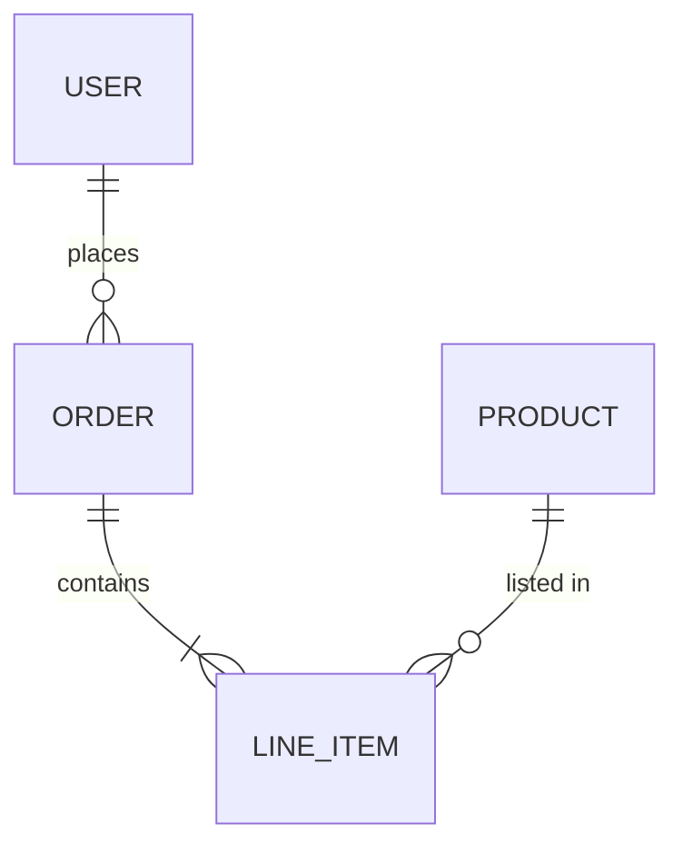
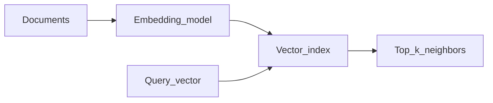

# Database design

**Use this:** When you need to **design tables, indexes, and migrations**—before [Project 4](../../archive/v1-22-step/career-project-specs/04-sql-performance-lab.md) or any lab with Postgres.

**Reading order:**

1. **You are here** — relational model, indexes, transactions
2. [SQL ecosystem map](../languages/sql.md) — dialect and EXPLAIN in your stack
3. [Project 4 — SQL performance](../../archive/v1-22-step/career-project-specs/04-sql-performance-lab.md) — measure query plans
4. [Memory and performance](memory-and-performance.md) — when slowness is app vs database

**Companion:** [Glossary](software-engineering-glossary.md) · [Software engineering](software-engineering.md) · [Command-line tooling](command-line-tooling.md)

Relational modeling, storage tradeoffs, vector search, and operational topics—in plain English for learning and interviews.

---

## Table of contents

- [Why databases exist](#why-databases-exist)
- [Relational model and ER thinking](#relational-model-and-er-thinking)
- [Keys and integrity](#keys-and-integrity)
- [Normalization](#normalization)
- [Indexes](#indexes)
- [ORMs and the N+1 query pattern](#orms-and-the-n1-query-pattern)
- [Transactions and ACID](#transactions-and-acid)
- [Migrations](#migrations)
- [Connection pooling](#connection-pooling)
- [Replication and read scaling](#replication-and-read-scaling)
- [CAP theorem (careful reading)](#cap-theorem-careful-reading)
- [SQL versus NoSQL families](#sql-versus-nosql-families)
- [OLTP versus OLAP](#oltp-versus-olap)
- [Vector databases and embeddings](#vector-databases-and-embeddings)
- [Time-series and graph stores](#time-series-and-graph-stores)
- [Full-text search](#full-text-search)
- [Change data capture](#change-data-capture)
- [Sharding and partitioning](#sharding-and-partitioning)
- [Data and access security](#data-and-access-security)
- [Interview checklist](#interview-checklist)

---

## Why databases exist

A database is persistent, concurrent, structured storage with a query language—Structured Query Language (SQL) is the most common example. Compared to plain files, databases give you coordinated concurrent access, durability after crashes, and declarative queries where you describe *what* you want rather than how to scan bytes on disk.

In practice, you reach for a database when multiple processes or users need consistent reads and writes, when you need constraints enforced centrally, and when ad hoc querying matters. The tradeoff is operational complexity: you must design schemas, manage connections, plan migrations, and tune performance rather than simply appending to a log file.

---

## Relational model and ER thinking

The relational model organizes data into **relations** (tables), **tuples** (rows), and **attributes** (columns), with **constraints** that define valid data shapes.



Entity-relationship (ER) thinking maps real-world entities and relationships onto tables linked by foreign keys (covered in the next section). A user places many orders; each order contains many line items; each line item references a product. This diagram is a design sketch—implementation adds primary keys, nullable columns, and indexes based on how the application actually reads and writes data.

---

## Keys and integrity

A **primary key** uniquely identifies a row in a table. Teams often use a surrogate key—an integer or Universally Unique Identifier (UUID) with no business meaning—because natural keys like email addresses can change over time.

A **foreign key** references a row in another table and enforces **referential integrity**: you cannot insert a child row pointing at a parent that does not exist, and delete behavior is explicit rather than accidental.

A **natural key** is business-meaningful (for example, an email address). Natural keys can change, which makes them awkward as primary keys; a common pattern is a surrogate primary key plus a unique constraint on the natural key.

When a parent row is deleted, `ON DELETE CASCADE` removes dependent child rows automatically, while `ON DELETE RESTRICT` blocks the delete if children exist. Cascade prevents orphan rows but can cause accidental mass deletes if someone deletes the wrong parent. Restrict is safer for critical hierarchies but pushes cleanup logic to application code.

---

## Normalization

Normalization reduces redundancy and update anomalies by organizing columns so each fact is stored once in the right place.

| Form | Idea |
|------|------|
| **1NF** | Atomic columns; repeating groups eliminated |
| **2NF** | No partial dependency on part of a composite key |
| **3NF** | No transitive dependency on non-key attributes |

**First normal form (1NF)** means each column holds a single atomic value—no lists inside a cell, no repeating column groups like `phone1`, `phone2`. You can still have redundancy at 1NF; the form is about shape, not eliminating duplication.

**Second normal form (2NF)** applies when the primary key is composite (multiple columns). No non-key column should depend on only part of that key. On an order line keyed by `(order_id, product_id)`, quantity depends on the full key, not on `order_id` alone.

**Third normal form (3NF)** means no non-key column depends on another non-key column—a transitive dependency through a middle attribute. Storing `customer_city` on every order row creates update anomalies: change the customer's city and you must update many order rows. Move city to a **Customer** table and orders reference the customer instead.

**Boyce-Codd normal form (BCNF)** handles certain anomalies that third normal form still allows. You rarely implement BCNF by name in day-to-day work, but interviewers may ask whether you know it exists and what problem it solves.

Denormalization deliberately introduces redundancy for read performance—materialized views, counter columns, or duplicated fields on hot paths. That is a valid tradeoff when reads dominate and you document how writes keep denormalized data consistent.

---

## Indexes

An index is a separate data structure that speeds lookups on one or more columns. The **B-tree** is the common default: it supports equality and range queries with roughly **O(log n)** probe cost versus **O(n)** for a full table scan.

A **covering index** includes all columns a query needs, so the database can satisfy the query from the index alone without touching the table heap—a useful pattern for read-heavy reporting queries.

Every index adds **write amplification**: inserts, updates, and deletes must update each index on the affected columns. Indexes hurt when columns have low selectivity (most rows share the same value), when tables are tiny, or when write-heavy paths accumulate too many indexes.

---

## ORMs and the N+1 query pattern

An **Object-Relational Mapper (ORM)** loads database tables as objects in application code—examples include Eloquent, SQLAlchemy, Entity Framework Core, and Django ORM. The **N+1 query problem** happens when the ORM lazily loads a relationship inside a loop: one query fetches the parent rows, then one extra query runs per parent to fetch children. What should be **O(1)** round trips becomes **O(n)**.

The example below shows what happens when code loops over users and touches `user.profile` for each one. **What:** two query shapes—one batched, one per row. **Why:** lazy loading is ergonomic in small tutorials but explodes latency on real pages. **When:** inspect logged SQL in staging whenever a list endpoint feels slow.

```text
-- Step 1: ORM loads all users shown on a page (1 query)
SELECT id, email FROM users LIMIT 100;

-- Step 2: Code loops; each access to user.profile triggers another query (N queries)
SELECT * FROM profiles WHERE user_id = 1;
SELECT * FROM profiles WHERE user_id = 2;
-- ... ×100
```

The fix is a single batched read—a join or an `IN (...)` clause—or an ORM **eager load** / `JOIN FETCH`:

```sql
SELECT u.*, p.*
FROM users u
JOIN profiles p ON p.user_id = u.id
WHERE u.id IN ( /* page of ids */ );
```

Indexes help each individual query run faster, but they cannot replace fewer round trips between the application and the database. ORM defaults often favor lazy loading; hot HTTP handlers reveal N+1 as latency cliffs. See also the language-specific notes in [Python](../languages/python.md), [PHP/Laravel](../languages/php-laravel.md), and the [SQL map](../languages/sql.md).

---

## Transactions and ACID

A **transaction** groups multiple statements into one atomic unit. **ACID** describes the guarantees most relational databases aim for:

| Letter | Meaning |
|--------|---------|
| **A**tomicity | All or nothing |
| **C**onsistency | Invariants preserved |
| **I**solation | Concurrent transactions see well-defined visibility |
| **D**urability | Committed data survives crashes |

**Atomicity** means either all statements in the transaction commit or none do—no half-applied bank transfers. Engines implement this with logs and rollback.

**Consistency** means the rules you care about—constraints, triggers, foreign keys—hold when the transaction ends. The database rejects or rolls back illegal states.

**Isolation** means concurrent transactions each see a coherent story. Without it you get **dirty reads** (reading uncommitted data), **non-repeatable reads** (the same row changes between reads in one transaction), and **phantom reads** (new rows appear in a repeated range query). Real engines offer **isolation levels**—read uncommitted, read committed, repeatable read, serializable—with different cost and anomaly tradeoffs; exact names and behavior vary by engine.

**Durability** means after **commit**, data survives crash or power loss. Write-ahead logging (WAL) and fsync policies determine the exact guarantee.

**Multi-Version Concurrency Control (MVCC)** gives readers a snapshot without blocking writers—common in PostgreSQL and others. Replication still lags behind the primary, so MVCC does not eliminate stale reads on replicas.

---

## Migrations

Migrations are version-controlled, forward-only schema change scripts run through CI/CD. You should never hand-edit production schema without automation—drift between environments causes subtle bugs and failed deploys.

For **zero-downtime** changes, use an expand/contract pattern: add a new nullable column, backfill data in the background, add constraints, switch application code to the new column, then remove the old column. Rushing a breaking change in one deploy step locks tables or breaks running instances.

---

## Connection pooling

Opening a new Transmission Control Protocol (TCP) connection to the database for every HTTP request exhausts server resources and adds latency. A **connection pool** reuses open connections across requests.

Pool size is a tradeoff: too few connections queue requests under load; too many waste memory on the database server and can trigger **connection storms** after deploys when every instance tries to connect at once. Tune pool size against observed latency and database connection limits.

---

## Replication and read scaling

**Replication** copies data from a **primary** (writer) to one or more **replicas** (readers). **Asynchronous** replication is common: replicas lag behind the primary by some amount of time.

That lag creates user-visible bugs if you read from a replica immediately after a write—the replica may not have the new row yet. **Read-your-writes** consistency fails unless you route critical reads to the primary or use session stickiness carefully. Sticky sessions can hide backend bugs until a node fails, so prefer stateless designs where possible.

---

## CAP theorem (careful reading)

The **CAP theorem** (Consistency, Availability, Partition tolerance) states that in a distributed system, when a **network partition** occurs, you cannot simultaneously guarantee full **consistency** and full **availability** for every operation. **Partition tolerance** is not optional in real distributed systems—networks fail—so under partition you choose how much consistency to sacrifice for availability, or vice versa.

Real systems offer **tunable** consistency: linearizable reads for critical paths, eventual consistency for others. CAP is a coarse teaching model. In senior interviews, avoid slogans like "pick two" without nuance—describe what your system actually guarantees during normal operation and during partition.

---

## SQL versus NoSQL families

| Family | Example use |
|--------|--------------|
| **Document** | Flexible schema, nested JSON—MongoDB, DynamoDB document mode |
| **Key-value** | Cache, sessions—Redis |
| **Wide-column** | Time-ordered big data—Cassandra |
| **Graph** | Traversals, relationships as first-class |

**Document stores** hold one JSON-like document per key. They fit when reads and writes are document-shaped and joins are rare. Watch for unbounded document growth and weak cross-document consistency guarantees.

**Key-value stores** offer O(1) get/put by key. Redis suits cache, sessions, and rate limits. They are not a substitute for complex queries unless you build secondary structures yourself.

**Wide-column stores** organize rows with dynamic columns; the partition key defines data locality—Cassandra-style. They handle high write throughput and time-series-ish patterns when partition design is clear.

**Graph stores** treat nodes and edges as first-class citizens. They shine for traversals—friends-of-friends, fraud rings—though operational and query complexity differs from relational joins.

**Rule of thumb:** start with relational when joins and constraints are core to the domain. Choose document when schema varies per record and access patterns are document-shaped.

---

## OLTP versus OLAP

| | OLTP | OLAP |
|---|------|------|
| Pattern | Many small transactions | Heavy scans, aggregations |
| Schema | Normalized | Often star/snowflake dimensional |
| Engines | Postgres, SQL Server rowstore | Column stores, warehouses |

**Online Transaction Processing (OLTP)** handles many short transactions—point lookups, inserts, updates—optimized for row storage, indexes, and low latency per operation. This is your production application database.

**Online Analytical Processing (OLAP)** runs heavy scans and aggregations over large history, often on **columnar** storage with partitioning and pre-aggregates. It is not tuned for single-row interactive updates.

Running analytical warehouse queries on the production OLTP database can starve transactional traffic. The usual pattern is **Extract, Transform, Load (ETL)** or **Extract, Load, Transform (ELT)**—move data into a separate warehouse, transform there if using ELT, and keep OLTP lean.

---

## Vector databases and embeddings

An **embedding model** maps text or images into high-dimensional **vectors**—arrays of numbers where similar meaning sits nearby in space. **Similarity search** finds nearest neighbors in that space, powering semantic search, recommendations, and **Retrieval-Augmented Generation (RAG)**.

**Approximate Nearest Neighbor (ANN)** indexes like **Hierarchical Navigable Small World (HNSW)** and **Inverted File (IVF)** trade recall for latency—you may miss the true nearest neighbor but get an answer fast. **Hybrid search** combines keyword ranking (BM25) with vector similarity for better relevance than either alone.

Tradeoffs include re-embedding cost when you change models, and **chunking** strategy—how you split documents before embedding—which materially affects RAG answer quality.

**Azure (cert overlay):** [Azure Database for PostgreSQL](software-engineering-glossary.md#azure-database-for-postgresql) Flexible Server with **pgvector** runs the same vector patterns as local Postgres—see [Project 4 Azure stretch](../../archive/v1-22-step/career-project-specs/04-sql-performance-lab.md#azure-certification-stretch) and [Azure cloud and AI](azure-cloud-and-ai.md#data-for-ai-workloads).



---

## Time-series and graph stores

**Time-series databases** store metrics and events keyed by timestamp. **Cardinality**—how many unique label combinations exist—and retention policies dominate operational cost. High-cardinality labels (per-user, per-request IDs as tags) explode storage.

**Graph databases** optimize traversal queries such as degrees of separation. For moderate depth, **recursive Common Table Expressions (CTEs)** in SQL can suffice without a dedicated graph engine—the tradeoff is query complexity and performance at scale.

---

## Full-text search

SQL `LIKE '%term%'` scans entire tables and performs poorly at scale. **Full-text search** engines—Elasticsearch, OpenSearch, SQL Server Full-Text Search—build **inverted indexes** over tokens and support relevance ranking. Use them when users search unstructured text across large corpora; use indexed equality/range queries when the access pattern is structured.

---

## Change data capture

**Change Data Capture (CDC)** streams row-level changes from the primary database to downstream consumers—warehouses, search indexes, analytics pipelines. Consumers operate under **eventual consistency**: they lag the source by some interval. CDC decouples OLTP from read models without polling every table on a schedule.

---

## Sharding and partitioning

**Horizontal sharding** splits rows across multiple database instances by a **shard key**—often user ID or tenant ID. It scales write throughput beyond a single machine. **Hot shards**—keys that receive disproportionate traffic—hurt fairness, complicate failover, and resist rebalancing. Partitioning within one engine (table partitions by date) is lighter-weight and solves retention/archival without full sharding complexity.

---

## Data and access security

**SQL injection** happens when user input is concatenated into SQL strings. Never do this—use **parameterized queries** or **prepared statements**. ORMs provide a safe default path, but raw SQL and dynamic query fragments can still be vulnerable.

Apply **least privilege**: the application role gets only the Data Manipulation Language (DML) it needs; migrations use a separate elevated role; reporting uses read-only credentials.

**Encryption at rest** protects data volumes; a **Key Management Service (KMS)** manages keys—know who can decrypt via Identity and Access Management (IAM) policies.

Classify **Personally Identifiable Information (PII)**: mask it in non-production environments and document which columns are sensitive.

**Backups** should be encrypted. Know your **Recovery Point Objective (RPO)**—how much data you can lose—and **Recovery Time Objective (RTO)**—how long restore takes. Restrict who can restore; restore capability equals breach capability.

**Row-level security** in PostgreSQL or SQL Server enforces per-tenant or per-user policies when multiple tenants share tables—a stronger model than application-only filtering for multi-tenant SaaS.

---

## Interview checklist

- **Primary vs foreign key**; what breaks without foreign key constraints.
- **1NF–3NF** with a small normalization example.
- **ACID** and isolation phenomenon names (dirty read, non-repeatable read, phantom read).
- **Index** why/when; covering index intuition.
- **Replication lag** and user-visible bugs.
- **SQL vs NoSQL** when to pick document or key-value.
- **OLTP vs OLAP** and star schema in one sentence.
- **Vector database** purpose; embeddings; RAG pipeline sketch.
- **SQL injection** mitigation.
- **CAP theorem** without false certainty.

---

## Technical reference

### Jargon quick lookup

| Term | One line |
|------|----------|
| **ACID** | Atomic, Consistent, Isolated, Durable transactions |
| **1NF / 2NF / 3NF** | Normalization levels—reduce redundant columns |
| **MVCC** | Multi-version concurrency—readers don't block writers |
| **CAP** | Under partition, choose consistency vs availability tradeoffs |
| **OLTP / OLAP** | Transaction processing vs analytics warehouses |
| **CDC** | Stream row changes to downstream systems |
| **RLS** | Postgres row-level security—DB-enforced tenant filters |
| **RPO / RTO** | How much data loss / downtime is acceptable in disaster |

### SQL commands

```sql
EXPLAIN (ANALYZE, BUFFERS) SELECT ...;
```

### Glossary links

- [ACID](software-engineering-glossary.md#acid-databases) · [N+1](software-engineering-glossary.md#n1-query-problem)
- [Expand/contract migration](software-engineering-glossary.md#expandcontract-migration) · [RLS](software-engineering-glossary.md#row-level-security-rls)
- [Replication lag](software-engineering-glossary.md#replication-lag--read-replica) · [Sharding](software-engineering-glossary.md#partition-key--sharding)

### Interview one-liners

- "I'd index the hot WHERE/JOIN columns and EXPLAIN ANALYZE before guessing."
- "Multi-tenant: tenant_id on every query—or Postgres RLS for defense in depth."
