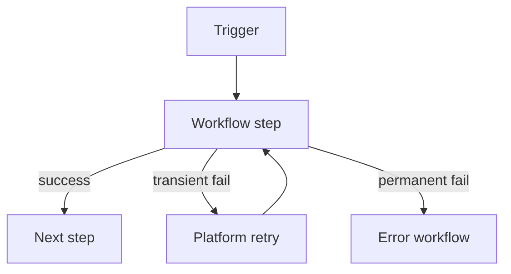

# Ecosystem map: Integration and automation platforms

**Use this:** Vocabulary for **Boomi**, **n8n**, and similar **workflow/automation** tools — mapped to playbook labs (webhooks, queues, idempotency), not vendor certification prep.

**Reading order:**

1. [Systems integration architect](systems-integration-architect.md) — sync vs async boundary
2. **You are here** — Boomi/n8n terms ↔ code patterns
3. [Project 1](../../career-project-specs/01-integration-webhook-receiver.md) → [Project 6](../../career-project-specs/06-async-worker-stretch.md) — same patterns in code

**Companion:** [Integration hardening checklist](../../checklists/integration-hardening.md) · [Messaging and RPC](messaging-and-rpc.md) · [Stacks glossary](../languages/glossary.md)

**New here?** [Plain language (bottom)](#plain-language-terms-used-on-this-page)

---

## Why this page exists

Visual integration tools (Boomi, n8n) and your code labs solve the same problems with different surfaces:

| Problem | Plain English | Code lab equivalent |
|---------|---------------|---------------------|
| Partner sends an event | **Trigger** fires | Webhook in [Project 1](../../career-project-specs/01-integration-webhook-receiver.md) |
| Steps run in order | **Process / workflow** | Queue chain [Project 6](../../career-project-specs/06-async-worker-stretch.md) |
| Step fails and retries | Platform **retry** | Worker retry + [DLQ](software-engineering-glossary.md#dead-letter-queue-dlq) |
| Same event delivered twice | Must not double-charge | [Idempotency key](software-engineering-glossary.md#idempotency) |

---

## Mental model

Integration platforms use a consistent vocabulary. The table below maps each concept to plain English and to the equivalent pattern in this playbook.

| Concept | Plain English | Playbook analogue |
|---------|---------------|-------------------|
| **Connector** | Adapter that talks to one system (Customer Relationship Management (CRM), database, HTTP API) | Your webhook receiver or outbound HTTP client in Project 1 / Project 7 |
| **Trigger** | Starts a process (schedule, webhook, file drop) | Inbound HTTP webhook in Project 1 |
| **Process / workflow** | Ordered steps with branches and error paths | Queue job chain Project 1 → Project 6 → Project 8 |
| **Map / transform** | Shape data between systems | Contract Data Transfer Objects (DTOs) in Project 5 OpenAPI |
| **Atom / step** | Single unit of work with retry policy | Idempotent handler + DLQ |
| **Execution** | One run of a workflow for one payload | Trace ID + structured logs in Project 3 |

---

## Patterns you already practice in code

### Fast ack + durable work

Boomi and n8n often **acknowledge** a trigger quickly while **downstream steps** run asynchronously. The same pattern appears in the playbook: a PHP webhook returns HTTP 200 after enqueue, and a **Go worker** completes processing ([Project 1](../../career-project-specs/01-integration-webhook-receiver.md) → [Project 6](../../career-project-specs/06-async-worker-stretch.md)). The partner gets a fast response; your system finishes the work reliably in the background.

### Idempotent steps

Connectors retry on failure. Your handlers must tolerate **duplicate delivery** using idempotency keys or natural keys in the database — see [integration hardening](../../checklists/integration-hardening.md).

### Error branches

Visual tools expose **success / failure / retry** paths. In code you implement the same idea with try/catch at boundaries, a **DLQ** after N failures, and alerts on poison messages.

### Replay

Re-running a failed execution with the same business key must not **double-charge** or **double-provision**. That is the same semantics as idempotent webhook plus worker design.

---

## n8n custom node skeleton (Illustrative)

```typescript
// Illustrative — INodeType.execute() calling your API with idempotency
const idempotencyKey = this.getNodeParameter("idempotencyKey", 0) as string;
await this.helpers.requestWithAuthentication.call(this, "myApi", {
  method: "POST",
  url: "/webhook",
  headers: { "Idempotency-Key": idempotencyKey },
  body: items[0].json,
});
```

See [Project 10 — Automation bot](../../career-project-specs/10-automation-bot-lab.md) · [Illustrative snippets](illustrative-snippets.md).

---

## Boomi vs code-first integration

| Approach | Pros | Cons | Use when |
|----------|------|------|----------|
| **iPaaS (Boomi, n8n UI)** | Fast partner onboarding; visual ops; non-engineers can tweak flows | Export/secret hygiene risk; harder to unit test graphs | Enterprise glue, many connectors, ops-owned tweaks |
| **Code-first (Project 1/6/7)** | Testable; versioned in git; CI gates on contracts | Slower for non-engineers to change | Core product integrations, money paths |
| **Hybrid** | UI for ops; custom nodes or microservices for hard paths | Two skill sets; split ownership | Common in mid-size SaaS |

| Decision factor | Lean iPaaS | Lean code-first |
|-----------------|------------|-----------------|
| Change frequency | Ops adjusts mappings weekly | Engineers own release train |
| Correctness bar | Idempotent replays + DLQ in platform | Idempotency keys + tests in repo ([P1](../../career-project-specs/01-integration-webhook-receiver.md)) |
| Secrets | Platform vault; watch export leaks | Env + secret manager; never in workflow JSON |
| Observability | Platform execution logs | Structured logs + `request_id` ([P3](../../career-project-specs/03-observability-lab.md)) |
| Partner contract | Map/transform in UI | OpenAPI + CI drift gate ([P5](../../career-project-specs/05-contract-first-api.md)) |

**Playbook stance:** prove code-first idempotency and DLQ on **one** broker, then say the same semantics apply in Boomi or n8n executions.

### Workflow retry diagram



---

## n8n (future lane)

Custom nodes in n8n are often **TypeScript** — which aligns with [Project 7 Node/TS lab](../../career-project-specs/07-node-typescript-lab.md) as a stretch goal. The workflow JSON is the artifact; secrets live outside the graph; test **error workflows** explicitly.

---

## Boomi (your anchor)

Process reporting plus document properties map to structured logs and correlation IDs ([Project 3 observability](../../career-project-specs/03-observability-lab.md)). Connector Software Development Kit (SDK) thinking maps to small **Go or PHP** services with strict contracts when a packaged connector is not enough.

---

## Read next (handbook)

- [Integration: sync, async, messaging](software-engineering.md#integration-sync-async-and-messaging)
- [Event-driven integration](software-engineering.md#event-driven-integration)
- [Systems integration architect](systems-integration-architect.md)

---

## Plain language: terms used on this page

| Term | Means |
|------|--------|
| **At-least-once** | A step may run more than once; design idempotency. |
| **DLQ** | Dead-letter queue — where poison/failed messages go for inspection. |
| **Correlation ID** | Same ID across steps so you can trace one business event in logs. |

---

## Technical reference

### Boomi vs code-first (summary)

| Approach | Lean when |
|----------|-----------|
| **iPaaS (Boomi, n8n UI)** | Many connectors; ops-owned mapping changes |
| **Code-first (P1/6/7)** | Money paths; git-reviewed contracts and tests |
| **Hybrid** | UI for ops; custom services for hard paths |

### n8n node skeleton

See [n8n custom node skeleton (Illustrative)](#n8n-custom-node-skeleton-illustrative) above.

### Glossary links

- [Idempotency](software-engineering-glossary.md#idempotency) · [Fast ack](software-engineering-glossary.md#fast-ack)
- [Correlation ID](software-engineering-glossary.md#correlation-id--request_id)

### Interview one-liner

- "Same idempotency and DLQ semantics in Boomi executions as in my webhook worker—I design steps to tolerate retries."
