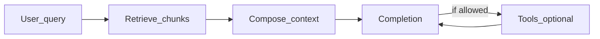

# Large language models (LLMs)

Concepts for **how modern text models behave**, **how retrieval and grounding differ from “just prompting,”** and **what shipping an LLM feature looks like next to ordinary backend practice**—evals, observability, latency/cost, and abuse boundaries.

**Companion docs:** [Software engineering](software-engineering.md) · [Database design](database-design.md) · [Per-project testing (evals + layering)](per-project-testing.md) · [AI-assisted unfamiliar stack](ai-assisted-unfamiliar-stack.md) · [Project 4: RAG / LLM service](../../career-project-specs/02-rag-llm-service.md) · [LLM feature ship checklist](../../checklists/llm-feature-ship.md)

---

## Table of contents

- [How this doc is organized](#how-this-doc-is-organized)
- [Tokens, context windows, and unpredictability](#tokens-context-windows-and-unpredictability)
- [Inference, retrieval, specialization, and tools](#inference-retrieval-specialization-and-tools)
- [RAG: retrieval, chunking, and citations](#rag-retrieval-chunking-and-citations)
- [Evaluation and regression on model outputs](#evaluation-and-regression-on-model-outputs)
- [Serving, latency, streaming, cost, observability](#serving-latency-streaming-cost-observability)
- [Safety, trust boundaries, data handling](#safety-trust-boundaries-data-handling)
- [Interview checklist](#interview-checklist)

---

## How this doc is organized

| Level | You should be able to… |
|--------|-------------------------|
| **Basic** | Define tokens/context; explain why identical prompts can yield different completions; sketch RAG vs “model knows everything”; name major operational risks (injection, PII leakage, silent drift). |
| **Intermediate** | Compare fine-tuning vs RAG vs tool use; reason about chunking and stale corpora; design a minimal eval + logging story that ties responses to **`request_id`** and optional **chunk ids**. |
| **Advanced** | Discuss provider tradeoffs (latency SLA, versioning, failover), degraded modes under timeout/cost pressure, and how **untrusted retrieved text** interacts with prompt structure—without treating the checklist as exhaustive security. |

**Do not confuse this page with workflows:** gate releases with **[LLM feature ship](../../checklists/llm-feature-ship.md)** and the lab contract in **[Project 4](../../career-project-specs/02-rag-llm-service.md)**.

---

## Tokens, context windows, and unpredictability

**Basic:**

- Models consume text as **tokens**—subword pieces, not strictly “words.” Billing, rate limits, and context limits are expressed in tokens.
- A **context window** is how much concurrent text (instructions + retrieval + conversation + output budget) fits in one request. Oversized payloads are truncated, summarized, rejected, or split—behavior depends on the stack.
- Sampling controls like **temperature** and **top-p** change **how stochastic** completions are at the token level—useful product knobs, not replacements for tests or grounding.

**Intermediate:**

- **Non-determinism** means flakiness is normal: flapping tests that assert exact strings are a smell unless you freeze seed/provider settings—but even then regressions slip through when prompts, models, or retrieval change.
- “Long context” reduces *some* truncation pain but raises **latency and cost**; it does **not** fix bad retrieval or adversarial injections.

---

## Inference, retrieval, specialization, and tools

**Basic:**

- **Inference** (running a trained model on new input) is what most product features use day to day.
- **Retrieval-augmented generation (RAG)** injects **your** documents or records into the prompt so answers can be **grounded** in provided text—see [RAG](#rag-retrieval-chunking-and-citations).
- **Fine-tuning / domain adaptation** adjusts model weights or adapters; useful when behavior must be systematically steered—but it is slower to iterate than prompt + retrieval changes and raises training/eval discipline.

**Intermediate:**

- **Tool use** or **agents** delegate steps to deterministic code (search APIs, calculators, ticketing systems). Benefits: factual hooks and repeatable actions. Risks: unbounded loops, over-broad abilities, ambiguous argument schemas—enforce **timeouts**, **allowlists**, and **human-readable logs** ([Software engineering — Observability](software-engineering.md#observability-logs-metrics-traces)).

---

## RAG: retrieval, chunking, and citations

**Basic:**

- **Indexing** converts documents into retrievable units—often chunked paragraphs or sections plus **embeddings** (vectors) for similarity search, sometimes combined with keyword/BM25 filters.
- **Grounding** means the model is instructed to rely on supplied chunks; **hallucination** still happens when retrieval is wrong, chunks conflict, or instructions are weak.

**Intermediate:**

- **Chunking tradeoffs:** tiny chunks improve precision but lose surrounding context; large chunks inflate noise in the prompt. Headers, structure-aware splits, and metadata (tenant, locale, freshness) materially change quality.
- **Staleness:** if the corpus updates often, embeddings and filters must refresh; stale answers often look plausible.
- Return **identifiers** alongside answers (see **`cited_chunk_ids`** in [Project 4](../../career-project-specs/02-rag-llm-service.md)) so support and debugging trace “wrong answer” to “wrong retrieval” versus “generation drift.”

**Database crossover:** embeddings stores and hybrid search patterns touch concepts in [Database design](database-design.md) (consistency + operational tradeoffs)—the implementation varies by vendor; the engineering habit is versioning indexes and documenting refresh semantics.

---

## Evaluation and regression on model outputs

**Basic:**

- A small **labeled eval set** (JSONL rows with questions + expected fragments + forbidden phrases) catches **regressions** when prompts, retrieval, chunking, or models change—the same intuition as snapshots for brittle prose.

**Intermediate:**

- **Eval JSONL complements unit tests**, it does **not** replace them: deterministic code paths (routing, preprocessing, serialization, BM25 boosts) still belong under normal automated tests ([Per-project testing — LLM/RAG layer](per-project-testing.md)).
- Separate **offline** harnesses vs **online** probes; watch for **evaluation leakage**—do not bake training examples into asserts you only ever tune against.

---

## Serving, latency, streaming, cost, observability

**Basic:**

- **Timeouts and fallbacks:** model calls stall; callers need budgets and degraded UX copy, not hangs.
- **Streaming** improves perceived latency over waiting for full completion—still correlates cost to tokens and needs abort handling when clients disconnect.

**Intermediate:**

- Log **`request_id`**, wall-clock **latency**, **model id**, and **token usage** when available; avoid logging full prompts in production if **PII** policy forbids it—align with [Security for applications](software-engineering.md#security-for-applications).
- **Cost control:** cap context, batch where safe, cache idempotent lookups, and alert on error/retry storms.

---

## Safety, trust boundaries, data handling

**Basic:**

- **Prompt injection:** untrusted user or web content pasted into chats can instruct the model to ignore policy. Mitigations blend architecture (separate trusted system text from retrieved/user layers), tooling limits, moderation, output filters, and product-level refusals—see **[LLM feature ship](../../checklists/llm-feature-ship.md)**.

**Intermediate:**

- **Data residency and retention:** know what providers log, train on, or sub-process; classify **secrets** vs **customer content**.
- Agents with powerful tools are a **privilege surface**—default deny, explicit allowlists, and auditable actions.

---

## Interview checklist

- **Token** vs **word**; **context window** and what happens when it overflows.
- **Why** two runs with the same prompt can differ; how **temperature/top-p** fit (qualitatively).
- **RAG** vs **fine-tuning** vs **tool use**—when each is appropriate.
- **Chunking** tradeoffs; **stale index** as a failure mode; **citations / chunk ids** for debuggability.
- **Eval JSONL** or similar for **regression**; why **unit tests** still matter on the pipeline.
- **Observability** on the model path: **request_id**, latency, tokens, model id; **PII** in logs.
- **Prompt injection** at a high level and one **mitigation** you’ve actually reasoned about (not just “use a better prompt”).
- **Cost/latency** tradeoffs: streaming, timeouts, caps, caching.
