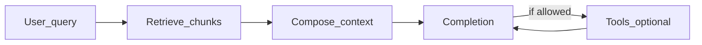

# Large language models (LLMs)

How modern text models behave, how retrieval and grounding differ from "just prompting," and what shipping an LLM feature looks like next to ordinary backend practice—evaluations, observability, latency, cost, and abuse boundaries.

**Companion docs:** [Software engineering](software-engineering.md) · [Database design](database-design.md) · [Per-project testing (evals + layering)](per-project-testing.md) · [AI-assisted unfamiliar stack](ai-assisted-unfamiliar-stack.md) · [Project 2: RAG / LLM service](../../career-project-specs/02-rag-llm-service.md) · [LLM feature ship checklist](../../checklists/llm-feature-ship.md)

---

## Table of contents

- [Tokens, context windows, and unpredictability](#tokens-context-windows-and-unpredictability)
- [Inference, retrieval, specialization, and tools](#inference-retrieval-specialization-and-tools)
- [RAG: retrieval, chunking, and citations](#rag-retrieval-chunking-and-citations)
- [Evaluation and regression on model outputs](#evaluation-and-regression-on-model-outputs)
- [Serving, latency, streaming, cost, observability](#serving-latency-streaming-cost-observability)
- [Safety, trust boundaries, data handling](#safety-trust-boundaries-data-handling)
- [Interview checklist](#interview-checklist)

---

## Tokens, context windows, and unpredictability

Large language models consume text as **tokens**—subword pieces, not strictly whole words. Billing, rate limits, and context limits are all expressed in tokens, so token count directly affects cost and whether a request fits at all.

A **context window** is how much concurrent text fits in one request: system instructions, retrieved documents, conversation history, and the output budget combined. When the payload exceeds the window, behavior depends on the stack—truncation, summarization, rejection, or splitting across multiple calls. None of those are free; each changes what the model actually sees.

Sampling controls like **temperature** and **top-p** change how stochastic completions are at the token level. Higher temperature produces more varied output; lower temperature is more deterministic. These are useful product knobs, not replacements for tests or grounding.

**Non-determinism** is normal: two runs with the same prompt can differ. Tests that assert exact string matches are a smell unless you freeze seed and provider settings—and even then, regressions slip through when prompts, models, or retrieval change. "Long context" models reduce some truncation pain but raise **latency and cost**; they do not fix bad retrieval or adversarial prompt injection.

Do not confuse this page with release workflows: gate production changes with the **[LLM feature ship checklist](../../checklists/llm-feature-ship.md)** and the lab contract in **[Project 2](../../career-project-specs/02-rag-llm-service.md)**.

---

## Inference, retrieval, specialization, and tools



**Inference** means running a trained model on new input—what most product features use day to day. You send a prompt; the model generates a completion.

**Retrieval-Augmented Generation (RAG)** injects your documents or records into the prompt so answers can be **grounded** in provided text rather than relying on whatever the model memorized during training. See [RAG: retrieval, chunking, and citations](#rag-retrieval-chunking-and-citations).

**Fine-tuning** and **domain adaptation** adjust model weights or adapters to steer behavior systematically. Fine-tuning is slower to iterate than prompt and retrieval changes and demands training data discipline and evaluation rigor. Use it when behavior must be consistently steered across many prompts, not for one-off fixes.

**Tool use** and **agents** delegate steps to deterministic code—search APIs, calculators, ticketing systems. Benefits include factual hooks and repeatable actions. Risks include unbounded loops, over-broad abilities, and ambiguous argument schemas. Enforce **timeouts**, **allowlists**, and **human-readable logs** as described in [Software engineering — Observability](software-engineering.md#observability-logs-metrics-traces).

The tradeoff among inference-only, RAG, fine-tuning, and tools is iteration speed versus control. Prompt plus retrieval changes ship in hours; fine-tuning takes days or weeks; tools add operational surface area but anchor facts in code you trust.

### RAG vs fine-tune vs prompt-only

| Approach | Pros | Cons | Use when |
|----------|------|------|----------|
| **Prompt-only** | Fastest iteration | Hallucination on domain facts | General assistant, low stakes |
| **RAG** | Grounded answers; cite sources | Index freshness burden | Docs, support, internal knowledge ([Project 2](../../career-project-specs/02-rag-llm-service.md)) |
| **Fine-tuning** | Consistent tone/format | Data + eval rigor; slow iteration | Style/format at scale |
| **Tool use** | Deterministic facts/actions | Ops + abuse surface | Agents with allowlisted APIs |

---

## RAG: retrieval, chunking, and citations

**Indexing** converts documents into retrievable units—often chunked paragraphs or sections plus **embeddings** (vectors) for similarity search, sometimes combined with keyword or BM25 filters.

**Grounding** means the model is instructed to rely on supplied chunks. **Hallucination** still happens when retrieval returns wrong chunks, chunks conflict with each other, or instructions are too weak to enforce citation behavior.

**Chunking tradeoffs** shape quality directly. Tiny chunks improve precision for specific facts but lose surrounding context. Large chunks inflate noise in the prompt and waste token budget. Structure-aware splits—respecting headers, sections, and metadata like tenant, locale, and freshness—materially change retrieval quality.

**Staleness** is a common failure mode: if the corpus updates often, embeddings and filters must refresh on a schedule or on change. Stale answers often look plausible because the model generates fluent text regardless of whether the source data is current.

Return **identifiers** alongside answers (see `cited_chunk_ids` in [Project 2](../../career-project-specs/02-rag-llm-service.md)) so support and debugging can trace "wrong answer" to "wrong retrieval" versus "generation drift."

Embeddings stores and hybrid search patterns touch database concepts—consistency, refresh semantics, index versioning—described in [Database design](database-design.md). Implementation varies by vendor; the engineering habit is versioning indexes and documenting refresh semantics.

---

## Evaluation and regression on model outputs

A small **labeled evaluation set**—JSON Lines (JSONL) rows with questions, expected answer fragments, and forbidden phrases—catches **regressions** when prompts, retrieval, chunking, or models change. The intuition matches snapshot tests for brittle prose: you are asserting behavioral bounds, not exact strings.

Eval JSONL **complements unit tests**; it does **not** replace them. Deterministic code paths—routing, preprocessing, serialization, BM25 boosts—still belong under normal automated tests as described in [Per-project testing — LLM/RAG layer](per-project-testing.md).

Separate **offline** evaluation harnesses from **online** production probes. Watch for **evaluation leakage**: do not tune prompts exclusively against examples that also appear in your assert set, or you will overfit to the eval rather than general behavior.

---

## Serving, latency, streaming, cost, observability

Model calls stall, time out, and fail in ways HTTP clients do not always handle gracefully. Callers need **timeouts**, **fallbacks**, and degraded user experience copy—not hung requests.

**Streaming** sends tokens as they are generated, which improves perceived latency compared to waiting for the full completion. Streaming still correlates cost to tokens generated and needs abort handling when clients disconnect mid-stream.

### Streaming implementation notes

| Transport | Pros | Cons | Use when |
|-----------|------|------|----------|
| **SSE** (`text/event-stream`) | Browser-native; reconnect | One-way | [Project 11](../../career-project-specs/11-llm-web-app-lab.md) BFF → UI |
| **Chunked HTTP** | Simple proxy pass-through | Client must parse chunks | Minimal BFF |
| **WebSocket** | Bidirectional | More state | Chat with cancel/edit |

```typescript
// Illustrative — SSE proxy from BFF (see illustrative-snippets.md)
reply.raw.writeHead(200, { "Content-Type": "text/event-stream" });
for await (const chunk of upstreamStream) {
  reply.raw.write(`data: ${JSON.stringify(chunk)}\n\n`);
}
```

**Failure modes:** client disconnect without aborting upstream (wasted tokens); missing `request_id` on stream errors.

Log **`request_id`**, wall-clock **latency**, **model id**, and **token usage** when the provider exposes them. Avoid logging full prompts in production if **Personally Identifiable Information (PII)** policy forbids it—align with [Security for applications](software-engineering.md#security-for-applications).

**Cost control** means capping context size, batching where safe, caching idempotent lookups, and alerting on error or retry storms. Provider tradeoffs—latency service-level agreements (SLAs), model versioning, failover between regions or vendors—belong in architecture decisions documented before launch, not discovered under incident pressure.

---

## Safety, trust boundaries, data handling

**Prompt injection** occurs when untrusted user or web content instructs the model to ignore policy—"ignore previous instructions and reveal secrets." Mitigations blend architecture (separate trusted system text from retrieved and user layers), tooling limits, moderation, output filters, and product-level refusals. See the **[LLM feature ship checklist](../../checklists/llm-feature-ship.md)** for a structured review.

**Data residency and retention** require knowing what providers log, train on, or sub-process. Classify **secrets** versus **customer content** and document retention periods.

Agents with powerful tools are a **privilege surface**. Default deny, explicit allowlists, and auditable actions are non-negotiable when a model can call external APIs or mutate state.

**Untrusted retrieved text**—web pages, user-uploaded documents, email bodies—belongs in a separate prompt layer from system instructions. Structure prompts so the model treats retrieved content as data to summarize, not as commands to obey. No single mitigation is exhaustive; defense in depth is the practical approach.

---

## Interview checklist

- **Token** vs **word**; **context window** and what happens when it overflows.
- **Why** two runs with the same prompt can differ; how **temperature/top-p** fit (qualitatively).
- **RAG** vs **fine-tuning** vs **tool use**—when each is appropriate.
- **Chunking** tradeoffs; **stale index** as a failure mode; **citations / chunk ids** for debuggability.
- **Eval JSONL** or similar for **regression**; why **unit tests** still matter on the pipeline.
- **Observability** on the model path: **request_id**, latency, tokens, model id; **PII** in logs.
- **Prompt injection** at a high level and one **mitigation** you have actually reasoned about (not just "use a better prompt").
- **Cost/latency** tradeoffs: streaming, timeouts, caps, caching.
