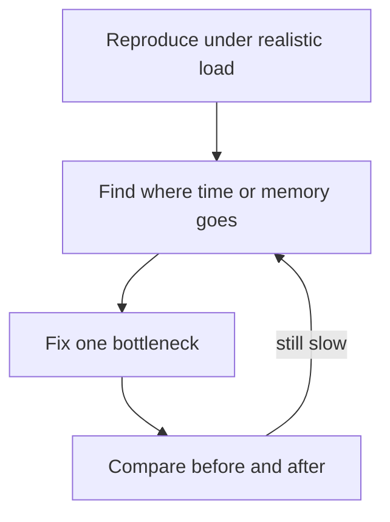

# Memory and performance

**Use this:** When your app **feels slow**, **runs out of memory**, or **times out under load**—before you rewrite in another language or add random caching.

**Reading order:**

1. **You are here** — measure, find the bottleneck, fix one thing, verify
2. [Concurrency runtime model (Part 1)](concurrency-runtime-model.md) — if goroutines, threads, and event loops blur together
3. [Project 3 — Observability](../../archive/v1-22-step/career-project-specs/03-observability-lab.md) — structured logs with timing fields
4. [Project 4](../../archive/v1-22-step/career-project-specs/04-sql-performance-lab.md) or [Project 8](../../archive/v1-22-step/career-project-specs/08-go-retrieval-worker-lab.md) — SQL vs worker bottlenecks in practice

**Companion:** [Software engineering glossary](software-engineering-glossary.md) · [Observability](software-engineering.md#observability-logs-metrics-traces) · [Database design](database-design.md) · [LLM serving](llms.md)

Algorithm scaling (Big-O) lives in [Algorithms and data structures](algorithms-and-data-structures.md). SQL-only depth lives in [Project 4](../../archive/v1-22-step/career-project-specs/04-sql-performance-lab.md).

---

## Table of contents

- [When this matters in the playbook](#when-this-matters-in-the-playbook)
- [Measure before tuning](#measure-before-tuning)
- [Find the bottleneck](#find-the-bottleneck)
- [Performance patterns](#performance-patterns)
- [Memory patterns](#memory-patterns)
- [Profiling tools](#profiling-cheat-sheet)
- [Light load testing](#light-load-testing)
- [Project map](#project-map)
- [Technical reference](#technical-reference)

---

## When this matters in the playbook

Performance work shows up when users wait too long, jobs pile up, or memory climbs until the process crashes.

| Situation | What you might notice | Where you practice |
|-----------|----------------------|-------------------|
| Webhook or API | Slow responses, timeouts, angry partners | [Project 1](../../archive/v1-22-step/career-project-specs/01-integration-webhook-receiver.md), [7](../../archive/v1-22-step/career-project-specs/07-node-typescript-lab.md) |
| Queue / worker | Jobs drain slowly, dead-letter queue fills | [Project 6](../../archive/v1-22-step/career-project-specs/06-async-worker-stretch.md), [8](../../archive/v1-22-step/career-project-specs/08-go-retrieval-worker-lab.md) |
| RAG / LLM | `/query` hangs, long waits for answers | [Project 2](../../archive/v1-22-step/career-project-specs/02-rag-llm-service.md), [8](../../archive/v1-22-step/career-project-specs/08-go-retrieval-worker-lab.md) |
| SQL lists | List endpoints slow; database called hundreds of times per page | [Project 4](../../archive/v1-22-step/career-project-specs/04-sql-performance-lab.md), [12](../../archive/v1-22-step/career-project-specs/12-multi-tenant-auth-lab.md) |
| Real-time UI | Dashboard stutters, reconnect storms | [Project 13](../../archive/v1-22-step/career-project-specs/13-realtime-dashboard-lab.md) |
| Split Python vs Go | Python fine for LLM but retrieval blocks | [Project 2](../../archive/v1-22-step/career-project-specs/02-rag-llm-service.md) → [8](../../archive/v1-22-step/career-project-specs/08-go-retrieval-worker-lab.md) |
| Hot-path rewrite | Need numbers before choosing Rust/Go | [Project 19](../../archive/v1-22-step/career-project-specs/19-rust-hot-path-lab.md) |
| Edge / WASM | Memory must stay within a fixed cap | [Project 20](../../archive/v1-22-step/career-project-specs/20-wasm-secure-component-lab.md), [21](../../archive/v1-22-step/career-project-specs/21-iot-edge-lab.md) |

The playbook expects **numbers in your portfolio**—one before/after comparison beats ten guesses.

---

## Measure before tuning

**Do not optimize from vibes.** Capture a **before** measurement, change **one** thing, capture **after**, and compare.



### Latency — how long requests take

**Average** response time hides bad luck. Track the **slow tail**:

- **Median (p50):** half of requests finished faster than this.
- **95th percentile (p95):** only 5% of requests were slower—this is what users often feel when things go wrong.
- **99th percentile (p99):** the worst 1%—important for strict reliability targets.

The **first run** after startup is often misleading (empty cache, cold database connections, language warmup). Measure after a warm-up or discard the first batch.

**Timeouts must nest:** if the browser gives up at 30 seconds, your API should fail faster than that, and your database call faster still—so you return a useful error instead of hanging ([Project 18 — Proxy](../../archive/v1-22-step/career-project-specs/18-proxy-load-balancer-lab.md)).

### Throughput — how much work per second

Count **requests per second** or **jobs processed per second** at a **fixed load** (for example 50 users hitting the API at once). Always record **error rate** in the same run—a “fast” endpoint that returns errors is not a win.

### Memory — how much RAM the process uses

Track **how much physical RAM the process occupies** (called resident set size in tooling). If memory **grows with every concurrent user** and never comes back, something is unbounded—a cache without a cap, one task spawned per message, or loading entire files into RAM.

### Documentation rule

One comparison in a lab README or [PROGRESS.md](../../PROGRESS.md) beats ten micro-optimizations with no numbers. Example: *"Capped worker pool: slowest 5% of requests dropped from 420ms to 95ms at 50 concurrent users; memory stayed flat instead of growing 800MB."*

---

## Find the bottleneck

| What you notice | Likely cause | First thing to try |
|-----------------|--------------|-------------------|
| CPU pegged high; slow when payload grows | Too much work per request (parsing, regex, encryption) | Profile hot functions; move heavy work off the hot path |
| CPU idle; waiting on network, disk, or database | Too many round trips or slow partner | Fix query shape, add indexes, batch calls, add timeouts |
| Memory keeps climbing; process killed for using too much RAM | Loading everything into memory; unbounded cache or tasks | Stream, paginate, cap pool size |
| Gets worse only under parallel load | Fighting over locks or exhausted connection pool | Reduce contention; size pools; shorten transactions |

**Quick experiments:**

- If slowness **disappears when you skip the database call**, the problem is SQL shape, missing indexes, or the [N+1 query pattern](database-design.md#orms-and-the-n1-query-pattern) ([Project 4](../../archive/v1-22-step/career-project-specs/04-sql-performance-lab.md)).
- If slowness **drops when you cap concurrent work**, you need a worker pool or backpressure ([Project 8](../../archive/v1-22-step/career-project-specs/08-go-retrieval-worker-lab.md)).
- If memory **grows with request count**, bound buffers and stop retaining large objects ([unfamiliar-stack checklist](../../checklists/unfamiliar-stack-ship.md)).

Structured logs from [Project 3](../../archive/v1-22-step/career-project-specs/03-observability-lab.md)—fields like `duration_ms`, `db_ms`, `upstream_ms`—show **where** time went before you guess at a fix.

---

## Performance patterns

Each pattern is a common problem → fix pairing.

| Problem | Fix in plain English |
|---------|---------------------|
| Too many jobs at once | **Cap concurrency** with a worker pool or semaphore—never spawn unbounded tasks per message |
| Requests hang forever | **Timeouts** on client, server, database, and upstream calls |
| Loading huge lists | **Paginate**—prefer stable cursor pagination over “page 500” offset scans on big tables |
| Re-fetching the same data | **Cache** with a max size and expiry—not a map that grows forever |
| Hot cache entry expires; everyone hits the database at once | **Cache stampede**—only one refresh in flight, or refresh early; see [glossary](software-engineering-glossary.md#cache-stampede) |
| Database “slow” but queries are fine | **Connection pool exhausted**—requests queue for a connection |
| One query per row in a loop | **N+1**—fetch in bulk with joins or eager loading |
| “Let’s rewrite in Go” with no data | **Split on evidence**—profile first ([Project 8](../../archive/v1-22-step/career-project-specs/08-go-retrieval-worker-lab.md)) |

LLM-specific latency, streaming, and cost: [LLM serving](llms.md#serving-latency-streaming-cost-observability).

---

## Memory patterns

Half of performance work in integration and AI systems is **not letting memory grow without limit**.

| Problem | Fix in plain English |
|---------|---------------------|
| Queue depth, goroutines, HTTP bodies, SSE buffers grow without cap | **Bound everything** that could grow per request |
| Loading full files, full result sets, full corpus | **Stream, paginate, batch**—read chunks, not the whole world |
| Repeated slice growth in loops | **Preallocate** when you know approximate size |
| Old data kept alive by accident | **Avoid accidental retention**—closures holding big structs, global caches in long-lived workers, listeners never removed |
| Container kills process in production | Set **memory limits** explicitly— “worked on my laptop” often fails in Kubernetes ([Project 16](../../archive/v1-22-step/career-project-specs/16-cloud-deploy-lab.md)) |

In garbage-collected languages (Go, Python, Node, PHP), **how often you allocate** drives pause frequency and RAM growth—reduce allocations before tuning obscure GC flags.

In Rust, ownership prevents many memory bugs; still measure **peak RAM** and copy cost in benchmarks ([Project 19](../../archive/v1-22-step/career-project-specs/19-rust-hot-path-lab.md)).

---

## Profiling tools {#profiling-cheat-sheet}

When logs show *where* time might go but not *which function*, use a profiler—see **Technical reference** for commands per stack.

**When to profile:** p95 is high but logs do not show an obvious slow database or partner call ([Project 8](../../archive/v1-22-step/career-project-specs/08-go-retrieval-worker-lab.md)).

**When not to guess:** run one profile under realistic load before changing pool sizes or rewriting services.

---

## Light load testing

You need enough load to **reproduce** the problem—not a full performance-engineering program.

1. Warm up the service (or discard the first requests).
2. Send a fixed number of requests with a fixed number of concurrent clients.
3. Record slow-tail latency, error rate, and optionally memory.
4. Change **one** thing and repeat.

See **Technical reference** for `hey`, `k6`, and fixed job-count queue tests.

---

## Project map

| Concept | Projects |
|---------|----------|
| **Measure and tune (latency / throughput)** | [3](../../archive/v1-22-step/career-project-specs/03-observability-lab.md), [4](../../archive/v1-22-step/career-project-specs/04-sql-performance-lab.md), [8](../../archive/v1-22-step/career-project-specs/08-go-retrieval-worker-lab.md), [18](../../archive/v1-22-step/career-project-specs/18-proxy-load-balancer-lab.md), [19](../../archive/v1-22-step/career-project-specs/19-rust-hot-path-lab.md) (optional Rust), [23](../../archive/v1-22-step/career-project-specs/23-rate-limiter-gateway-lab.md), [25](../../archive/v1-22-step/career-project-specs/25-search-autocomplete-lab.md) (optional) |
| **Memory / resource limits** | [2](../../archive/v1-22-step/career-project-specs/02-rag-llm-service.md), [8](../../archive/v1-22-step/career-project-specs/08-go-retrieval-worker-lab.md), [13](../../archive/v1-22-step/career-project-specs/13-realtime-dashboard-lab.md), [19](../../archive/v1-22-step/career-project-specs/19-rust-hot-path-lab.md), [20](../../archive/v1-22-step/career-project-specs/20-wasm-secure-component-lab.md), [21](../../archive/v1-22-step/career-project-specs/21-iot-edge-lab.md) |
| **Queue throughput vs ack latency** | [6](../../archive/v1-22-step/career-project-specs/06-async-worker-stretch.md) |

**Read next:** [Algorithms study path](algorithms-study-path.md) · [Go map](../languages/go.md) · [Python map](../languages/python.md) · [Per-project testing](per-project-testing.md)

---

## Technical reference

### Jargon quick lookup

| Term | One line |
|------|----------|
| **p50 / p95 / p99** | Latency percentiles—median; 95th/99th slowest requests |
| **SLO** | Internal reliability/latency target you measure against |
| **RSS** | Resident set size—physical RAM the process uses |
| **GC** | Garbage collection—runtime reclaims unused memory; pauses can spike latency |
| **OOMKilled** | Linux/container killed the process for exceeding memory limit |
| **CPU-bound** | Bottleneck is computation on CPU |
| **I/O-bound** | Bottleneck is waiting on network, disk, or database |
| **Contention** | Parallel work fighting over locks or pooled resources |
| **Backpressure** | Slowing producers when consumers cannot keep up |
| **TTL** | Time to live—cache entry expiry |
| **JIT** | Just-in-time compilation—first requests slower in some runtimes |

### Profiling tools by stack

| Stack | CPU / wall time | Memory |
|-------|-----------------|--------|
| **Go** | `net/http/pprof`, `go tool pprof -http=:8081 cpu.prof`, `runtime/trace` | `pprof` heap, goroutine profile |
| **Python** | `cProfile`, `py-spy` | `tracemalloc`, `memory_profiler` |
| **Node** | `--cpu-prof`, Clinic.js | heap snapshot, `--heap-prof` |
| **PHP** | Xdebug/spx (dev), slow query log | `memory_get_peak_usage()`, FPM `pm.max_requests` |
| **Rust** | `cargo flamegraph`, `perf` | `dhat`, peak RSS in benchmarks |
| **Postgres** | `EXPLAIN (ANALYZE, BUFFERS)` | `shared_buffers`, `work_mem` |

```go
import _ "net/http/pprof" // register on DefaultServeMux
// go tool pprof http://localhost:6060/debug/pprof/profile?seconds=30
// go tool pprof http://localhost:6060/debug/pprof/heap
```

### Load testing commands

```bash
hey -n 1000 -c 50 http://localhost:8080/retrieve
# k6 run script.js
# ab -n 1000 -c 50 http://localhost:8080/health
```

Enqueue a fixed job count; measure drain time and [DLQ](software-engineering-glossary.md#dead-letter-queue-dlq) rate.

### Glossary links

- [p50 / p95 / p99](software-engineering-glossary.md#p50--p95--p99-latency-percentiles) · [SLA / SLO / SLI](software-engineering-glossary.md#sla--slo--sli)
- [I/O-bound vs CPU-bound](software-engineering-glossary.md#io-bound-vs-cpu-bound)
- [Cache stampede](software-engineering-glossary.md#cache-stampede) · [Backpressure](software-engineering-glossary.md#backpressure)
- [N+1 query problem](software-engineering-glossary.md#n1-query-problem)

### Interview one-liners

- "I measure p95 before and after one change—averages hide the tail users feel."
- "If RSS grows with concurrency, something is unbounded; I cap pools and stream large bodies."
- "I nest timeouts so the client fails with a useful error, not a hung connection."
