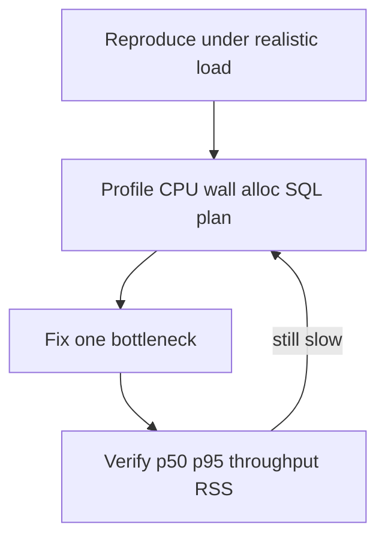

# Memory and performance

Runtime tuning literacy for this playbook: measure, find the bottleneck, fix one thing, verify. Covers latency, throughput, memory, and profiling—not algorithm Big-O (see [Algorithms and data structures](algorithms-and-data-structures.md)) or SQL-only depth (see [Project 4](../../career-project-specs/04-sql-performance-lab.md)).

**Companion docs:** [Software engineering](software-engineering.md) · [Observability](software-engineering.md#observability-logs-metrics-traces) · [LLM serving](llms.md) · [Database design](database-design.md)

---

## Table of contents

- [When this matters in the playbook](#when-this-matters-in-the-playbook)
- [Measure before tuning](#measure-before-tuning)
- [Find the bottleneck](#find-the-bottleneck)
- [Performance patterns](#performance-patterns)
- [Memory patterns](#memory-patterns)
- [Profiling cheat sheet](#profiling-cheat-sheet)
- [Light load testing](#light-load-testing)
- [Project map](#project-map)

---

## When this matters in the playbook

| Situation | Typical signal | Where you practice |
|-----------|----------------|-------------------|
| Webhook / API SLO | p95 latency, timeout storms | Projects 1, 7, 17 |
| Queue throughput | jobs/sec, DLQ growth | Projects 6, 8 |
| RAG retrieval fan-out | slow `POST /query`, high token wait | Projects 2, 8 |
| SQL list endpoints | p95 cliffs, N+1 | Projects 4, 5, 12 |
| Real-time UI | reconnect storms, janky DOM | Project 13 |
| Service split decision | Python CPU vs I/O bound | Projects 2 → 8 |
| Hot-path ADR | p95 + RSS vs Go baseline | Project 19 |
| Edge / WASM | bounded linear memory | Projects 19, 20 |

Performance work shows up whenever a Service Level Objective (SLO) is at risk—tail latency spikes, memory growth under concurrency, or throughput plateaus. The playbook projects above give concrete places to reproduce and fix these patterns with numbers, not intuition.

---

## Measure before tuning

Do not optimize from vibes. Capture a **before** measurement, change **one** thing, capture **after**, and compare.

### Latency

Report **p50, p95, and p99** percentiles—not only averages. Tail latency is what users and SLOs feel; a healthy average can hide miserable experiences for one request in twenty.

Note **warm versus cold** behavior: Just-In-Time (JIT) compilation warmup, connection pool fill on first requests, and empty caches all make the first run unrepresentative.

Align measurements with **timeout budgets**: client timeout, upstream timeout, and job deadline must nest correctly—each layer needs headroom below the layer above (see [Project 18](../../career-project-specs/18-proxy-load-balancer-lab.md)).

### Throughput

Measure **requests per second** or **jobs per second** at fixed concurrency—for example, 50 concurrent clients or 10 worker goroutines. Include **error rate** in the same run. A faster path that returns HTTP 500 responses is not a win.

### Memory

Track **Resident Set Size (RSS)**—physical memory the process occupies—plus heap in use, allocation rate, and garbage collection (GC) pause time where applicable. Under load, if RSS grows **linearly with concurrency**, suspect unbounded buffers, goroutines, or caches that retain data per request.

### Documentation rule

One comparison in a lab README or [PROGRESS.md](../../PROGRESS.md) Architecture Decision Record (ADR) beats ten micro-optimizations with no numbers. Example: *"Bounded worker pool: p95 420ms → 95ms at 50 concurrent; RSS flat vs +800MB unbounded goroutines."*



---

## Find the bottleneck

| Class | Symptoms | First checks |
|-------|----------|--------------|
| **CPU-bound** | High CPU, latency scales with payload size | hot loop, JSON encode, regex on large bodies |
| **I/O-bound** | CPU idle, waiting on network/disk/DB | N+1 queries, slow partner HTTP, queue wait |
| **Memory-bound** | RSS climbs, OOMKilled, GC thrash | load-all, unbounded cache, one goroutine per message |
| **Contention** | Latency spikes under parallel load | lock convoys, exhausted connection pool, row locks |

If p95 drops when you **remove the database call**, the problem is query shape, missing indexes, or N+1 round trips ([Project 4](../../career-project-specs/04-sql-performance-lab.md)).

If p95 drops when you **cap concurrency**, you need backpressure or pool sizing ([Project 8](../../career-project-specs/08-go-retrieval-worker-lab.md)).

If RSS climbs with **request count**, bound buffers, stream response bodies, and drop retained references ([unfamiliar-stack checklist](../../checklists/unfamiliar-stack-ship.md)).

Structured logs from [Project 3](../../career-project-specs/03-observability-lab.md)—fields like `duration_ms`, `db_ms`, `upstream_ms`—tell you **where** to profile next before you guess at the fix.

---

## Performance patterns

**Bound concurrency** with worker pools or semaphores. Never spawn unbounded goroutines or async tasks per message—under load, that exhausts memory and scheduling capacity.

**Timeouts everywhere**: client, upstream, job context. Proxies should enforce budgets so slow backends do not hold connections indefinitely ([Project 18](../../career-project-specs/18-proxy-load-balancer-lab.md)).

**Batch and paginate** at scale. Keyset pagination beats offset pagination on large tables. Embed and index documents in batches rather than one at a time ([Projects 4](../../career-project-specs/04-sql-performance-lab.md), [2](../../career-project-specs/02-rag-llm-service.md)).

**Cache deliberately** with Time To Live (TTL), maximum size, and explicit invalidation. Unbounded in-process maps become memory leaks dressed as optimizations.

**Connection pooling** reuses database and HTTP connections. Pool exhaustion looks like latency spikes, not slow SQL—the queries themselves are fine but requests queue waiting for a connection.

**Avoid N+1 queries** with eager loading or joins. See [ORMs and N+1](database-design.md#orms-and-the-n1-query-pattern).

**Split services on evidence**, not preference. Move retrieval to Go when profiling shows Python hitting an I/O concurrency limit, not by default ([Project 8](../../career-project-specs/08-go-retrieval-worker-lab.md)).

For LLM-specific latency, streaming, and cost caps, see [Serving, latency, streaming](llms.md#serving-latency-streaming-cost-observability).

---

## Memory patterns

Memory work is half of performance work in integration and AI systems.

**Bound everything that could grow without limit**: goroutines, queue depth, HTTP body size, in-memory evaluation caches, Server-Sent Events (SSE) client buffers.

**Stream, paginate, and batch** instead of loading a full corpus, full HTTP body, or full result set into memory. Cap response body bytes—for example, Go's `io.LimitReader`.

**Preallocate when size is known**—Go's `make([]T, 0, n)` avoids repeated slice growth; in Python, list comprehensions often beat repeated append in hot loops ([algorithms study path](algorithms-study-path.md)).

**Avoid accidental retention**: closures holding large structs, global singleton caches in long-lived PHP Octane workers, undropped event listeners in browser or Node code.

**Copy versus reference** matters in systems languages: Go slice aliasing can surprise you; unnecessary `.clone()` in Rust hot paths adds cost ([Project 19](../../career-project-specs/19-rust-hot-path-lab.md)).

In **GC languages** (Go, Python, Node, PHP long-lived workers), allocation rate drives GC pause frequency and RSS growth—reduce allocations before tuning GC flags.

In **Rust**, ownership prevents many memory bugs, but still measure peak RSS and clone cost in benchmarks.

In **containers**, set memory limits explicitly. **OOMKilled** (Out Of Memory killed by the orchestrator) means "worked on my laptop" failed in production ([Projects 15–16](../../career-project-specs/16-cloud-deploy-lab.md)).

---

## Profiling cheat sheet

Practical first tools—not an exhaustive catalog.

| Stack | CPU / wall | Memory |
|-------|------------|--------|
| **Go** | `net/http/pprof`, `go tool pprof -http=:8081 cpu.prof`, `runtime/trace` | `pprof` heap, goroutine profile |
| **Python** | `cProfile`, `py-spy` (sampling) | `tracemalloc`, `memory_profiler` |
| **Node** | `--cpu-prof`, Clinic.js (optional) | heap snapshot, `--heap-prof` |
| **PHP** | Xdebug/spx (dev), slow query log | `memory_get_peak_usage()`, FPM `pm.max_requests` |
| **Rust** | `cargo flamegraph`, `perf` | `dhat`, peak RSS in benchmark harness |
| **Postgres** | `EXPLAIN (ANALYZE, BUFFERS)` | `shared_buffers`, `work_mem` — see [Project 4](../../career-project-specs/04-sql-performance-lab.md) |

**What:** register Go's pprof HTTP handlers and capture CPU or heap profiles. **Why:** find hot functions and goroutine leaks under realistic load. **When:** p95 is high but logs do not show obvious I/O wait ([Project 8](../../career-project-specs/08-go-retrieval-worker-lab.md)).

```go
import _ "net/http/pprof" // register on DefaultServeMux
// go tool pprof http://localhost:6060/debug/pprof/profile?seconds=30
// go tool pprof http://localhost:6060/debug/pprof/heap
```

---

## Light load testing

Enough to **reproduce** a problem—not a full performance-engineering curriculum.

| Tool | Use |
|------|-----|
| **`hey`** | HTTP: `hey -n 1000 -c 50 http://localhost:8080/retrieve` |
| **`k6`** | Scripted scenarios, p95 in summary |
| **`ab`** | Simple Apache bench smoke |
| **Fixed job count** | Enqueue N jobs; measure drain time and Dead Letter Queue (DLQ) rate |

**What:** send 1000 requests with 50 concurrent clients. **Why:** establish baseline p95 and error rate before and after a change. **When:** you have a reproducible local endpoint and need numbers for an ADR.

Record concurrency, duration, **p95**, error rate, and optionally RSS before and after each run.

---

## Project map

| Concept | Projects |
|---------|----------|
| **Measure and tune (latency / throughput)** | [3](../../career-project-specs/03-observability-lab.md), [4](../../career-project-specs/04-sql-performance-lab.md), [8](../../career-project-specs/08-go-retrieval-worker-lab.md), [18](../../career-project-specs/18-proxy-load-balancer-lab.md), [19](../../career-project-specs/19-rust-hot-path-lab.md) (optional Rust), [23](../../career-project-specs/23-rate-limiter-gateway-lab.md), [25](../../career-project-specs/25-search-autocomplete-lab.md) (optional Go-first depth) |
| **Memory / resource limits** | [2](../../career-project-specs/02-rag-llm-service.md), [8](../../career-project-specs/08-go-retrieval-worker-lab.md), [13](../../career-project-specs/13-realtime-dashboard-lab.md), [18](../../career-project-specs/19-rust-hot-path-lab.md), [19](../../career-project-specs/20-wasm-secure-component-lab.md), [20](../../career-project-specs/21-iot-edge-lab.md) |
| **Queue throughput vs ack latency** | [6](../../career-project-specs/06-async-worker-stretch.md) |

**Read next:** [Algorithms study path](algorithms-study-path.md) · [Go map](../languages/go.md) · [Python map](../languages/python.md) · [per-project testing](per-project-testing.md)
