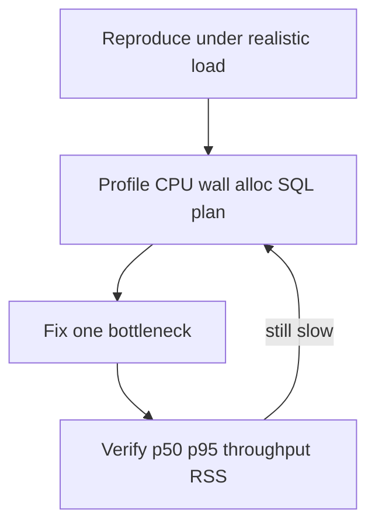

# Memory and performance

Runtime tuning literacy for this playbook: **measure → find bottleneck → fix one thing → verify**. Covers **latency**, **throughput**, **memory**, and **profiling**—not algorithm Big-O (see [Algorithms and data structures](algorithms-and-data-structures.md)) or SQL-only depth (see [Project 4](../../career-project-specs/04-sql-performance-lab.md)).

**Companion docs:** [Software engineering](software-engineering.md) · [Observability](software-engineering.md#observability-logs-metrics-traces) · [LLM serving](llms.md) · [Database design](database-design.md)

---

## Table of contents

- [When this matters in the playbook](#when-this-matters-in-the-playbook)
- [Measure before tuning](#measure-before-tuning)
- [Find the bottleneck](#find-the-bottleneck)
- [Performance patterns](#performance-patterns)
- [Memory patterns](#memory-patterns)
- [Profiling cheat sheet](#profiling-cheat-sheet)
- [Light load testing](#light-load-testing)
- [Project map](#project-map)

---

## When this matters in the playbook

| Situation | Typical signal | Where you practice |
|-----------|----------------|-------------------|
| Webhook / API SLO | p95 latency, timeout storms | Projects 1, 7, 17 |
| Queue throughput | jobs/sec, DLQ growth | Projects 6, 8 |
| RAG retrieval fan-out | slow `POST /query`, high token wait | Projects 2, 8 |
| SQL list endpoints | p95 cliffs, N+1 | Projects 4, 5, 12 |
| Real-time UI | reconnect storms, janky DOM | Project 13 |
| Service split decision | Python CPU vs I/O bound | Projects 2 → 8 |
| Hot-path ADR | p95 + RSS vs Go baseline | Project 19 |
| Edge / WASM | bounded linear memory | Projects 19, 20 |

---

## Measure before tuning

**Do not optimize from vibes.** Capture a **before** line, change **one** thing, capture **after**.

### Latency

- Report **p50 / p95 / p99**, not only averages—tail latency is what users and SLOs feel.
- Note **warm vs cold** (JIT, connection pool fill, cache empty).
- Align with **timeout budgets**: client, upstream, job deadline must nest (see [Project 18](../../career-project-specs/18-proxy-load-balancer-lab.md)).

### Throughput

- **Requests/sec** or **jobs/sec** at fixed concurrency (e.g. 50 concurrent clients, 10 worker goroutines).
- Include **error rate**—a faster path that returns 500s is not a win.

### Memory

- **RSS** (process resident set), **heap in use**, **allocation rate**, **GC pause** (language-dependent).
- Under load: if RSS grows **linearly with concurrency**, suspect unbounded buffers, goroutines, or caches.

### Documentation rule

One comparison in lab README or [PROGRESS.md](../../PROGRESS.md) ADR beats ten micro-opts with no numbers. Example: *“Bounded worker pool: p95 420ms → 95ms at 50 concurrent; RSS flat vs +800MB unbounded goroutines.”*



---

## Find the bottleneck

| Class | Symptoms | First checks |
|-------|----------|--------------|
| **CPU-bound** | High CPU, latency scales with payload size | hot loop, JSON encode, regex on large bodies |
| **I/O-bound** | CPU idle, waiting on network/disk/DB | N+1 queries, slow partner HTTP, queue wait |
| **Memory-bound** | RSS climbs, OOMKilled, GC thrash | load-all, unbounded cache, one goroutine per message |
| **Contention** | Latency spikes under parallel load | lock convoys, exhausted connection pool, row locks |

**Quick decisions:**

- p95 drops when you **remove the DB call** → query shape, indexes, N+1 ([Project 4](../../career-project-specs/04-sql-performance-lab.md)).
- p95 drops when you **cap concurrency** → backpressure or pool sizing ([Project 8](../../career-project-specs/08-go-retrieval-worker-lab.md)).
- RSS climbs with **request count** → bound buffers, stream bodies, drop retained references ([unfamiliar-stack checklist](../../checklists/unfamiliar-stack-ship.md)).

Structured logs from [Project 3](../../career-project-specs/03-observability-lab.md) (`duration_ms`, `db_ms`, `upstream_ms`) tell you **where** to profile next.

---

## Performance patterns

- **Bound concurrency** — worker pools, semaphores; never unbounded `go handler()` or `tokio::spawn` per message.
- **Timeouts everywhere** — client, upstream, job `context`; proxies enforce budgets ([Project 18](../../career-project-specs/18-proxy-load-balancer-lab.md)).
- **Batch and paginate** — keyset pagination at scale; embed/index in batches ([Projects 4](../../career-project-specs/04-sql-performance-lab.md), [2](../../career-project-specs/02-rag-llm-service.md)).
- **Cache deliberately** — TTL, max size, invalidation; avoid unbounded in-process maps.
- **Connection pooling** — reuse DB and HTTP connections; pool exhaustion looks like latency, not “slow SQL.”
- **Avoid N+1** — eager load or join; see [ORMs and N+1](database-design.md#orms-and-the-n1-query-pattern).
- **Split services on evidence** — move retrieval to Go when **profile** shows Python I/O concurrency limit, not by default ([Project 8](../../career-project-specs/08-go-retrieval-worker-lab.md)).

For LLM-specific latency, streaming, and cost caps, see [Serving, latency, streaming](llms.md#serving-latency-streaming-cost-observability).

---

## Memory patterns

Memory work is half of performance work in integration + AI systems.

- **Bound everything unbounded** — goroutines, queue depth, HTTP body size, in-memory eval caches, SSE client buffers.
- **Stream / paginate / batch** — do not load full corpus, full HTTP body, or full result set; cap response body bytes (e.g. Go `io.LimitReader`).
- **Preallocate when size is known** — Go `make([]T, 0, n)`; Python list comp vs repeated append ([algorithms study path](algorithms-study-path.md)).
- **Avoid accidental retention** — closures holding large structs, global singleton caches (PHP Octane), undropped event listeners.
- **Copy vs reference** — Go slice aliasing; unnecessary `.clone()` in Rust hot paths ([Project 19](../../career-project-specs/19-rust-hot-path-lab.md)).
- **GC languages** (Go, Python, Node, PHP long-lived) — allocation rate drives GC pause and RSS growth.
- **Rust** — ownership prevents many bugs; still measure **peak RSS** and clone cost in benchmarks.
- **Containers** — set memory limits; **OOMKilled** means “worked on laptop” failed in prod ([Projects 15–16](../../career-project-specs/16-cloud-deploy-lab.md)).

---

## Profiling cheat sheet

Practical first tools—not exhaustive.

| Stack | CPU / wall | Memory |
|-------|------------|--------|
| **Go** | `net/http/pprof`, `go tool pprof -http=:8081 cpu.prof`, `runtime/trace` | `pprof` heap, goroutine profile |
| **Python** | `cProfile`, `py-spy` (sampling) | `tracemalloc`, `memory_profiler` |
| **Node** | `--cpu-prof`, Clinic.js (optional) | heap snapshot, `--heap-prof` |
| **PHP** | Xdebug/spx (dev), slow query log | `memory_get_peak_usage()`, FPM `pm.max_requests` |
| **Rust** | `cargo flamegraph`, `perf` | `dhat`, peak RSS in benchmark harness |
| **Postgres** | `EXPLAIN (ANALYZE, BUFFERS)` | `shared_buffers`, `work_mem` — see [Project 4](../../career-project-specs/04-sql-performance-lab.md) |

**Go quick start (Project 8):**

```go
import _ "net/http/pprof" // register on DefaultServeMux
// go tool pprof http://localhost:6060/debug/pprof/profile?seconds=30
// go tool pprof http://localhost:6060/debug/pprof/heap
```

---

## Light load testing

Enough to **reproduce**—not a full performance-engineering curriculum.

| Tool | Use |
|------|-----|
| **`hey`** | HTTP: `hey -n 1000 -c 50 http://localhost:8080/retrieve` |
| **`k6`** | Scripted scenarios, p95 in summary |
| **`ab`** | Simple Apache bench smoke |
| **Fixed job count** | Enqueue N jobs; measure drain time and DLQ rate |

Record: concurrency, duration, **p95**, error rate, and optionally RSS before/after.

---

## Project map

| Concept | Projects |
|---------|----------|
| **Measure and tune (latency / throughput)** | [3](../../career-project-specs/03-observability-lab.md), [4](../../career-project-specs/04-sql-performance-lab.md), [8](../../career-project-specs/08-go-retrieval-worker-lab.md), [17](../../career-project-specs/17-proxy-load-balancer-lab.md), [18](../../career-project-specs/19-rust-hot-path-lab.md) |
| **Memory / resource limits** | [2](../../career-project-specs/02-rag-llm-service.md), [8](../../career-project-specs/08-go-retrieval-worker-lab.md), [13](../../career-project-specs/13-realtime-dashboard-lab.md), [18](../../career-project-specs/19-rust-hot-path-lab.md), [19](../../career-project-specs/20-wasm-secure-component-lab.md), [20](../../career-project-specs/21-iot-edge-lab.md) |
| **Queue throughput vs ack latency** | [6](../../career-project-specs/06-async-worker-stretch.md) |

**Read next:** [Algorithms study path](algorithms-study-path.md) · [Go map](../languages/go.md) · [Python map](../languages/python.md) · [per-project testing](per-project-testing.md)
